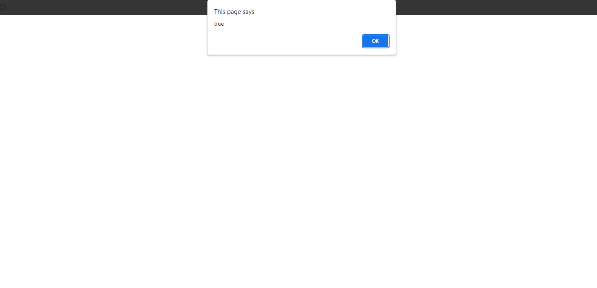

## Array Snippets Example

### Example 0

#### HTML

```HTML
<!DOCTYPE html>

<html>

    <head>

        <title>This is the title</title>

        <link rel="stylesheet" type="text/css" href="style.css">

    </head>

<body>

    <script src="js.js"></script>

</body>

</html>
```

#### JavaScript

```JavaScript
var arr = new Array("dasd");

function cher(arr) {

    return arr.constructor.toString().indexOf("Array") > -1;
}

alert(cher(arr));


//This program checks if an object is an Array or not.
````
### Output


