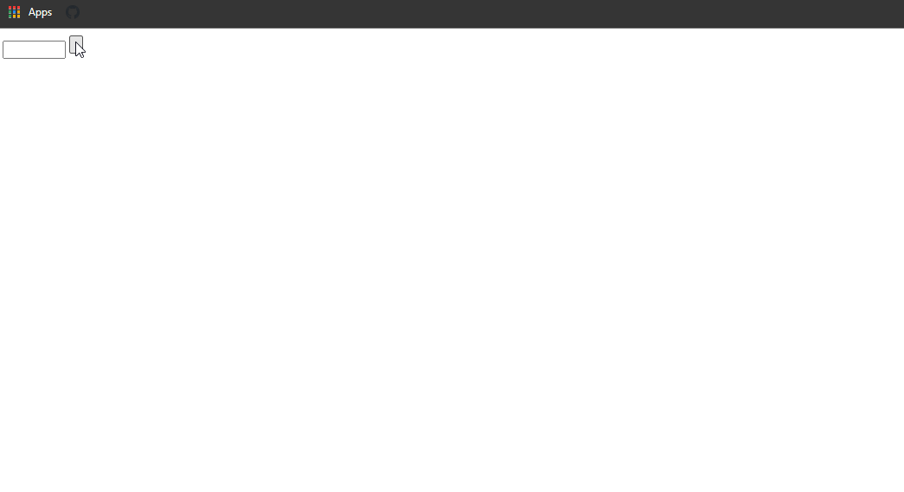
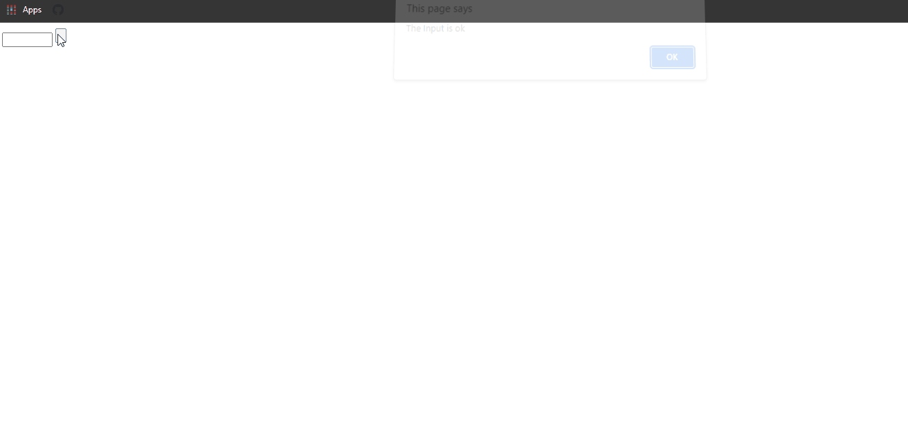
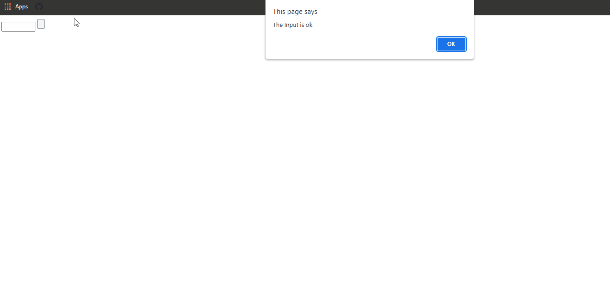

## Form Snippets Examples

### Example 0

#### HTML

```HTML
<!DOCTYPE html>

<html>

    <head>

        <title>This is the title</title>

        <link rel="stylesheet" type="text/css" href="style.css">

    </head>

<body>

    <form id="myForm" name="form1">

        <input type="text"  name="text1" />

        <input type="button" id="btn1" />

    </form>

    <script src="js.js"></script>

</body>

</html>
```

#### JavaScript

```JavaScript
window.onload = function () {

    document.getElementById("btn1").onclick = fun;
}

function fun() {

    var inp = document.forms["form1"]["text1"].value;

    alert(inp);

}
````

### Output


### Example 1

#### HTML

```HTML
<!DOCTYPE html>

<html>

    <head>

        <title>Excrise</title>

        <link rel="stylesheet" type="text/css" href="style.css">  

    </head>

<body>

    <form name="kuna">

        <input type="text" name="txt" />
        <input type="button" value="Vlick" name="dis" />

    </form>

    <script src="js.js"></script>

</body>

</html>
```

#### JavaScript

```JavaScript
window.onload = function () {

    document.forms.kuna.dis.onclick = function () { fun() };
}

function fun() {

    var inp = document.forms.kuna.txt.value;
    alert(inp);
}
````

### Output


### Example 2

#### HTML

```HTML
<!DOCTYPE html>

<html>

    <head>

        <title>This is the title</title>

        <link rel="stylesheet" type="text/css" href="style.css">

    </head>

<body>

    <form id="myForm" name="form1">

        <input type="number" min="0" max="300"  name="text1" />

        <input type="button" id="btn1" />

    </form>

    <script src="js.js"></script>

</body>

</html>
```

#### JavaScript

```JavaScript
window.onload = function () {

    document.getElementById("btn1").onclick = fun;
}

function fun() {

    var inp = document.forms["form1"]["text1"];

    if (inp.checkValidity() == false) {

        alert(inp.validationMessage);
    } else {

        alert("The Input is ok");
    }

}

//The HTML 5 Constraint Validation API Automatically genarates Customs Errors.
````

### Output



### Example 3

#### HTML

```HTML
<!DOCTYPE html>

<html>

    <head>

        <title>This is the title</title>

        <link rel="stylesheet" type="text/css" href="style.css">

    </head>

<body>

    <form id="myForm" name="form1">

        <input type="number" min="0" max="100"  name="text1" />

        <input type="button" id="btn1" />

    </form>

    <script src="js.js"></script>

</body>

</html>
```

#### JavaScript

```JavaScript
window.onload = function () {

    document.getElementById("btn1").onclick = fun;
}

function fun() {


    var inp = document.forms["form1"]["text1"];

    if (inp.validity.rangeOverflow) {

        alert(inp.validationMessage);
    } else {

        alert("The Input is ok");
    }

}

//The HTML 5 Constraint Validation API Automatically genarates Customs Errors.
````

### Output


### Example 4

#### HTML

```HTML
<!DOCTYPE html>

<html>

    <head>

        <title>This is the title</title>

        <link rel="stylesheet" type="text/css" href="style.css">

    </head>

<body>

    <form id="myForm" name="form1">

        <input type="number" min="0" max="100"  name="text1" />

        <input type="button" id="btn1" />

    </form>

    <script src="js.js"></script>

</body>

</html>
```

#### JavaScript

```JavaScript
window.onload = function () {

    document.getElementById("btn1").onclick = fun;
}

function fun() {

    var inp = document.forms["form1"]["text1"];

    if (inp.validity.rangeOverflow) {

        alert("Value is too large");
    } else {

        alert("The Input is ok");
    }

}

````

### Output



### Example 5

#### HTML

```HTML
<!DOCTYPE html>

<html>

    <head>

        <title>This is the title</title>

        <link rel="stylesheet" type="text/css" href="style.css">

    </head>

<body>

    <form id="myForm" name="form1">

        <input type="number" min="50" max="100"  name="text1" />

        <input type="button" id="btn1" />

    </form>

    <script src="js.js"></script>

</body>

</html>
```

#### JavaScript

```JavaScript
window.onload = function () {

    document.getElementById("btn1").onclick = fun;
}

function fun() {


    var inp = document.forms["form1"]["text1"];

    if (inp.validity.rangeOverflow) {

        alert("Value is too large");

    } else if (inp.validity.rangeUnderflow) {

        alert("Value is too small");

    }else {

        alert("The Input is ok");
    }

}

//The HTML 5 Constraint Validation API Automatically genarates Customs Errors.
````

### Output


