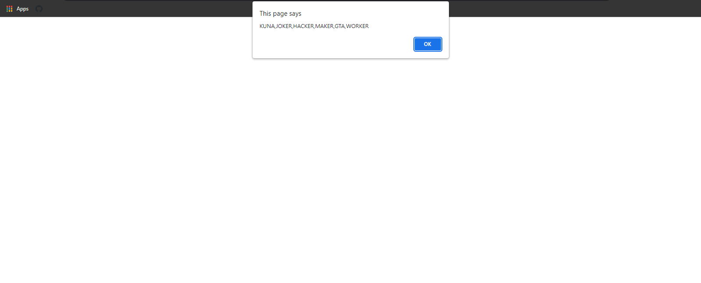
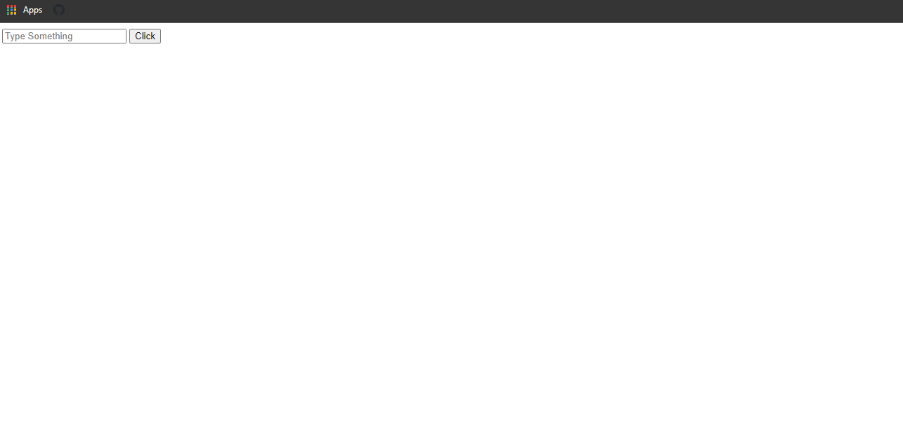
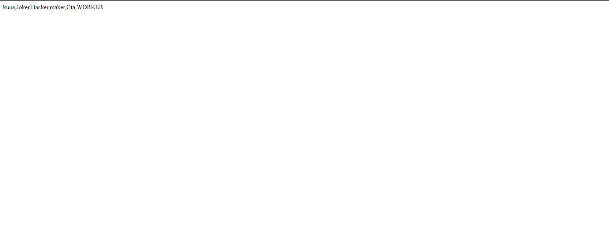
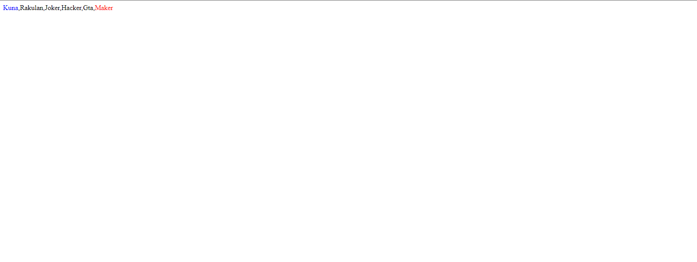
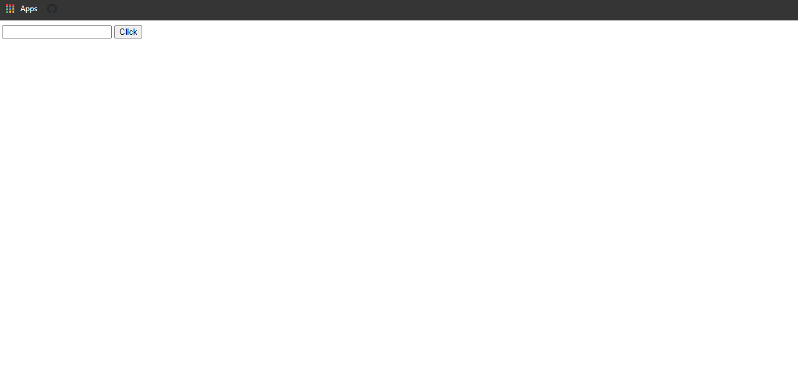
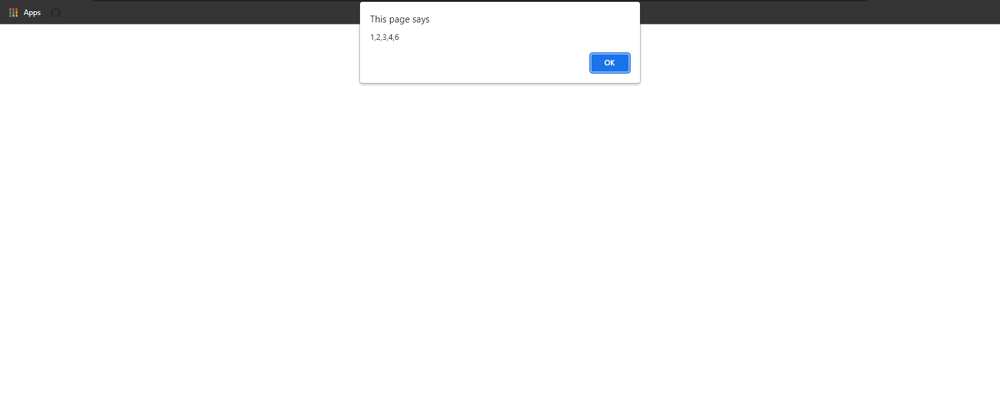

### Example 0

#### HTML

```HTML
<!DOCTYPE html>

<html>

    <head>

        <title>This is the title</title>  

        <link rel="stylesheet" type="text/css" href="style.css">

    </head>

<body>

    <script src="js.js"></script>

</body>      

</html>
```

#### JavaScript

```JavaScript
var arr = ["kuna", "Joker", "Hacker", "maker", "Gta", "worker"];
Array.prototype.myuse = function () {

    for (i = 0; i < this.length; i++) {

        this[i]=this[i].toUpperCase();

    }

}

arr.myuse();
alert(arr)
````

### Output



### Example 1

#### HTML

```HTML
<!DOCTYPE html>

<html>

    <head>

        <title>This is the title</title>

        <link rel="stylesheet" type="text/css" href="style.css">

    </head>

<body>

    <input type="text" id="txt1"  placeholder="Type Something"/>
    <button id="btn1">Click</button>

    <h1 id="dis"></h1>

    <script src="js.js"></script>

</body>

</html>
```

#### JavaScript

```JavaScript
var x;

if (x === undefined) {
    x = "This is kuna";
}

alert(x);
````

### Output



### Example 2

#### HTML

```HTML
<!DOCTYPE html>

<html>

    <head>

        <title>Excrise</title>

        <link rel="stylesheet" type="text/css" href="style.css">

    </head>

<body>

    <script src="js.js"></script>

</body>

</html>
```

#### JavaScript

```JavaScript
var arr = ["kuna", "Joker", "Hacker", "maker", "Gta", "worker"];


Array.prototype.upperSystem = function () {

    for (i = 0; i < this.length; i++) {

        this[this.length-1] = this[this.length-1].toUpperCase();
    }
}

 arr.upperSystem();
document.write(arr);
````

### Output



### Example 3

#### HTML

```HTML
<!DOCTYPE html>

<html>

    <head>

        <title>Excrise</title>

        <link rel="stylesheet" type="text/css" href="style.css">

    </head>

<body>

    <script src="js.js"></script>

</body>    

</html>
```

#### JavaScript

```JavaScript
var deArr = ["Kuna", "Rakulan", "Joker", "Hacker", "Gta", "Maker"];

Array.prototype.looperSystem = function () {

    var arr = [];

    for (i = 0; i < this.length; i++) {

        arr.push(this[i]);

    }
    var last = arr[this.length - 1];
    var newlat = last.fontcolor("red");
    var intoStr = arr.toString();
    var re=intoStr.replace(this[this.length - 1], newlat);

    return re;
}

var b = deArr.looperSystem();

document.write(b);
````

### Output


### Example 4

#### HTML

```HTML
<!DOCTYPE html>

<html>

    <head>

        <title>Excrise</title>

        <link rel="stylesheet" type="text/css" href="style.css">  

    </head>  

<body>

    <script src="js.js"></script>

</body>

</html>
```

#### JavaScript

```JavaScript
var deArr = ["Kuna", "Rakulan", "Joker", "Hacker", "Gta", "Maker"];

Array.prototype.looperSystem = function () {

    var arr = [];


    for (i = 0; i < this.length; i++) {

        arr.push(this[i]);

    }

    var lastEle = this[this.length - 1].fontcolor("red");
    var firstEle = this[0].fontcolor("blue");
    var intoStr = String(arr);
    var re = intoStr.replace(this[this.length - 1], lastEle);
    var split = re.split(",");

    var newArr=[]

    for (i = 0; i < split.length; i++) {

        newArr.push(split[i]);

    }

    var renew = newArr.splice(newArr[0], 1, firstEle);

    return newArr;
}

var b = deArr.looperSystem();

document.write(b);
````

### Output



### Example 5

#### HTML

```HTML
<!DOCTYPE html>

<html>

    <head>

        <title>Excrise</title>

        <link rel="stylesheet" type="text/css" href="style.css">

    </head>

<body>

    <input type="text" id="txt" />
    <input type="button" id="btn" value="Click" />

    <script src="js.js"></script>

</body>

</html>
```

#### JavaScript

```JavaScript
window.onload = function () {

    document.getElementById("btn").onclick = inpArrSystem;
}

function inpArrSystem() {

    var inpVal = document.getElementById("txt").value;
    var split = inpVal.split(" ");

    var arrSys = [];

    for (y = 0; y < split.length; y++) {

        arrSys.push(split[y]);
    }

    Array.prototype.looperSystem = function () {


        var arr = [];


        for (i = 0; i < this.length; i++) {

            arr.push(this[i]);

        }


        var lastEle = this[this.length - 1].fontcolor("red");
        var firstEle = this[0].fontcolor("blue");
        var intoStr = String(arr);
        var re = intoStr.replace(this[this.length - 1], lastEle);
        var split = re.split(",");

        var newArr = []

        for (i = 0; i < split.length; i++) {

            newArr.push(split[i]);


        }

        var renew = newArr.splice(newArr[0], 1, firstEle);

        return newArr;
    }
    var b = arrSys.looperSystem();
    document.write(b);
}
````

### Output



### Example 6

#### HTML

```HTML
<!DOCTYPE html>

<html>

    <head>

        <title>Excrise</title>

        <link rel="stylesheet" type="text/css" href="style.css">

    </head>

<body>

    <input type="number" id="num" />
    <input type="button" value="Click" id="btn" />


    <script src="js.js"></script>

</body>

</html>
```

#### JavaScript

```JavaScript
var arr = [1, 2, 3, 4, 5];


Array.prototype.incrementer = function () {


    var arr = [];

    for (i = 0; i < this.length; i++) {


        arr.push(this[i]);


    }

    var lastEle = this[this.length - 1]+1;
    var into = arr.toString();
    var re = into.replace(this[this.length - 1], lastEle);

    return re
}

var a=arr.incrementer();
alert(a);
````

### Output


