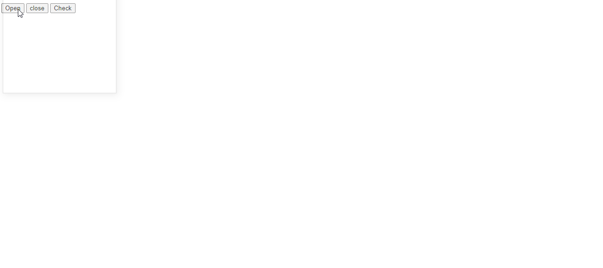
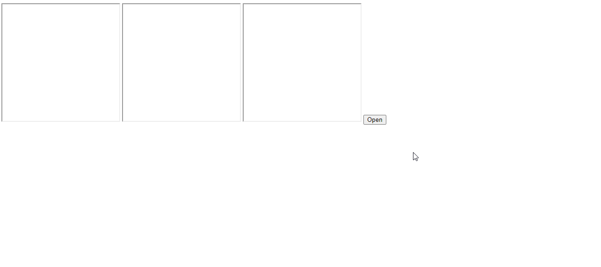
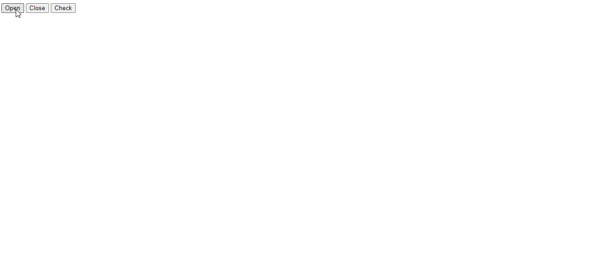

## BOM Snippets Examples

### Example 0

#### HTML

```HTML
<!DOCTYPE html>

<html>

    <head>

        <title>This is the title</title>

        <link rel="stylesheet" type="text/css" href="style.css">

    </head>

<body>

    <input type="button" id="open"  value="Open"/>
    <input type="button" id="close" value="close" />
    <input type="button" id="check" value="Check" />

    <h1 id="dis"></h1>

    <script src="js.js"></script>

</body>

</html>
```

#### JavaScript

```JavaScript
window.onload = function () {

    document.getElementById("open").onclick = openFun;
    document.getElementById("close").onclick = closeFun;
    document.getElementById("check").onclick = checkFun;

}

var myWin;

function openFun() {

    myWin = window.open("www.google.lk", "kuna", "width=250, height=250");


}

function closeFun() {

    if (myWin) {

        myWin.close();
    }

}

function checkFun() {

    if (!myWin) {//The Window never Open.This is mean this is the first time.

        document.getElementById("dis").innerHTML = "The window has never been open yet";

    }
    else if (myWin.closed == true) {

        document.getElementById("dis").innerHTML = "The Window is being closed";
    } else {

        document.getElementById("dis").innerHTML = "The is Open";

    }
}
````
### Output



### Example 1

#### HTML

```HTML
<!DOCTYPE html>

<html>

    <head>

        <title>This is the title</title>

        <link rel="stylesheet" type="text/css" href="style.css">

    </head>

<body>

    <iframe width="250" height="250"></iframe>
    <iframe width="250" height="250"></iframe>
    <iframe width="250" height="250"></iframe>

    <input type="button" id="open"  value="Open"/>

    <script src="js.js"></script>

</body>

</html>
```

#### JavaScript

```JavaScript
window.onload=function(){

  document.getElementById("open").onclick=openWins;

}

function openWins(){

	 var wins=document.getElementsByTagName("iframe");

    for(a=0;a<wins.length;a++){

	wins[a].src="www.google.lk";

    }
}
````

### Output



### Example 2

#### HTML

```HTML
<!DOCTYPE html>

<html>

    <head>

        <title>Excrise</title>

        <link rel="stylesheet" type="text/css" href="style.css">

    </head>

<body>

    <input type="button" id="open" value="Open" />
    <input type="button" id="close" value="Close" />
    <input type="button" id="check" value="Check" />

    <h1 id="dis"></h1>

    <script src="js.js"></script>

</body>

</html>
```

#### JavaScript

```JavaScript
window.onload = function () {

    document.getElementById("open").onclick = openFun;


}

function openFun() {


    var win;

    win = window.open("www.google.lk", "_blank", "width=250,height=250");

    document.getElementById("close").onclick = function () { closeFun() };
    document.getElementById("check").addEventListener("click", checkFun);

    function closeFun() {


        if (win) {

            win.close();
        }
    }


    function checkFun() {

        if (win.closed) {

            document.getElementById("dis").innerHTML = "The window is closed";

        } else {

            document.getElementById("dis").innerHTML = "The window is open";

        }

    }
}
````

### Output


