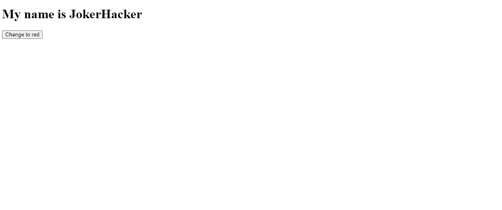

## Basic Snippets Introduction Examples

### Example 0

#### JavaScript

```JavaScript
function onoffSystem() {

    var light = document.getElementById("light");

    if (light.src.match("off")) {

        light.src = "on.gif"

    } else {

        light.src = "off.gif";
    }

}
````
#### HTML

```HTML
<!DOCTYPE html>

<html>

    <head>

        <title>This is the title</title>

        <link rel="stylesheet" type="text/css" href="style.css">
        <meta charset="utf-8">

    </head>
<body>

    
    <script src="js.js" type="text/javascript"></script>

</body>
</html>
```

### Output


### Example 2

#### JavaScript

```JavaScript
window.onload = function () {

    document.getElementById("changeColor").onclick = function () { red() };
}

function red() {
    document.getElementById("h1").style.color = "red";
    document.getElementById("h1").style.fontSize = "5em";
}
````
#### HTML

```HTML
<!DOCTYPE html>

<html>

    <head>

        <title>This is the title</title>

        <link rel="stylesheet" type="text/css" href="style.css">
        <meta charset="utf-8">

    </head>

<body>

    <h1 id="h1">My name is JokerHacker</h1>

    <button id="changeColor">Change to red</button>

    <script src="js.js" type="text/javascript"></script>

</body>      

</html>
```

### Output



### Example 2

#### JavaScript

```JavaScript
window.onload = function () {

    document.getElementById("valid").addEventListener("click",inputSystem);

}

function inputSystem() {

    var inputValue = document.getElementById("txt1").value;
    var outputDisplay = document.getElementsByTagName("h1")[0];

    if (inputValue == "") {

        outputDisplay.innerHTML = "The input Feild is Empty";
        outputDisplay.style.color = "red";

    } else if (inputValue > 0 && inputValue < 10) {

        outputDisplay.innerHTML = "The input is valid";
        outputDisplay.style.color = "green";
    } else {

        outputDisplay.innerHTML = "Input is not valid";
        outputDisplay.style.color = "red";

    }
}
````
#### HTML

```HTML
<!DOCTYPE html>

<html>

    <head>

        <title>Exercise</title>

        <link rel="stylesheet" type="text/css" href="style.css">

    </head>

<body>

 <input type="number" id="txt1" />
    <input type="button" id="valid" value="Validate" />
    <h1></h1>

    <script src="js.js"></script>

</body>    

</html>
```

### Output


### Example 3

#### JavaScript

```JavaScript
window.onload = function () {

    document.getElementById("valid").onclick = inputSystem;
}

function inputSystem() {

    var inpVal = document.getElementById("txt1").value;
    var out = document.getElementsByTagName("h1")[0];

    try {

        if (inpVal == "") {

            throw "Empty";

        } else if (inpVal.match(/[a-zA-z]/img)) {

            throw "String You must an numbetric value";

        } else if (inpVal > 0 && inpVal < 10) {

            throw "Ok";
        } else {

            throw "Not Valid";
        }  
    }
    catch (err) {

        out.innerHTML = "The input is " + err;

        if (err == "Empty") {

            out.style.color = "red";

        } else if (err.match("String")) {

            out.style.color = "red";

        } else if (err == 'Ok') {

            out.style.color = "green";
        } else if (err.match("Not")) {

            out.style.color = "darkRed";

        } else {

        }
    }
}
````
#### HTML

```HTML
<!DOCTYPE html>

<html>

    <head>

        <title>This is the title</title>

        <link rel="stylesheet" type="text/css" href="style.css">

    </head>

<body>

     <input type="text" id="txt1" />
    <input type="button" id="valid" value="Validate" />
    <h1></h1>

    <script src="js.js"></script>

</body>      

</html>
```

### Output


