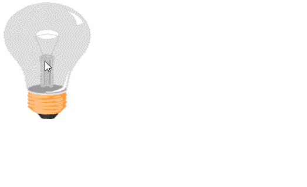

## Basic Snippets Introduction Examples

### Example 0

#### JavaScript

```JavaScript
function onoffSystem() {

    var light = document.getElementById("light");

    if (light.src.match("off")) {

        light.src = "on.gif"

    } else {

        light.src = "off.gif";
    }

}
````
#### HTML

```HTML
<!DOCTYPE html>

<html>

    <head>

        <title>This is the title</title>

        <link rel="stylesheet" type="text/css" href="style.css">
        <meta charset="utf-8">

    </head>
<body>

    
    <script src="js.js" type="text/javascript"></script>

</body>
</html>
```

### Output


