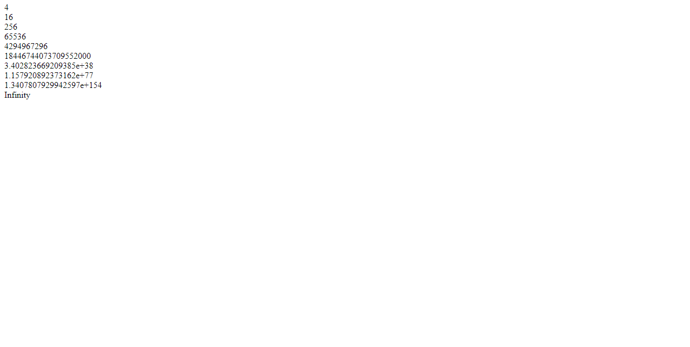

## Number Snippets Examples

### Example 0

#### JavaScript

```JavaScript
var num1 = 2;

while (num1 != Infinity) {

  var t= num1 *=num1;
  document.write(t + "<br>");
}
````
#### HTML

```HTML
<!DOCTYPE html>

<html>

    <head>

        <title>This is the title</title>

        <link rel="stylesheet" type="text/css" href="style.css">
        <meta charset="utf-8">

    </head>

<body>

    <script src="js.js" type="text/javascript"></script>

</body>

</html>
```

### Output


