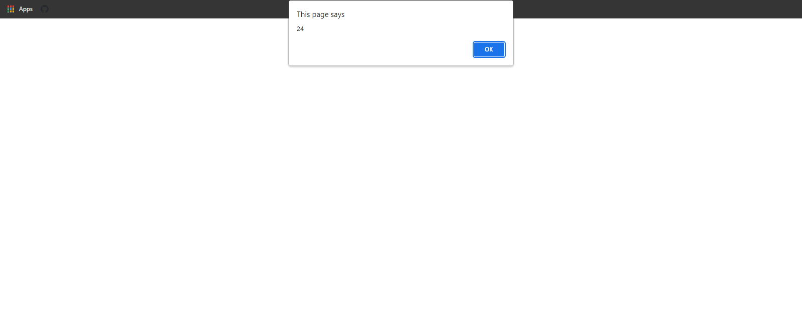
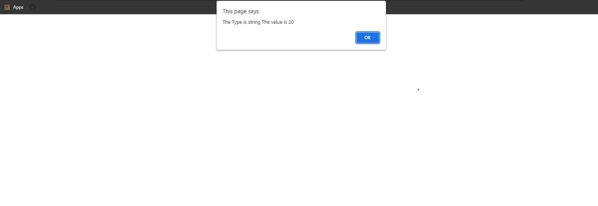
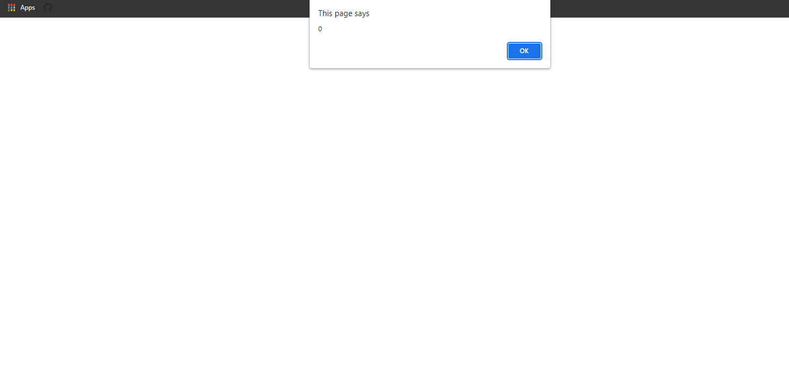
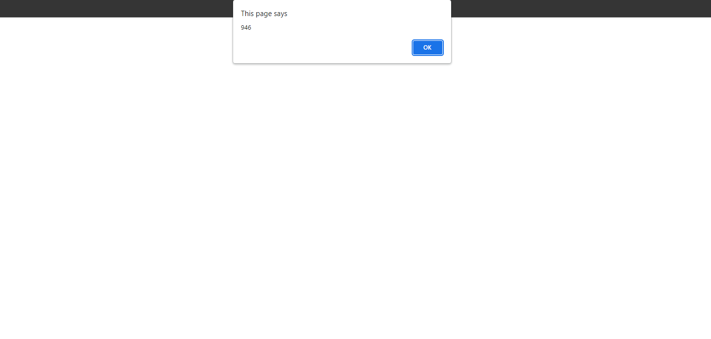
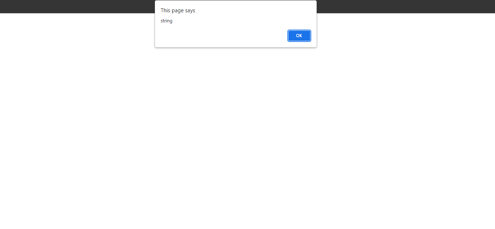
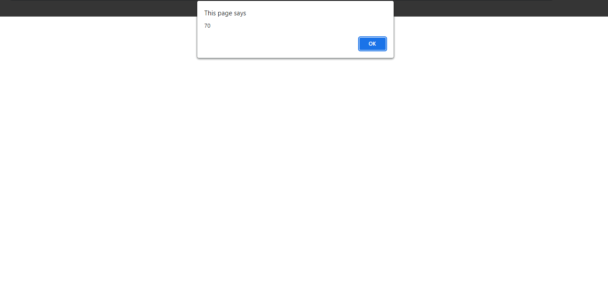
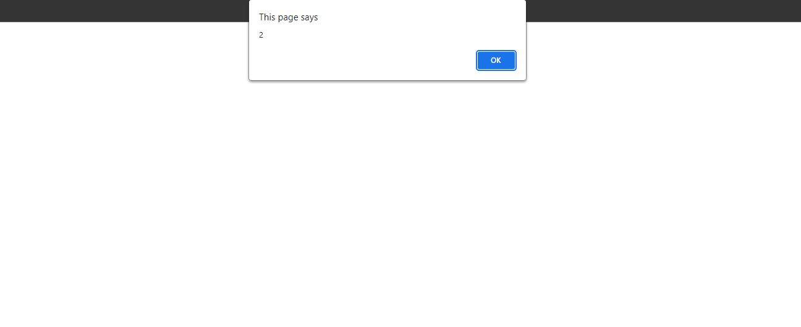
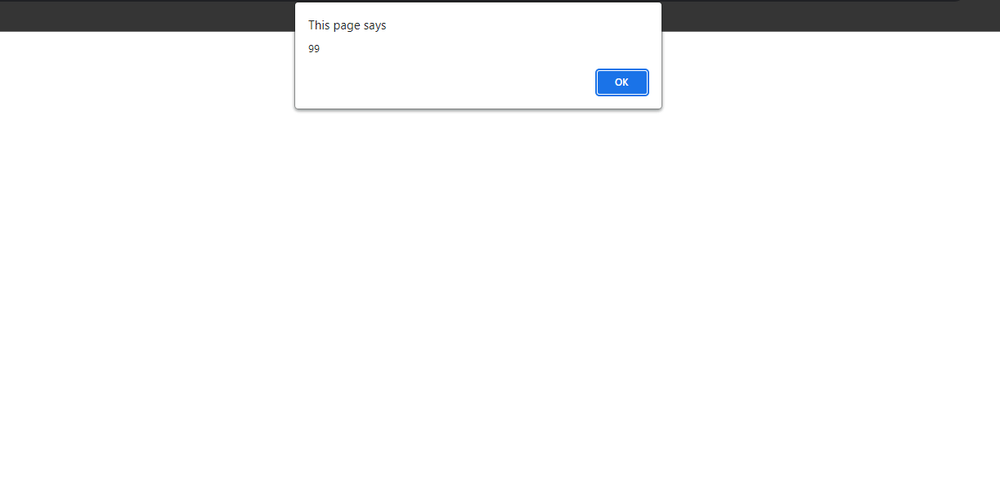
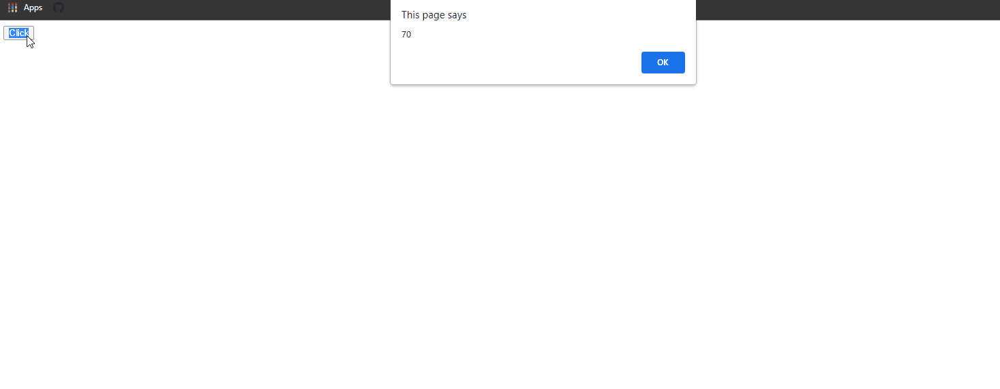
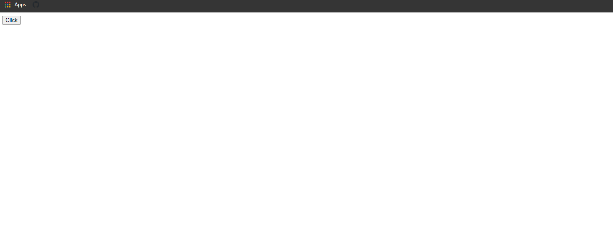

## Function Snippets Examples

### Example 0

#### JavaScript

```JavaScript
function myFunction(a, b) {
    return a * b;
}

var x = myFunction(4, 3) * 2;

alert(x);
````
#### HTML

```HTML
<!DOCTYPE html>

<html>

    <head>

        <title>This is the title</title>

        <link rel="stylesheet" type="text/css" href="style.css">
        <meta charset="utf-8">

    </head>

<body>

    <script src="js.js" type="text/javascript"></script>

</body>

</html>
```

### Output



### Example 1

#### JavaScript

```JavaScript
function myFunction(a, b) {
    return a * b;
}

var txt = myFunction(10,2).toString();

alert("The Type is "+typeof txt+" The value is "+txt);

//We can convert a function into a to string.
````
#### HTML

```HTML
<!DOCTYPE html>

<html>

    <head>

        <title>This is the title</title>

        <link rel="stylesheet" type="text/css" href="style.css">

    </head>

<body>

    <script src="js.js"></script>

</body>  

</html>
```

### Output



### Example 2

#### JavaScript

```JavaScript
function value(x, y) {

    if (y === undefined) {

       return y = 0;
    }

}
var a = value(10);
alert(a);
````
#### HTML

```HTML
<!DOCTYPE html>

<html>

    <head>

        <title>This is the title</title>

        <link rel="stylesheet" type="text/css" href="style.css">

    </head>

<body>

    <script src="js.js"></script>

</body>

</html>
```

### Output



### Example 3

#### JavaScript

```JavaScript
function addTogether() {

    var sum = 1000;

    for (i = 0; i < arguments.length; i++) {


        sum = sum - arguments[i];

    }

    return sum;

}

var a = addTogether(10, 2, 3, 6, 5, 4, 8, 9, 7);
alert(a);
````
#### HTML

```HTML
<!DOCTYPE html>

<html>

    <head>

        <title>Excrise</title>

        <link rel="stylesheet" type="text/css" href="style.css">

    </head>

<body>

    <script src="js.js"></script>

</body>

</html>
```

### Output



### Example 4

#### JavaScript

```JavaScript
function myFun(a, b) {

    return a * b;
}

var newFun = myFun.toString();
alert(typeof newFun);

//We can also convert a function into a number types and string types.
````
#### HTML

```HTML
<!DOCTYPE html>

<html>

    <head>

        <title>Excrise</title>

        <link rel="stylesheet" type="text/css" href="style.css">

    </head>

<body>

    <script src="js.js"></script>

</body>

</html>
```

### Output



### Example 5

#### JavaScript

```JavaScript
function findMax() {

    var max = -Infinity;

    for (i = 0; i < arguments.length; i++) {

        if (arguments[i] > max) {

            max = arguments[i];

        }
    }

    return max;
}

var a = findMax(10, 2, 3, 06, 4, 4, 70);

alert(a);
````
#### HTML

```HTML
<!DOCTYPE html>

<html>

    <head>

        <title>This is the title</title>

        <link rel="stylesheet" type="text/css" href="style.css">

    </head>

<body>

    <script src="js.js"></script>

</body>      

</html>
```

### Output



### Example 6

#### JavaScript

```JavaScript
function findMax() {

    var max = Infinity;

    for (i = 0; i < arguments.length; i++) {

        if (arguments[i] < max) {

            max = arguments[i];
        }

    }

    return max;
}

var a = findMax(10, 2, 3, 6, 5, 48, 6);
alert(a);

var b = Infinity;
var c = 40;


if (c < b) {

    alert("yes");
}
````
#### HTML

```HTML
<!DOCTYPE html>

<html>

    <head>

        <title>Excrise</title>

        <link rel="stylesheet" type="text/css" href="style.css">

    </head>

<body>

    <script src="js.js"></script>

</body>

</html>
```

### Output



### Example 7

#### JavaScript

```JavaScript
function findMax() {

    var sum = 0;

    for (i = 0; i < arguments.length; i++) {


        sum+=arguments[i]

    }

    return sum;
}

var a = findMax(10, 2, 3, 06, 4, 4, 70);
alert(a);
````
#### HTML

```HTML
<!DOCTYPE html>

<html>

    <head>

        <title>This is the title</title>

        <link rel="stylesheet" type="text/css" href="style.css">

    </head>

<body>

    <script src="js.js"></script>

</body>

</html>
```

### Output



### Example 8

#### JavaScript

```JavaScript
window.onload = function () {

    document.getElementById("click").onclick = fun;
}

var counter = 0;

function fun() {

    document.getElementById("dis").innerHTML = counter++;

}
````
#### HTML

```HTML
<!DOCTYPE html>

<html>

    <head>

        <title>This is the title</title>

        <link rel="stylesheet" type="text/css" href="style.css">

    </head>

<body>

    <button id="click">Click</button>

    <h1 id="dis"></h1>

    <script src="js.js"></script>

</body>

</html>
```

### Output



### Example 9

#### JavaScript

```JavaScript
var add = (function () {

    var counter = 0;


    return function () {

        return counter++;

    }

})();

window.onload = function () {

    document.getElementById("click").onclick = counterUp;

}

function counterUp() {

    document.getElementById("dis").innerHTML = add();
}
````
#### HTML

```HTML
<!DOCTYPE html>

<html>

    <head>

        <title>This is the title</title>

        <link rel="stylesheet" type="text/css" href="style.css">

    </head>

<body>

    <button id="click">Click</button>

    <h1 id="dis"></h1>

    <script src="js.js"></script>

</body>

</html>
```

### Output


