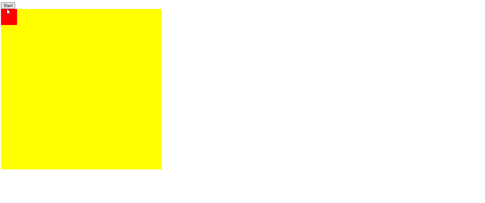

## Animation Snippets Examples

### Example 0

#### HTML

```HTML
<!DOCTYPE html>

<html>

    <head>

        <title>This is the title</title>

        <link rel="stylesheet" type="text/css" href="style.css">
        <meta charset="utf-8">

    </head>

<body>

   <button id="run">Start</button>

   <div id="container">

   <div id="animate"></div>

   </div>

    <script src="js.js" type="text/javascript"></script>

</body>

</html>
```

#### CSS

```CSS
#container {

    width:500px;
    height:500px;
    background-color:yellow;
    position:relative;

}

#animate {

    width:50px;
    height:50px;
    background-color:red;
    position:absolute;

}

```

#### JavaScript

```JavaScript
window.onload = function () {

    document.getElementById("run").onclick = function () { animation() };

}

function animation() {

    var ani = document.getElementById("animate");
    var pos = 0;
    var setTime = setInterval(frame, 5);

    function frame() {

        if (pos == 500) {

            clearInterval(setTime);
        } else {
            pos++;
            ani.style.left = pos + "px";
            ani.style.top = pos + "px";
        }

    }
}
````

### Output



### Example 1

#### HTML

```HTML
<!DOCTYPE html>

<html>

    <head>

        <title>This is the title</title>

        <link rel="stylesheet" type="text/css" href="style.css">

    </head>

<body>

    <div id="box"></div>

    <script src="js.js"></script>

</body>

</html>
```

#### CSS

```CSS
#box {

    width:250px;
    height:250px;
    background-color:black;
    border:1px solid red;

}

```

#### JavaScript

```JavaScript
function animate() {

    var ele = document.getElementById("box");
    var start = 0;

    var timerSet = setInterval(moverFunction, 10);

    function moverFunction() {

        if (start == 500) {

            clearInterval(timerSet);

        } else {

            start++;
            ele.style.position = "relative";
            ele.style.left = start + "px";
        }

    }

}

animate();
````

### Output


### Example 2

#### HTML

```HTML
<!DOCTYPE html>

<html>

    <head>

        <title>Excrise</title>

        <link rel="stylesheet" type="text/css" href="style.css">  

    </head>  

<body>

    <input type="button" id="btn" value="Click" />

    <div id="box"></div>

    <script src="js.js"></script>

</body>  

</html>
```

#### CSS

```CSS
#box {
    width:150px;
    height:150px;
    background-color:red;
    border:1px solid black;
    position:relative;

}
```

#### JavaScript

```JavaScript
window.onload = function () {

    document.getElementById("btn").onclick = animationFunction0;
}

function animationFunction0() {

    var ele = document.getElementById("box");
    var pos = 0;
    var timer = setInterval(frame, 5);

    function frame() {

        if (pos == 500) {

            clearInterval(timer);
            animationFunction1();
        } else {

            pos += 2
            ele.style.left = pos + "px";
            ele.style.transition = "background-color 1s, transform 2s";
            ele.style.backgroundColor = "green";
            ele.style.transform = "rotate(" + 90 + "deg)";
            }
    }

}

function animationFunction1() {

    var ele = document.getElementById("box");
    var start = 0;
    var time = setInterval(frame, 5);

    function frame() {

        if (start == 300) {

            clearInterval(time);
            animationFunction2();

        } else {
            start++;
            ele.style.top = start + "px";
            ele.style.transition = "background-color .5s, transform 2s";
            ele.style.backgroundColor = "blue";
            ele.style.transform = "rotate(" + -90 + "deg)";
        }
    }
}

function animationFunction2() {

    var box = document.getElementById("box");
    var pos = 500;
    var timing = setInterval(frame, 5);

    function frame() {

        if (pos == 0) {

            clearInterval(timing);
            animationFunction3();

        } else {

            pos -= 5;
            box.style.left = pos + "px";
            box.style.transition = "background-color .5s, transform 2s";
            box.style.backgroundColor = "yellow";
            box.style.transform = "rotate(" + -90 + "deg)";

        }
    }
}

  function animationFunction3() {

    var boxElement = document.getElementById("box");
    var startingPoint = 300;
  var timer=  setInterval(function () {

        if (startingPoint == 0) {

            clearInterval(timer);

        } else {

            startingPoint--;
            boxElement.style.top = startingPoint + "px";
            box.style.transition = "background-color .5s, transform 2s";
            box.style.backgroundColor = "darkred";
            box.style.transform = "rotate(" + 90 + "deg)";
        }
    }, 5)
}

````

### Output


