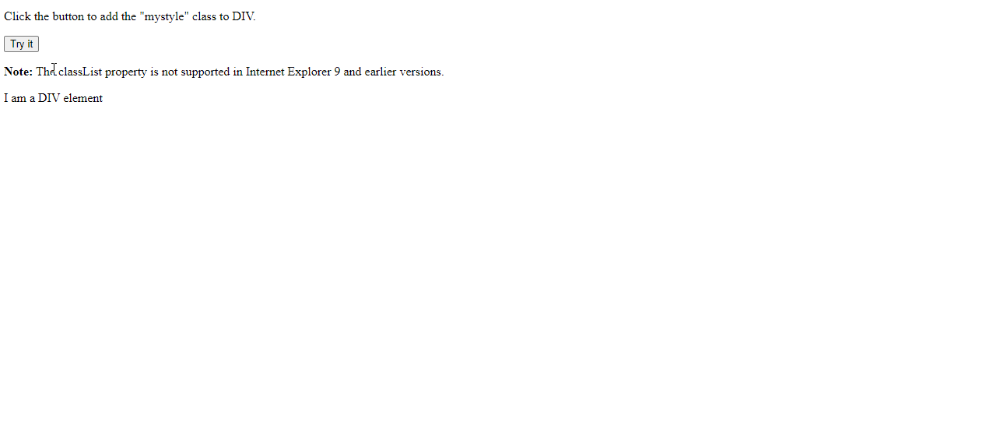
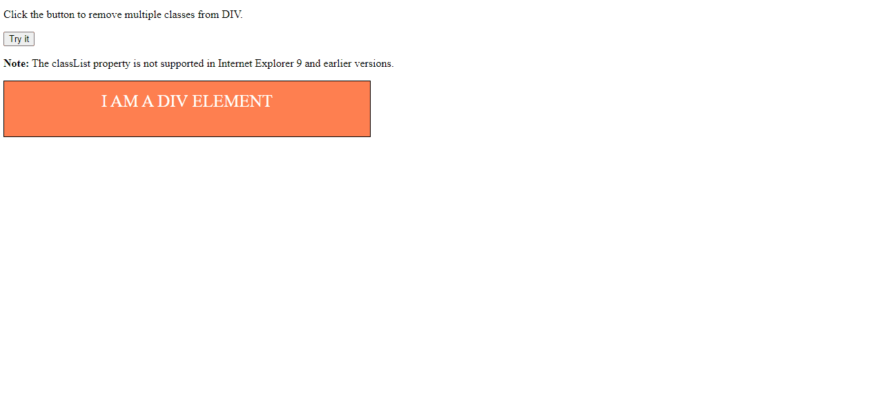
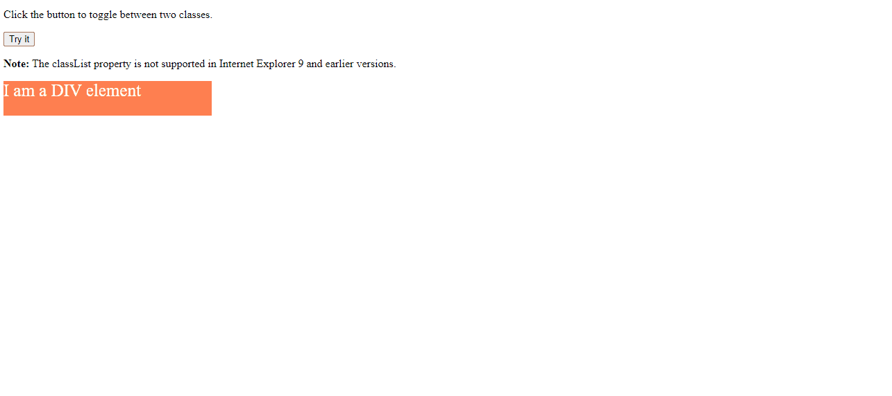

## DOM Snippets Examples

### Example 0

#### HTML

```HTML
<!DOCTYPE html>

<html>

    <head>

        <title>This is the title</title>

        <link rel="stylesheet" type="text/css" href="style.css">

    </head>

<body>

    <p>Click the button to add the "mystyle" class to DIV.</p>

    <button onclick="myFunction()">Try it</button>

    <p><strong>Note:</strong> The classList property is not supported in Internet Explorer 9 and earlier versions.</p>

    <div id="myDIV">
        I am a DIV element
    </div>

    <script src="js.js"></script>

</body>

</html>
```

#### CSS

```css
.mystyle {
    width: 500px;
    height: 50px;
    padding: 15px;
    border: 1px solid black;
}

.anotherClass {
    background-color: coral;
    color: white;
}

.thirdClass {
    text-transform: uppercase;
    text-align: center;
    font-size: 25px;
}
```

#### JavaScript

```JavaScript
function myFunction() {
    document.getElementById("myDIV").classList.add("mystyle", "anotherClass", "thirdClass");
}
````

### Output



### Example 1

#### HTML

```HTML
<!DOCTYPE html>

<html>

    <head>

        <title>This is the title</title>

        <link rel="stylesheet" type="text/css" href="style.css">

    </head>

<body>

    <p>Click the button to remove multiple classes from DIV.</p>

    <button onclick="myFunction()">Try it</button>

    <p><strong>Note:</strong> The classList property is not supported in Internet Explorer 9 and earlier versions.</p>

    <div id="myDIV" class="mystyle anotherClass thirdClass">
        I am a DIV element
    </div>

    <script src="js.js"></script>

</body>

</html>
```

#### CSS

```css
.mystyle {
    width: 500px;
    height: 50px;
    padding: 15px;
    border: 1px solid black;
}

.anotherClass {
    background-color: coral;
    color: white;
}

.thirdClass {
    text-transform: uppercase;
    text-align: center;
    font-size: 25px;
}
```

#### JavaScript

```JavaScript
function myFunction() {
    document.getElementById("myDIV").classList.remove("mystyle", "anotherClass", "thirdClass");
}
````

### Output



### Example 2

#### HTML

```HTML
<!DOCTYPE html>

<html>

    <head>

        <title>This is the title</title>

        <link rel="stylesheet" type="text/css" href="style.css">

    </head>

<body>

    <p>Click the button to toggle between two classes.</p>

    <button onclick="myFunction()">Try it</button>

    <p><strong>Note:</strong> The classList property is not supported in Internet Explorer 9 and earlier versions.</p>

    <div id="myDIV" class="mystyle">
        I am a DIV element
    </div>

    <script src="js.js"></script>

</body>

</html>
```

#### CSS

```css
.mystyle {
    width: 300px;
    height: 50px;
    background-color: coral;
    color: white;
    font-size: 25px;
}

.newClassName {
    width: 400px;
    height: 100px;
    background-color: lightblue;
    text-align: center;
    font-size: 25px;
    color: navy;
    margin-bottom: 10px;
}
```

#### JavaScript

```JavaScript
function myFunction() {
    document.getElementById("myDIV").classList.toggle("newClassName");
}
````

### Output


