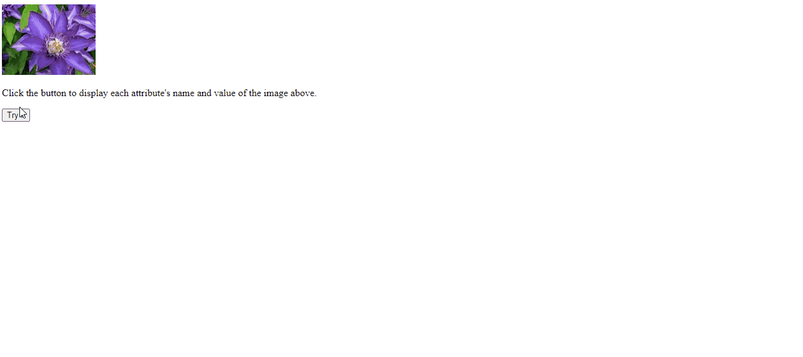
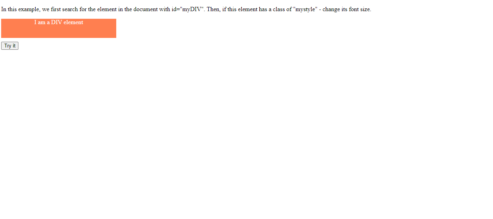

## Other Examples

### Example 0

#### HTML

```HTML
<!DOCTYPE html>

<html>

    <head>

        <title>This is the title</title>

        <link rel="stylesheet" type="text/css" href="style.css">

    </head>

<body>

    

    <p>Click the button to display each attribute's name and value of the image above.</p>

    <button onclick="myFunction()">Try it</button>

    <p id="demo"></p>

    <script src="js.js"></script>

</body>  

</html>
```

#### JavaScript

```JavaScript
function myFunction() {
    var x = document.getElementById("myImg");
    var txt = "";
    var i;
    for (i = 0; i < x.attributes.length; i++) {
        txt = txt + x.attributes[i].name + " = " + x.attributes[i].value + "<br>";
    }
    document.getElementById("demo").innerHTML = txt;
}

//We can change the attributes like this attributes.value="www.hophop.lk";
````

### Output



### Example 1

#### HTML

```HTML
<!DOCTYPE html>

<html>

    <head>

        <title>This is the title</title>

        <link rel="stylesheet" type="text/css" href="style.css">

    </head>

<body>

    <p>In this example, we first search for the element in the document with id="myDIV". Then, if this element has a class of "mystyle" - change its font size.</p>

    <div id="myDIV" class="mystyle">
        I am a DIV element
    </div>

    <button onclick="myFunction()">Try it</button>

    <script src="js.js"></script>

</body>

</html>
```

#### CSS

```css
.mystyle {
    width: 300px;
    height: 50px;
    text-align: center;
    background-color: coral;
    color: white;
    margin-bottom: 10px;
}
```

#### JavaScript

```JavaScript
function myFunction() {
    var x = document.getElementById("myDIV");

    if (x.className === "mystyle") {
        x.style.fontSize = "30px";
    }
}
````

### Output



### Example 2

#### HTML

```HTML
<!DOCTYPE html>

<html>

    <head>

        <title>This is the title</title>

        <link rel="stylesheet" type="text/css" href="style.css">

    </head>

<body>

    <input type="checkbox" id="cbtn" />

    <script src="js.js"></script>

</body>

</html>
```

#### CSS

```css
.mystyle {
    width: 300px;
    height: 50px;
    text-align: center;
    background-color: coral;
    color: white;
    margin-bottom: 10px;
}
```

#### JavaScript

```JavaScript
window.onload = function () {

    document.getElementById("cbtn").addEventListener("mouseover", fun);

}

function fun() {

    document.getElementById("cbtn").click();
}
````

### Output


