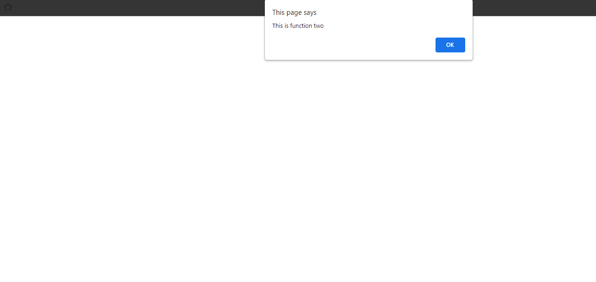
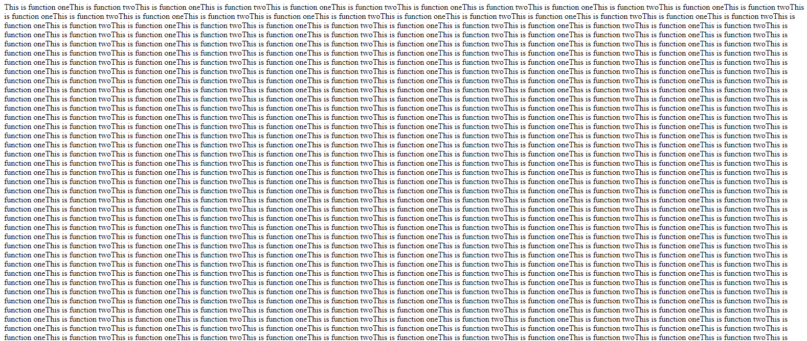
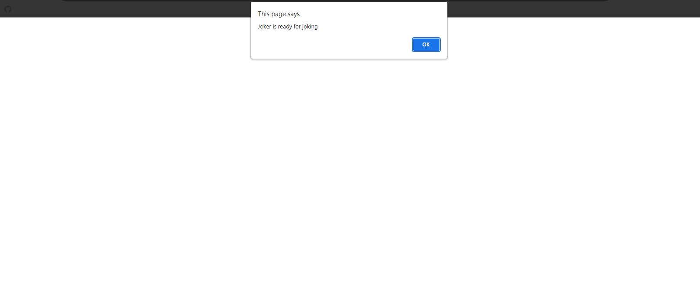
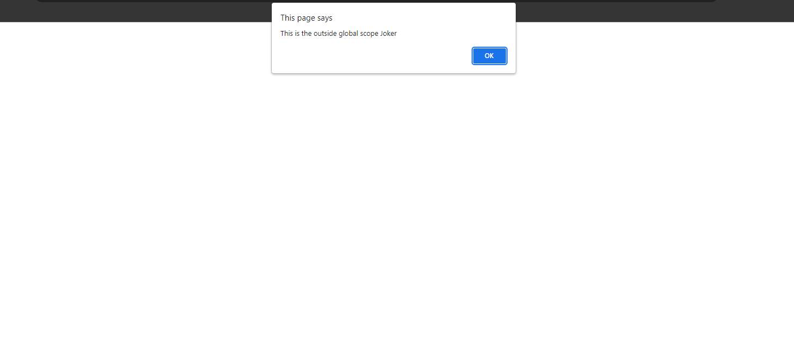
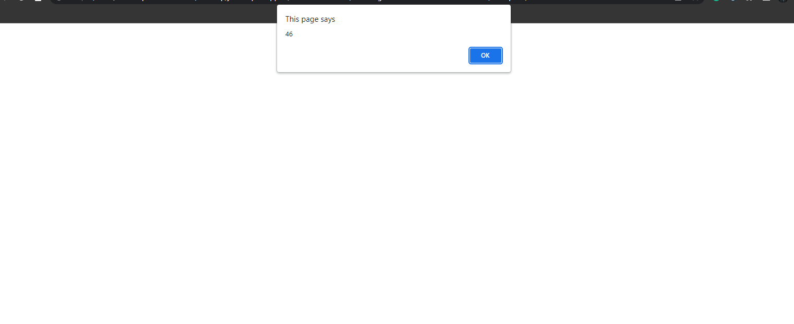
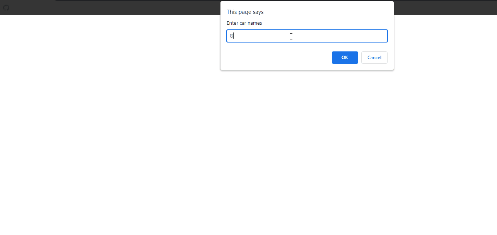
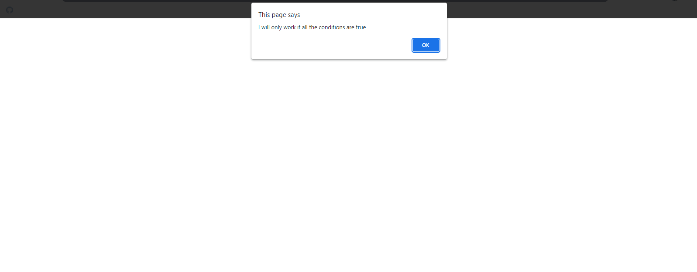

## 1. Function Basic Snippets

### Example 0

#### HTML

```HTML
<!DOCTYPE html>

<html>

    <head>

        <title>Excrise</title>

        <link rel="stylesheet" type="text/css" href="style.css">

    </head>

<body>

    <input type="text" id="txt1" />
    <input type="text" id="txt2" />
    <input type="button" id="btn1" value="Click" />

    <script src="js.js"></script>

</body>      

</html>
```

#### CSS

```css
.gta {

    color:red;

}

```

#### JavaScript

```JavaScript
window.onload = function () {

    document.getElementById("btn1").onclick = FnameAndLnameFun;

}

function names(x,y) {


    alert(x + " " + y);

}

function FnameAndLnameFun() {

    names(document.getElementById("txt1").value, document.getElementById("txt2").value);

}
````

### Output


### Example 1

#### HTML

```HTML
<!DOCTYPE html>

<html>

    <head>

        <title>Excrise</title>

        <link rel="stylesheet" type="text/css" href="style.css">

    </head>

<body>

    <input type="text" id="txt1" />
    <input type="text" id="txt2" />
    <input type="button" id="btn1" value="Click" />

    <script src="js.js"></script>

</body>

</html>
```

#### CSS

```css
.gta {

    color:red;

}
```

#### JavaScript

```JavaScript
window.onload = function () {


    document.getElementById("btn1").addEventListener("click", namesTogether);

}

function namesTogether() {

    var fname = document.getElementById("txt1").value;
    var lname = document.getElementById("txt2").value;

    alert(fname + " " + lname);
}
````

### Output


### Example 2

#### HTML

```HTML
<!DOCTYPE html>

<html>

    <head>

        <title>This is the title</title>

        <style>

        </style>

    <script src="js.js"></script>

    </head>

    <body>

    </body>

</html>
```

#### JavaScript

```JavaScript
function sayname(x,y){

    alert("My name is "+x+" and my age is "+y);    

}

sayname(prompt("Enter your name"),prompt("Enter your age"));

/* Notes

*function is a mini program example Facebook like button or youtube play button.
*function can have parameters
*Function parameters are the names listed in the function definition.
*Function arguments are the real values passed to (and received by) the function.

*/
````

### Output


## 2.Call  a Function Inside a function Snippets

### Example 0

#### HTML

```HTML
<!DOCTYPE html>

<html>

    <head>

        <title>This is the title</title>

        <style>

        </style>

    <script src="js.js"></script>

    </head>

    <body>

    </body>

</html>
```

#### JavaScript

```JavaScript
function fun1(){

	alert("This is function one");

}

function fun2(){

	alert("This is function two");

}

function start(){

	fun1();
	fun2();

}

start();

/*Notes

*We can call functions inside another function.

*/

````

### Output



## 3. Function Looping Snippets

### Example 0

#### HTML

```HTML
<!DOCTYPE html>

<html>

    <head>

        <title>This is the title</title>

        <style>

        </style>

    <script src="js.js"></script>

    </head>

    <body>

    </body>

</html>
```

#### JavaScript

```JavaScript
function fun1(){

	document.write("This is function one");
	fun2();

}

function fun2(){

	document.write("This is function two");
	fun1();

}

fun1();

/*Notes

*It's a looping function.
*it calls the functions again and again.

*/
````

### Output



## 4. Nestig If Statements Snippets

### Example 0

#### HTML

```HTML
<!DOCTYPE html>

<html>

    <head>

        <title>This is the title</title>

        <style>

        </style>

    <script src="js.js"></script>

    </head>

    <body>

    </body>

</html>
```

#### JavaScript

```JavaScript
var fname="joker";
var lname="hacker";


if(fname=="joker"){

	alert("Joker is ready for joking");

	if(lname=="hacker"){

		alert("The hacker is ready for hacking");

	}

}

/*Notes

*We can nest a thousand of if statements.

*/
````

### Output



## 5. Global Scope Snippets

### Example 0

#### HTML

```HTML
<!DOCTYPE html>

<html>

    <head>

        <title>This is the title</title>

        <style>

        </style>

    <script src="js.js"></script>

    </head>

    <body>

    </body>

</html>
```

#### JavaScript

```JavaScript
var globalSpoce="Joker";

function function_1(){

	alert("This is the inside global scope"+globalSpoce);

}

alert("This is the outside global scope "+globalSpoce);

function_1();

/*Notes

*Gobal scope is avaliable for all functions in your program.

*/
````

### Output



## 6. Local Scope Snippets

### Example 0

#### HTML

```HTML
<!DOCTYPE html>

<html>

    <head>

        <title>This is the title</title>

        <style>

        </style>

    <script src="js.js"></script>

    </head>

    <body>

    </body>

</html>
```

#### JavaScript

```JavaScript

function function_1(){

	var localSpoce="Joker";

	alert("This is the inside local scope"+localSpoce);

}
function_1();
alert("This is the outside local scope "+localSpoce);

/*Notes

*local scope is only avaliable for a Particular function.

*/
````

### Output


## 7. Do While Loop Snippets

### Example 0

#### HTML

```HTML
<!DOCTYPE html>

<html>

    <head>

        <title>This is the title</title>

        <style>

        </style>

    <script src="js.js"></script>

    </head>

    <body>

    </body>

</html>
```

#### JavaScript

```JavaScript
var a=0;

do{

	document.write("Number "+a+"<br>");
	a++;

}while(a<false)

/*Notes

*it runs the code before it tests the condition even though if the condition is false it runs once;

*/

````

### Output


## 8. Adding Methods to Construtor Function Snippets

### Example 0

#### HTML

```HTML
<!DOCTYPE html>

<html>

    <head>

        <title>This is the title</title>

        <style>

        </style>

    <script src="js.js"></script>

    </head>

    <body>

    </body>

</html>
```

#### JavaScript

```JavaScript
function Pepole(name,age){

	this.name=name;
	this.age=age;
	this.yearsLeft=yearsLeft;

}

function yearsLeft(){

var leftYears=65-this.age;

	return leftYears;
}

var kuna=new Pepole("Guna",19);

alert(kuna.yearsLeft());

/*Notes

*We can add methods to constructor function.
*Keep it in mind you have to use the Parentheses when you call it

*/
````

### Output



## 9. Aray Basic Snippets

### Example 0

#### HTML

```HTML
<!DOCTYPE html>

<html>

    <head>

        <title>This is the title</title>

        <style>

        </style>

    <script src="js.js"></script>

    </head>

    <body>

    </body>

</html>
```

#### JavaScript

```JavaScript
var carnames=new Array(3);

for(u=0;u<carnames.length;u++){

	carnames[u]=prompt("Enter car names");

}
document.write(carnames.join());

/*Notes

*There are four ways to create an array.
*/
````

### Output



## 10. OR Operator Snippets

### Example 0

#### HTML

```HTML
<!DOCTYPE html>

<html>

    <head>

        <title>This is the title</title>

        <style>

        </style>

    <script src="js.js"></script>

    </head>

    <body>

    </body>

</html>
```

#### JavaScript

```JavaScript
var variable1="kuna";
var variable2="joker";
var variable3="hacker";


if((variable1=="rakulan")||(variable2=="maker")||(variable3=="hacker")){

	alert("I will work if one of the conditions are true");

}

/*Notes

*If you want to test two or more conditions that only one of them need to be true use (||);
*You can add Unlimited  numbers of tests that is only one of them need to be true.

*/
````

### Output


## 11. And Operator Snippets

### Example 0

#### HTML

```HTML
<!DOCTYPE html>

<html>

    <head>

        <title>This is the title</title>

        <style>

        </style>

    <script src="js.js"></script>

    </head>

    <body>

    </body>

</html>
```

#### JavaScript

```JavaScript
var variable1="kuna";
var variable2="joker";
var variable3="hacker";

if((variable1=="kuna")&&(variable2=="joker")&&(variable3=="hacker")){

	alert("I will only work if all the conditions are true");

}

/*Notes

*If you want to test two or more conditions thats are all need to be true use (&&) operater.
*We can test a thousand of conditions thats are all need to be true.
*/
````

### Output


