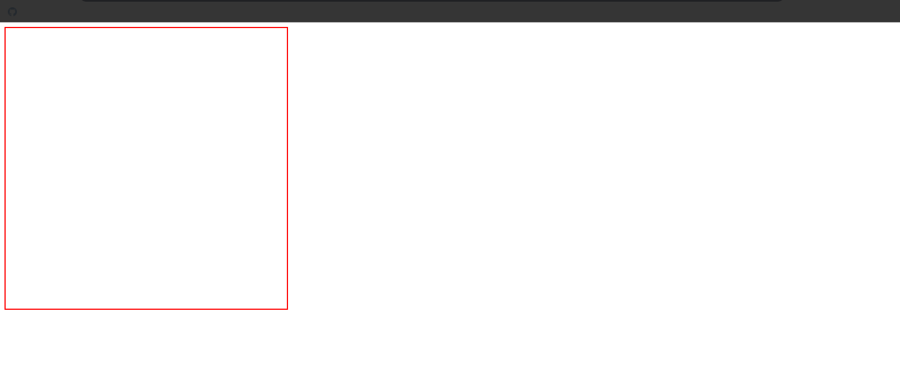
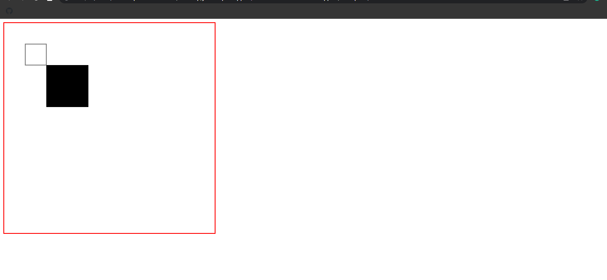
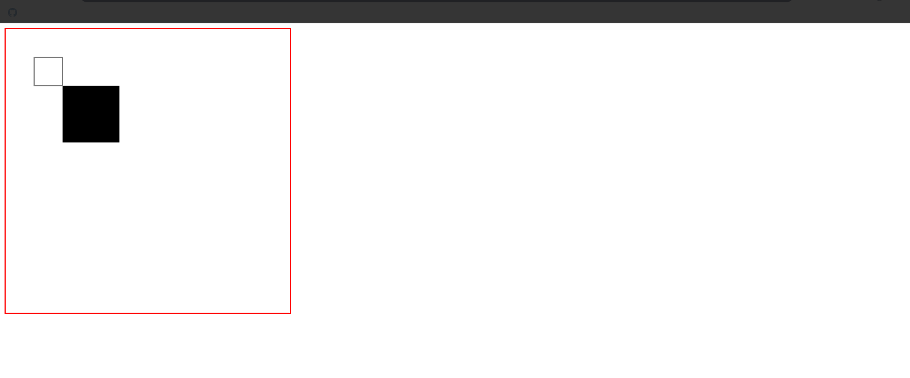
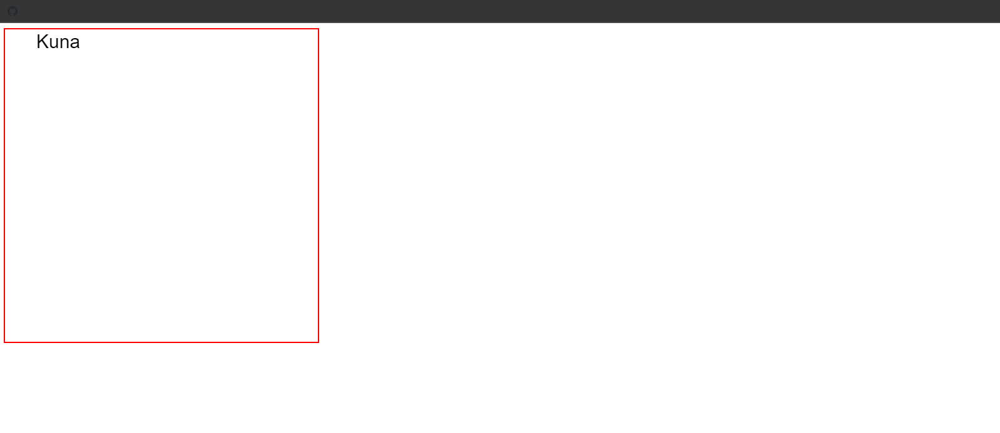
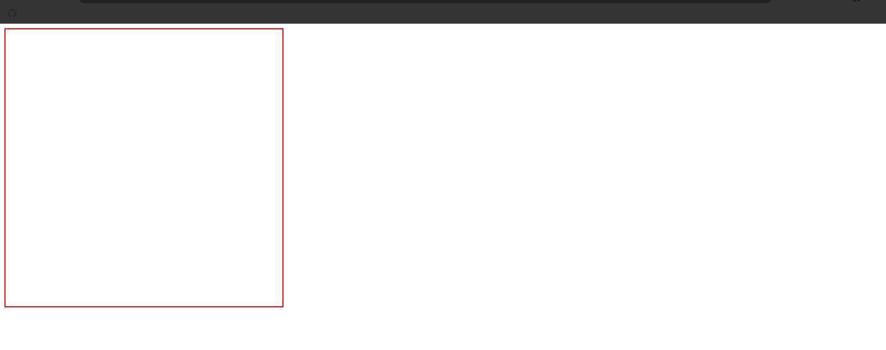

## Canvas Introduction Snippets

### Example 0

#### HTML

```HTML
<!DOCTYPE html>

<html>

    <head>

        <title>This is the title</title>

        <link rel="stylesheet" type="text/css" href="style.css">
        <meta charset="utf-8">

    </head>

<body>

   <canvas id="can1" width="500" height="500" style="border:2px solid red;"></canvas>

    <script src="js.js" type="text/javascript"></script>

</body>

</html>
```

#### JavaScript

```JavaScript
var img = new Image();

img.src = "im.jpg";

var can = document.getElementById("can1");
var ctx = can.getContext("2d");
ctx.drawImage(img, 0, 0, can.width, can.height);
```

### Output



### Example 1

#### HTML

```HTML
<!DOCTYPE html>

<html>

    <head>

        <title>This is the title</title>

        <link rel="stylesheet" type="text/css" href="style.css">
        <meta charset="utf-8">

    </head>

<body>

   <canvas id="can1" width="500" height="500" style="border:2px solid red;"></canvas>

    <script src="js.js" type="text/javascript"></script>

</body>

</html>
```

#### JavaScript

```JavaScript
var can1 = document.getElementById("can1");
var ctx = can1.getContext("2d");
ctx.fillRect(100, 100, 100, 100);
ctx.strokeRect(50, 50, 50, 50);

//The fillRect is filled with colors but strokeRect is not.
```

### Output



### Example 2

#### HTML

```HTML
<!DOCTYPE html>

<html>

    <head>

        <title>This is the title</title>

        <link rel="stylesheet" type="text/css" href="style.css">
        <meta charset="utf-8">

    </head>

<body>

   <canvas id="can1" width="500" height="500" style="border:2px solid red;"></canvas>

    <script src="js.js" type="text/javascript"></script>

</body>

</html>
```

#### JavaScript

```JavaScript
var can1 = document.getElementById("can1");
var ctx = can1.getContext("2d");
ctx.strokeRect(50, 50, 100, 100);
ctx.beginPath();
ctx.moveTo(75, 75);
ctx.lineTo(125, 125);
ctx.lineTo(125, 75);
ctx.fill()
```

### Output



### Example 3

#### HTML

```HTML
<!DOCTYPE html>

<html>

    <head>

        <title>This is the title</title>

        <link rel="stylesheet" type="text/css" href="style.css">
        <meta charset="utf-8">

    </head>

<body>

   <canvas id="can1" width="500" height="500" style="border:2px solid red;"></canvas>

    <script src="js.js" type="text/javascript"></script>

</body>

</html>
```

#### JavaScript

```JavaScript
var can1 = document.getElementById("can1");
var ctx = can1.getContext("2d");
ctx.font="30px Arial"//font method is use to give the font size and font type
ctx.fillText("Kuna", 50, 30)//fillText is use to fill with texts.And we can also use the strokeText method.
```

### Output



### Example 4

#### HTML

```HTML
<!DOCTYPE html>

<html>

    <head>

        <title>This is the title</title>

        <link rel="stylesheet" type="text/css" href="style.css">
        <meta charset="utf-8">

    </head>

<body>

   <canvas id="can1" width="500" height="500" style="border:2px solid red;"></canvas>

    <script src="js.js" type="text/javascript"></script>

</body>

</html>
```

#### JavaScript

```JavaScript
var can1 = document.getElementById("can1");
var ctx = can1.getContext("2d");
ctx.beginPath();
ctx.moveTo(50, 50);
ctx.lineTo(125, 125);
ctx.lineTo(125, 75);
ctx.fillStyle = "blue";//We use the fillStyle method to give a color to the canvas.We can also use the strokeStyle method.
ctx.strokeStyle
```

### Output


