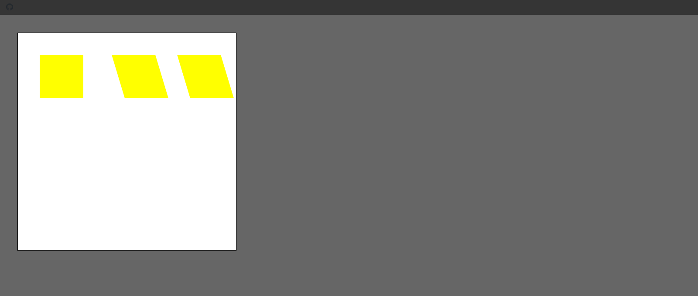

## 1. Rectangle Methods Snippets

### Example 0

#### HTML

```HTML
<!DOCTYPE html>

<html>

    <head>

        <title>This is the title</title>

        <link rel="stylesheet" type="text/css" href="style.css">
        <meta charset="utf-8">

    </head>

<body>

 <canvas id="can1" width="500" height="500"></canvas>

    <script src="js.js" type="text/javascript"></script>

</body>

</html>
```

#### CSS

```CSS
#can1 {

    background: white;
      border:1px solid black;
}

body {

    background-color:#666;
   margin: 40px;
}
```

#### JavaScript

```JavaScript
window.onload = draw;

function draw() {

    var ctx = document.getElementById("can1").getContext("2d");
    ctx.fillStyle = "magenta";
    ctx.fillRect(20, 20, 100, 100);//It is used to drow a rectangle.
    ctx.strokeRect(20, 20, 100, 100);//It is used to drow a border rectangle.
    ctx.fillRect(200, 200, 50, 50);//It is used to drow a rectangle.
    ctx.strokeRect(200, 200, 50, 50);//It is used to drow a border rectangle.
    ctx.clearRect(0, 0, 100, 100);//The clearRect is used to erase the canvas.
}
```

### Output


## 2. Fill and Stroke Styles Color Gradient Pattern Snippets

### Example 0

#### HTML

```HTML
<!DOCTYPE html>

<html>

    <head>

        <title>This is the title</title>

        <link rel="stylesheet" type="text/css" href="style.css">
        <meta charset="utf-8">

    </head>

<body>

 <canvas id="can1" width="500" height="500"></canvas>

    <script src="js.js" type="text/javascript"></script>

</body>

</html>
```

#### CSS

```CSS
#can1 {

    background: white;
      border:1px solid black;
}

body {

    background-color:#666;
   margin: 40px;

}
```

#### JavaScript

```JavaScript
window.onload = draw;

function draw() {

    var ctx = document.getElementById("can1").getContext("2d");
    //ctx.fillStyle=Color names | Hex | rgba() | gradient | pattren.
    ctx.fillStyle="rgba(0,200,0,0.4)"//rgba a is stand for alpha.it means the opacity.
    ctx.fillRect(50, 50, 150, 150);
}
```

### Output


### Example 1

#### HTML

```HTML
<!DOCTYPE html>

<html>

    <head>

        <title>This is the title</title>

        <link rel="stylesheet" type="text/css" href="style.css">
        <meta charset="utf-8">

    </head>

<body>

 <canvas id="can1" width="500" height="500"></canvas>

    <script src="js.js" type="text/javascript"></script>

</body>

</html>
```

#### CSS

```CSS
#can1 {

    background: white;
      border:1px solid black;
}

body {

    background-color:#666;
   margin: 40px;

}
```

#### JavaScript

```JavaScript
window.onload = draw;

function draw() {

    var ctx = document.getElementById("can1").getContext("2d");
    //ctx.fillStyle=Color names | Hex | rgba() | gradient | pattren.
    ctx.fillStyle = "rgba(0,200,0,0.5)"//rgba a is stand for alpha.it means the opacity.
    ctx.strokeStyle = "red";//strokeStyle is use to give a color style for strokeRect method.
    ctx.lineWidth = 10;//lineWidth is use to give the width of the strokeRect.
    ctx.strokeRect(50, 50, 150, 150);
    ctx.fillRect(50, 50, 150, 150);

}
```

### Output


### Example 2

#### HTML

```HTML
<!DOCTYPE html>

<html>

    <head>

        <title>This is the title</title>

        <link rel="stylesheet" type="text/css" href="style.css">
        <meta charset="utf-8">

    </head>

<body>

 <canvas id="can1" width="500" height="500"></canvas>

    <script src="js.js" type="text/javascript"></script>

</body>

</html>
```

#### CSS

```CSS
#can1 {

    background: white;
      border:1px solid black;
}

body {

    background-color:#666;
   margin: 40px;

}
```

#### JavaScript

```JavaScript
window.onload = draw;

function draw() {

    var ctx = document.getElementById("can1").getContext("2d");
    //var g1 = ctx.createLinearGradient(x0, y0, x1, y1);
    var g1 = ctx.createLinearGradient(50, 50, 150, 0);//if we change the last value like this (50, 50, 0, 150)  it will be top to bottom.like this
    g1.addColorStop(0, "magenta");//0 and 1 is the starting and ending position.
    g1.addColorStop(0.5, "yellow");//0.5 is middle position.and also we can give like 0.6,0.7,0.3;
    g1.addColorStop(1, "black");
    ctx.fillStyle = g1;
    ctx.strokeStyle = "red";
    ctx.lineWidth = 10;
    ctx.strokeRect(50, 50, 150, 150);
    ctx.fillRect(50, 50, 150, 150);

}
```

### Output


### Example 3

#### HTML

```HTML
<!DOCTYPE html>

<html>

    <head>

        <title>This is the title</title>

        <link rel="stylesheet" type="text/css" href="style.css">
        <meta charset="utf-8">

    </head>

<body>

 <canvas id="can1" width="500" height="500"></canvas>

    <script src="js.js" type="text/javascript"></script>

</body>

</html>
```

#### CSS

```CSS
#can1 {

    background: white;
      border:1px solid black;
}

body {

    background-color:#666;
   margin: 40px;

}
```

#### JavaScript

```JavaScript
window.onload = draw;

function draw() {

    var ctx = document.getElementById("can1").getContext("2d");
    //var g1 = ctx.createLinearGradient(x0, y0, x1, y1);
    //var g1 = ctx.createRadialGradient(x0, y0, r0, x1,y1, r1) r0 and r1 is the starting and ending position.
    var g1 = ctx.createRadialGradient(350, 100, 0,350, 100,200);//if we change the last value like this (50, 50, 0, 150)  it will be top to bottom.like this
    g1.addColorStop(0, "magenta");//0 and 1 is the starting and ending position.
    g1.addColorStop(0.5, "yellow");//0.5 is middle position.and also we can give like 0.6,0.7,0.3;
    g1.addColorStop(1, "black");
    ctx.fillStyle = g1;
    ctx.strokeStyle = "red";
    ctx.lineWidth = 10;
    ctx.strokeRect(250, 50, 150, 150);
    ctx.fillRect(250, 50, 150, 150);

}
```

### Output


### Example 4

#### HTML

```HTML
<!DOCTYPE html>

<html>

    <head>

        <title>This is the title</title>

        <link rel="stylesheet" type="text/css" href="style.css">
        <meta charset="utf-8">

    </head>

<body>

 <canvas id="can1" width="500" height="500"></canvas>

    <script src="js.js" type="text/javascript"></script>

</body>

</html>
```

#### CSS

```CSS
#can1 {

    background: white;
      border:1px solid black;
}

body {

    background-color:#666;
   margin: 40px;

}
```

#### JavaScript

```JavaScript
window.onload = draw;

var img = new Image();
img.src="im.png"

function draw() {

    var ctx = document.getElementById("can1").getContext("2d");
    var pa=ctx.createPattern(img, "repeat")//We can also use repeat-x and repeat-y.
    ctx.fillStyle = pa;
    ctx.strokeStyle = "red";
    ctx.lineWidth = 10;
    ctx.strokeRect(50, 50, 150, 150);
    ctx.fillRect(50, 50, 150, 150);

}
```

### Output


## 3. Line Styles for Lines and Strokes Snippets

### Example 0

#### HTML

```HTML
<!DOCTYPE html>

<html>

    <head>

        <title>This is the title</title>

        <link rel="stylesheet" type="text/css" href="style.css">
        <meta charset="utf-8">

    </head>

<body>

 <canvas id="can1" width="500" height="500"></canvas>

    <script src="js.js" type="text/javascript"></script>

</body>

</html>
```

#### CSS

```CSS
#can1 {

    background: white;
      border:1px solid black;
}

body {

    background-color:#666;
   margin: 40px;
}
```

#### JavaScript

```JavaScript
window.onload = draw;

function draw() {

    var ctx = document.getElementById("can1").getContext("2d");
    ctx.beginPath()//It spcifies that we are begining a new path.
    ctx.moveTo(150, 150);//These are x and y coordiates.
    ctx.lineTo(250, 250);
    ctx.lineTo(350,40)
    ctx.stroke();
    ctx.fill()//we use the fill method to fill it.

}
```

### Output


### Example 1

#### HTML

```HTML
<!DOCTYPE html>

<html>

    <head>

        <title>This is the title</title>

        <link rel="stylesheet" type="text/css" href="style.css">
        <meta charset="utf-8">

    </head>

<body>

 <canvas id="can1" width="500" height="500"></canvas>

    <script src="js.js" type="text/javascript"></script>

</body>

</html>
```

#### CSS

```CSS
#can1 {

    background: white;
      border:1px solid black;
}

body {

    background-color:#666;
   margin: 40px;

}
```

#### JavaScript

```JavaScript
window.onload = draw;

function draw() {

    var ctx = document.getElementById("can1").getContext("2d");
    ctx.beginPath()//It spcifies that we are begining a new path.
    ctx.moveTo(150, 150);//These are x and y coordiates.
    ctx.lineWidth = 20;
    ctx.lineCap = "round";//We can also use butt,round,square.It spcifies the end.
    ctx.lineJoin = "round";//We can alose use bevel,round,miter.It spcifies the joins.
    ctx.lineTo(250, 250);
    ctx.lineTo(350,40)
    ctx.stroke();

}
```

### Output


### Example 2

#### HTML

```HTML
<!DOCTYPE html>

<html>

    <head>

        <title>This is the title</title>

        <link rel="stylesheet" type="text/css" href="style.css">
        <meta charset="utf-8">

    </head>

<body>

 <canvas id="can1" width="500" height="500"></canvas>

    <script src="js.js" type="text/javascript"></script>

</body>

</html>
```

#### CSS

```CSS
#can1 {

    background: white;
      border:1px solid black;
}

body {

    background-color:#666;
   margin: 40px;

}
```

#### JavaScript

```JavaScript
window.onload = draw;

function draw() {

    var ctx = document.getElementById("can1").getContext("2d");
    ctx.beginPath()//It spcifies that we are begining a new path.
    ctx.moveTo(150, 150);//These are x and y coordiates.
    ctx.lineWidth = 20;
    ctx.lineCap = "butt";//We can also use butt,round,square.It spcifies the end.
    ctx.lineJoin = "round";//We can alose use bevel,round,miter.It spcifies the joins.
    ctx.setLineDash([20,10]);
    ctx.lineTo(250, 250);
    ctx.lineTo(350,40)
    ctx.stroke();

}
```

### Output


## 4. Building and Drawing Path Snippets

### Example 0

#### HTML

```HTML
<!DOCTYPE html>

<html>

    <head>

        <title>This is the title</title>

        <link rel="stylesheet" type="text/css" href="style.css">
        <meta charset="utf-8">

    </head>

<body>

 <canvas id="can1" width="500" height="500"></canvas>

    <script src="js.js" type="text/javascript"></script>

</body>

</html>
```

#### CSS

```CSS
#can1 {

    background: white;
      border:1px solid black;
}

body {

    background-color:#666;
   margin: 40px;

}
```

#### JavaScript

```JavaScript
window.onload = draw;

function draw() {

    var ctx = document.getElementById("can1").getContext("2d");
    ctx.beginPath()//Resets the current default path.
    ctx.moveTo(50, 50)//creates a new subpath with the given point.
    ctx.lineTo(250, 50);//creates a new line along the current subpath.
    ctx.lineTo(250, 200);
    ctx.lineTo(50, 200);
    ctx.closePath();//We can also code like this ctx.lineTo(50,50).
    ctx.stroke();//We can also use the fill method.

}
```

### Output


### Example 1

#### HTML

```HTML
<!DOCTYPE html>

<html>

    <head>

        <title>This is the title</title>

        <link rel="stylesheet" type="text/css" href="style.css">
        <meta charset="utf-8">

    </head>

<body>

 <canvas id="can1" width="500" height="500"></canvas>

    <script src="js.js" type="text/javascript"></script>

</body>

</html>
```

#### CSS

```CSS
#can1 {

    background: white;
      border:1px solid black;
}

body {

    background-color:#666;
   margin: 40px;

}
```

#### JavaScript

```JavaScript
window.onload = draw;

function draw() {

    var ctx = document.getElementById("can1").getContext("2d");
    ctx.arc(150, 150, 100, 0, 6.28, false);//The 3.28 is the cricle value we can also use like this Math.PI *2 insted of 6.28.false is clockwise and true is counter-clockwise.
    ctx.stroke()

}
```

### Output


### Example 2

#### HTML

```HTML
<!DOCTYPE html>

<html>

    <head>

        <title>This is the title</title>

        <link rel="stylesheet" type="text/css" href="style.css">
        <meta charset="utf-8">

    </head>

<body>

 <canvas id="can1" width="500" height="500"></canvas>

    <script src="js.js" type="text/javascript"></script>

</body>

</html>
```

#### CSS

```CSS
#can1 {

    background: white;
      border:1px solid black;
}

body {

    background-color:#666;
   margin: 40px;

}
```

#### JavaScript

```JavaScript
window.onload = draw;

function draw() {

    var ctx = document.getElementById("can1").getContext("2d");
    ctx.arc(150, 150, 100, 0, Math.PI * 2, false);//Math.PI * 2 is same as 6.28.
    ctx.stroke()

}
```

### Output


### Example 3

#### HTML

```HTML
<!DOCTYPE html>

<html>

    <head>

        <title>This is the title</title>

        <link rel="stylesheet" type="text/css" href="style.css">
        <meta charset="utf-8">

    </head>

<body>

 <canvas id="can1" width="500" height="500"></canvas>

    <script src="js.js" type="text/javascript"></script>

</body>

</html>
```

#### CSS

```CSS
#can1 {

    background: white;
      border:1px solid black;
}

body {

    background-color:#666;
   margin: 40px;

}
```

#### JavaScript

```JavaScript
window.onload = draw;

function draw() {

    var ctx = document.getElementById("can1").getContext("2d");
    ctx.arc(150, 150, 100, 0, Math.PI , true);//Math.PI is the 50% cricle true is counter-clockwise.
    ctx.stroke()

}
```

### Output


### Example 4

#### HTML

```HTML
<!DOCTYPE html>

<html>

    <head>

        <title>This is the title</title>

        <link rel="stylesheet" type="text/css" href="style.css">
        <meta charset="utf-8">

    </head>

<body>

 <canvas id="can1" width="500" height="500"></canvas>

    <script src="js.js" type="text/javascript"></script>

</body>

</html>
```

#### CSS

```CSS
#can1 {

    background: white;
      border:1px solid black;
}

body {

    background-color:#666;
   margin: 40px;

}
```

#### JavaScript

```JavaScript
window.onload = draw;

function draw() {

    var ctx = document.getElementById("can1").getContext("2d");
    ctx.arc(150, 150, 100, 0, Math.PI , false);//Math.PI is the 50% cricle and is false is clockwise
    ctx.stroke()

}
```

### Output


### Example 5

#### HTML

```HTML
<!DOCTYPE html>

<html>

    <head>

        <title>This is the title</title>

        <link rel="stylesheet" type="text/css" href="style.css">
        <meta charset="utf-8">

    </head>

<body>

 <canvas id="can1" width="500" height="500"></canvas>

    <script src="js.js" type="text/javascript"></script>

</body>

</html>
```

#### CSS

```CSS
#can1 {

    background: white;
      border:1px solid black;
}

body {

    background-color:#666;
   margin: 40px;

}
```

#### JavaScript

```JavaScript
window.onload = draw;

function draw() {

    var ctx = document.getElementById("can1").getContext("2d");
    ctx.arc(150, 150, 100, 0, 4.2 , false);//By changeing the cricle value we can make 75% 88% and many cricles.
    ctx.stroke()

}
```

### Output


### Example 6

#### HTML

```HTML
<!DOCTYPE html>

<html>

    <head>

        <title>This is the title</title>

        <link rel="stylesheet" type="text/css" href="style.css">
        <meta charset="utf-8">

    </head>

<body>

 <canvas id="can1" width="500" height="500"></canvas>

    <script src="js.js" type="text/javascript"></script>

</body>

</html>
```

#### CSS

```CSS
#can1 {

    background: white;
      border:1px solid black;
}

body {

    background-color:#666;
   margin: 40px;

}
```

#### JavaScript

```JavaScript
window.onload = draw;

function draw() {

    var ctx = document.getElementById("can1").getContext("2d");
    ctx.moveTo(50,50);
    ctx.lineTo(300, 50);
    //ctx.arcTo(x1,y1,x2,y2,radius) x1 and y1 means where it is beign.x2 and y2 means where it is end.
    ctx.arcTo(350, 50, 350, 100, 50);
    ctx.lineTo(350, 200);
    ctx.stroke();
  // There are also some methods like this ctx.bezierCurveTo() and ctx.quadraticCurveTo() methods

}
```

### Output


## 5. Drawing Images and Videos Snippets

### Example 0

#### HTML

```HTML
<!DOCTYPE html>

<html>

    <head>

        <title>This is the title</title>

        <link rel="stylesheet" type="text/css" href="style.css">
        <meta charset="utf-8">

    </head>

<body>

 <canvas id="can1" width="500" height="500"></canvas>

    <script src="js.js" type="text/javascript"></script>

</body>

</html>
```

#### CSS

```CSS
#can1 {

    background: white;
      border:1px solid black;
}

body {

    background-color:#666;
   margin: 40px;

}
```

#### JavaScript

```JavaScript
window.onload = draw;

var img = new Image();
img.src = "img.jpg";

function draw() {

    var ctx = document.getElementById("can1").getContext("2d");
    ctx.drawImage(img,20, 20, 200, 200);

}
```

### Output


### Example 0

#### HTML

```HTML
<!DOCTYPE html>

<html>

    <head>

        <title>This is the title</title>

        <link rel="stylesheet" type="text/css" href="style.css">
        <meta charset="utf-8">

    </head>

<body>

 <canvas id="can1" width="500" height="500"></canvas>

    <script src="js.js" type="text/javascript"></script>

</body>

</html>
```

#### CSS

```CSS
#can1 {

    background: white;
      border:1px solid black;
}

body {

    background-color:#666;
   margin: 40px;

}
```

#### JavaScript

```JavaScript
window.onload = draw;

var img = new Image();
img.src = "img.jpg";

function draw() {

    var ctx = document.getElementById("can1").getContext("2d");
    ctx.drawImage(img, 100, 100, img.width, img.height, 20, 20, img.width, img.height);
    //We can clip images like this for further information research about it.

}
```

### Output


## 6. Drawing Text Snippets

### Example 0

#### HTML

```HTML
<!DOCTYPE html>

<html>

    <head>

        <title>This is the title</title>

        <link rel="stylesheet" type="text/css" href="style.css">
        <meta charset="utf-8">

    </head>

<body>

 <canvas id="can1" width="500" height="500"></canvas>

    <script src="js.js" type="text/javascript"></script>

</body>

</html>
```

#### CSS

```CSS
#can1 {

    background: white;
      border:1px solid black;
}

body {

    background-color:#666;
   margin: 40px;

}
```

#### JavaScript

```JavaScript
window.onload = draw;

function draw() {

    var ctx = document.getElementById("can1").getContext("2d");
    //fillText(text,x,y,maxWidth) maxWidth is optional.
    //storkeText(text,x,y,maxWidth) maxWidth is optional. but it is a storke text.
    ctx.fillStyle = "orange";
    ctx.font = "italic bold 56px Arial sans-serif";//We can use 900 500 to bold.
    ctx.textAlign = "start";//star,end,left,right,center .we can use one if these.
    ctx.textBaseline = "hanging";//top,middle,bottom,hanging,alphabetic,ideographic.
    ctx.fillText("Text on canvas", 50, 50);
    ctx.lineWidth = 3;
    ctx.strokeText("Text on canvas", 50, 50);

}
```

### Output


### Example 1

#### HTML

```HTML
<!DOCTYPE html>

<html>

    <head>

        <title>This is the title</title>

        <link rel="stylesheet" type="text/css" href="style.css">
        <meta charset="utf-8">

    </head>

<body>

 <canvas id="can1" width="500" height="500"></canvas>

    <script src="js.js" type="text/javascript"></script>

</body>

</html>
```

#### CSS

```CSS
#can1 {

    background: white;
      border:1px solid black;
}

body {

    background-color:#666;
   margin: 40px;

}
```

#### JavaScript

```JavaScript
window.onload = draw;

function draw() {

    var ctx = document.getElementById("can1").getContext("2d");
    //fillText(text,x,y,maxWidth) maxWidth is optional.
    //storkeText(text,x,y,maxWidth) maxWidth is optional. but it is a storke text.
    ctx.fillStyle = "orange";
    ctx.font = "italic bold 56px Arial sans-serif";//We can use 900 500 to bold.
    ctx.fillText("Text on canvas", 50, 50);
    ctx.textAlign = "start";//star,end,left,right,center .we can use one if these.
    ctx.textBaseline = "hanging";//top,middle,bottom,hanging,alphabetic,ideographic.
    ctx.lineWidth = 3;
    ctx.strokeText("Text on canvas", 50, 50);

}

//in this program the stroke method only apply all properties.we draw the fillText property first then we apply textAlign and textBaseline so this will aplly to stokeText.
```

### Output


### Example 2

#### HTML

```HTML
<!DOCTYPE html>

<html>

    <head>

        <title>This is the title</title>

        <link rel="stylesheet" type="text/css" href="style.css">
        <meta charset="utf-8">

    </head>

<body>

 <canvas id="can1" width="500" height="500"></canvas>

    <script src="js.js" type="text/javascript"></script>

</body>

</html>
```

#### CSS

```CSS
#can1 {

    background: white;
      border:1px solid black;
}

body {

    background-color:#666;
   margin: 40px;

}
```

#### JavaScript

```JavaScript
window.onload = draw;

var img = new Image();
img.src = "img.jpg";

function draw() {

    var ctx = document.getElementById("can1").getContext("2d");
    ctx.fillStyle = "red";
    ctx.font = "60px Arial";
    ctx.fillText("Text On canvas", 50, 50, 150);
    ctx.strokeText("Text On canvas", 50, 50, 150);

}
```

### Output


## 7. Shadows Snippets

### Example 0

#### HTML

```HTML
<!DOCTYPE html>

<html>

    <head>

        <title>This is the title</title>

        <link rel="stylesheet" type="text/css" href="style.css">
        <meta charset="utf-8">

    </head>

<body>

 <canvas id="can1" width="500" height="500"></canvas>

    <script src="js.js" type="text/javascript"></script>

</body>

</html>
```

#### CSS

```CSS
#can1 {

    background: white;
      border:1px solid black;
}

body {

    background-color:#666;
   margin: 40px;

}
```

#### JavaScript

```JavaScript
window.onload = draw;

function draw() {

   var ctx = document.getElementById("can1").getContext("2d");
    //shadowColor=color | hex | rgba().a is alpha it means opacity.
    //shadowOffsetX=positive or nagative number.
    //shadowOffsetY=positive or nagative number.
    //shadowBlur=positive number.

   ctx.fillStyle = "yellow";
   ctx.shadowColor = 'rgba(200,0,0,1)';//200 is the Maximum value.  1 is the tranparent it means the opacity.
   ctx.shadowOffsetX = 5;//if you out -5 it will change the diraction.
   ctx.shadowOffsetY = 5;//if you out -5 it will change the diraction.
   ctx.shadowBlur = 3;
   ctx.fillRect(200, 50, 100, 100);

}
```

### Output


## 8. Transformation Effects Snippets

### Example 0

#### HTML

```HTML
<!DOCTYPE html>

<html>

    <head>

        <title>This is the title</title>

        <link rel="stylesheet" type="text/css" href="style.css">
        <meta charset="utf-8">

    </head>

<body>

 <canvas id="can1" width="500" height="500"></canvas>

    <script src="js.js" type="text/javascript"></script>

</body>

</html>
```

#### CSS

```CSS
#can1 {

    background: white;
      border:1px solid black;
}

body {

    background-color:#666;
   margin: 40px;

}
```

#### JavaScript

```JavaScript
window.onload = draw;

function draw() {

    var ctx = document.getElementById("can1").getContext("2d");
    ctx.fillStyle = "yellow";
   ctx.fillRect(50, 50, 100, 100);
   ctx.scale(0.5, 0.5);//Default scale is 1,1 that is x and y.
   ctx.fillRect(500, 50, 100, 100);

}
```

### Output


### Example 1

#### HTML

```HTML
<!DOCTYPE html>

<html>

    <head>

        <title>This is the title</title>

        <link rel="stylesheet" type="text/css" href="style.css">
        <meta charset="utf-8">

    </head>

<body>

 <canvas id="can1" width="500" height="500"></canvas>

    <script src="js.js" type="text/javascript"></script>

</body>

</html>
```

#### CSS

```CSS
#can1 {

    background: white;
      border:1px solid black;
}

body {

    background-color:#666;
   margin: 40px;

}
```

#### JavaScript

```JavaScript
window.onload = draw;

function draw() {

    var ctx = document.getElementById("can1").getContext("2d");
    ctx.fillStyle = "yellow";
   ctx.fillRect(50, 50, 100, 100);
   ctx.rotate(0.1);//angle
   ctx.fillRect(200, 50, 100, 100);
   ctx.fillRect(350, 50, 100, 100);

}
```

### Output


### Example 2

#### HTML

```HTML
<!DOCTYPE html>

<html>

    <head>

        <title>This is the title</title>

        <link rel="stylesheet" type="text/css" href="style.css">
        <meta charset="utf-8">

    </head>

<body>

 <canvas id="can1" width="500" height="500"></canvas>

    <script src="js.js" type="text/javascript"></script>

</body>

</html>
```

#### CSS

```CSS
#can1 {

    background: white;
      border:1px solid black;
}

body {

    background-color:#666;
   margin: 40px;

}
```

#### JavaScript

```JavaScript
window.onload = draw;

function draw() {

    var ctx = document.getElementById("can1").getContext("2d");
    ctx.fillStyle = "yellow";
   ctx.fillRect(50, 50, 100, 100);
   ctx.translate(20,50);//It takes x and y.We can also put -20 -50;
   ctx.fillRect(200, 50, 100, 100);
   ctx.fillRect(350, 50, 100, 100);

}
```

### Output


### Example 3

#### HTML

```HTML
<!DOCTYPE html>

<html>

    <head>

        <title>This is the title</title>

        <link rel="stylesheet" type="text/css" href="style.css">
        <meta charset="utf-8">

    </head>

<body>

 <canvas id="can1" width="500" height="500"></canvas>

    <script src="js.js" type="text/javascript"></script>

</body>

</html>
```

#### CSS

```CSS
#can1 {

    background: white;
      border:1px solid black;
}

body {

    background-color:#666;
   margin: 40px;

}
```

#### JavaScript

```JavaScript
window.onload = draw;

function draw() {

    var ctx = document.getElementById("can1").getContext("2d");
    ctx.fillStyle = "yellow";
   ctx.fillRect(50, 50, 100, 100);
    //transform(xScale,ySkew,xSkew,yScale,xTrans,yTrans).
    //Default transform is matrix is (1,0,0,1,0,0).

   ctx.transform(0.5, 0, 0, 0.5, 0, 0);
   ctx.fillRect(500, 50, 100, 100);
   ctx.fillRect(350, 50, 100, 100);

}
```

### Output


### Example 4

#### HTML

```HTML
<!DOCTYPE html>

<html>

    <head>

        <title>This is the title</title>

        <link rel="stylesheet" type="text/css" href="style.css">
        <meta charset="utf-8">

    </head>

<body>

 <canvas id="can1" width="500" height="500"></canvas>

    <script src="js.js" type="text/javascript"></script>

</body>

</html>
```

#### CSS

```CSS
#can1 {

    background: white;
      border:1px solid black;
}

body {

    background-color:#666;
   margin: 40px;

}
```

#### JavaScript

```JavaScript
window.onload = draw;

function draw() {

    var ctx = document.getElementById("can1").getContext("2d");
    ctx.fillStyle = "yellow";
   ctx.fillRect(50, 50, 100, 100);
    //transform(xScale,ySkew,xSkew,yScale,xTrans,yTrans).
    //Default transform is matrix is (1,0,0,1,0,0).

   ctx.transform(1, 0.3, 0, 1, 0, 0);//This is ySkew transform.
   ctx.fillRect(200, 50, 100, 100);
   ctx.fillRect(350, 50, 100, 100);

}
```

### Output


### Example 5

#### HTML

```HTML
<!DOCTYPE html>

<html>

    <head>

        <title>This is the title</title>

        <link rel="stylesheet" type="text/css" href="style.css">
        <meta charset="utf-8">

    </head>

<body>

 <canvas id="can1" width="500" height="500"></canvas>

    <script src="js.js" type="text/javascript"></script>

</body>

</html>
```

#### CSS

```CSS
#can1 {

    background: white;
      border:1px solid black;
}

body {

    background-color:#666;
   margin: 40px;

}
```

#### JavaScript

```JavaScript
window.onload = draw;

function draw() {

    var ctx = document.getElementById("can1").getContext("2d");
    ctx.fillStyle = "yellow";
   ctx.fillRect(50, 50, 100, 100);
    //transform(xScale,ySkew,xSkew,yScale,xTrans,yTrans).
    //Default transform is matrix is (1,0,0,1,0,0).

   ctx.transform(1, 0, 0.3, 1, 0, 0);//This is xSkew transform.
   ctx.fillRect(200, 50, 100, 100);
   ctx.fillRect(350, 50, 100, 100);

}
```

### Output



### Example 6

#### HTML

```HTML
<!DOCTYPE html>

<html>

    <head>

        <title>This is the title</title>

        <link rel="stylesheet" type="text/css" href="style.css">
        <meta charset="utf-8">

    </head>

<body>

 <canvas id="can1" width="500" height="500"></canvas>

    <script src="js.js" type="text/javascript"></script>

</body>

</html>
```

#### CSS

```CSS
#can1 {

    background: white;
      border:1px solid black;
}

body {

    background-color:#666;
   margin: 40px;

}
```

#### JavaScript

```JavaScript
window.onload = draw;

function draw() {

    var ctx = document.getElementById("can1").getContext("2d");
    ctx.fillStyle = "yellow";
   ctx.fillRect(50, 50, 100, 100);
    //transform(xScale,ySkew,xSkew,yScale,xTrans,yTrans).
    //Default transform is matrix is (1,0,0,1,0,0).

   ctx.transform(1, 0, 0, 1, 30, 20);//This is Translate.We can use -30 and -20.
   ctx.fillRect(200, 50, 100, 100);
   ctx.fillRect(350, 50, 100, 100);

}
```

### Output


### Example 7

#### HTML

```HTML
<!DOCTYPE html>

<html>

    <head>

        <title>This is the title</title>

        <link rel="stylesheet" type="text/css" href="style.css">
        <meta charset="utf-8">

    </head>

<body>

 <canvas id="can1" width="500" height="500"></canvas>

    <script src="js.js" type="text/javascript"></script>

</body>

</html>
```

#### CSS

```CSS
#can1 {

    background: white;
      border:1px solid black;
}

body {

    background-color:#666;
   margin: 40px;

}
```

#### JavaScript

```JavaScript
window.onload = draw;

function draw() {

    var ctx = document.getElementById("can1").getContext("2d");
    //transform(xScale,ySkew,xSkew,yScale,xTrans,yTrans).
    //Default transform is matrix is (1,0,0,1,0,0).
    ctx.fillStyle = "yellow";

    ctx.setTransform(1, 0, 0.5, 1, 0, 0)
    ctx.fillRect(20, 20, 100, 100);
    ctx.setTransform(1, 0.5, 0, 1, 0, 0)
    ctx.fillRect(100, 80, 100, 100);
}

//by using setTransform method we can set the transform effects.but if you only put the transfrom effect it will set the effects for all canvases.
```

### Output


## 9. Pixel Manipulation Snippets

### Example 0

#### HTML

```HTML
<!DOCTYPE html>

<html>

    <head>

        <title>This is the title</title>


        <link rel="stylesheet" type="text/css" href="style.css">
        <meta charset="utf-8">

    </head>

<body>

 <canvas id="can1" width="500" height="500"></canvas>

    <script src="js.js" type="text/javascript"></script>

</body>

</html>
```

#### CSS

```CSS
#can1 {

    background: white;
      border:1px solid black;
}

body {

    background-color:#666;
   margin: 40px;

}
```

#### JavaScript

```JavaScript
window.onload = draw;

function draw() {

    var ctx = document.getElementById("can1").getContext("2d");
    ctx.fillStyle = "magenta";
    ctx.fillRect(20, 20, 100, 100);
    ctx.fillStyle = "blue";
    ctx.fillRect(40, 40, 100, 100);
    var src = ctx.getImageData(20, 20, 50, 50)//(x,y,w,h).This line of code get the image form the canvas.
    ctx.putImageData(src, 280, 25);//The putImageData is use to paste the image.

}
```

### Output


### Example 1

#### HTML

```HTML
<!DOCTYPE html>

<html>

    <head>

        <title>This is the title</title>

        <link rel="stylesheet" type="text/css" href="style.css">
        <meta charset="utf-8">

    </head>

<body>

 <canvas id="can1" width="500" height="500"></canvas>

    <script src="js.js" type="text/javascript"></script>

</body>

</html>
```

#### CSS

```CSS
#can1 {

    background: white;
      border:1px solid black;
}

body {

    background-color:#666;
   margin: 40px;

}
```

#### JavaScript

```JavaScript
window.onload = draw;

function draw() {

    var ctx = document.getElementById("can1").getContext("2d");
    ctx.fillStyle = "magenta";
    ctx.fillRect(20, 20, 100, 100);
    ctx.fillStyle = "blue";
    ctx.fillRect(40, 40, 100, 100);
    var src = ctx.getImageData(20, 20, 50, 50)//(x,y,w,h).This line of code get the image form the canvas.
    var copy = ctx.createImageData(src.width, src.height)//we can also put 50 50 or we can put ony src it will automatically get the width and height.

    for (var i = 0; i < copy.data.length; i++) {//data returns the rgb value 0 to 255.

        copy.data[i] = src.data[i];//It takes the src data rgb and put it in the copy data.

    }
    ctx.putImageData(copy, 250, 20);

}
//This is another way to get Image.


```

### Output


### Example 2

#### HTML

```HTML
<!DOCTYPE html>

<html>

    <head>

        <title>This is the title</title>

        <link rel="stylesheet" type="text/css" href="style.css">
        <meta charset="utf-8">

    </head>

<body>

 <canvas id="can1" width="500" height="500"></canvas>

    <script src="js.js" type="text/javascript"></script>

</body>

</html>
```

#### CSS

```CSS
#can1 {

    background: white;
      border:1px solid black;
}

body {

    background-color:#666;
   margin: 40px;

}
```

#### JavaScript

```JavaScript
window.onload = draw;

function draw() {

    var ctx = document.getElementById("can1").getContext("2d");
    ctx.fillStyle = "magenta";
    ctx.fillRect(20, 20, 100, 100);
    ctx.fillStyle = "blue";
    ctx.fillRect(40, 40, 100, 100);
    var src = ctx.getImageData(20, 20, 50, 50)//(x,y,w,h).This line of code get the image form the canvas.
    var copy = ctx.createImageData(src.width, src.height)//we can also put 50 50.

    copy.data.set(src.data);//But this method won't work in internet explorer.
    ctx.putImageData(copy, 250, 20);

}
//This is another way to get Image.
```

### Output


## 10. Compositing Snippets

### Example 0

#### HTML

```HTML
<!DOCTYPE html>

<html>

    <head>

        <title>This is the title</title>

        <link rel="stylesheet" type="text/css" href="style.css">
        <meta charset="utf-8">

    </head>

<body>

 <canvas id="can1" width="500" height="500"></canvas>

    <script src="js.js" type="text/javascript"></script>

</body>

</html>
```

#### CSS

```CSS
#can1 {

    background: white;
      border:1px solid black;
}

body {

    background-color:#666;
   margin: 40px;

}
```

#### JavaScript

```JavaScript
window.onload = draw;

function draw() {

    var ctx = document.getElementById("can1").getContext("2d");
    ctx.fillStyle = "magenta";
    ctx.fillRect(20, 20, 100, 100);
    ctx.fillStyle = "blue";
    ctx.globalAlpha = 0.5;
    ctx.fillRect(40, 40, 100, 100);

}
```

### Output


### Example 1

#### HTML

```HTML
<!DOCTYPE html>

<html>

    <head>

        <title>This is the title</title>

        <link rel="stylesheet" type="text/css" href="style.css">
        <meta charset="utf-8">

    </head>

<body>

 <canvas id="can1" width="500" height="500"></canvas>

    <script src="js.js" type="text/javascript"></script>

</body>

</html>
```

#### CSS

```CSS
#can1 {

    background: white;
      border:1px solid black;
}

body {

    background-color:#666;
   margin: 40px;

}
```

#### JavaScript

```JavaScript
window.onload = draw;

function draw() {
	var ctx = document.getElementById("can1").getContext("2d");

    //globalAlpha=0.0 to 1.0.

	ctx.fillStyle = "magenta";
    ctx.globalAlpha = 0.6;
    ctx.fillRect(20, 20, 100, 100);
    ctx.fillStyle = "blue";
    ctx.fillRect(40, 40, 100, 100);

}
```

### Output


### Example 2

#### HTML

```HTML
<!DOCTYPE html>

<html>

    <head>

        <title>This is the title</title>

        <link rel="stylesheet" type="text/css" href="style.css">
        <meta charset="utf-8">

    </head>

<body>

 <canvas id="can1" width="500" height="500"></canvas>

    <script src="js.js" type="text/javascript"></script>

</body>

</html>
```

#### CSS

```CSS
#can1 {

    background: white;
      border:1px solid black;
}

body {

    background-color:#666;
   margin: 40px;

}
```

#### JavaScript

```JavaScript
window.onload = draw;

function draw() {

    var ctx = document.getElementById("can1").getContext("2d");

    //globalAlpha 0.0 to 1.0.
    //globalCompositeOperation= source-atop || source-in || source-out || source-over(default) || destination-atop || destination-in || destination-out
    //destination-over || lighter || copy || xor.

    ctx.globalAlpha = 1;
    ctx.fillStyle = "magenta";
    ctx.fillRect(20, 20, 100, 100);

    ctx.fillStyle = "blue";
    ctx.fillRect(40, 40, 100, 100);

    ctx.fillStyle = "magenta";
    ctx.fillRect(250, 20, 100, 100);

    ctx.globalCompositeOperation = "source-atop";

    ctx.fillStyle = "blue";
    ctx.fillRect(270, 40, 100, 100);

}

//globalCompositeOperation is use to make a lot of effects.But make sure to put it between two or more canvases.
```

### Output


### Example 3

#### HTML

```HTML
<!DOCTYPE html>

<html>

    <head>

        <title>This is the title</title>

        <link rel="stylesheet" type="text/css" href="style.css">
        <meta charset="utf-8">

    </head>

<body>

 <canvas id="can1" width="500" height="500"></canvas>

    <script src="js.js" type="text/javascript"></script>

</body>

</html>
```

#### CSS

```CSS
#can1 {

    background: white;
      border:1px solid black;
}

body {

    background-color:#666;
   margin: 40px;

}
```

#### JavaScript

```JavaScript
window.onload = draw;

function draw() {

    var ctx = document.getElementById("can1").getContext("2d");

    //globalAlpha 0.0 to 1.0.
    //globalCompositeOperation= source-atop || source-in || source-out || source-over(default) || destination-atop || destination-in || destination-out
    //destination-over || lighter || copy || xor.

    ctx.globalAlpha = 1;
    ctx.fillStyle = "magenta";
    ctx.fillRect(20, 20, 100, 100);

    ctx.fillStyle = "blue";
    ctx.fillRect(40, 40, 100, 100);

    ctx.fillStyle = "magenta";
    ctx.fillRect(250, 20, 100, 100);

    ctx.globalCompositeOperation = "source-in";

    ctx.fillStyle = "blue";
    ctx.fillRect(270, 40, 100, 100);

}

//globalCompositeOperation is use to make a lot of effects.But make sure to put it between two or more canvases.
```

### Output


### Example 4

#### HTML

```HTML
<!DOCTYPE html>

<html>

    <head>

        <title>This is the title</title>

        <link rel="stylesheet" type="text/css" href="style.css">
        <meta charset="utf-8">

    </head>

<body>

 <canvas id="can1" width="500" height="500"></canvas>

    <script src="js.js" type="text/javascript"></script>

</body>

</html>
```

#### CSS

```CSS
#can1 {

    background: white;
      border:1px solid black;
}

body {

    background-color:#666;
   margin: 40px;

}
```

#### JavaScript

```JavaScript
window.onload = draw;

function draw() {

    var ctx = document.getElementById("can1").getContext("2d");

    //globalAlpha 0.0 to 1.0.
    //globalCompositeOperation= source-atop || source-in || source-out || source-over(default) || destination-atop || destination-in || destination-out
    //destination-over || lighter || copy || xor.

    ctx.globalAlpha = 1;
    ctx.fillStyle = "magenta";
    ctx.fillRect(20, 20, 100, 100);

    ctx.fillStyle = "blue";
    ctx.fillRect(40, 40, 100, 100);

    ctx.fillStyle = "magenta";
    ctx.fillRect(250, 20, 100, 100);

    ctx.globalCompositeOperation = "source-out";

    ctx.fillStyle = "blue";
    ctx.fillRect(270, 40, 100, 100);

}

//globalCompositeOperation is use to make a lot of effects.But make sure to put it between two or more canvases.
```

### Output


### Example 5

#### HTML

```HTML
<!DOCTYPE html>

<html>

    <head>

        <title>This is the title</title>

        <link rel="stylesheet" type="text/css" href="style.css">
        <meta charset="utf-8">

    </head>

<body>

 <canvas id="can1" width="500" height="500"></canvas>

    <script src="js.js" type="text/javascript"></script>

</body>

</html>
```

#### CSS

```CSS
#can1 {

    background: white;
      border:1px solid black;
}

body {

    background-color:#666;
   margin: 40px;

}
```

#### JavaScript

```JavaScript
window.onload = draw;

function draw() {

    var ctx = document.getElementById("can1").getContext("2d");

    //globalAlpha 0.0 to 1.0.
    //globalCompositeOperation= source-atop || source-in || source-out || source-over(default) || destination-atop || destination-in || destination-out
    //destination-over || lighter || copy || xor.

    ctx.globalAlpha = 1;
    ctx.fillStyle = "magenta";
    ctx.fillRect(20, 20, 100, 100);

    ctx.fillStyle = "blue";
    ctx.fillRect(40, 40, 100, 100);

    ctx.fillStyle = "magenta";
    ctx.fillRect(250, 20, 100, 100);

    ctx.globalCompositeOperation = "source-over";//This is default.

    ctx.fillStyle = "blue";
    ctx.fillRect(270, 40, 100, 100);

}

//globalCompositeOperation is use to make a lot of effects.But make sure to put it between two or more canvases.
```

### Output


### Example 6

#### HTML

```HTML
<!DOCTYPE html>

<html>

    <head>

        <title>This is the title</title>

        <link rel="stylesheet" type="text/css" href="style.css">
        <meta charset="utf-8">

    </head>

<body>

 <canvas id="can1" width="500" height="500"></canvas>

    <script src="js.js" type="text/javascript"></script>

</body>

</html>
```

#### CSS

```CSS
#can1 {

    background: white;
      border:1px solid black;
}

body {

    background-color:#666;
   margin: 40px;

}
```

#### JavaScript

```JavaScript
window.onload = draw;

function draw() {

    var ctx = document.getElementById("can1").getContext("2d");

    //globalAlpha 0.0 to 1.0.
    //globalCompositeOperation= source-atop || source-in || source-out || source-over(default) || destination-atop || destination-in || destination-out
    //destination-over || lighter || copy || xor.

    ctx.globalAlpha = 1;
    ctx.fillStyle = "magenta";
    ctx.fillRect(20, 20, 100, 100);

    ctx.fillStyle = "blue";
    ctx.fillRect(40, 40, 100, 100);

    ctx.fillStyle = "magenta";
    ctx.fillRect(250, 20, 100, 100);

    ctx.globalCompositeOperation = "destination-atop";

    ctx.fillStyle = "blue";
    ctx.fillRect(270, 40, 100, 100);

}

//globalCompositeOperation is use to make a lot of effects.But make sure to put it between two or more canvases.
```

### Output


### Example 7

#### HTML

```HTML
<!DOCTYPE html>

<html>

    <head>

        <title>This is the title</title>

        <link rel="stylesheet" type="text/css" href="style.css">
        <meta charset="utf-8">

    </head>

<body>

 <canvas id="can1" width="500" height="500"></canvas>

    <script src="js.js" type="text/javascript"></script>

</body>

</html>
```

#### CSS

```CSS
#can1 {

    background: white;
      border:1px solid black;
}

body {

    background-color:#666;
   margin: 40px;

}
```

#### JavaScript

```JavaScript
window.onload = draw;

function draw() {

    var ctx = document.getElementById("can1").getContext("2d");

    //globalAlpha 0.0 to 1.0.
    //globalCompositeOperation= source-atop || source-in || source-out || source-over(default) || destination-atop || destination-in || destination-out
    //destination-over || lighter || copy || xor.

    ctx.globalAlpha = 1;
    ctx.fillStyle = "magenta";
    ctx.fillRect(20, 20, 100, 100);

    ctx.fillStyle = "blue";
    ctx.fillRect(40, 40, 100, 100);

    ctx.fillStyle = "magenta";
    ctx.fillRect(250, 20, 100, 100);

    ctx.globalCompositeOperation = "destination-in";

    ctx.fillStyle = "blue";
    ctx.fillRect(270, 40, 100, 100);

}

//globalCompositeOperation is use to make a lot of effects.But make sure to put it between two or more canvases.
```

### Output


### Example 8

#### HTML

```HTML
<!DOCTYPE html>

<html>

    <head>

        <title>This is the title</title>

        <link rel="stylesheet" type="text/css" href="style.css">
        <meta charset="utf-8">

    </head>

<body>

 <canvas id="can1" width="500" height="500"></canvas>

    <script src="js.js" type="text/javascript"></script>

</body>

</html>
```

#### CSS

```CSS
#can1 {

    background: white;
      border:1px solid black;
}

body {

    background-color:#666;
   margin: 40px;
}
```

#### JavaScript

```JavaScript
window.onload = draw;

function draw() {

    var ctx = document.getElementById("can1").getContext("2d");

    //globalAlpha 0.0 to 1.0.
    //globalCompositeOperation= source-atop || source-in || source-out || source-over(default) || destination-atop || destination-in || destination-out
    //destination-over || lighter || copy || xor.

    ctx.globalAlpha = 1;
    ctx.fillStyle = "magenta";
    ctx.fillRect(20, 20, 100, 100);

    ctx.fillStyle = "blue";
    ctx.fillRect(40, 40, 100, 100);

    ctx.fillStyle = "magenta";
    ctx.fillRect(250, 20, 100, 100);

    ctx.globalCompositeOperation = "destination-out";

    ctx.fillStyle = "blue";
    ctx.fillRect(270, 40, 100, 100);

}

//globalCompositeOperation is use to make a lot of effects.But make sure to put it between two or more canvases.
```

### Output


### Example 9

#### HTML

```HTML
<!DOCTYPE html>

<html>

    <head>

        <title>This is the title</title>

        <link rel="stylesheet" type="text/css" href="style.css">
        <meta charset="utf-8">

    </head>

<body>

 <canvas id="can1" width="500" height="500"></canvas>

    <script src="js.js" type="text/javascript"></script>

</body>

</html>
```

#### CSS

```CSS
#can1 {

    background: white;
      border:1px solid black;
}

body {

    background-color:#666;
   margin: 40px;

}
```

#### JavaScript

```JavaScript
window.onload = draw;

function draw() {

    var ctx = document.getElementById("can1").getContext("2d");

    //globalAlpha 0.0 to 1.0.
    //globalCompositeOperation= source-atop || source-in || source-out || source-over(default) || destination-atop || destination-in || destination-out
    //destination-over || lighter || copy || xor.

    ctx.globalAlpha = 1;
    ctx.fillStyle = "magenta";
    ctx.fillRect(20, 20, 100, 100);

    ctx.fillStyle = "blue";
    ctx.fillRect(40, 40, 100, 100);

    ctx.fillStyle = "magenta";
    ctx.fillRect(250, 20, 100, 100);

    ctx.globalCompositeOperation = "destination-over";

    ctx.fillStyle = "blue";
    ctx.fillRect(270, 40, 100, 100);

}
//globalCompositeOperation is use to make a lot of effects.But make sure to put it between two or more canvases.
```

### Output


### Example 10

#### HTML

```HTML
<!DOCTYPE html>

<html>

    <head>

        <title>This is the title</title>

        <link rel="stylesheet" type="text/css" href="style.css">
        <meta charset="utf-8">

    </head>

<body>

 <canvas id="can1" width="500" height="500"></canvas>

    <script src="js.js" type="text/javascript"></script>

</body>

</html>
```

#### CSS

```CSS
#can1 {

    background: white;
      border:1px solid black;
}

body {

    background-color:#666;
   margin: 40px;

}
```

#### JavaScript

```JavaScript
window.onload = draw;

function draw() {

    var ctx = document.getElementById("can1").getContext("2d");

    //globalAlpha 0.0 to 1.0.
    //globalCompositeOperation= source-atop || source-in || source-out || source-over(default) || destination-atop || destination-in || destination-out
    //destination-over || lighter || copy || xor.

    ctx.globalAlpha = 1;
    ctx.fillStyle = "magenta";
    ctx.fillRect(20, 20, 100, 100);

    ctx.fillStyle = "blue";
    ctx.fillRect(40, 40, 100, 100);

    ctx.fillStyle = "magenta";
    ctx.fillRect(250, 20, 100, 100);

    ctx.globalCompositeOperation = "lighter";

    ctx.fillStyle = "blue";
    ctx.fillRect(270, 40, 100, 100);

}

//globalCompositeOperation is use to make a lot of effects.But make sure to put it between two or more canvases.
```

### Output


### Example 11

#### HTML

```HTML
<!DOCTYPE html>

<html>

    <head>

        <title>This is the title</title>

        <link rel="stylesheet" type="text/css" href="style.css">
        <meta charset="utf-8">

    </head>

<body>

 <canvas id="can1" width="500" height="500"></canvas>

    <script src="js.js" type="text/javascript"></script>

</body>

</html>
```

#### CSS

```CSS
#can1 {

    background: white;
      border:1px solid black;
}
body {

    background-color:#666;
   margin: 40px;
}
```

#### JavaScript

```JavaScript
window.onload = draw;

function draw() {

    var ctx = document.getElementById("can1").getContext("2d");

    //globalAlpha 0.0 to 1.0.
    //globalCompositeOperation= source-atop || source-in || source-out || source-over(default) || destination-atop || destination-in || destination-out
    //destination-over || lighter || copy || xor.

    ctx.globalAlpha = 1;
    ctx.fillStyle = "magenta";
    ctx.fillRect(20, 20, 100, 100);

    ctx.fillStyle = "blue";
    ctx.fillRect(40, 40, 100, 100);

    ctx.fillStyle = "magenta";
    ctx.fillRect(250, 20, 100, 100);

    ctx.globalCompositeOperation = "copy";

    ctx.fillStyle = "blue";
    ctx.fillRect(270, 40, 100, 100);

}
//globalCompositeOperation is use to make a lot of effects.But make sure to put it between two or more canvases.
```

### Output


### Example 12

#### HTML

```HTML
<!DOCTYPE html>

<html>

    <head>

        <title>This is the title</title>

        <link rel="stylesheet" type="text/css" href="style.css">
        <meta charset="utf-8">

    </head>

<body>

 <canvas id="can1" width="500" height="500"></canvas>

    <script src="js.js" type="text/javascript"></script>

</body>

</html>
```

#### CSS

```CSS
#can1 {

    background: white;
      border:1px solid black;
}

body {

    background-color:#666;
   margin: 40px;

}
```

#### JavaScript

```JavaScript
window.onload = draw;

function draw() {

    var ctx = document.getElementById("can1").getContext("2d");

    //globalAlpha 0.0 to 1.0.
    //globalCompositeOperation= source-atop || source-in || source-out || source-over(default) || destination-atop || destination-in || destination-out
    //destination-over || lighter || copy || xor.

    ctx.globalAlpha = 1;
    ctx.fillStyle = "magenta";
    ctx.fillRect(20, 20, 100, 100);

    ctx.fillStyle = "blue";
    ctx.fillRect(40, 40, 100, 100);

    ctx.fillStyle = "magenta";
    ctx.fillRect(250, 20, 100, 100);

    ctx.globalCompositeOperation = "xor";

    ctx.fillStyle = "blue";
    ctx.fillRect(270, 40, 100, 100);

}
//globalCompositeOperation is use to make a lot of effects.But make sure to put it between two or more canvases.
```

### Output


