## 11. Dynamic Centering and Alignment Snippets

### Example 0

#### HTML

```HTML
<!DOCTYPE html>

<html>

    <head>

        <title>This is the title</title>

        <link rel="stylesheet" type="text/css" href="style.css">
        <meta charset="utf-8">

    </head>

<body>

 <canvas id="can1" width="500" height="500"></canvas>

    <script src="js.js" type="text/javascript"></script>

</body>

</html>
```

#### CSS

```CSS
#can1 {

    background: white;
      border:1px solid black;
}

body {

    background-color:#666;
   margin: 40px;

}
```

#### JavaScript

```JavaScript
window.onload = draw;

function draw() {

    var ctx = document.getElementById("can1").getContext("2d");
    var rectW = 100;
    var rectH = 100;
    var rectX = (ctx.canvas.width / 2) - (rectW / 2);//If we don't want to group it just leave it.It will work fine without grouping.
    var rectY = (ctx.canvas.height * .5) - (rectH *.5);//*.5 is same as /2.
    ctx.fillStyle = "green";
    ctx.fillRect(rectX, rectY, rectW, rectH);

}
```

### Output

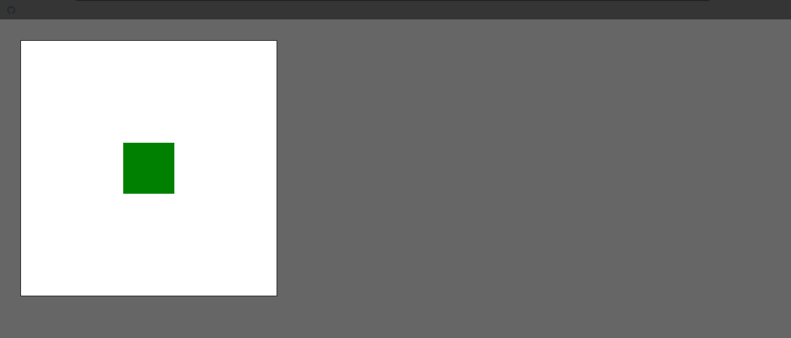

## 12. Animation and App Initialization Snippets

### Example 0

#### HTML

```HTML
<!DOCTYPE html>

<html>

    <head>

        <title>This is the title</title>

        <link rel="stylesheet" type="text/css" href="style.css">
        <meta charset="utf-8">

    </head>

<body>

 <canvas id="can1" width="500" height="500"></canvas>

    <script src="js.js" type="text/javascript"></script>

</body>

</html>
```

#### CSS

```CSS
#can1 {

    background: white;
      border:1px solid black;
}

body {

    background-color:#666;
   margin: 40px;

}
```

#### JavaScript

```JavaScript
window.addEventListener("load", function (event) {

    initCanvas();
})

function initCanvas() {

    var ctx = document.getElementById("can1").getContext("2d");
    var cW = ctx.canvas.width, cH = ctx.canvas.height;
    var y = 0, x = 0;

    function animate() {

        ctx.save();//save and restore are important Our code comes between them.

        ctx.clearRect(0, 0, cW, cH);//If you don't clear the rectangle every time when it runs.It will mass up your code.

        ctx.fillStyle = "magenta";
        ctx.fillRect(0, y, 100, 100);

        y++

        ctx.fillStyle = "blue";
        ctx.fillRect(x, 0, 100,100);
        x++;

        ctx.restore();//save and restore are important Our code comes between them.
    }

    var animateInterval = setInterval(animate, 30);

    ctx.canvas.addEventListener("click", function (event) {

        clearInterval(animateInterval);
    });

}
```

### Output

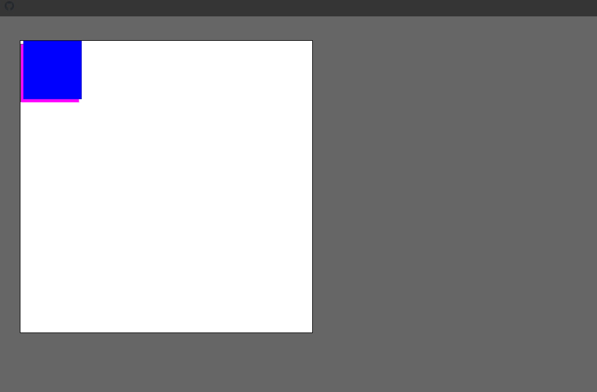

## 13. Object Oriented Assets Snippets

### Example 0

#### HTML

```HTML
<!DOCTYPE html>

<html>

    <head>

        <title>This is the title</title>

        <link rel="stylesheet" type="text/css" href="style.css">
        <meta charset="utf-8">

    </head>

<body>

 <canvas id="can1" width="500" height="500"></canvas>

    <script src="js.js" type="text/javascript"></script>

</body>

</html>
```

#### CSS

```CSS
#can1 {

    background: white;
      border:1px solid black;
}

body {

    background-color:#666;
   margin: 40px;

}
```

#### JavaScript

```JavaScript
window.addEventListener("load", function (event) {

    initCanvas();
})

function initCanvas() {

    var ctx = document.getElementById("can1").getContext("2d");
    var cW = ctx.canvas.width, cH = ctx.canvas.height;

    function rectObj() {

        this.x = 0, this.y = 0; this.w = 0;

        this.render = function (ctx,rx,ry,rw,rh,clr) {//ctx is the canvas object.

            ctx.fillStyle = clr;
            ctx.fillRect(rx, ry, rw, rh);

        }

    }

    var rect1 = new rectObj();
    var rect2 = new rectObj();
    rect1.w = 50;
    rect2.w = 50;
    rect2.y = 100;

    function animate() {

        ctx.save();//save and restore are important Our code comes between them.

        ctx.clearRect(0, 0, cW, cH);//If you don't clear the rectangle every time when it runs.It will mass up your code.

       rect1.render(ctx, rect1.x, rect1.y, 50, 50, "red");
       rect2.render(ctx,rect2.x,rect2.y,50,50,"blue")

       rect1.y++;
       rect2.x++;
        ctx.restore();//save and restore are important Our code comes between them.
    }

    var animateInterval = setInterval(animate, 30);

    ctx.canvas.addEventListener("click", function (event) {

        clearInterval(animateInterval);
    });

}
```

### Output

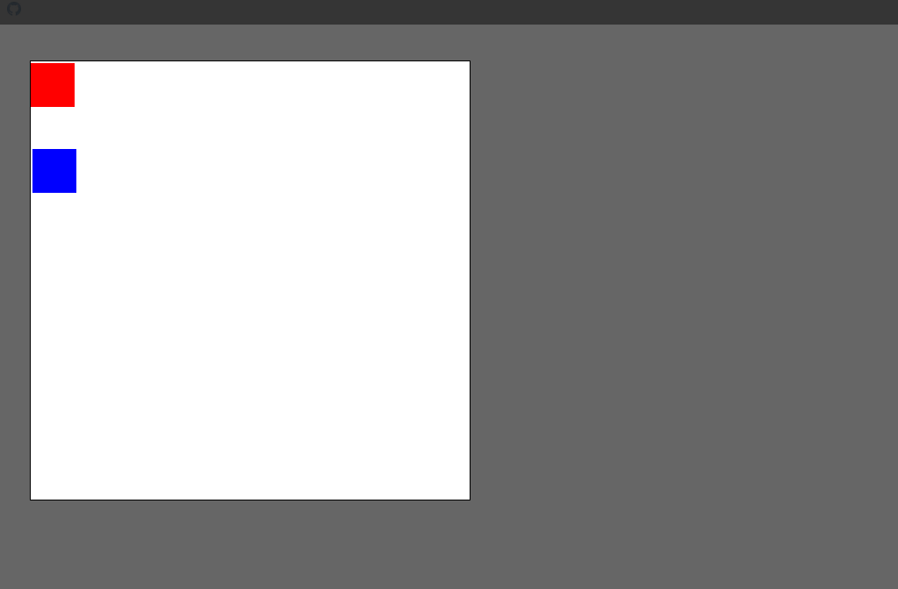

## 14. Mouse Coordinates Snippets

### Example 0

#### HTML

```HTML
<!DOCTYPE html>

<html>

    <head>

        <title>This is the title</title>

        <link rel="stylesheet" type="text/css" href="style.css">
        <meta charset="utf-8">

    </head>

<body>

 <canvas id="can1" width="500" height="500"></canvas>

    <h2 id="status">0 | 0</h2>

    <script src="js.js" type="text/javascript"></script>

</body>

</html>
```

#### CSS

```CSS
#can1 {

    background: white;
      border:1px solid black;
}
body {

    background-color:#666;
   margin: 40px;
}
```

#### JavaScript

```JavaScript
window.addEventListener("load", function (event) {

    initCanvas();
})

function initCanvas() {

    var ctx = document.getElementById("can1").getContext("2d");

    ctx.canvas.addEventListener("mousemove", function (event) {

        var mouseX = event.clientX - ctx.canvas.offsetLeft;//By subtracting the offsetLeft we can get right value.
        var mouseY = event.clientY - ctx.canvas.offsetTop;//By subtracting the offsetTop we can get right value.
        var status = document.getElementById("status");
        status.innerHTML = mouseX + " | " + mouseY;

    });

    ctx.canvas.addEventListener("click", function (event) {

        var mouseX = event.clientX - ctx.canvas.offsetLeft;
        var mouseY = event.clientY - ctx.canvas.offsetTop;
        var status = document.getElementById("status");
        status.innerHTML = mouseX + " | " + mouseY;

        ctx.fillStyle = "red";
        ctx.fillRect(mouseX - 18, mouseY - 18, 50, 50);//Why i / by 15 mouseX and mouseY to get the deth center.

    });

}
```

### Output

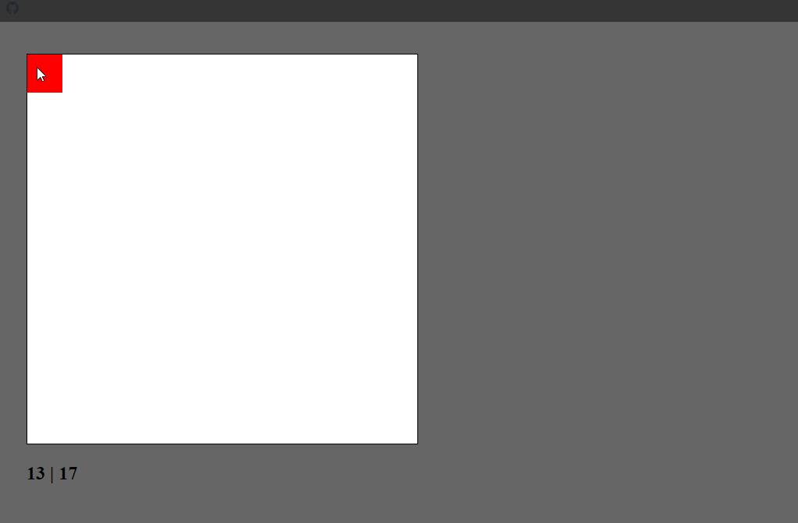

## 15. Animated Background Layers Snippets

### Example 0

#### HTML

```HTML
<!DOCTYPE html>

<html>

    <head>

        <title>This is the title</title>

        <link rel="stylesheet" type="text/css" href="style.css">
        <meta charset="utf-8">

    </head>

<body>

   <div id="canvas_container">

       <canvas id="can1" width="1000" height="500"></canvas>

   </div>

    <script src="js.js" type="text/javascript"></script>

</body>

</html>
```

#### CSS

```CSS
#canvas_container {

    width:1000px;
   margin:20px auto;
}

#can1 {

    background:#fff;
    border:#999 1px solid;
}

body {

background-color:#333;
}
```

#### JavaScript

```JavaScript
window.addEventListener("load", function (event) {

    initCanvas();

});

var bg = new Image();
bg.src = "stars.jpg";

function initCanvas() {

    var ctx = document.getElementById("can1").getContext("2d");
    var cW = ctx.canvas.width, cH = ctx.canvas.height;

    function Background() {

        this.x = 0, this.y = 0, this.w = bg.width, this.h = bg.height;

        this.render = function () {

            ctx.drawImage(bg, this.x-=3, 0);//If we put x++ it will animate form right to left.or you can speed up by giving higher numbers like x-=3,x+=3.

            if (this.x <= -499) {

                this.x = 0;
            }
        }
    }

    var background = new Background();

    function animate() {

        ctx.save();

        background.render();

        ctx.fillStyle = "red";
        ctx.fillRect(50, 50, 25, 25);

        ctx.restore();

    }

    var animateInterval = setInterval(animate, 30);
}
```

### Output

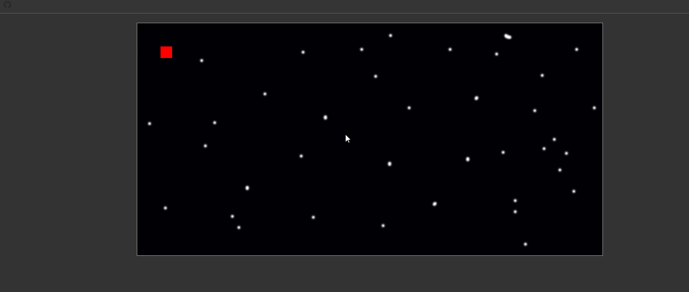

## 16. Keyboard Control and Movement Snippets

### Example 0

#### HTML

```HTML
<!DOCTYPE html>

<html>

    <head>

        <title>This is the title</title>

        <link rel="stylesheet" type="text/css" href="style.css">
        <meta charset="utf-8">

    </head>

<body>

   <div id="canvas_container">

       <canvas id="can1" width="1000" height="500"></canvas>

   </div>

    <script src="js.js" type="text/javascript"></script>

</body>

</html>
```

#### CSS

```CSS
#canvas_container {

    width:1000px;
   margin:20px auto;
}

#can1 {

    background:#fff;
    border:#999 1px solid;
}

body {

background-color:#333;
}
```

#### JavaScript

```JavaScript
window.addEventListener("load", function (event) {

    initCanvas();

});
var bg = new Image();
bg.src = "stars.jpg";

function initCanvas() {

    var ctx = document.getElementById("can1").getContext("2d");
    var cW = ctx.canvas.width, cH = ctx.canvas.height;

    function Background() {

        this.x = 0, this.y = 0, this.w = bg.width, this.h = bg.height;

        this.render = function () {

            ctx.drawImage(bg, this.x-=3, 0);//If we put x++ it will animate form right to left.or you can speed up by giving higher numbers like x-=3,x+=3.

            if (this.x <= -499) {

                this.x = 0;
            }
        }
    }

    function Player() {

        this.x = 0, this.y = 0, this.w = 50, this.h = 50;

        this.render = function () {
            ctx.fillStyle = "red";
            ctx.fillRect(this.x, this.y, this.w, this.h);

        }
    }

    var background = new Background();
    var player1 = new Player();

    player1.y = 100;
    player1.x = 100;

    function animate() {

        ctx.save();

        background.render();

        player1.render();

        ctx.restore();

    }

    var animateInterval = setInterval(animate, 30);

    document.addEventListener("keydown", function (event) {

        var key_code = String.fromCharCode(event.keyCode);
        var speed=3;

        if (key_code == "W") {

            player1.y -= speed;

        } else if (key_code == "S") {

            player1.y += speed;

        } else if (key_code == "A") {

            player1.x -= speed;

        } else if(key_code=="D") {

            player1.x += speed;
        }

    });
}
```

### Output

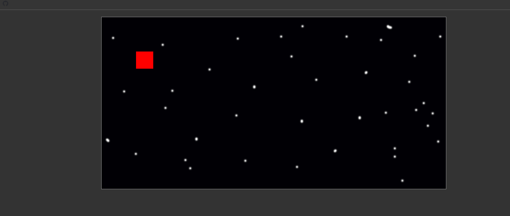

## 17. Json Object Arrays and Loops Snippets

### Example 0

#### HTML

```HTML
<!DOCTYPE html>

<html>

    <head>

        <title>This is the title</title>

        <link rel="stylesheet" type="text/css" href="style.css">
        <meta charset="utf-8">

    </head>

<body>

 <canvas id="can1" width="500" height="500"></canvas>

    <h2 id="status">0 | 0</h2>

    <script src="js.js" type="text/javascript"></script>

</body>

</html>
```

#### CSS

```CSS
#can1 {

    background: white;
      border:1px solid black;
}
body {

    background-color:#666;
   margin: 40px;
}
```

#### JavaScript

```JavaScript
window.addEventListener("load", function (event) {

    initCanvas();
})

function initCanvas() {

    var ctx = document.getElementById("can1").getContext("2d");
    var buildings = [

        { "id": "house", "x": 100, "y": 100, "w": 50, "h": 50, "bg": "blue" },
         { "id": "grocery", "x": 200, "y": 100, "w": 50, "h": 50, "bg": "red" },
          { "id": "house", "x": 300, "y": 100, "w": 50, "h": 50, "bg": "green" }
    ];

    for (i = 0; i < buildings.length; i++) {

        var b = buildings[i];//This line of code gets the data form the JSON when the loop runs.When the first time runs b gets the house data second time grocery data.

        ctx.fillStyle = b.bg;
        ctx.fillRect(b.x, b.y, b.w, b.h);    
    }
}
```

### Output


## 18. Hit Detection Mouse Touch Over Object Arrays Snippets

### Example 0

#### HTML

```HTML
<!DOCTYPE html>

<html>

    <head>

        <title>This is the title</title>

        <link rel="stylesheet" type="text/css" href="style.css">
        <meta charset="utf-8">

    </head>

<body>

 <canvas id="can1" width="500" height="500"></canvas>

    <h2 id="status"></h2>

    <script src="js.js" type="text/javascript"></script>

</body>

</html>
```

#### CSS

```CSS
#can1 {

    background: white;
      border:1px solid black;
}
body {

    background-color:#666;
   margin: 40px;
}
```

#### JavaScript

```JavaScript
window.addEventListener("load", function (event) {

    initCanvas();
})

function initCanvas() {

    var ctx = document.getElementById("can1").getContext("2d");

    ctx.canvas.addEventListener("mousedown", function (event) {

        var mX = event.clientX - ctx.canvas.offsetLeft;
        var mY = event.clientY - ctx.canvas.offsetTop;

        for (var i = 0; i < buildings.length; i++) {

            var b = buildings[i];

            if (mX >= b.x && mY < b.x + b.w && mY >= b.y && mY < b.y + b.h) {

                document.getElementById("status").innerHTML = "You touched " + b.id;
            }  
        }
    });

    var buildings = [

        { "id": "house", "x": 100, "y": 100, "w": 50, "h": 50, "bg": "blue" },
         { "id": "grocery", "x": 200, "y": 100, "w": 50, "h": 50, "bg": "red" },
          { "id": "car", "x": 300, "y": 100, "w": 50, "h": 50, "bg": "green" }

    ];

    for (i = 0; i < buildings.length; i++) {

        var b = buildings[i];//This line of code gets the data form the JSON when the loop runs.When the first time runs b gets the house data second time grocery data.

        ctx.fillStyle = b.bg;
        ctx.fillRect(b.x, b.y, b.w, b.h);

    }
}

//touchstart
//touchend
//touchcancel
//touchleave
//touchmove
```

### Output

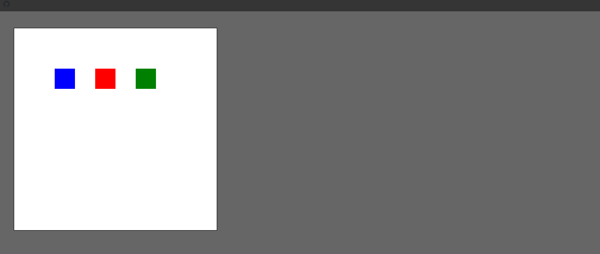

## 19 Collision Detection Hit Game Enemies Snippets

### Example 0

#### HTML

```HTML
<!DOCTYPE html>

<html>

    <head>

        <title>This is the title</title>

        <link rel="stylesheet" type="text/css" href="style.css">
        <meta charset="utf-8">

    </head>

<body>

 <canvas id="can1" width="500" height="350"></canvas>

    <div>

        <input type="button" id="btn_left" value="Left" />
        <input type="button" id="btn_right" value="Right" />
        <input type="button" id="fire_btn" value="Fire" />

    </div>

    <h2 id="status"></h2>

    <script src="js.js" type="text/javascript"></script>

</body>

</html>
```

#### CSS

```CSS
#can1 {

    background: white;
      border:1px solid black;
}
body {

    background-color:#666;
   margin: 40px;
}
```

#### JavaScript

```JavaScript
window.addEventListener("load", function () {

    initCanas();

});

function initCanas() {

    var ctx = document.getElementById("can1").getContext("2d");
    var cW = ctx.canvas.width, cH = ctx.canvas.height;
    var enemies = [

        { "id": "enemy1", x: 100, y: -20, w: 40, h: 20 },
        { "id": "enemy2", x: 225, y: -20, w: 40, h: 20 },
        { "id": "enemy3", x: 350, y: -20, w: 40, h: 20 },
        { "id": "enemy4", x: 100, y: -70, w: 40, h: 20 },
        { "id": "enemy5", x: 225, y: -70, w: 40, h: 20 },
        { "id": "enemy3", x: 350, y: -70, w: 40, h: 20 }

    ];

    function renderEnemies() {

        for (var i = 0; i < enemies.length; i++) {

            ctx.fillStyle = "blue";
            ctx.fillRect(enemies[i].x, enemies[i].y += .5, enemies[i].w, enemies[i].h);

        }
    }
    function Launcher() {

        this.y = 280, this.x = cW * .5 - 25, this.w = 50, this.h = 50, this.dir, this.bg = "orange", this.missiles = [];//cW * .5 - 25 to deth center.

        this.render = function () {

            if (this.dir == "left") {

                this.x -= 5;

            } else if (this.dir == "right") {

                this.x += 5;

            }
            ctx.fillStyle = this.bg;
            ctx.fillRect(this.x, this.y, this.w, this.h);

            for (var i = 0; i < this.missiles.length; i++) {

                var m = this.missiles[i];
                ctx.fillStyle = m.bg;
                ctx.fillRect(m.x, m.y -= 5, m.w, m.h);//m.y-=5 it moves upward.
                this.hitDetect(this.missiles[i], i);

                if (m.y <= 0) {//If a missile goes part the canvas boundries,remove it.

                    this.missiles.splice(i, 1);//Splice that missile out of the missile array.

                }
            }
        }

        if (enemies.length == 0) {

            clearInterval(animateInterval);//Stop the game.
            ctx.fillStyle = "#FC0";
            ctx.font = "italic bold 36px Arial,sans-serif";
            ctx.fillText = ('Leval complete', cW * .5 - 130, 50, 300);

        }

        this.hitDetect = function (m, mi) {

            for (var i = 0; i < enemies.length; i++) {

                var e = enemies[i];

                if (m.x + m.w >= e.x && m.x <= e.x + e.w && m.y >= e.y && m.y <= e.y + e.h) {

                    this.missiles.splice(this.missiles[mi], 1)//Remove that missiles
                    enemies.splice(i, 1)//Remove the enemy that the missile hit
                    document.getElementById("status").innerHTML = "You droped " + e.id;

                }
            }

        }

    }

    var launcher = new Launcher();

    function animate() {

        ctx.save();
        ctx.clearRect(0, 0, cW, cH);//If you don't put this code your program will be suck.

        renderEnemies()
        launcher.render();

        ctx.restore();
    }


    var animateInterval = setInterval(animate, 30);

    var left_btn = document.getElementById("btn_left");
    var right_btn = document.getElementById("btn_right");
    var fire_btn = document.getElementById("fire_btn");

    left_btn.addEventListener("mousedown", function () {

        launcher.dir = "left";

    });

    left_btn.addEventListener("mouseup", function () {

        launcher.dir = "";

    });

    right_btn.addEventListener("mousedown", function () {

        launcher.dir = "right";

    });

    right_btn.addEventListener("mouseup", function () {

        launcher.dir = "";

    });

    fire_btn.addEventListener("mousedown", function () {

        launcher.missiles.push({ "x": launcher.x + launcher.w * .5, "y": launcher.y, "w": 3, "h": 10, "bg": "red" });

    });
}
```

### Output

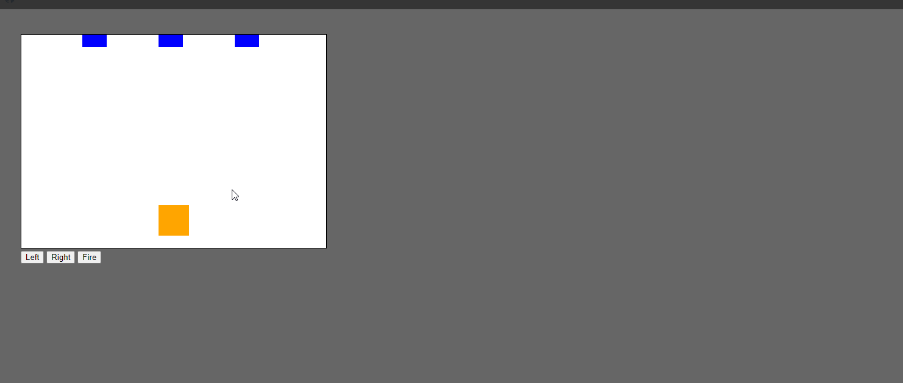

## 20. Particle Effect System Tutorial Snow-falling-animation-snippets

### Example 0

#### HTML

```HTML
<!DOCTYPE html>

<html>

    <head>

        <title>This is the title</title>

        <link rel="stylesheet" type="text/css" href="style.css">
        <meta charset="utf-8">

    </head>

<body>

 <canvas id="can1" width="800" height="600"></canvas>

    <h2 id="status"></h2>

    <script src="js.js" type="text/javascript"></script>

</body>

</html>
```

#### CSS

```CSS
#can1 {

    background: white;
      border:1px solid black;
}
body {

    background-color:#666;
   margin: 40px;
}
```

#### JavaScript

```JavaScript
window.addEventListener("load", function () {

    initCanvas();

});

var img = new Image();
img.src = "im.jpg";

function initCanvas() {

    var ctx = document.getElementById('can1').getContext("2d");
    var cW = ctx.canvas.width, cH = ctx.canvas.height;
    var flakes = [];

    function addFlake() {

        var x = Math.floor(Math.random() * cW) + 1;
        var y = 0;
        var s = Math.floor(Math.random() * 3) + 1;//It has three layers in depth.
        flakes.push({ "x": x, "y": y, "s": s });

    }

    function snow() {
        addFlake();

        for (var i = 0; i < flakes.length; i++) {

            ctx.fillStyle = "rgba(255,255,255,.75)";//.75 is the alpha.
            ctx.beginPath();
            ctx.arc(flakes[i].x, flakes[i].y += flakes[i].s * .5, flakes[i].s * .5, 0, Math.PI * 2, false);
            ctx.fill();//fill it with the above color.

            if (flakes[i].y > cH) {//if the snow hits the bottom just remove it.

                flakes.splice(i, 1);
            }

            document.getElementById("status").innerHTML = flakes.length;
        }
    }
    function animate() {

        //ctx.save();//We use save() and restore() methods when we use rotate() or any other transform methods.

        ctx.clearRect(0, 0, cW, cH);//This is important to make the right animation.
        ctx.drawImage(img, 0, 0);
        snow()

        //ctx.restore();//We use save() and restore() methods when we use rotate() or any other transform methods.
    }

    var animateInterval = setInterval(animate, 30);

}
//Do you want to thick the snow just call the addFlake() function in the snow() function a lot of times.
//Do you want to show form differnt diraction use the rotate() method.
```

### Output

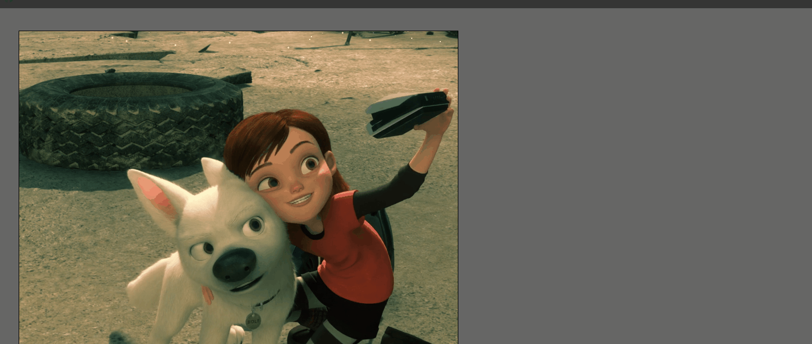

### Example 1

#### HTML

```HTML
<!DOCTYPE html>

<html>

    <head>

        <title>This is the title</title>

        <link rel="stylesheet" type="text/css" href="style.css">
        <meta charset="utf-8">

    </head>

<body>

 <canvas id="can1" width="800" height="600"></canvas>

    <h2 id="status"></h2>

    <script src="js.js" type="text/javascript"></script>

</body>

</html>
```

#### CSS

```CSS
#can1 {

    background: white;
      border:1px solid black;
}
body {

    background-color:#666;
   margin: 40px;

}
```

#### JavaScript

```JavaScript
window.addEventListener("load", function () {

    initCanvas();

});

var img = new Image();
img.src = "im.jpg";

function initCanvas() {

    var ctx = document.getElementById('can1').getContext("2d");
    var cW = ctx.canvas.width, cH = ctx.canvas.height;
    var flakes = [];

    function addFlake() {

        var x = Math.floor(Math.random() * cW) + 1;
        var y = 0;
        var s = Math.floor(Math.random() * 3) + 1;//It has three layers in depth.
        flakes.push({ "x": x, "y": y, "s": s });

    }

    function snow() {

        addFlake();
        addFlake();
        addFlake();
        addFlake();
        addFlake();
        addFlake();
        addFlake();
        addFlake();
        addFlake();
        addFlake();
        addFlake();
        addFlake();
        addFlake();

        for (var i = 0; i < flakes.length; i++) {

            ctx.fillStyle = "rgba(255,255,255,.75)";//.75 is the alpha.
            ctx.beginPath();
            ctx.arc(flakes[i].x, flakes[i].y += flakes[i].s * .5, flakes[i].s * .5, 0, Math.PI * 2, false);
            ctx.fill();//fill it with the above color.

            if (flakes[i].y > cH) {//if the snow hits the bottom just remove it.

                flakes.splice(i, 1);
            }

            document.getElementById("status").innerHTML = flakes.length;
        }
    }

    function animate() {

        //ctx.save();//We use save() and restore() methods when we use rotate() or any other transform methods.

        ctx.clearRect(0, 0, cW, cH);//This is important to make the right animation.
        ctx.drawImage(img, 0, 0);
        snow()

        //ctx.restore();//We use save() and restore() methods when we use rotate() or any other transform methods.
    }
    var animateInterval = setInterval(animate, 30);

}
//Do you want to thick the snow just call the addFlake() function in the snow() function a lot of times.
//Do you want to show form differnt diraction use the rotate() method.
```

### Output


### Example 2

#### HTML

```HTML
<!DOCTYPE html>

<html>

    <head>

        <title>This is the title</title>

        <link rel="stylesheet" type="text/css" href="style.css">
        <meta charset="utf-8">

    </head>

<body>

 <canvas id="can1" width="800" height="600"></canvas>

    <h2 id="status"></h2>

    <script src="js.js" type="text/javascript"></script>

</body>

</html>
```

#### CSS

```CSS
#can1 {

    background: white;
      border:1px solid black;
}
body {

    background-color:#666;
   margin: 40px;
}
```

#### JavaScript

```JavaScript
window.addEventListener("load", function () {

    initCanvas();

});

var img = new Image();
img.src = "im.jpg";

function initCanvas() {

    var ctx = document.getElementById('can1').getContext("2d");
    var cW = ctx.canvas.width, cH = ctx.canvas.height;
    var flakes = [];

    function addFlake() {

        var x = Math.floor(Math.random() * cW) + 1;
        var y = 0;
        var s = Math.floor(Math.random() * 3) + 1;//It has three layers in depth.
        flakes.push({ "x": x, "y": y, "s": s });

    }

    function snow() {

        addFlake();
        addFlake();


        for (var i = 0; i < flakes.length; i++) {

            ctx.fillStyle = "rgba(255,255,255,.75)";//.75 is the alpha.
            ctx.beginPath();
            ctx.arc(flakes[i].x, flakes[i].y += flakes[i].s * .5, flakes[i].s * .5, 0, Math.PI * 2, false);
            ctx.fill();//fill it with the above color.

            if (flakes[i].y > cH) {//if the snow hits the bottom just remove it.

                flakes.splice(i, 1);
            }

            document.getElementById("status").innerHTML = flakes.length;
        }
    }

    function animate() {

        ctx.save();//We use save() and restore() methods when we use rotate() or any other transform methods.

        ctx.clearRect(0, 0, cW, cH);//This is important to make the right animation.
        ctx.drawImage(img, 0, 0);
        ctx.rotate(-.4);
        snow()

        ctx.restore();//We use save() and restore() methods when we use rotate() or any other transform methods.
    }

    var animateInterval = setInterval(animate, 30);

}
//Do you want to thick the snow just call the addFlake() function in the snow() function a lot of times.
//Do you want to show form differnt diraction use the rotate() method.
```

### Output

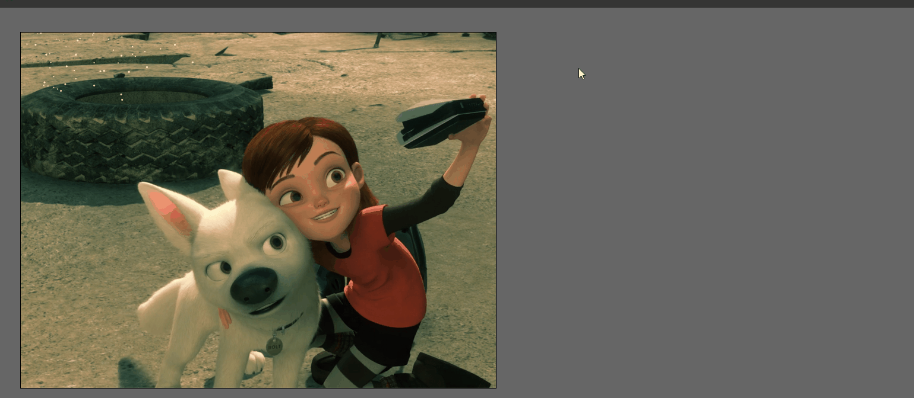

## 21. Circular Progress Loader Canvas Snippets

### Example 0

#### HTML

```HTML
<!DOCTYPE html>

<html>

    <head>

        <title>This is the title</title>

        <link rel="stylesheet" type="text/css" href="style.css">
        <meta charset="utf-8">

    </head>

<body>

 <canvas id="can1" width="800" height="600"></canvas>

    <script src="js.js" type="text/javascript"></script>

</body>

</html>
```

#### CSS

```CSS
#can1 {

    background: white;
      border:1px solid black;
}
body {

    background-color:#666;
   margin: 40px;
}
```

#### JavaScript

```JavaScript

    var ctx = document.getElementById("can1").getContext("2d");
    var al = 0;
    var start = 4.72;
    var cw = ctx.canvas.width;
    var ch = ctx.canvas.height;
    var diff;

    function progressSim() {

        diff=((al / 100) * Math.PI * 2 * 10).toFixed(2);
        ctx.clearRect(0, 0, cw, ch);
        ctx.lineWidth = 10;
        ctx.fillStyle = "#09F";
        ctx.strokeStyle = "#09F";
        ctx.textAlign = "center";
        ctx.fillText(al + "%",38,38);
        ctx.beginPath();
        ctx.arc(35,35,30, start, diff / 10 + start, false)
        ctx.stroke();
        if (al >= 100) {

            clearInterval(Sim);

        }
        al++;
    }

    var Sim = setInterval(progressSim, 50);
```

### Output

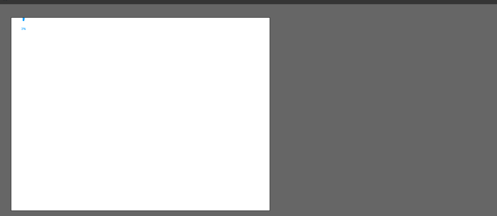
