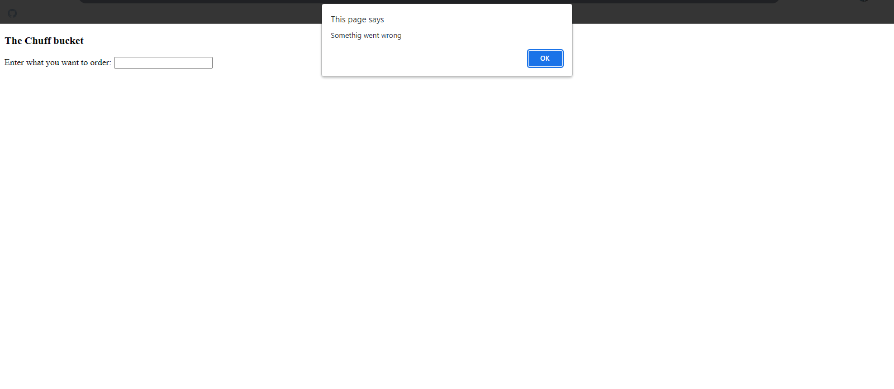
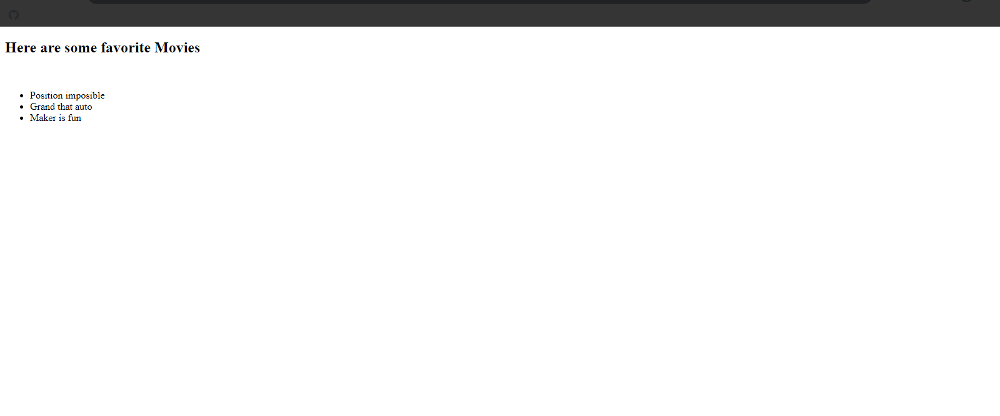
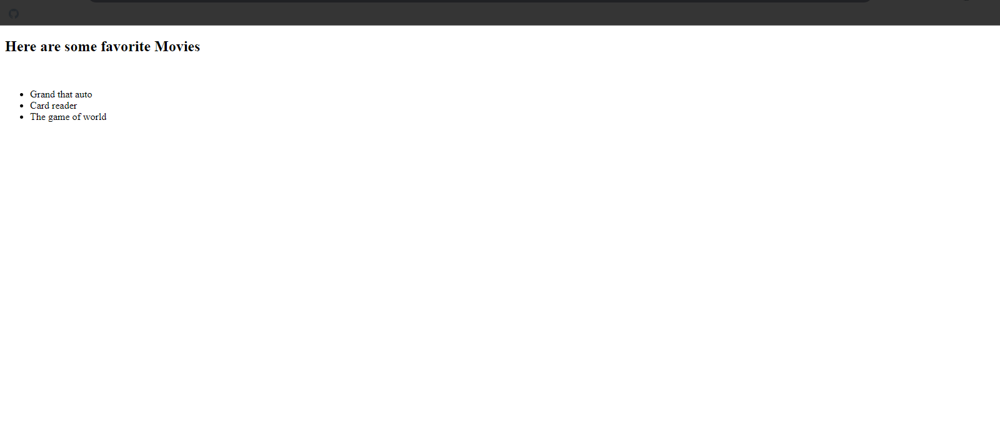
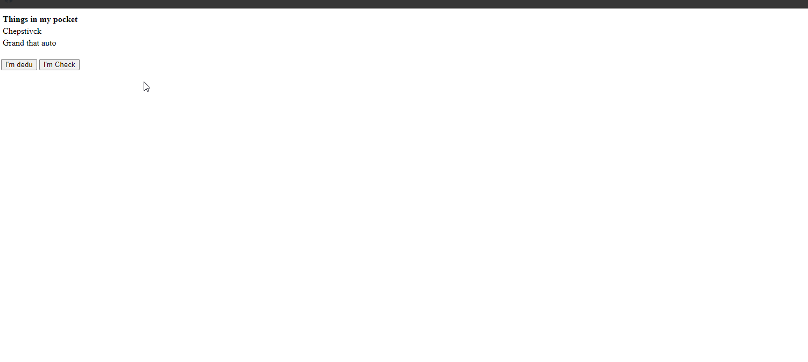

## Ajax The New Bonston Snippets Examples

### Example 0

#### HTML

```HTML
<!DOCTYPE html>

<html>

<head>

<title>This is the title</title>

<script type="text/javascript" src="js.js"></script>

</head>

<body onload="process()">

<h3>The Chuff bucket</h3>
Enter what you want to order:

<input type="text" id="userInput" />

<div id="underInput"></div>

</body>

</html>
```

#### JavaScript

```JavaScript
var xmlHttp=createXmlHttpRequestObject();

function createXmlHttpRequestObject(){ //This is Ajax basic function.

	var xmlHttp;

	if(window.ActiveXObject){

		try{

			xmlHttp=new ActiveXObject("Microsoft.XMLHTTP");

		}catch(e){

			xmlHttp=false;

		}

	}else{

		try{

			xmlHttp=new XMLHttpRequest();

		}catch(e){

			xmlHttp=false;

		}

	}

	if(!xmlHttp)
		alert("cant create that object hoss");

	else

	return xmlHttp;

}

function process(){//This function is for communicating with server.

	if(xmlHttp.readyState==0 || xmlHttp.readyState==4){

		food=encodeURIComponent(document.getElementById("userInput").value);
		xmlHttp.open("GET","foodStore.php?food="+food,true);
		xmlHttp.onreadystatechange=handleServerResponse;
		xmlHttp.send(null);

	}else{

		setTimeout('process()',1000)//This code means i the server is busy try again after 1 seconds.

	}
}

function handleServerResponse(){//This function is for reciving response form server.

	if(xmlHttp.readyState==4){//state number 4 is done communicating.

		if(xmlHttp.status==200){//status==200 means communication is ok maybe the server is down this wouldn't be to 200.

			xmlResponse=xmlHttp.responseXML;
			xmlDocumentElement=xmlResponse.documentElement;
			message=xmlDocumentElement.firstChild.data;
			document.getElementById("userInput").innerHTML=message;
			setTimeout(process(),1000);

		}else{

			alert("Somethig went wrong");
		}
	}
}
```

### Output



### Example 1

#### HTML

```HTML
<!DOCTYPE html>

<html>

    <head>

        <title>This is the title</title>

        <link rel="stylesheet" type="text/css" href="style.css">

    </head>

    <body onload="createList()">

        <h2>Here are some favorite Movies</h2>

        <br />

        <div id="divMovies"></div>

          <script src="js.js"></script>

    </body>

</html>
```

#### JavaScript

```JavaScript
function createList() {

    var s;
    s = "<ul>"
    + "<li>Position imposible</li>"
    + "<li>Grand that auto</li>"
    + "<li>Maker is fun</li>"
    + "</ul>";

    var divMovies = document.getElementById("divMovies").innerHTML = s;

}
```

### Output



### Example 2

#### HTML

```HTML
<!DOCTYPE html>

<html>

    <head>

        <title>This is the title</title>

        <link rel="stylesheet" type="text/css" href="style.css">

    </head>

    <body onload="gameTime()">

        <h2>Here are some favorite Movies</h2>

        <br />

        <div id="divMovies"></div>

          <script src="js.js"></script>

    </body>

</html>
```

#### JavaScript

```JavaScript
function gameTime(){

var title=document.createTextNode("Here are Some Things");
var displa=document.getElementById("divMovies");

var list=document.createElement("ul");

var ele1=document.createElement("li");
var txt1=document.createTextNode("Grand that auto");
ele1.appendChild(txt1);

var ele2=document.createElement("li");
var txt2=document.createTextNode("Card reader");
ele2.appendChild(txt2);

var ele3=document.createElement("li");
var txt3=document.createTextNode("The game of world");
ele3.appendChild(txt3);

list.appendChild(ele1);
list.appendChild(ele2);
list.appendChild(ele3);

displa.appendChild(list);

}

/*
*We don't have to close the html elements in JavaScript like this <ul></ul>
 JavaScript will automarically do it for us.
*/
```

### Output



### Example 3

#### HTML

```HTML
<!DOCTYPE html>

<html>

    <head>

        <title>This is the title</title>

        <link rel="stylesheet" type="text/css" href="style.css">

    </head>

    <body>

        <table>

            <tr>

                <th id="tableHead">Things in my pocket</th>

            </tr>

            <tr>

                <td id="item1">Chepstivck</td>

            </tr>

            <tr>

                <td id="item2">Grand that auto</td>

            </tr>
        </table>

        <br />

        <input type="button" value="I'm dedu" onclick="dude()" />
        <input type="button" value="I'm Check" onclick="chick()" />

    <script src="js.js"></script>

    </body>

</html>
```

#### CSS

```CSS
.dudeTable {

    border:3px solid #cc0000;
    background-color:#0099cc;
    color:white;

}
.dudeHead {

    font-family:Verdana;
    font-weight:bold;
    font-size:18px;

}

.dudeImages {

    font-family:Arial;
    font-size:16px;

}

.chickTable {

    border:3px solid #cc3399;
    background-color:#ffff00;

}

.chickHead {
    font-family:Georgia;
    font-weight:bold;
    font-size:15px;

}

.chickImages {

    font-family:Georgia;
    font-size:14px;
    font-style:italic;

}
```

#### JavaScript

```JavaScript
function dude() {

    var table = document.getElementsByTagName("table")[0];
    var th = document.getElementById("tableHead");
    var item1 = document.getElementById("item1");
    var item2 = document.getElementById("item2");

    table.className = "dudeTable";
    th.className = "dudeHead";
    item1.className = "dudeImages";
    item2.className = "dudeImages";

}

function chick() {

    var table = document.getElementsByTagName("table")[0];
    var th = document.getElementById("tableHead");
    var item1 = document.getElementById("item1");
    var item2 = document.getElementById("item2");

    table.classList.add("chickTable");
    th.classList.add("chickHead");
    item1.classList.add("chickImages");
    item2.classList.add("chickImages");

}
```

### Output


