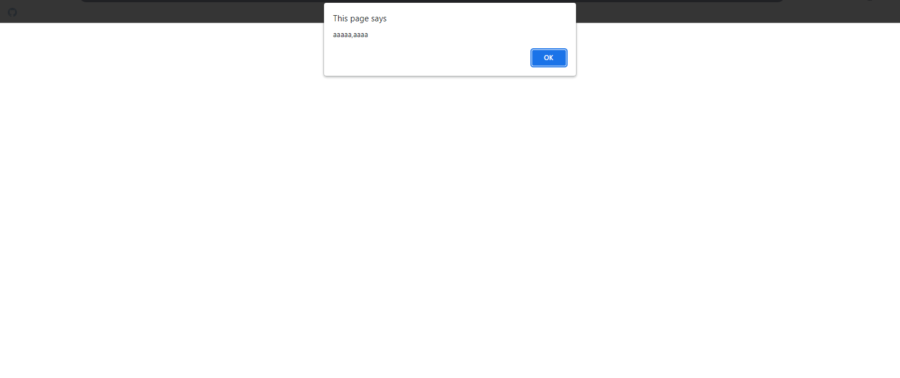
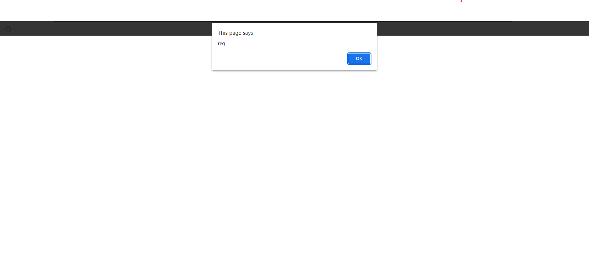
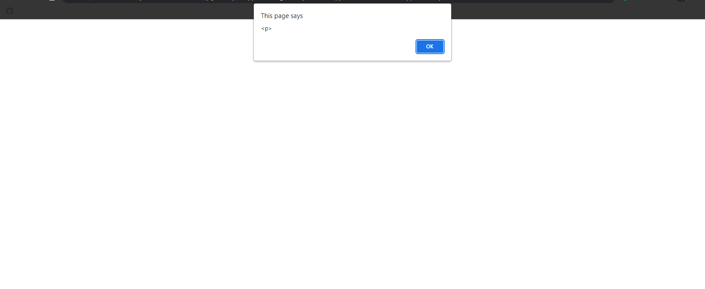
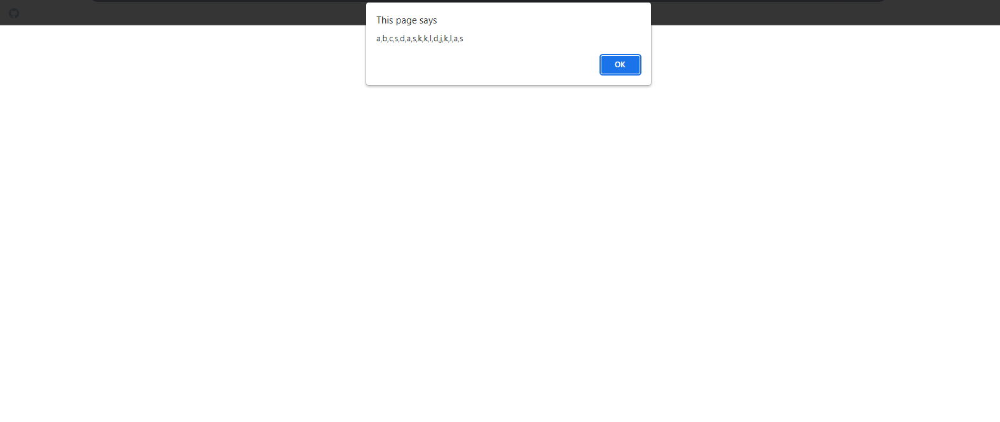
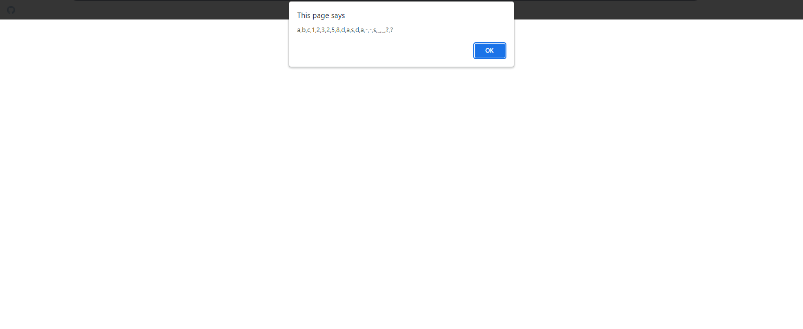
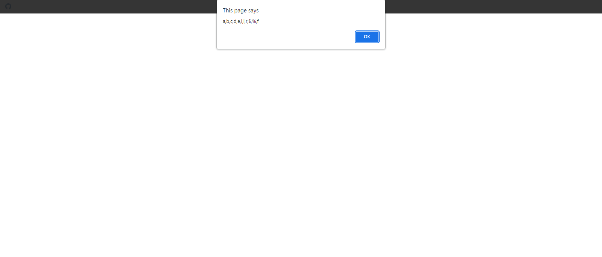
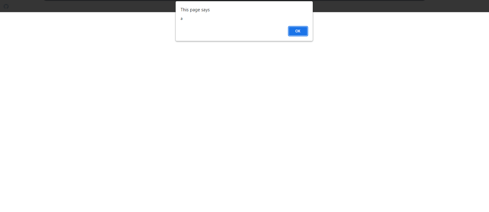
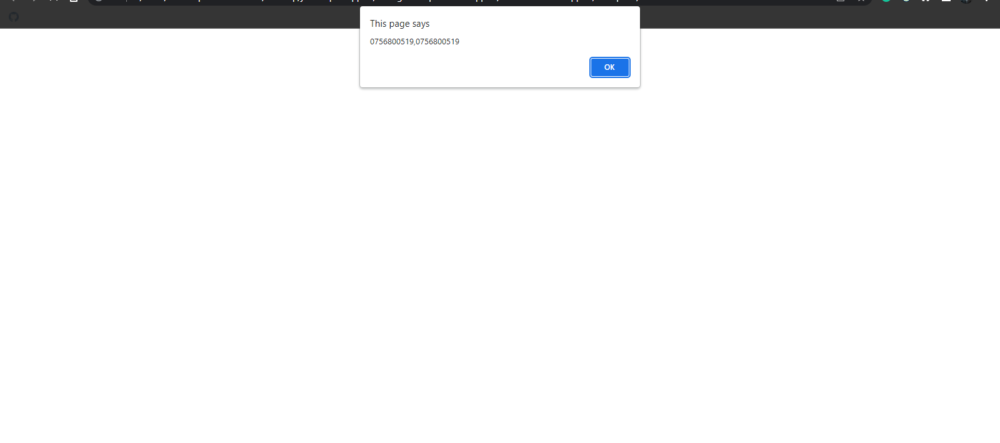

## Regular Expression Snippets Examples

## 1. Best of Fluent Snippets

### Example 0

#### HTML

```HTML
<!DOCTYPE html>

<html>

    <head>

        <title>This is the title</title>

        <link rel="stylesheet" type="text/css" href="style.css">

    </head>

<body onclick="process()">

    <br />

    <div id="theD" />

    <script src="js.js"></script>

</body>

</html>
```

#### JavaScript

```JavaScript
var a = "caaat";
var reg = a.match(/a/g);
alert(reg);

//This example matches anywhere,unless restrcted.

```

### Output


### Example 1

#### HTML

```HTML
<!DOCTYPE html>

<html>

    <head>

        <title>This is the title</title>

        <link rel="stylesheet" type="text/css" href="style.css">

    </head>

<body onclick="process()">

    <br />

    <div id="theD" />

    <script src="js.js"></script>

</body>

</html>
```

#### JavaScript

```JavaScript
var a = "caaat";
var reg = a.match(/A/gi);
alert(reg);

//This example matches anywhere,unless restrcted.
//i modifier is used to ignore the case.
```

### Output


### Example 2

#### HTML

```HTML
<!DOCTYPE html>

<html>

    <head>

        <title>This is the title</title>

        <link rel="stylesheet" type="text/css" href="style.css">

    </head>

<body onclick="process()">

    <br />

    <div id="theD" />

    <script src="js.js"></script>

</body>

</html>
```

#### JavaScript

```JavaScript
var a = "251a5";
var reg = a.match(/1.5/g);
alert(reg);

//The dot sign is used to except one charactor in the string.
```

### Output


### Example 3

#### HTML

```HTML
<!DOCTYPE html>

<html>

    <head>

        <title>This is the title</title>

        <link rel="stylesheet" type="text/css" href="style.css">

    </head>

<body onclick="process()">

    <br />

    <div id="theD" />

    <script src="js.js"></script>

</body>

</html>
```

#### JavaScript

```JavaScript
var a = "251.5";
var reg = a.match(/1\.5/g);
alert(reg);

//The dot sign is used to except one charactor in the string.
//To change the behavior we use the \ charactor.It will only matches the 1.5.
```

### Output


### Example 4

#### HTML

```HTML
<!DOCTYPE html>

<html>

    <head>

        <title>This is the title</title>

        <link rel="stylesheet" type="text/css" href="style.css">

    </head>

<body onclick="process()">

    <br />

    <div id="theD" />

    <script src="js.js"></script>

</body>

</html>
```

#### JavaScript

```JavaScript
var a = "aaaaaaaaaaaaaa";
var reg = a.match(/a{10}/);
alert(reg);

//This code will match 10 a in the text.I you want more you can change it.
```

### Output


### Example 5

#### HTML

```HTML
<!DOCTYPE html>

<html>

    <head>

        <title>This is the title</title>

        <link rel="stylesheet" type="text/css" href="style.css">

    </head>

<body onclick="process()">

    <br />

    <div id="theD" />

    <script src="js.js"></script>

</body>

</html>
```

#### JavaScript

```JavaScript
var a = "aaaaaaaaaaaaaa";
var reg = a.match(/a{5,}/g);
alert(reg);

//This code will match if a is more than 5 times or it won't.
//It means al least 5.
```

### Output


### Example 6

#### HTML

```HTML
<!DOCTYPE html>

<html>

    <head>

        <title>This is the title</title>

        <link rel="stylesheet" type="text/css" href="style.css">

    </head>

<body onclick="process()">

    <br />

    <div id="theD" />

    <script src="js.js"></script>

</body>

</html>
```

#### JavaScript

```JavaScript
var a = "aaaaaaaaa"
var reg = a.match(/a{2,5}/g);
alert(reg);

//This code will match between 2 and 5 but if a is more than 5 it will be fine but less than 2 won't be fine.
```

### Output



### Example 7

#### HTML

```HTML
<!DOCTYPE html>

<html>

    <head>

        <title>This is the title</title>

        <link rel="stylesheet" type="text/css" href="style.css">

    </head>

<body onclick="process()">

    <br />

    <div id="theD" />

    <script src="js.js"></script>

</body>

</html>
```

#### JavaScript

```JavaScript
var a = "aaaaaaaaa"
var reg = a.match(/a{0,}/g);
alert(reg);

//It will match all of a
//a* this is the shortcut for a{0,}
```

### Output


### Example 8

#### HTML

```HTML
<!DOCTYPE html>

<html>

    <head>

        <title>This is the title</title>

        <link rel="stylesheet" type="text/css" href="style.css">

    </head>

<body onclick="process()">

    <br />

    <div id="theD" />

    <script src="js.js"></script>

</body>

</html>
```

#### JavaScript

```JavaScript
var a = "aaaaaaaaa"
var reg = a.match(/a+/g);
alert(reg);

//This means one time to infinty.
```

### Output


### Example 9

#### HTML

```HTML
<!DOCTYPE html>

<html>

    <head>

        <title>This is the title</title>

        <link rel="stylesheet" type="text/css" href="style.css">

    </head>

<body onclick="process()">

    <br />

    <div id="theD" />

    <script src="js.js"></script>

</body>

</html>
```

#### JavaScript

```JavaScript
var a = "regexp"
var reg = a.match(/reg/g);
alert(reg);

//It will be fine if we change reg to regexp will be fine.
```

### Output



### Example 10

#### HTML

```HTML
<!DOCTYPE html>

<html>

    <head>

        <title>This is the title</title>

        <link rel="stylesheet" type="text/css" href="style.css">

    </head>

<body onclick="process()">

    <br />

    <div id="theD" />

    <script src="js.js"></script>

</body>

</html>
```

#### JavaScript

```JavaScript
var a = "<p>Joker</p>"
var reg = a.match(/<.?>/g);
alert(reg);

//But if you put + insted of ? it will find all the text.
```

### Output



### Example 11

#### HTML

```HTML
<!DOCTYPE html>

<html>

    <head>

        <title>This is the title</title>

        <link rel="stylesheet" type="text/css" href="style.css">

    </head>

<body onclick="process()">

    <br />

    <div id="theD" />

    <script src="js.js"></script>

</body>

</html>
```

#### JavaScript

```JavaScript
var a = "abc"
var reg = a.match(/[abc]/g);
alert(reg);
```

### Output


### Example 12

#### HTML

```HTML
<!DOCTYPE html>

<html>

    <head>

        <title>This is the title</title>

        <link rel="stylesheet" type="text/css" href="style.css">

    </head>

<body onclick="process()">

    <br />

    <div id="theD" />

    <script src="js.js"></script>

</body>

</html>
```

#### JavaScript

```JavaScript
var a = "abcsdaskkldjklas"
var reg = a.match(/[a-z]/g);
alert(reg);

//This will match every letters.
```

### Output



### Example 13

#### HTML

```HTML
<!DOCTYPE html>

<html>

    <head>

        <title>This is the title</title>

        <link rel="stylesheet" type="text/css" href="style.css">

    </head>

<body onclick="process()">

    <br />

    <div id="theD" />

    <script src="js.js"></script>

</body>

</html>
```

#### JavaScript

```JavaScript
var a = "abc123258dasdas__??"
var reg = a.match(/[a-z0-9_?]/g);
alert(reg);

//This will match every letters,0-9 numbers,underscore  and ?.
```

### Output


### Example 14

#### HTML

```HTML
<!DOCTYPE html>

<html>

    <head>

        <title>This is the title</title>

        <link rel="stylesheet" type="text/css" href="style.css">

    </head>

<body onclick="process()">

    <br />

    <div id="theD" />

    <script src="js.js"></script>

</body>

</html>
```

#### JavaScript

```JavaScript
var a = "abc123258dasdas__??"
var reg = a.match(/\w/g);
alert(reg);

//This will match [a-zA-Z0-9_]
```

### Output


### Example 15

#### HTML

```HTML
<!DOCTYPE html>

<html>

    <head>

        <title>This is the title</title>

        <link rel="stylesheet" type="text/css" href="style.css">

    </head>

<body onclick="process()">

    <br />

    <div id="theD" />

    <script src="js.js"></script>

</body>

</html>
```

#### JavaScript

```JavaScript
var a = "abc123258dasdas__??"
var reg = a.match(/\d/g);
alert(reg);

//This will match [0-9]
```

### Output


### Example 16

#### HTML

```HTML
<!DOCTYPE html>

<html>

    <head>

        <title>This is the title</title>

        <link rel="stylesheet" type="text/css" href="style.css">

    </head>

<body onclick="process()">

    <br />

    <div id="theD" />

    <script src="js.js"></script>

</body>  

</html>
```

#### JavaScript

```JavaScript
var a = "abc1 232 58 da sdas__??"
var reg = a.match(/\s/g);
alert(reg);

//This will match whiteSpace
```

### Output


### Example 17

#### HTML

```HTML
<!DOCTYPE html>

<html>

    <head>

        <title>This is the title</title>

        <link rel="stylesheet" type="text/css" href="style.css">

    </head>

<body onclick="process()">

    <br />

    <div id="theD" />

    <script src="js.js"></script>

</body>

</html>
```

#### JavaScript

```JavaScript
var a = "abc123258dasda--s__??"
var reg = a.match(/[\w?-]/g);
alert(reg);

//This will find [a-zA-Z0-9_],-and ?.
//This is more complex.
```

### Output



### Example 18

#### HTML

```HTML
<!DOCTYPE html>

<html>

    <head>

        <title>This is the title</title>

        <link rel="stylesheet" type="text/css" href="style.css">

    </head>

<body>

    <p id="dis">This is JokerHacker</p>

    <script src="js.js"></script>

</body>

</html>
```

#### JavaScript

```JavaScript
window.onload = function () {

    var tets = document.getElementById("dis").innerHTML;
    alert(tets.match(/\w/g).length);
}
```

### Output


### Example 19

#### HTML

```HTML
<!DOCTYPE html>

<html>

    <head>

        <title>This is the title</title>

        <link rel="stylesheet" type="text/css" href="style.css">

    </head>

<body>

    <p id="dis">This is JokerHacker</p>

    <script src="js.js"></script>

</body>

</html>
```

#### JavaScript

```JavaScript
window.onload = function () {

    var tets = document.getElementById("dis").innerHTML;
    alert(tets.split(/s+/g).length);
}
```

### Output


### Example 20

#### HTML

```HTML
<!DOCTYPE html>

<html>

    <head>

        <title>This is the title</title>

        <link rel="stylesheet" type="text/css" href="style.css">

    </head>

<body>

    <script src="js.js"></script>

</body>

</html>
```

#### JavaScript

```JavaScript
var a = "abcdellrf";
var reg = a.match(/[^a-d]/g);
alert(reg);

//This matches anything that is not letter between a and d.
```

### Output


### Example 21

#### HTML

```HTML
<!DOCTYPE html>

<html>

    <head>

        <title>This is the title</title>

        <link rel="stylesheet" type="text/css" href="style.css">

    </head>

<body>

    <script src="js.js"></script>

</body>

</html>
```

#### JavaScript

```JavaScript
var a = "abcdellr$%f";
var reg = a.match(/\W/g);
alert(reg);

//This matches anything that is not letter numbers and underscore.
```

### Output


### Example 22

#### HTML

```HTML
<!DOCTYPE html>

<html>

    <head>

        <title>This is the title</title>

        <link rel="stylesheet" type="text/css" href="style.css">

    </head>

<body>

    <script src="js.js"></script>

</body>

</html>
```

#### JavaScript

```JavaScript
var a = "abcdellr$45456%f";
var reg = a.match(/\D/g);
alert(reg);

//This matches anything that is not numbers.
```

### Output



### Example 23

#### HTML

```HTML
<!DOCTYPE html>

<html>

    <head>

        <title>This is the title</title>

        <link rel="stylesheet" type="text/css" href="style.css">

    </head>

<body>

    <script src="js.js"></script>

</body>

</html>
```

#### JavaScript

```JavaScript
var a = "abbacd";
var reg = a.match(/(ab|ba)/g);
alert(reg);

//This matches ba and ab
```

### Output


### Example 24

#### HTML

```HTML
<!DOCTYPE html>

<html>

    <head>

        <title>This is the title</title>

        <link rel="stylesheet" type="text/css" href="style.css">

    </head>

<body>

    <script src="js.js"></script>

</body>

</html>
```

#### JavaScript

```JavaScript
var a = "abbacd";
var reg = a.match(/^a/g);
alert(reg);

//To match somting in the begining of the charactor.
```

### Output



### Example 25

#### HTML

```HTML
<!DOCTYPE html>

<html>

    <head>

        <title>This is the title</title>

        <link rel="stylesheet" type="text/css" href="style.css">

    </head>

<body>

    <script src="js.js"></script>

</body>

</html>
```

#### JavaScript

```JavaScript
var a = "abbacd";
var reg = a.match(/d$/g);
alert(reg);

//To match somting in the end of the charactor.
```

### Output


### Example 26

#### HTML

```HTML
<!DOCTYPE html>

<html>

    <head>

        <title>This is the title</title>

        <link rel="stylesheet" type="text/css" href="style.css">

    </head>

<body>

    <script src="js.js"></script>

</body>

</html>
```

#### JavaScript

```JavaScript
var a = "abbacd kuna";
var reg = a.match(/\bk/g);
alert(reg);

//To match somting in the begining of each charactor.
```

### Output


### Example 0

#### HTML

```HTML

```

#### CSS

```CSS

```

#### JavaScript

```JavaScript

```

### Output


### Example 27

#### HTML

```HTML
<!DOCTYPE html>

<html>

    <head>

        <title>This is the title</title>

        <link rel="stylesheet" type="text/css" href="style.css">

    </head>

<body>

    <script src="js.js"></script>

</body>

</html>
```

#### JavaScript

```JavaScript
var a = "abbkacd kuna";
var reg = a.match(/\Bk/g);
alert(reg);

//To match somting inside of each charactor.Not at the begining.
```

### Output


## 2. Derak Beans Snippets

### Example 0

#### HTML

```HTML
<!DOCTYPE html>

<html>

    <head>

        <title>This is the title</title>

        <link rel="stylesheet" type="text/css" href="style.css">

    </head>

<body>

    <script src="js.js"></script>

</body>

</html>
```

#### JavaScript

```JavaScript
var str = "My name is kuna and my phone number is 0756800519";
var reg = /([0-9]{3}-?[0-9]-?[0-9]{4}-?[0-9]{2})/;
alert(str.match(reg));
```

### Output


