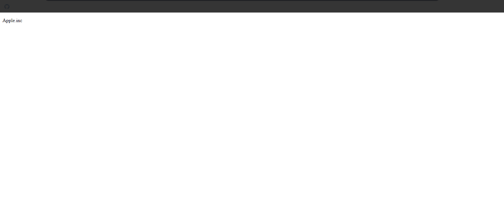
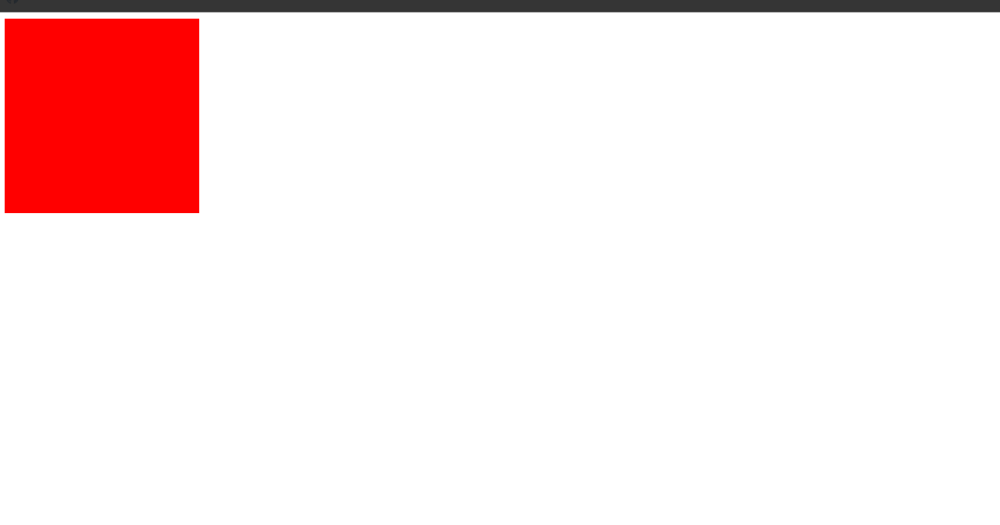
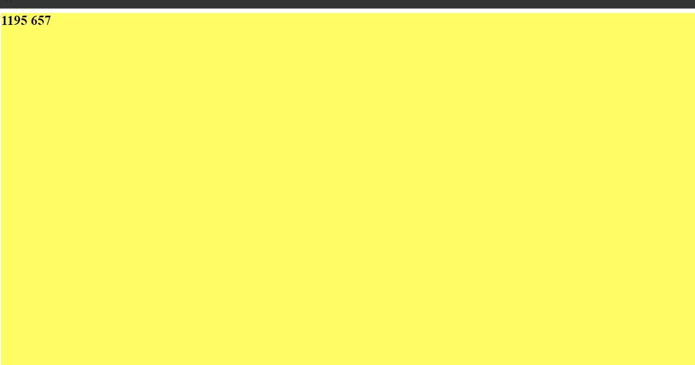
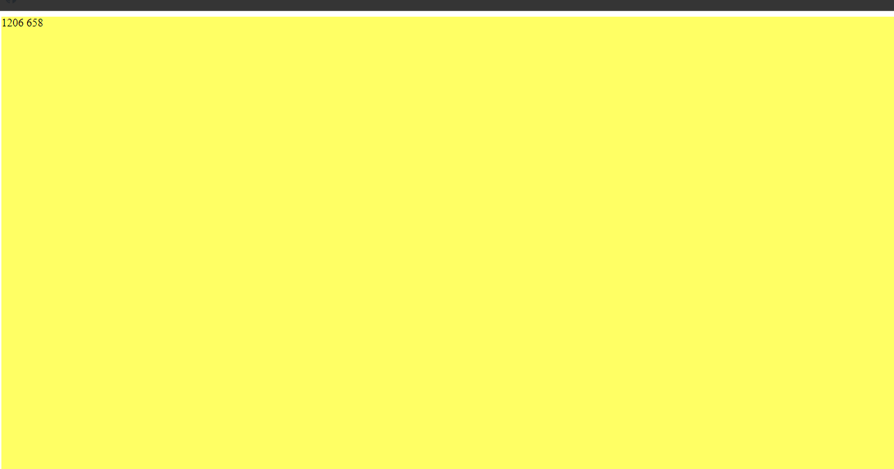
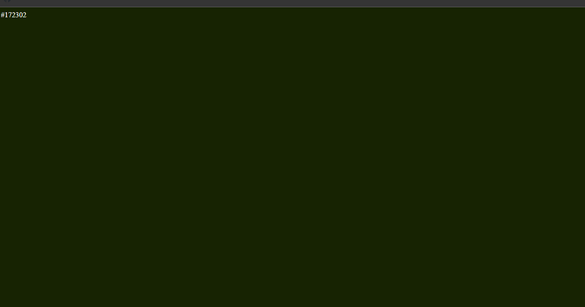
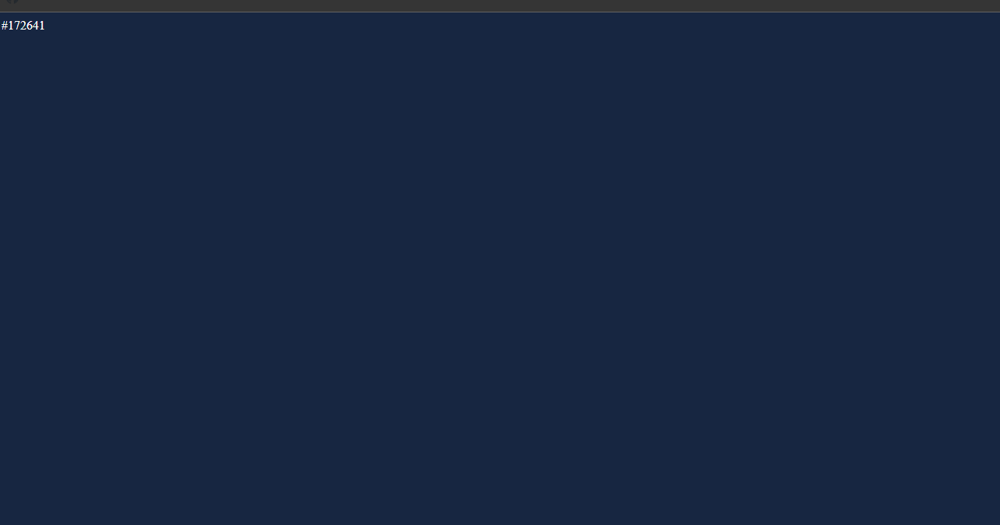

## DOM Snippets

### Example 0

#### HTML

```HTML
<!DOCTYPE html>

<html>

    <head>

        <title>This is the title</title>

        <link rel="stylesheet" type="text/css" href="style.css">

    </head>

<body>

    <script src="js.js"></script>

</body>

</html>
```

#### JavaScript

```JavaScript
var pa = document.createElement("p");
pa.textContent = "Apple.inc";
document.body.appendChild(pa);
```

### Output



### Example 1

#### HTML

```HTML
<!DOCTYPE html>

<html>

    <head>

        <title>This is the title</title>

        <link rel="stylesheet" type="text/css" href="style.css">

    </head>

<body>

    <script src="js.js"></script>

</body>

</html>
```

#### JavaScript

```JavaScript
var box = document.createElement("div");
box.style.height = "250px";
box.style.width = "250px";
box.style.backgroundColor = "red";
box.style.border = "green";
box.style.position = "relative";

document.body.appendChild(box);

var pos = 0;

var timer = setInterval(function () {

    if (pos == 500) {

        clearInterval(timer);

    } else {

        pos++;
        box.style.left = pos + "px";

    }

},10)
```

### Output



### Example 2

#### HTML

```HTML
<!DOCTYPE html>

<html>

    <head>

        <title>This is the title</title>

        <link rel="stylesheet" type="text/css" href="style.css">

    </head>

<body>

    <script src="js.js"></script>

</body>

</html>
```

#### JavaScript

```JavaScript
var div = document.createElement("div");
div.style.height = "100vh";//This is 100% viewing height
document.body.appendChild(div);

div.addEventListener("mousemove", function (event) {

    var x = event.clientX;
    var y = event.clientY;
    div.textContent = x + " " + y;
    div.style.fontSize = "25px";
    div.style.fontWeight = "bold";
    div.style.backgroundColor="rgb("+x+","+y+","+100+")"

});
```

### Output



### Example 3

#### HTML

```HTML
<!DOCTYPE html>

<html>

    <head>

        <title>This is the title</title>

        <link rel="stylesheet" type="text/css" href="style.css">

    </head>

<body>

    <script src="js.js"></script>

</body>

</html>
```

#### JavaScript

```JavaScript
function fullScreen(element) {

    var newElement = document.createElement(element);
    newElement.style.height = "100vh";
    document.body.appendChild(newElement);
    return newElement;//The return is returned the newElement to the fullScreen function.

}

function input(inputType, DOMElement, callback) {

    DOMElement.addEventListener(inputType, function (event) {

        var x = event.clientX;
        var y = event.clientY;
        callback(DOMElement, x, y);

    });
}

function output(element,x,y) {

    element.textContent = x + " " + y;
    element.style.backgroundColor = "rgb(" + x + "," + y + "," + 100 + ")";

}

input("mousemove", fullScreen("DIV"), output);
```

### Output



### Example 4

#### HTML

```HTML
<!DOCTYPE html>

<html>

    <head>

        <title>This is the title</title>

        <link rel="stylesheet" type="text/css" href="style.css">

    </head>

<body>

    <script src="js.js"></script>

</body>

</html>
```

#### JavaScript

```JavaScript
function time() {

    var date = new Date();

    var hours = date.getHours();
    var minutes = date.getMinutes();
    var seconds = date.getSeconds();

    var arr = [hours, minutes, seconds].map(function (num) {

        return num < 10 ? "0" + num : String(num);

    });

    hours = arr[0];
    minutes = arr[1];
    seconds = arr[2];

    return hours + minutes + seconds;

}
function output(time) {

    var color = "#" + time;
    document.body.bgColor = color;
    document.body.textContent = color;
	document.body.style.color = "white";
}

setInterval(function () {

    output(time());

}, 1000);
```

### Output



### Example 5

#### HTML

```HTML
<!DOCTYPE html>

<html>

    <head>

        <title>This is the title</title>

        <link rel="stylesheet" type="text/css" href="style.css">

    </head>

<body>

    <script src="js.js"></script>

</body>

</html>
```

#### JavaScript

```JavaScript
function time() {

    var date = new Date();

    var hours = date.getHours();
    var minutes = date.getMinutes();
    var seconds = date.getSeconds();

    var arr = [hours, minutes, seconds].map(function (num) {

        return num < 10 ? "0" + num : String(num);

    });

    hours = arr[0];
    minutes = arr[1];
    seconds = arr[2];

    return hours + minutes + seconds;

}
function output(time) {

    var color = "#" + time;
    document.body.bgColor = color;
    document.body.textContent = color;
    document.body.style.height = "100vh";
    document.body.style.color = "white";

}

function startClick(callback) {

    document.body.addEventListener("dblclick", function () {

        callback();

    });

}

function stopClick(callback,name) {

    document.body.addEventListener("click", function (event) {

        callback(name);

    });

}

function init() {

    var tick = setInterval(function () { output(time()) }, 1000);
    stopClick(clearInterval, tick);
    startClick(init);
}

init();
```

### Output


