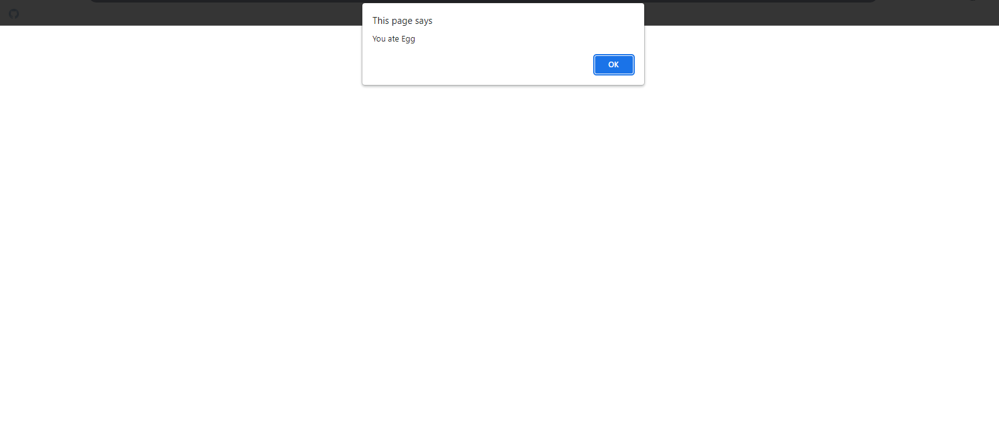
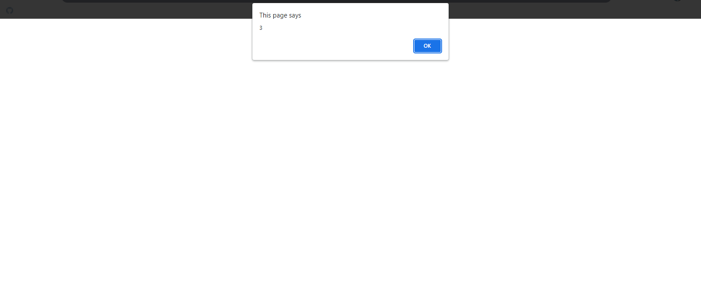

## Fun Fun Function Snippets

### Example 0

#### HTML

```HTML
<!DOCTYPE html>

<html>

    <head>

        <title>This is the title</title>

        <link rel="stylesheet" type="text/css" href="style.css">

    </head>

<body>

    <script src="js.js"></script>

</body>

</html>
```

#### JavaScript

```JavaScript
const food = {

    init: function (type) {

        this.type = type;
    },

    eat: function () {

        alert("You ate " + this.type);
    }

}

food.init("Egg");
food.eat();

//const is used to create variables but we can't change the const variable later.
```

### Output



### Example 1

#### HTML

```HTML
<!DOCTYPE html>

<html>

    <head>

        <title>This is the title</title>

        <link rel="stylesheet" type="text/css" href="style.css">

    </head>

<body>

    <script src="js.js"></script>

</body>

</html>
```

#### JavaScript

```JavaScript
function puls1(val){

    return val + 1;

}
alert(puls1(10));
```

### Output


### Example 2

#### HTML

```HTML
<!DOCTYPE html>

<html>

    <head>

        <title>This is the title</title>

        <link rel="stylesheet" type="text/css" href="style.css">

    </head>

<body>

    <script src="js.js"></script>

</body>

</html>
```

#### JavaScript

```JavaScript
function puls1(val){

    if (Array.isArray(val)) {

        var newArr = [];

        for (i = 0; i < val.length; i++) {

            newArr[i] = val[i] + 1;
        }

        return newArr;
    } else {

        return val + 1;
    }
}

alert(puls1(2));
```

### Output


