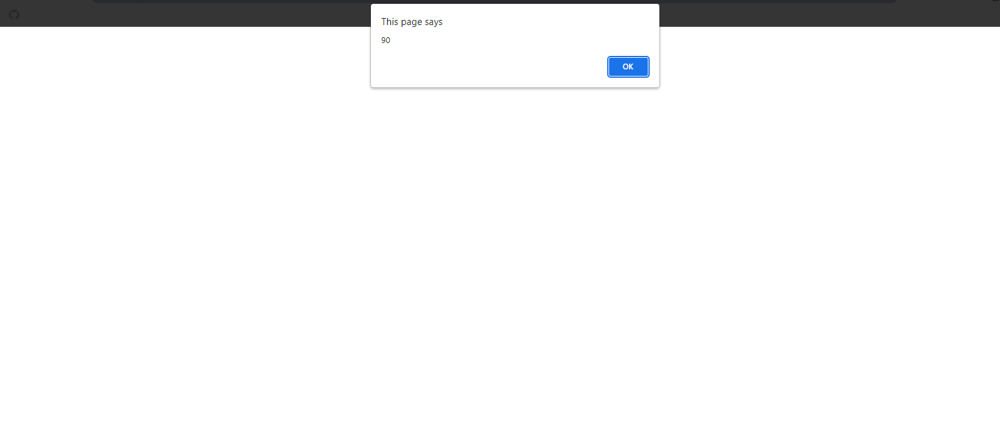
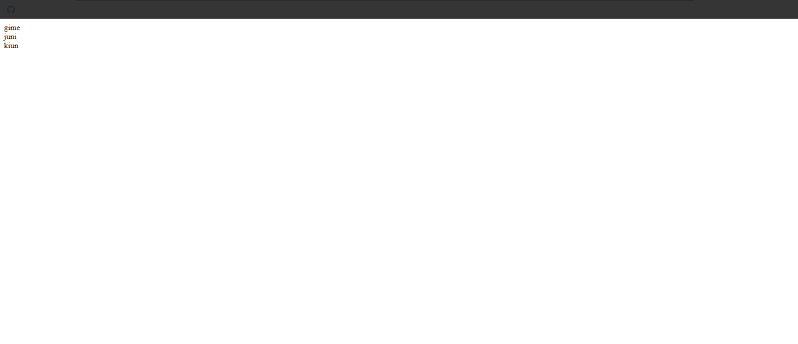
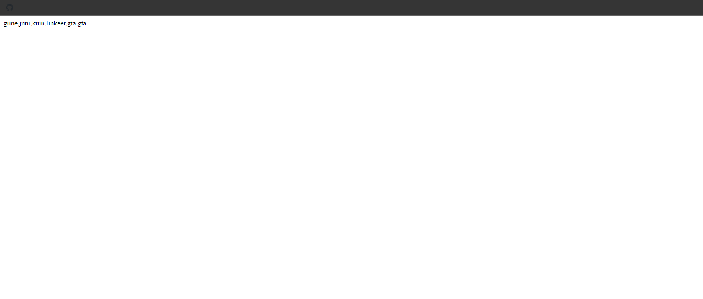
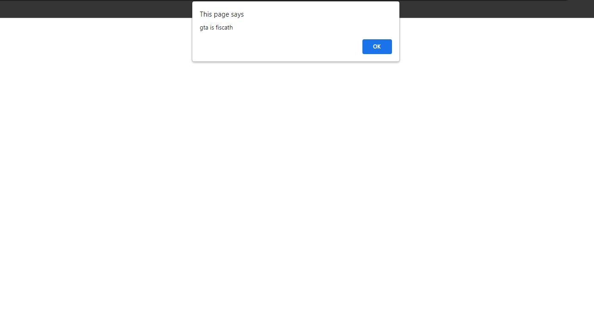
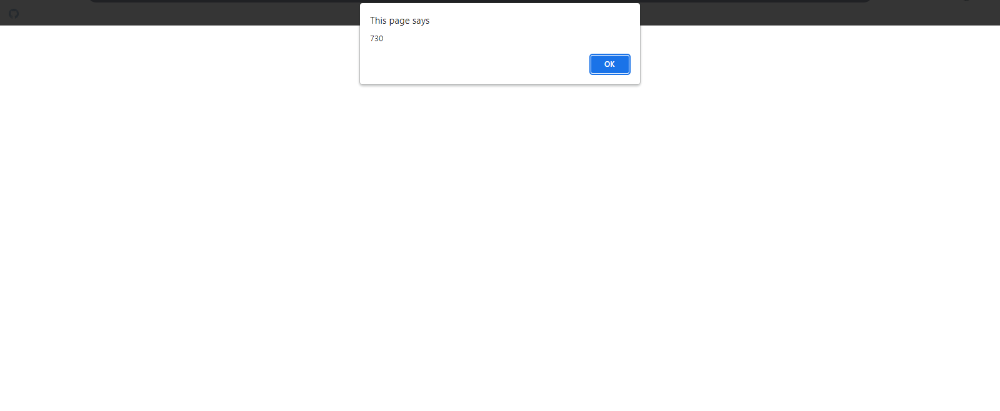

# Functional Programming Snippets

## 1. Function Snippets

### Example 0

#### HTML

```HTML
<!DOCTYPE html>

<html>

    <head>

        <title>This is the title</title>

        <link rel="stylesheet" type="text/css" href="style.css">

    </head>

<body>

    <script src="js.js"></script>

</body>

</html>
```

#### JavaScript

```JavaScript
var triple = function (x) {

    return x * 3;
}

var waffle = triple;

var a=waffle(30);

alert(a);

//in Functional Programming functions are values.
```

### Output



## 2. Fillter Snippets

### Example 0

#### HTML

```HTML
<!DOCTYPE html>

<html>

    <head>

        <title>This is the title</title>

        <link rel="stylesheet" type="text/css" href="style.css">

    </head>

<body>

    <script src="js.js"></script>

</body>

</html>
```

#### JavaScript

```JavaScript
var animals = [

    { name: "gime", species: "dog" },
     { name: "juni", species: "dog" },
      { name: "kiun", species: "dog" },
       { name: "linkeer", species: "rabbit" },
        { name: "gta", species: "fiscath" },
         { name: "gta", species: "rabbit" },
]

var newArr = [];

for (a = 0; a < animals.length; a++) {

    if (animals[a].species == "dog") {

        newArr.push(animals[a]);
    }

    alert(newArr[a].name);

}

//It can be done by using fillter method.
```

### Output


### Example 1

#### HTML

```HTML
<!DOCTYPE html>

<html>

    <head>

        <title>This is the title</title>

        <link rel="stylesheet" type="text/css" href="style.css">

    </head>

<body>

    <script src="js.js"></script>

</body>

</html>
```

#### JavaScript

```JavaScript
var animals = [

    { name: "gime", species: "dog" },
     { name: "juni", species: "dog" },
      { name: "kiun", species: "dog" },
       { name: "linkeer", species: "rabbit" },
        { name: "gta", species: "fiscath" },
         { name: "gta", species: "rabbit" },
]

var a=animals.filter(function (ani) {

    if (ani.species == "dog") {

        document.write(ani.name + "<br>");
    }

});

//filter returns a small array bashed on a logic but find returns the first item the single item.
//map,filter and find are all list transformation they turn your list into something else.
```

### Output



## 3. Map Snippets

### Example 0

#### HTML

```HTML
<!DOCTYPE html>

<html>

    <head>

        <title>This is the title</title>

        <link rel="stylesheet" type="text/css" href="style.css">

    </head>

<body>

    <script src="js.js"></script>

</body>

</html>
```

#### JavaScript

```JavaScript
var animals = [

    { name: "gime", species: "dog" },
     { name: "juni", species: "dog" },
      { name: "kiun", species: "dog" },
       { name: "linkeer", species: "rabbit" },
        { name: "gta", species: "fiscath" },
         { name: "gta", species: "rabbit" },

]
var names = [];

for (i = 0; i < animals.length; i++) {

    names.push(animals[i].name);

};
document.write(names);
```

### Output



### Example 1

#### HTML

```HTML
<!DOCTYPE html>

<html>

    <head>

        <title>This is the title</title>

        <link rel="stylesheet" type="text/css" href="style.css">

    </head>

<body>

    <script src="js.js"></script>

</body>

</html>
```

#### JavaScript

```JavaScript
var animals = [

    { name: "gime", species: "dog" },
     { name: "juni", species: "dog" },
      { name: "kiun", species: "dog" },
       { name: "linkeer", species: "rabbit" },
        { name: "gta", species: "fiscath" },
         { name: "gta", species: "rabbit" },
]

animals.map(function (ani) {

    alert(ani.name + " is " + ani.species);

});

//*Map will take an array transform that into an arry of same length but with each induival items transformed.
```

### Output



## 4. Reduce Snippets

### Example 0

#### HTML

```HTML
<!DOCTYPE html>

<html>

    <head>

        <title>This is the title</title>

        <link rel="stylesheet" type="text/css" href="style.css">

    </head>

<body>

    <script src="js.js"></script>

</body>

</html>
```

#### JavaScript

```JavaScript
var order = [

    { amount:250},
    { amount: 150},
    { amount: 50},
    { amount: 80 },
    { amount: 85 },
    { amount: 115 }

]

var total = 0;

for (i = 0; i < order.length; i++) {

    total += order[i].amount;

}
alert(total);
```

### Output



### Example 1

#### HTML

```HTML
<!DOCTYPE html>

<html>

    <head>

        <title>This is the title</title>

        <link rel="stylesheet" type="text/css" href="style.css">

    </head>

<body>

    <script src="js.js"></script>

</body>

</html>
```

#### JavaScript

```JavaScript
var order = [

    { amount:250},
    { amount: 150},
    { amount: 50},
    { amount: 80 },
    { amount: 85 },
    { amount: 115 }

]

var total = order.reduce(function (sum, order) {

    return sum + order.amount;

}, 0);//Here the 0 is the starting point.

alert(total);

//sum is the first iteration and the order is the second iteration it will add together untill the iteration process is finshed.
//reduce is the multi tools for list transformations.It can be used to express any list transformations.
```

### Output


