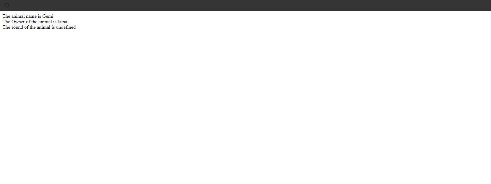
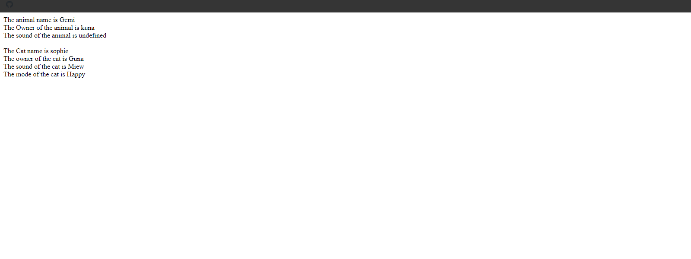
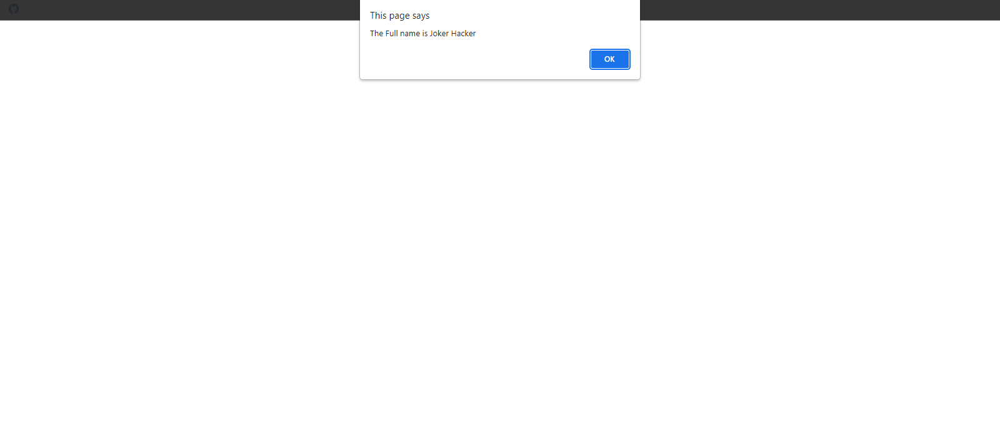

## Derek Banas Snippets

### 1. Prototypical OOP

### Example 0

#### HTML

```HTML
<!DOCTYPE html>

<html>

    <head>

        <title>This is the title</title>

        <style>

        </style>

    </head>

    <body>
		<h1 id="dis1"></h1>

        <h1 id="dis2"></h1>

          <script src="js.js"></script>

    </body>

</html>
```

#### JavaScript

```JavaScript
function Car(){

	this.carname="no name";

}

Car.prototype.setCarname=function(realCarname){

	if(realCarname!=undefined){

		this.carname=realCarname;

	}else{

		alert("Please enter a car name");

	}
}

Car.prototype.getCarname=function(){

	return this.carname;

}

var bmw=new Car();

bmw.setCarname("Bmw1698");

document.write(bmw.getCarname());

/*Notes

*We have created a constructor function.
*Then We inharited the value by prototype method.
*prototype is used to inharite the value.
*/
```

### Output


### Example 1

#### HTML

```HTML
<!DOCTYPE html>

<html>

    <head>

        <title>This is the title</title>

        <link rel="stylesheet" type="text/css" href="style.css">

    </head>

<body>

    <script src="js.js"></script>

</body>

</html>
```

#### JavaScript

```JavaScript
function Animal() {

    this.owner = "No Owner";
    this.name = "No Name";
    this.sound = "No Sound";

    //By default the animal Object is going to get These values.

}

Animal.prototype.setOwner = function (newOwner) {

    if (typeof newOwner != "undefind") {

        this.owner = newOwner;

    } else {

        document.write("Plase enter a valid owner");
    }

}

Animal.prototype.getOwner = function () {

    return this.owner;
}

Animal.prototype.setName = function (newName) {

    if (typeof newName != "undefind") {

        this.name = newName;
    } else {

        document.write("Please enter a valid name");

    }

}

Animal.prototype.getName = function () {

    return this.name;
}

Animal.prototype.setSound = function (newSound) {

    if (typeof newSound != "undefind") {

        this.sound = newSound;

    }
}

Animal.prototype.getSound = function () {

    return this.sound;
}

var dog = new Animal();

dog.setName("Gemi");
dog.setOwner("kuna");
dog.setSound();

document.write("The animal name is "+dog.getName() + "<br>");
document.write("The Owner of the animal is "+dog.getOwner() + "<br>");
document.write("The sound of the animal is "+dog.getSound() + "<br>");
```

### Output



### Example 2

#### HTML

```HTML
<!DOCTYPE html>

<html>

    <head>

        <title>This is the title</title>

        <link rel="stylesheet" type="text/css" href="style.css">

    </head>

<body>

    <script src="js.js"></script>

</body>

</html>
```

#### JavaScript

```JavaScript
function Animal() {

    this.owner = "No Owner";
    this.name = "No Name";
    this.sound = "No Sound";

    //By default the animal Object is going to get These values.

}

Animal.prototype.setOwner = function (newOwner) {

    if (typeof newOwner != "undefind") {

        this.owner = newOwner;

    } else {

        document.write("Plase enter a valid owner");
    }
}

Animal.prototype.getOwner = function () {

    return this.owner;
}

Animal.prototype.setName = function (newName) {

    if (typeof newName != "undefind") {

        this.name = newName;
    } else {

        document.write("Please enter a valid name");

    }

}

Animal.prototype.getName = function () {

    return this.name;
}

Animal.prototype.setSound = function (newSound) {

    if (typeof newSound != "undefind") {

        this.sound = newSound;

    }
}

Animal.prototype.getSound = function () {

    return this.sound;
}

var dog = new Animal();

dog.setName("Gemi");
dog.setOwner("kuna");
dog.setSound();

document.write("The animal name is "+dog.getName() + "<br>");
document.write("The Owner of the animal is "+dog.getOwner() + "<br>");
document.write("The sound of the animal is " + dog.getSound() + "<br>");
document.write("<br>");//It is for make a space.

function Cat() {

    Animal.call(this);//Automatically the cat funtion is going have setName,setOwner and everthing.
    this.mode = "Happy";

}

Cat.prototype = new Animal;//It made it as super class.
Cat.prototype.constructor = Cat;//This is not very important.We can omit it if we want.

Cat.prototype.getMode = function () {

    return this.mode;
}

Cat.prototype.setMode = function (newMode) {

    if (typeof newMode != "undefind") {

        this.setMode = newMode;

    } else {

        document.write("Please enter a valid mode");
    }

}

var sophie = new Cat();

sophie.setName("sophie");
sophie.setOwner("Guna");
sophie.setSound("Miew");
sophie.setMode("Sad");

document.write("The Cat name is "+sophie.getName() + "<br>");
document.write("The owner of the cat is "+sophie.getOwner() + "<br>");
document.write("The sound of the cat is "+sophie.getSound() + "<br>");
document.write("The mode of the cat is "+sophie.getMode() + "<br>");
document.write("<br>");//It makes space.
```

### Output



### Example 3

#### HTML

```HTML
<!DOCTYPE html>

<html>

    <head>

        <title>This is the title</title>

        <link rel="stylesheet" type="text/css" href="style.css">

    </head>

<body>

    <script src="js.js"></script>

</body>

</html>
```

#### JavaScript

```JavaScript
var customer = {

    name: "Guna",

    speak: function () {

        return "My name is " + this["name"];

    },

    address: {

        street: "No:3 Kallady Batticala",
        country: "USA",
        state:"North"

    }
}

customer.address.country="Sri Lanka";//I have change the country in this line.

document.write(customer.speak()+"<br>");
document.write("My name is " + customer.name + " I'm from " + customer.address.country + " and i live in " + customer.address.street);
```

### Output


### Example 4

#### HTML

```HTML
<!DOCTYPE html>

<html>

    <head>

        <title>This is the title</title>

        <link rel="stylesheet" type="text/css" href="style.css">

    </head>

<body>

    <script src="js.js"></script>

</body>

</html>
```

#### JavaScript

```JavaScript
function Person(name, country) {

    this.name = name;
    this.country = country;

    this.info = function () {

        return "My name is " + this['name'] + " and i libve in " + this.country;

    }
}

var kuna = new Person("Kuna", "Sri Lanka")

var Joker = new Person("JokerHacker", "USA");

document.write(kuna.info() + "<br>");

document.write(Joker.info()+"<br>");

document.write((kuna instanceof Person)+"<br>");//This line of code determines if kuna is instance of Person ..! Yes It's true.

document.write((Joker instanceof Person)+"<br>");//This line of code determines if joker is instance of Person ..! Yes It's true.
```

### Output


### Example 5

#### HTML

```HTML
<!DOCTYPE html>

<html>

    <head>

        <title>This is the title</title>

        <style>

        </style>

    </head>

    <body>

		<h1 id="dis1"></h1>

        <h1 id="dis2"></h1>

          <script src="js.js"></script>

    </body>

</html>
```

#### JavaScript

```JavaScript
function FullName(fname){

	this.fname=fname;

	this.fun1=function(){

		return "The Firstname is "+this.fname;
	}
}

FullName.prototype.lname="Hacker";

FullName.prototype.fun2=function(){

	return "The Full name is "+this.fname+" "+this.lname;

}

var kuna=new FullName("Joker");

alert(kuna.fun2());
```

### Output



### Example 6

#### HTML

```HTML
<!DOCTYPE html>

<html>

    <head>

        <title>This is the title</title>

        <link rel="stylesheet" type="text/css" href="style.css">

    </head>

<body>

    <script src="js.js"></script>

</body>

</html>
```

#### JavaScript

```JavaScript
function Person() {

    this.name = "Guna";

}
Person.prototype.job = "Software Engineer";

var kuna = new Person();

document.write(kuna.hasOwnProperty("name")+"<br>");
document.write(kuna.hasOwnProperty("job"));//Because the job Property is stored in Prototypical system.But the name is stored in the Person Object.
```

### Output


### Example 7

#### HTML

```HTML
<!DOCTYPE html>

<html>

    <head>

        <title>This is the title</title>

        <link rel="stylesheet" type="text/css" href="style.css">

    </head>

<body>

    <script src="js.js"></script>

</body>

</html>
```

#### JavaScript

```JavaScript
Array.prototype.inArray = function (value) {

    for (var i = 0; i < this.length; i++) {

        if (this[i] === value) {

            return true;
        }
    }

    // Or Once it All iteration finished. and Then not found return false.

    return false;//But if you put the 'return false' inside the for loop block or in else statement it will still retun false.
}

var ar = [1, 2, 3, 4, 5];

document.write(ar.inArray(2));

//We can also access JavaScript build in objects.
```

### Output


### Example 8

#### HTML

```HTML
<!DOCTYPE html>

<html>

    <head>

        <title>This is the title</title>

        <link rel="stylesheet" type="text/css" href="style.css">

    </head>

<body>

    <script src="js.js"></script>

</body>

</html>
```

#### JavaScript

```JavaScript
function SecrtCode() {

    var secrtNum = 78;

    this.guessNum=function(num){

        if (num > secrtNum) {

            return "Please Guess Lower Number";

        } else if (num < secrtNum) {

            return "Please Guess Higher Number";

        } else {

            return "You Guessed It";
        }

    }

}

SecrtCode.prototype.getNum = function () {

    return this.secrtNum;
}//If you also make geter you still can't get the secrt number.

var secrt = new SecrtCode();
document.write(secrt.secrtNum+"<br>");//We can't get the secrt number.

document.write(secrt.guessNum(78)+"<br>");

document.write(secrt.getNum());

//If we make a privaite variable inside a function that is going to be secrt.
```

### Output


### Example 9

#### HTML

```HTML
<!DOCTYPE html>

<html>

    <head>

        <title>This is the title</title>

        <link rel="stylesheet" type="text/css" href="style.css">

    </head>

<body>

    <script src="js.js"></script>

</body>

</html>
```

#### JavaScript

```JavaScript
var address = {

    street: "No street",
    city: "No City",
    state: "No state",

    get getAddress() {

        return this.street + " , " + this.city + " , " + this.state;

    },

    set setAddress(theAddress) {

        var parts = theAddress.toString().split(", ");//We get the address and converted to string and split it by ,

        this["street"] = parts[0] || "";//We assign first part if is not assgin "" empty. for all follwing.
        this.city = parts[1] || "";
        this["state"]=parts[2] || "";

    }

}
address.setAddress = "123 main St, Kallady, Bactticala";//We must not use () We must assign like = this.

document.write(address.getAddress);//We must not call it like address.getAddress();

//This is the geter and seter in JavaScript.
```

### Output


### Example 10

#### HTML

```HTML
<!DOCTYPE html>

<html>

    <head>

        <title>This is the title</title>

        <link rel="stylesheet" type="text/css" href="style.css">

    </head>

<body>

    <script src="js.js"></script>

</body>

</html>
```

#### JavaScript

```JavaScript
function Coordinates() {

    this.latitute = 0;
    this.longtitute = 0;
}

Object.__defineGetter__.call(Coordinates.prototype, "getCoords", function () {

    return "The Latitude is " + this["latitute"] + " and the longtitute is " + this.longtitute;

});

Object.__defineSetter__.call(Coordinates.prototype, "setCoords", function (coords) {

    var parts = coords.toString().split(", ");
    this.latitute = parts[0] || "";
    this["longtitute"] = parts[0] || "";

});

var testCoord = new Coordinates();

testCoord.setCoords = "40,70";

document.write(testCoord.getCoords);

//This is the deprecated way to use getter and setter in javaScript but it still works in new browers.
```

### Output


### Example 11

#### HTML

```HTML
<!DOCTYPE html>

<html>

    <head>

        <title>This is the title</title>

        <link rel="stylesheet" type="text/css" href="style.css">

    </head>

<body>

    <script src="js.js"></script>

</body>

</html>
```

#### JavaScript

```JavaScript
function Points() {

    this.xPos = 0;
    this.yPos = 0;
}

Object.defineProperty(Points.prototype, "pointPos", {

    get: function () {

        return "The X postion is " + this.xPos + " and  the Y postion is " + this.yPos;

    },

    set: function (thenewPonts) {

        var parts = thenewPonts.toString().split(", ");
        this.xPos = parts[0] || "";
        this.yPos = parts[1] || "";

    }
});

var aPoint = new Points();

aPoint.pointPos = "10,50";

document.write(aPoint.pointPos);

//This is the 3rd way to use getter and setters in JavaScript.
```

### Output


### Example 12

#### HTML

```HTML
<!DOCTYPE html>

<html>

    <head>

        <title>This is the title</title>

        <link rel="stylesheet" type="text/css" href="style.css">

    </head>

<body>

    <script src="js.js"></script>

</body>

</html>
```

#### JavaScript

```JavaScript
function Animal() {

    this.name = "Animal";

    this.toString = function () {

        return "My name is " + this.name;
    }
}
function Canine() {

    this.name = "Canine";

}

function Wolf() {

    this.name = "Wolf";

}

Canine.prototype = new Animal();//We can access everyting inside the Animal Object in Caine or Wolf Objects.//This method called inheritance
Wolf.prototype = new Canine();//Wolf is joined with Canine the Canine is Joined with Animal It's like Wolf -> Canine -> Animal.The Three objects are joined together.

Canine.prototype.constructor = Canine;//We Must assgin it after inheritanced.
Wolf.prototype.constructor = Wolf;//We Must assgin it after inheritanced.

var arcticWolf = new Wolf();

document.write(arcticWolf.toString() + "<br>");

document.write("Wolf instance of Animal " + (arcticWolf instanceof Animal)+"<br>");//true.

Animal.prototype.sound = "Grrr";

Animal.prototype.getSound = function () {

    return this.name + ' says ' + this.sound;

}
document.write(arcticWolf.getSound());

//Canine.prototype.sound = "Wolf";//we can also assign properties for Canine
//Wolf.prototype.sound = "Grr wolf";//we can also assign properties for Canine

function Rodent() {

    this.name = "Rodent";

}

function Rat() {

    this.name = "Rat";
}

Rodent.prototype = new Animal();
Rat.prototype = Rodent.prototype;//It is also like  Rat.prototype = new Rodent();

Rodent.prototype.constructor = Rodent;
Rat.prototype.constructor = Rat;

var caneRat = new Rat();

document.write(caneRat.toString() + "<br>");
```

### Output


### Example 13

#### HTML

```HTML
<!DOCTYPE html>

<html>

    <head>

        <title>This is the title</title>

        <link rel="stylesheet" type="text/css" href="style.css">

    </head>

<body>

    <script src="js.js"></script>

</body>

</html>
```

#### JavaScript

```JavaScript
function Pizza(price) {

    this.price = price || 10;

}

Pizza.prototype.getPrice = function () {

    return this.price;
}

function ExtraCheese(pizza) {

    var pervPrice = pizza.price;

    pizza.price = pervPrice + 1;

}

var myPizza = new Pizza(10);

ExtraCheese(myPizza);//This is add extra Cheese.

document.write("The Pizza $ " + myPizza.price);
```

### Output


## 2. ECMA 6 OOP

### Example 0

#### HTML

```HTML
<!DOCTYPE html>

<html>

    <head>

        <title>This is the title</title>

        <link rel="stylesheet" type="text/css" href="style.css">

    </head>

<body>

    <script src="js.js"></script>

</body>

</html>
```

#### JavaScript

```JavaScript
var addStuff = {//This is stayable ECMA virsion Script.

    sum: function (num1, num2) {

        return num1 + num2;

    }
};

document.write("This is Stayable ECMA Script "+addStuff.sum(10, 2)+"<br>");


var addStuff = {//This is ECMA 6 Script.

    sum(num1, num2) {

        return num1 + num2;

    }
}

document.write("This is ECMA 6 Script " + addStuff.sum(10, 2) + "<br>");
```

### Output


### Example 0

#### HTML

```HTML
<!DOCTYPE html>

<html>

    <head>

        <title>This is the title</title>

        <link rel="stylesheet" type="text/css" href="style.css">

    </head>

<body>

    <script src="js.js"></script>

</body>

</html>
```

#### JavaScript

```JavaScript
function points(xPos, yPos) {//This is the stayable ECMA Script.

    this.xPos = xPos;
    this.yPos = yPos;

};

points.prototype.getPos = function () {

    return "The X Position is " + this.xPos + " and The Y postion is " + this.yPos;
};

var aPoint = new points(10, 2);

document.write("This is the stayable ECMA Script." + aPoint.getPos()+"<br>");

class point {//This is The ECMA 6 Sciprt

    constructor(xPos, yPos) {

        this.xPos = xPos;
        this.yPos = yPos;
    }

    getPoss() {

        return "The X position is " + this.xPos + " and The Y postion is " + this.yPos;

    }
}

var pointer = new point(200, 22);

document.write("This is The ECMA 6 Sciprt" + pointer.getPoss());
```

### Output


