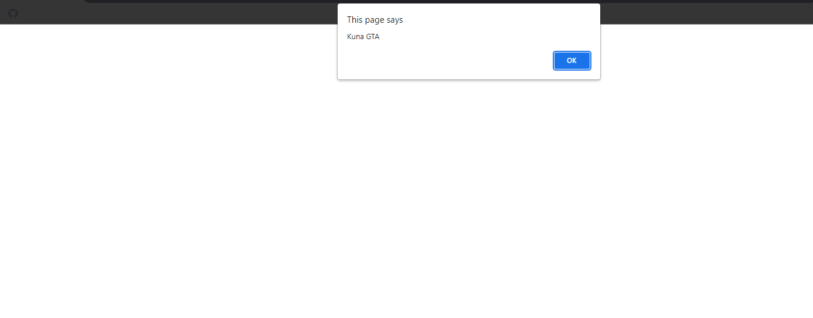
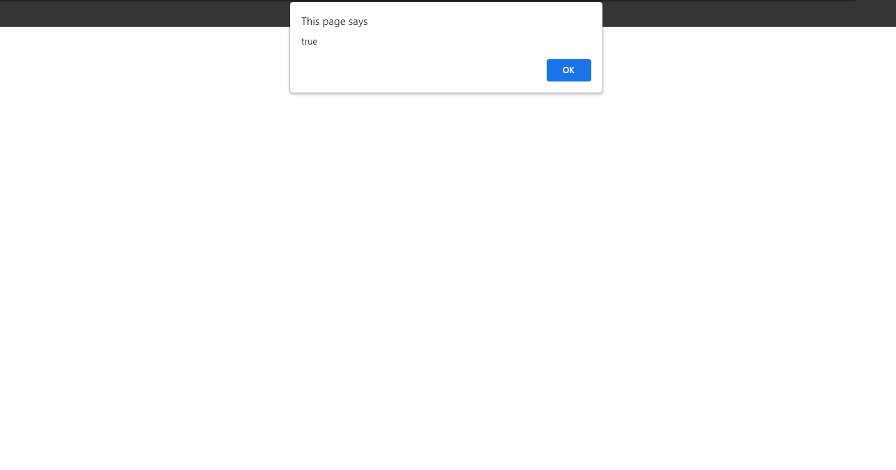
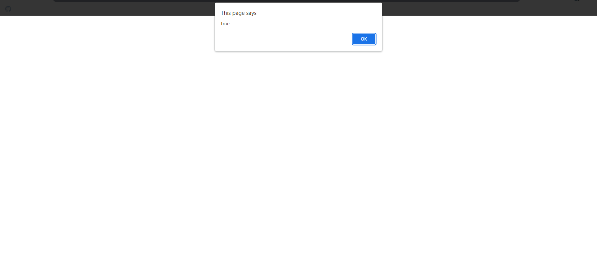

## OOP Design Partterns Snippets

## 1. Creational Partterns Snippets

### Example 0

#### HTML

```HTML
<!DOCTYPE html>

<html>

    <head>

        <title>This is the title</title>

        <link rel="stylesheet" type="text/css" href="style.css">

    </head>

<body>

    <script src="js.js"></script>

</body>

</html>
```

#### JavaScript

```JavaScript
var obj = {};

obj.firstName = "Kuna";//Adding property
obj["lastName"] = "GTA";//Adding property

var fname = obj["firstName"];
var lname = obj.lastName;

alert(fname + " " + lname);
```

### Output



### Example 1

#### HTML

```HTML
<!DOCTYPE html>

<html>

    <head>

        <title>This is the title</title>

        <link rel="stylesheet" type="text/css" href="style.css">

    </head>

<body>

    <script src="js.js"></script>

</body>

</html>
```

#### JavaScript

```JavaScript
var obj = {

    fname: "Kuna",
    gta: "Gta"

}
document.write("My name is " + obj.fname + " " + obj.gta);
```

### Output


### Example 2

#### HTML

```HTML
<!DOCTYPE html>

<html>

    <head>

        <title>This is the title</title>

        <link rel="stylesheet" type="text/css" href="style.css">

    </head>

<body>

    <script src="js.js"></script>

</body>

</html>
```

#### JavaScript

```JavaScript
var obj = {

}

Object.defineProperty(obj, "firstName", {//obj is the Object that we want to access.firstName is the property.

    value:"KunaRakulan"

});

document.write("It is in defineProperty " + obj.firstName+"<br>");

Object.defineProperties(obj, {//obj is the Object that we want to access.The properties can be used as bellow.

    fname: {

        value:"Joker"
    },

    lname: {

        value:"Hacker"
    }

});

document.write("It is in defindeProperties " + obj.fname + " " + obj.lname);

//The difineProperty and defineProperties are used to define objects properties and methods.
```

### Output


### Example 3

#### HTML

```HTML
<!DOCTYPE html>

<html>

    <head>

        <title>This is the title</title>

        <link rel="stylesheet" type="text/css" href="style.css">

    </head>

<body>

    <script src="js.js"></script>

</body>

</html>
```

#### JavaScript

```JavaScript
function Person(fname, lname) {

    this.fname = fname;
    this.lname = lname;

    this.sayName = function () {

        return this.fname + " " + this.lname;

    }
}

var kuna = new Person("Kuna", "Rakulan");
var joker = new Person("Joker", "Hacker");

var isPerson = kuna instanceof Person;//true
var isSame = kuna.sayName === joker.sayName;//false

alert(isPerson);
alert(isSame);
```

### Output



### Example 4

#### HTML

```HTML
<!DOCTYPE html>

<html>

    <head>

        <title>This is the title</title>

        <link rel="stylesheet" type="text/css" href="style.css">

    </head>

<body>

    <script src="js.js"></script>

</body>

</html>
```

#### JavaScript

```JavaScript
function Person(fname, lname) {

    this.fname = fname;
    this.lname = lname;

}

Person.prototype.sayName = function () {

    return "My name is " + this.fname + " " + this.lname;

}

var kuna = new Person("Kuna", "Rakulan");
var joker = new Person("Joker", "Hacker");

var isPerson = kuna instanceof Person;//true
var isSame = kuna.sayName === joker.sayName;//Now Becomes true.

alert(isPerson);
alert(isSame);
```

### Output



### Example 5

#### HTML

```HTML
<!DOCTYPE html>

<html>

    <head>

        <title>This is the title</title>

        <link rel="stylesheet" type="text/css" href="style.css">

    </head>

<body>

    <script src="js.js"></script>

</body>

</html>
```

#### CSS

```CSS
#customId0 {
width:250px;
height:250px;
background-color:red;

}
```

#### JavaScript

```JavaScript
var dom = {

    _counter: 0,

    genetateId: function () {//It cretes an id every time when this function works.

        return "customId" + this._counter++;//increments

    },
    create: function (tagName,id) {

        ele = document.createElement(tagName);

        ele.id = id || this.genetateId();

        return ele;
    }

}

var div1 = dom.create("div", "kuna")//It creates a div element with kuna id.But if you omit the id value.the genarateId() function will run and it will automatically creates id.
div1.style.width = 250+"px";
div1.style.height = 250+"px";
div1.style.backgroundColor = "red";
document.body.appendChild(div1);

var div2 = dom.create("div")//It creates a div element with gebarateId function the id would be customId0.
div2.style.width = "250px";
div2.style.height = "250px";
div2.style.backgroundColor = "green";
document.body.appendChild(div2);

//In this program we can access the _counter property easily and it's easy to hack.that is the bug in this program.
```

### Output


### Example 6

#### HTML

```HTML
<!DOCTYPE html>

<html>

    <head>

        <title>This is the title</title>

        <link rel="stylesheet" type="text/css" href="style.css">

    </head>

<body>

    <script src="js.js"></script>

</body>

</html>
```

#### CSS

```CSS
#customId0 {
width:250px;
height:250px;
background-color:red;

}
```

#### JavaScript

```JavaScript
var dom = (function () {

    var _counter = 0;//It's hidden.It is priviate.

    return {

        genarateId: function () {

            return "customId" + this._counter++;

        },

        create: function (tagName, id) {

            var ele = document.createElement(tagName);
            ele.id = id || this.genarateId();

            return ele;
        }

    }

})();

var div1 = dom.create("div", "kuna")
div1.style.width = 250 + "px";
div1.style.height = 250 + "px";
div1.style.backgroundColor = "red";
document.body.appendChild(div1);

var div2 = dom.create("div")
div2.style.width = "250px";
div2.style.height = "250px";
div2.style.backgroundColor = "green";
document.body.appendChild(div2);

//But in this code _counter cannot be accesed because it's protacted.
```

### Output


## 2. Code Reuse Snippets

### Example 0

#### HTML

```HTML
<!DOCTYPE html>

<html>

    <head>

        <title>This is the title</title>

        <link rel="stylesheet" type="text/css" href="style.css">

    </head>

<body>

    <script src="js.js"></script>

</body>

</html>
```

#### JavaScript

```JavaScript
function Beverage(name, temperature) {

    this.name = name;
    this.temperature = temperature;

}

Beverage.prototype.drink = function () {

    return "I'm Drinking " + this.name;

};

function Coffee(type) {

    Beverage.call(this, "Coffee", "Hot");//we call the Beverage object.
    this.type = type;

}

Coffee.prototype = Object.create(Beverage.prototype);//It's like Coffee.prototype = new Beverage();
//Now the Coffee Object can be accesed everthing inside the Beverage Object.

Coffee.prototype.sip = function () {

    return "Sipping Some Awesome " + this.type + " " + this.name;

};

var water = new Beverage("water", "Cold");
var coffee = new Coffee("Bold roest ");

document.write(water.drink() + "<br>")
document.write(coffee.drink() + "<br>");
document.write(coffee.sip());
```

### Output


### Example 1

#### HTML

```HTML
<!DOCTYPE html>

<html>

    <head>

        <title>This is the title</title>

        <link rel="stylesheet" type="text/css" href="style.css">

    </head>

<body>

    <script src="js.js"></script>

</body>

</html>
```

#### JavaScript

```JavaScript
function extend(target) {//target is the passing object.

    if (!arguments[1]) {//If we don't have anything just return.

        return;

    }

    for (var ii = 1, ll = arguments.length; ii < ll; ii++) {//why i start ii form 1 because to skip the target Object.

        var source = arguments[ii];

        for (var prop in source) {

            if (!target[prop] && source.hasOwnProperty(prop)) {// when the target does not have these properties and source has it's own property run this block of code

                target[prop] = source[prop];//Assgin the target[prop] to source[prop].
            }
        }
    }
}

function Person(name) {

    this.name = name;
}

function Dog(name) {

    this.name = name;
}

var speaker = {


    speak: function () {

        return this.name + " is Speaking";
    }
};

var mover = {

    walk: function () {

        return this.name + " is walking";
    },

    run: function () {

        return this.name + " is running";
    }

};

var arithematic = {

    add: function () {

        return this.name + " is adding";

    },

    mutiply: function () {

        return this.name + " is multiplying";

    }

}

extend(Person.prototype, speaker, mover, arithematic);
extend(Dog.prototype, speaker, mover);//but Dog object does not have the arithematic object that's why Dog object can't do arithematic.

var guna = new Person("Kuna");
var gemi = new Dog("Gemi");

document.write(guna.walk()+"<br>")//guna can walk.
document.write(gemi.walk() + "<br>")//gemi can run.
document.write(guna.add() + "<br>")//guna can run.
document.write(gemi.add())//It will return an error because the arithematic object does not define to Dog Object.
```

### Output


### Example 2

#### HTML

```HTML
<!DOCTYPE html>

<html>

    <head>

        <title>This is the title</title>

        <link rel="stylesheet" type="text/css" href="style.css">

    </head>

<body>

    <script src="js.js"></script>

</body>

</html>
```

#### JavaScript

```JavaScript
var joker = {

    firname: "Joker",
    lastname: "Hacker",
    sayname: function () {

        return this.firname + " " + this.lastname;
    }
};

var kuna = Object.create(joker, {

    firstname: { value: "Kuna" },
    lastname: { value: "Rakulan" }

});

document.write(joker.sayname()+"<br>");
document.write(kuna.sayname());

//Object.create is used to crrate an object bashed on another object.
```

### Output


