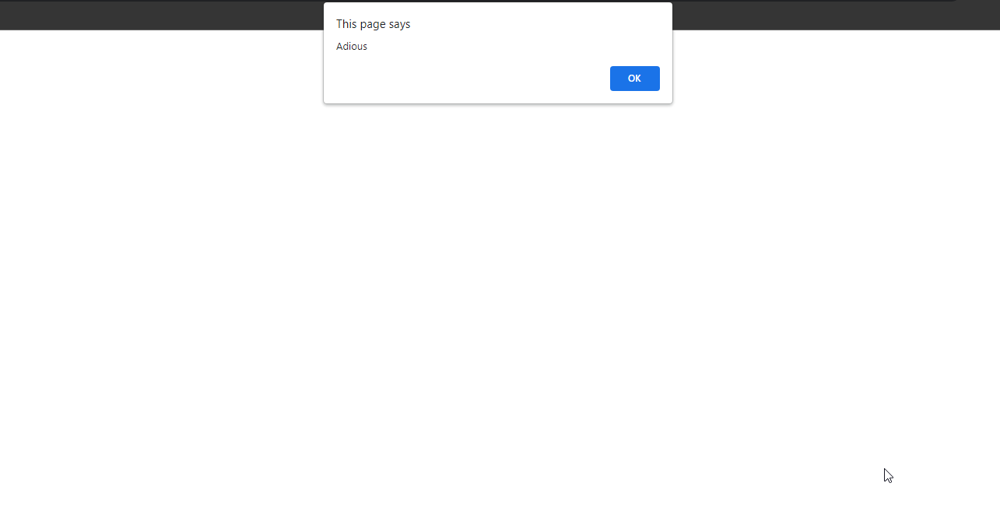
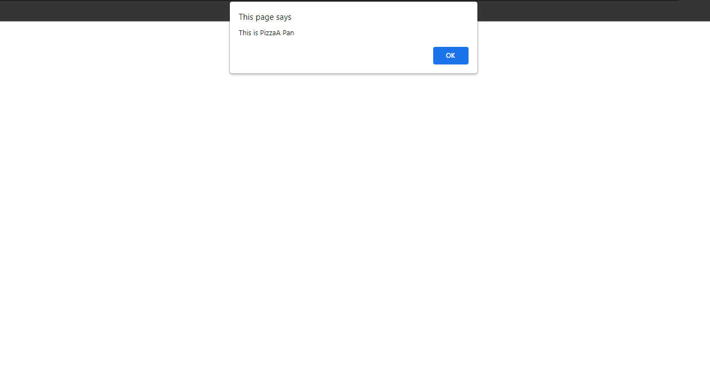
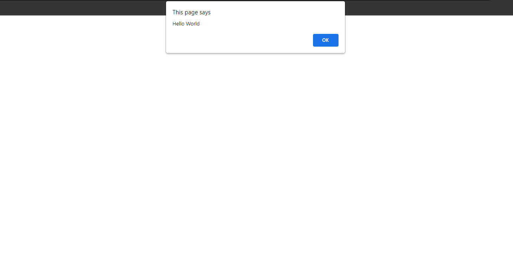

## Other OOP Snippets

## 1. Mixed Snippets

### Example 0

#### HTML

```HTML
<!DOCTYPE html>

<html>

    <head>

        <title>This is the title</title>

        <link rel="stylesheet" type="text/css" href="style.css">

    </head>

<body>

    <script src="js.js"></script>

</body>

</html>
```

#### JavaScript

```JavaScript
function X(j) {

    this.i = 0;
    this.j = j;

    this.getJ = function () {

        return this.j;
    }

}

var x1 = new X(1);
var x2 = new X(2);
alert("This is instance X one " + x1.getJ());
alert("This is instance X two " + x2.getJ());
```

### Output


### Example 1

#### HTML

```HTML
<!DOCTYPE html>

<html>

    <head>

        <title>This is the title</title>

        <link rel="stylesheet" type="text/css" href="style.css">

    </head>

<body>

    <script src="js.js"></script>

</body>

</html>
```

#### JavaScript

```JavaScript
function X(j) {

    this.i = 0;
    this.j = j;

}

X.prototype.getJ = function () {

    return this.j

}

var x1 = new X(1);
var x2 = new X(2);
alert("This is instance X one " + x1.getJ());
alert("This is instance X two " + x2.getJ());

//This code also works same but the difference is it is outside of the X Object and it has prototype chin.
```

### Output


### Example 2

#### HTML

```HTML
<!DOCTYPE html>

<html>

    <head>

        <title>This is the title</title>

        <link rel="stylesheet" type="text/css" href="style.css">

    </head>

<body>

    <script src="js.js"></script>

</body>

</html>
```

#### JavaScript

```JavaScript
function Parentclass() {

    this.parent_property1 = "Hola";
    this.parent_method1 = function (a1) {

        return a1 + "Parent Method returns data";

    }

}

function Childclass() {

    this.child_property1 = "Adious";
    this.child_method1 = function (a1) {

        return a1 + "child Method returns data";

    }
}

Childclass.prototype = new Parentclass();//Childclass can access Parentclass mehtods and properties.

var childClassInstance = new Childclass();

alert(childClassInstance instanceof Parentclass);//true
alert(childClassInstance instanceof Childclass);//true
```

### Output


### Example 3

#### HTML

```HTML
<!DOCTYPE html>

<html>

    <head>

        <title>This is the title</title>

        <link rel="stylesheet" type="text/css" href="style.css">

    </head>

<body>

    <script src="js.js"></script>

</body>

</html>
```

#### JavaScript

```JavaScript
function Parentclass() {

    this.parent_property1 = "Hola";
    this.parent_method1 = function (a1) {

        return a1 + "Parent Method returns data";
    }

}

function Childclass() {

    this.child_property1 = "Adious";
    this.child_method1 = function (a1) {

        return a1 + "child Method returns data";

    }

}

Childclass.prototype = new Parentclass();//Childclass can access Parentclass mehtods and properties.

var childClassInstance = new Childclass();

alert(childClassInstance.parent_method1("Result "))//Parent Method.
alert(childClassInstance.child_method1("Result "))//Child Method.
alert(childClassInstance.parent_property1)//Parent property.
alert(childClassInstance.child_property1)//Child property.
```

### Output



## 2. Techsith Snippets

### Example 0

#### HTML

```HTML
<!DOCTYPE html>

<html>

    <head>

        <title>This is the title</title>

        <link rel="stylesheet" type="text/css" href="style.css">

    </head>

<body>

    <script src="js.js"></script>

</body>

</html>
```

#### JavaScript

```JavaScript
var pizza = {

    crust: "thin",
    toppings: 3,
    hasBecan: true,
    howmanyTopping: function () {

        return this.toppings;

    }

};

pizza.price = "12$"//This is how add properties to an object after the creation of the object.We can also add methods,Array boolean values and etc.

alert(pizza.howmanyTopping());//This is how call a function inside the object.

delete (pizza.crust);//This is how delete an object properties or anything form an object.
```

### Output


### Example 1

#### HTML

```HTML
<!DOCTYPE html>

<html>

    <head>

        <title>This is the title</title>

        <link rel="stylesheet" type="text/css" href="style.css">

    </head>

<body>

    <script src="js.js"></script>

</body>

</html>
```

#### JavaScript

```JavaScript
var Pizza = function () {//This is the function object.It can be also make as function Pizza(){ codes }.

    this.crust="thin",
    this.toppings=3,
    this.hasBecan = true

}

var pizzaA = new Pizza();
var pizzaB = new Pizza();//We can create a lof instances bashed on a function object.

pizzaA.crust="Pan"//I have changed the pizzaA curst to 'Pan' But the pizzaB won't be changed.It will be 'thin'.

alert("This is PizzaA " + pizzaA.crust);
alert("This is PizzaB " + pizzaB.crust);

console.log(pizzaA instanceof Pizza);//true.
console.log(pizzaB instanceof Pizza)//true.

//But in function object we can't access like Pizza.crust or Pizza.hasBecan.If we want to access we need to create an instance like above.
```

### Output



### Example 2

#### HTML

```HTML
<!DOCTYPE html>

<html>

    <head>

        <title>This is the title</title>

        <link rel="stylesheet" type="text/css" href="style.css">

    </head>

<body>

    <script src="js.js"></script>

</body>

</html>
```

#### JavaScript

```JavaScript
var Pizza = function () {

    var curst = "thin";//This is Priviate variable.We can't call it outside.We can use this kind of variable to keep secrt values.
    var topping = 6;

    this.hasBecan = true;//This is public variable.We can call it outside.

    this.getHasBecan = function () {

        return this.hasBecan;

    }

    this.getCrust = function () {

        return curst;// we can access priviate variables using public methods.
    }

    var getTopping = function () {//This is priviate method.

        return topping;
    }
}

var pizzaA = new Pizza();

console.log(pizzaA.crust);//undefined.
console.log(pizzaA.getHasBecan());//returns 'true'.
console.log(pizzaA.getCrust());//returns 'thin' we can access priviate variables using public methods.
console.log(pizzaA.getTopping());//It will not work.Becase that is priviate function.
```

### Output


### Example 3

#### HTML

```HTML
<!DOCTYPE html>

<html>

    <head>

        <title>This is the title</title>

        <link rel="stylesheet" type="text/css" href="style.css">

    </head>

<body>

    <script src="js.js"></script>

</body>

</html>
```

#### JavaScript

```JavaScript
var Pizza = function () {

    var curst = "thin";//This is Priviate variable.We can't call it outside.We can use this kind of variable to keep secrt values.
    var topping = 6;

    this.hasBecan = true;//This is public variable.We can call it outside.

    this.getHasBecan = function () {

        return this.hasBecan;

    }

    this.getCrust = function () {

        return curst;// we can access priviate variables using public methods.
    }

    var getTopping = function () {//This is priviate method.

        return topping;
    }

}

var pizzaA = new Pizza();

console.log(pizzaA.crust);//undefined.
console.log(pizzaA.getHasBecan());//returns 'true'.
console.log(pizzaA.getCrust());//returns 'thin' we can access priviate variables using public methods.
console.log(pizzaA.getTopping());//It will not work.Becase that is priviate function.
```

### Output


### Example 4

#### HTML

```HTML
<!DOCTYPE html>

<html>

    <head>

        <title>This is the title</title>

        <link rel="stylesheet" type="text/css" href="style.css">

    </head>

<body>

    <script src="js.js"></script>

</body>

</html>
```

#### JavaScript

```JavaScript
//This in called Factary Pattern Object.

var peopleFactary = function (name, age, state) {

    var temp = {};

    temp.name = name;
    temp.age = age;
    temp.state = state;

    temp.printPerson = function () {

        console.log(this.name + " " + this.age + " " + this.state);
    };

    return temp;

};

var person1 = peopleFactary("Joker", 19, "SL");//In Factary Pattern we don't use new keyword.
var person2 = peopleFactary("Kuna", 18, "USA");//In Factary Pattern we don't use new keyword.

person1.printPerson();
person2.printPerson();
```

### Output


### Example 5

#### HTML

```HTML
<!DOCTYPE html>

<html>

    <head>

        <title>This is the title</title>

        <link rel="stylesheet" type="text/css" href="style.css">

    </head>

<body>

    <script src="js.js"></script>

</body>

</html>
```

#### JavaScript

```JavaScript
//This in called Constructor Function is more like class in Java.

function peopleConstructor(name, age, state) {

    this.name = name;
    this.age = age;
    this.state = state;

    this.printPerson = function () {

        console.log(this.name + " " + this.age + " " + this.state);

    };
};

//We have to use new keyword when we are assgining ConstructorFunction
var person1 = new peopleConstructor("joker", 23, "Sl");
var person2 = new peopleConstructor("kuna", 19, "UK");

person1.printPerson();
person2.printPerson();
```

### Output


### Example 6

#### HTML

```HTML
<!DOCTYPE html>

<html>

    <head>

        <title>This is the title</title>

        <link rel="stylesheet" type="text/css" href="style.css">

    </head>

<body>

    <script src="js.js"></script>

</body>

</html>
```

#### JavaScript

```JavaScript
//This in called Prototype Function.

var peopleProto = function () {

};

peopleProto.prototype.age = 19;//default values.
peopleProto.prototype.name = "No name";//default values.
peopleProto.prototype.city = "SL"//default values.

peopleProto.prototype.printPerson = function () {

    console.log(this.name + " " + this.age + " " + this.city);

};

var person1 = new peopleProto();
//person1.name = "Joker";
person1.age = 19;
person1.city = "USA";

person1.printPerson();//This prints person object in the console window.

console.log("name" in person1)//Even though it is commend out.It will still look at in the prototype chin and returns true.
console.log(person1.hasOwnProperty("name"));//This hasOwnProperty won't care about the prototype chin.It returns false.
```

### Output


### Example 7

#### HTML

```HTML
<!DOCTYPE html>

<html>

    <head>

        <title>This is the title</title>

        <link rel="stylesheet" type="text/css" href="style.css">

    </head>

<body>

    <script src="js.js"></script>

</body>

</html>
```

#### JavaScript

```JavaScript
//This in called Dynamic Prototype Function.

var dynamicProto = function (name,age,state) {

    this.age = age;
    this.name = name;
    this.state = state;

    if (typeof this.printPerson !== "function") {//if the printPerson is not defined run the bellow code.

        dynamicProto.prototype.printPerson = function () {

            console.log(this.name + " " + this.age + " " + this.state);
        };
    }
}

var person1 = new dynamicProto("Joker", 19, "CA");

person1.printPerson();
console.log("name" in person1);//true
console.log(person1.hasOwnProperty("name"))//true

//console.dir() we use it for more details.
```

### Output


### Example 8

#### HTML

```HTML
<!DOCTYPE html>

<html>

    <head>

        <title>This is the title</title>

        <link rel="stylesheet" type="text/css" href="style.css">

    </head>

<body>

    <script src="js.js"></script>

</body>

</html>
```

#### JavaScript

```JavaScript
function exampleClass() {//This is the class code bluePrint.

    this.property1 = 5;
    this.property2 = "World";
    this.method1 = function (arg1) {

        return arg1 + " " + this.property2;

    };

}

//This is the useage code of the class.
var instance1 = new exampleClass();
var instance2 = new exampleClass();

var result = instance1.method1("Hello");

alert(result);

instance1.property1 = 10;//instance1 value has been changed to 10 but not instance2.

alert("This is instance1 "+instance1.property1);
alert("This is instance2 "+instance2.property1);//It's default 5
```

### Output


