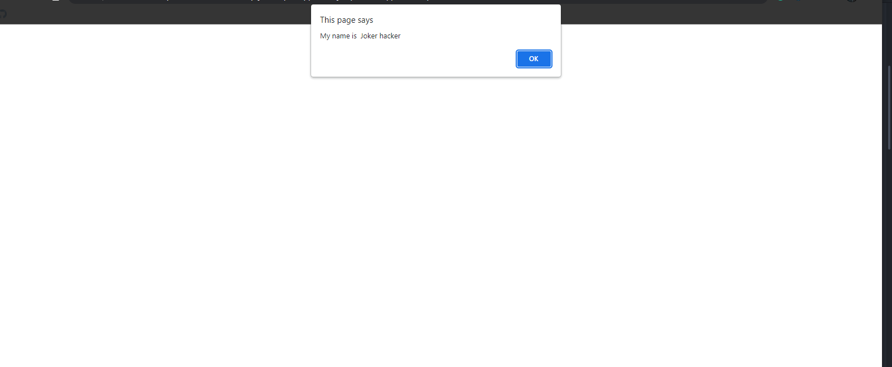

## Jump Start Snippets

### Example 0

#### HTML

```HTML
<!DOCTYPE html>

<html>

    <head>

        <title>This is the title</title>

        <link rel="stylesheet" type="text/css" href="style.css">

    </head>

<body>

    <script src="js.js"></script>

</body>

</html>
```

#### JavaScript

```JavaScript
var color = "red";

if (color) {

   var color = "blue";//This is Globel Variable.

    console.log("Inside If statement "+color);//This statement prints blue.
}

console.log("Outside " + color);//This statement prints blue.

//As you can see the color variable in the if statement is globel and though it is declared as a new variable
//in the if statement.It is not considered local because it is not in an function.
```

### Output


### Example 1

#### HTML

```HTML
<!DOCTYPE html>

<html>

    <head>

        <title>This is the title</title>

        <link rel="stylesheet" type="text/css" href="style.css">

    </head>

<body>

    <script src="js.js"></script>

</body>

</html>
```

#### JavaScript

```JavaScript
var color = "blue";

function printColor() {

    var color = "purple"//This is a local variable.
    console.log("This is local variable inside the function"+color);//This prints purple.

}

printColor();

console.log("This is globel variable outside the function "+color);//This prints blue.

//As you can see the local variable is labled as purple,and is only purple within the printColor function.

//Though both the local and globel variable have the same name,The local variable will take precedence over the globel variable
//in the printColor function.
```

### Output


### Example 2

#### HTML

```HTML
<!DOCTYPE html>

<html>

    <head>

        <title>This is the title</title>

        <link rel="stylesheet" type="text/css" href="style.css">

    </head>

<body>

    <script src="js.js"></script>

</body>

</html>
```

#### JavaScript

```JavaScript
function showName(fname,lname){

    var start="My name is ";

       function makeFullName(){

           return start+" "+fname+" "+lname;

       }

    return makeFullName();

}

alert(showName("Joker","hacker"));

//No parameters were passed to the makeFullName function yet
//it was able to print the name accurately.
//The function keyword is been use to define the enclosure.
```

### Output


