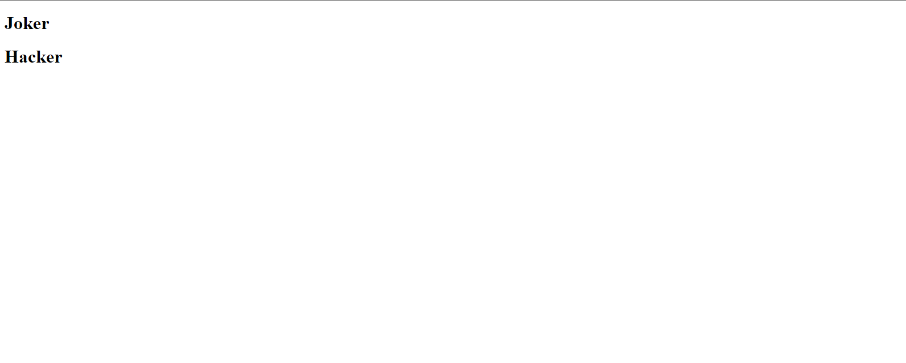
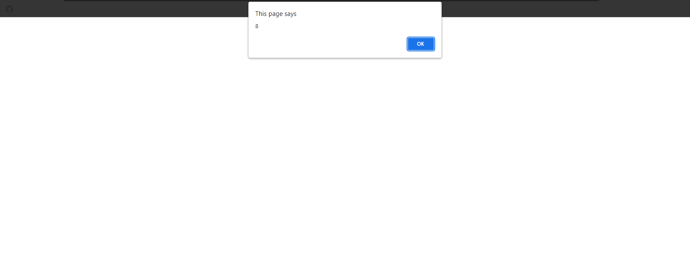
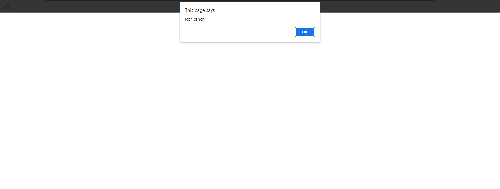

## 1. Variables Can Be Reassign Snippets

### Example 0

#### HTML

```HTML
<!DOCTYPE html>

<html>

    <head>

        <title>This is the title</title>

        <style>

        </style>

    <script src="js.js"></script>

    </head>

    <body>

    </body>

</html>
```

#### JavaScript

```JavaScript
var a="kuna";
alert(a);
a="joker";
alert(a);

/*Notes

*Variables can be reassgin.

01.Types of errors in JavaScript.

*syntax errors:-problem with syntax itself usually to sloppy typing
*Runtime exception:-problem with logic,missing reference to function or variable or unexpected errors that usually occor
 because of a raliance on external resource(ex:AJAX).

*Use Developer(F12) tool to solve problems.

*/
````

### Output


## 2. Conditional Important Snippets

### Example 0

#### HTML

```HTML
<!DOCTYPE html>

<html>

    <head>

        <title>This is the title</title>

        <style>

        </style>

    </head>

    <body>

		<h1 id="dis1"></h1>

        <h1 id="dis2"></h1>

          <script src="js.js"></script>

    </body>

</html>
```

#### JavaScript

```JavaScript
var joker=true;

if(joker){

	document.getElementById("dis1").innerHTML="Joker";

}

var hacker=false;

if(!hacker){

	document.getElementById("dis2").innerHTML="Hacker";

}

/*Notes

*if(someValue===true) '=' if(someValue);
*if(someValue===false) '=' if(!someValue);

*/
````

### Output



## 3. Switch Important Snippets

### Example 0

#### HTML

```HTML
<!DOCTYPE html>

<html>

    <head>

        <title>This is the title</title>

        <style>

        </style>

    </head>

    <body>

		<h1 id="dis1"></h1>

        <h1 id="dis2"></h1>

          <script src="js.js"></script>

    </body>

</html>
```

#### JavaScript

```JavaScript
var date=new Date();
var hour=date.getHours();

switch(true){

    case (hour>8&&hour<12):
        document.write("It is morning");
        break;

        case(hour==12):
        document.write("It is time for lunch");
        break;
        case(hour>12&&hour<18):
        document.write("Fight time");
        break;
    default:
        document.write("Careful");

}
````

### Output


## 4. Anonymous Function Important Snippets

### Example 0

#### HTML

```HTML
<!DOCTYPE html>

<html>

    <head>

        <title>This is the title</title>

        <style>

        </style>

    </head>

    <body>

		<h1 id="dis1"></h1>

        <h1 id="dis2"></h1>

          <script src="js.js"></script>

    </body>

</html>
```

#### JavaScript

```JavaScript
var mySys=(function(a,b){

	return a-b;

})(10,2);

alert(mySys);

alert((function(a,b){

	return a+b;

})(10,2));

/*Notes

*We can pass arguments to anonymous function.
*We can return the value and alert it or We can alert the value on the spot.

*/
````

### Output



## 5. Array And If Snippets

### Example 0

#### HTML

```HTML
<!DOCTYPE html>

<html>

    <head>

        <title>This is the title</title>

        <style>

        </style>

    </head>

    <body>

		<h1 id="dis1"></h1>

        <h1 id="dis2"></h1>

          <script src="js.js"></script>

    </body>

</html>
```

#### JavaScript

```JavaScript
if(true){


	var x=5;
}

alert(x);

/*Notes

*It works fine,Even though the x variable is inside the if statement.

*Array is a variable that contains multiple variables in other words.It's a bucket that contains other buckets.

*/
````

### Output


## 6. Object Snippets

### Example 0

#### HTML

```HTML
<!DOCTYPE html>

<html>

    <head>

        <title>This is the title</title>

        <style>

        </style>

    </head>

    <body>

		<h1 id="dis1"></h1>

        <h1 id="dis2"></h1>

          <script src="js.js"></script>

    </body>

</html>
```

#### JavaScript

```JavaScript
var planet={

id:35,
name:"kuna",

faction:{

	name:"Nex",
	factionId:2,
	notification:function(){

		document.write("Next alliance");

	}

},
cites:[
    {locationId:15,name:"Gladius"},
	{locationId:18,name:"chalybs"},
	{locationId:16,name:"Ensis"}

]

}

planet.faction.notification();
document.write(planet.cites[1].name);

planet.name="gta"; //We can change the object properties

var z=planet;
document.write(z.name);  //We can assign an object to a variable

if(typeof planet.defense==="undefined"){

	planet.defense="Icon canon";

}

alert(planet.defense);

/*Notes

*We can change the object properties like in line 30.
*We can assign an object to a variable like in line 33.
*We can check and create an object property like in line 35.

*/
````

### Output



### Example 1

#### HTML

```HTML
<!DOCTYPE html>

<html>

    <head>

        <title>This is the title</title>

        <style>

        </style>

    </head>

    <body>

		<h1 id="dis1"></h1>

        <h1 id="dis2"></h1>

          <script src="js.js"></script>

    </body>

</html>
```

#### JavaScript

```JavaScript
var joker={

	name:"kuna",
	job:"Software Developer"

}

var mainObj={

	mainSys:function(tarObj){

		for(p in tarObj){

			document.write(tarObj[p]+"<br>");
		}

	}

}

mainObj.mainSys(joker);

/*Notes

*We can pass an object to function for proessing.

*/
````

### Output


