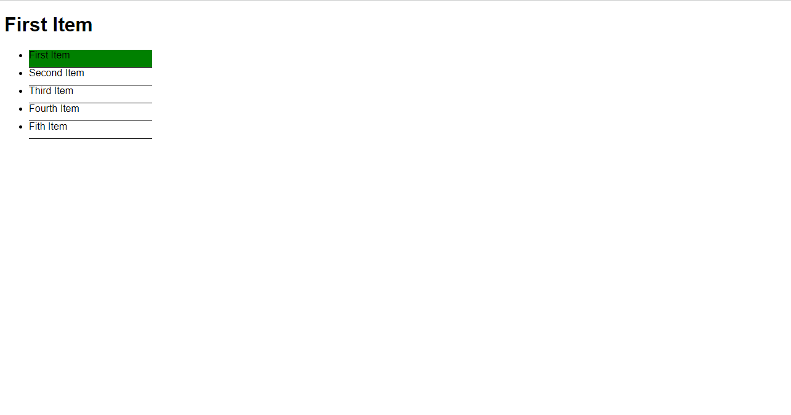

## JavaScript Best Tutorial Snippets

## 1. JavaScript Basic snippets

### Example 0

#### HTML

```HTML
<!DOCTYPE html>

<html>

	<head>

		<title>This is the title</title>

        <link  rel="stylesheet" href="jquery-ui.min.css" type="text/css" />

        <link href="style.css" rel="stylesheet" type="text/css" />

	</head>

<body>

    <header>

        <h1 id="head">Click a list item to replace this text</h1>

    </header>

    <ul id="list">

        <li><a>First Item</a></li>
        <li><a>Second Item</a></li>
        <li><a>Third Item</a></li>
        <li><a>Fourth Item</a></li>
        <li><a>Fith Item</a></li>
    </ul>

    <script src="jquery-3.2.1.min.js" type="text/javascript"></script>
    <script src="jquery-ui.min.js" type="text/javascript"></script>

    <script src="js.js" type="text/javascript"></script>

</body>

</html>
```

#### CSS

```CSS
#head {

    font-family:sans-serif;
}

ul {

    width:200px;
    font-family:sans-serif;
}

ul li {

    padding-bottom:10px;
    border-bottom:1px solid black;
    cursor:pointer;

}

.active {

    background-color:green;

}
```

#### JavaScript

```JavaScript
var items = document.getElementById("list").getElementsByTagName("li");
var head = document.getElementById("head");
var posNumber = 0;

for (s = 0; s < items.length; s++) {

    items[s].addEventListener("click", activator);

}

function activator() {

    head.innerHTML = this.innerHTML;

    for (a = 0; a < items.length; a++) {

        items[a].classList.remove("active");

    }

    this.classList.add("active");

}

//+= this is equel to append.But this not in this code.
```

### Output



## 2. JavaScript Design Partterns snippets

### Example 0

#### HTML

```HTML
<!DOCTYPE html>

<html>

    <head>

        <title>This is the title</title>

        <link  rel="stylesheet" type="text/css" href="style.css">

</head>

<body>

    <script src="jquery-3.2.1.min.js" type="text/javascript"></script>
    <script src="js.js" type="text/javascript"></script>

</body>

</html>
```

#### JavaScript

```JavaScript
function Car(modal) {

    this.modal = modal;
    this.color = "red";
    this.year = "2016";
    this.getInfo = function () {

        return this.modal + " " + this.year;
    }

}

var car1 = new Car();
car1.modal = "BMW";

console.log(car1.getInfo());
```

### Output


### Example 1

#### HTML

```HTML
<!DOCTYPE html>

<html>

    <head>

        <title>This is the title</title>

        <link  rel="stylesheet" type="text/css" href="style.css">

    </head>

<body>

    <script src="jquery-3.2.1.min.js" type="text/javascript"></script>
    <script src="js.js" type="text/javascript"></script>

</body>

</html>
```

#### JavaScript

```JavaScript
function Car(modal, speed, year) {

    this.modal = modal;
    this.speed = speed;
    this.year = year;

    this.getInfo = function () {

        document.write(this.modal + " " + this.speed + " " + this.year);

    }
}

var car1 = new Car("BMW", "1500", "2018");
var car2 = new Car("Ford", "2000", "2019");

car1.getInfo();
car2.getInfo();
```

### Output


## 3. JavaScript OOP snippets

### Example 0

#### HTML

```HTML
<!DOCTYPE html>

<html>

	<head>

		<title>This is the title</title>

        <link  rel="stylesheet" href="jquery-ui.min.css" type="text/css" />

        <link href="style.css" rel="stylesheet" type="text/css" />

	</head>

<body>

    <script src="jquery-3.2.1.min.js" type="text/javascript"></script>
    <script src="jquery-ui.min.js" type="text/javascript"></script>

    <script src="js.js" type="text/javascript"></script>

</body>

</html>
```

#### JavaScript

```JavaScript
function person(name, favColor) {

    console.log("My name is " + name + " and my favorite color " + favColor);

}

var name = "joker";
var favColor = "Red";

person("kuna", "Blue");
person(name, favColor);

//This is kind of OOP Progarmming.
```

### Output


### Example 1

#### HTML

```HTML
<!DOCTYPE html>

<html>

	<head>

		<title>This is the title</title>

        <link  rel="stylesheet" href="jquery-ui.min.css" type="text/css" />

        <link href="style.css" rel="stylesheet" type="text/css" />

	</head>

<body>

    <script src="jquery-3.2.1.min.js" type="text/javascript"></script>
    <script src="jquery-ui.min.js" type="text/javascript"></script>

    <script src="js.js" type="text/javascript"></script>

</body>

</html>
```

#### JavaScript

```JavaScript
function person(name, favColor) {

    console.log("My name is " + name + " and My Favorite Color is " + favColor);

}

var kuna = {

    name: "Kuna",
    favColor:"Blue"
}

person(kuna.name,kuna.favColor);
```

### Output


### Example 2

#### HTML

```HTML
<!DOCTYPE html>

<html>

	<head>

		<title>This is the title</title>

        <link  rel="stylesheet" href="jquery-ui.min.css" type="text/css" />

        <link href="style.css" rel="stylesheet" type="text/css" />

	</head>

<body>

    <script src="jquery-3.2.1.min.js" type="text/javascript"></script>
    <script src="jquery-ui.min.js" type="text/javascript"></script>

    <script src="js.js" type="text/javascript"></script>

</body>

</html>
```

#### JavaScript

```JavaScript
var Joker = {

    name: "Joker Hacker",
    favColor: "red",
    greet: function () {

        console.log("My name is " + this.name + " and my favoriate color is " + this.favColor);
    }

}

Joker.greet();
```

### Output


### Example 3

#### HTML

```HTML
<!DOCTYPE html>

<html>

	<head>

		<title>This is the title</title>

        <link  rel="stylesheet" href="jquery-ui.min.css" type="text/css" />

        <link href="style.css" rel="stylesheet" type="text/css" />

	</head>

<body>

    <script src="jquery-3.2.1.min.js" type="text/javascript"></script>
    <script src="jquery-ui.min.js" type="text/javascript"></script>

    <script src="js.js" type="text/javascript"></script>

</body>

</html>
```

#### JavaScript

```JavaScript
function Person(fullName, favColor) {//Always use upper-case for blue Prints.Not Improtant.

    this.name = fullName;
    this.favoriteColor = favColor;
    this.greet = function () {

        console.log("My name is " + this.name + " and my favorite Color is " + this.favoriteColor + ".");

    }
}

var joker = new Person("Joker Hacker", "Red");
var kuna = new Person("Kunarakulan", "Blue");

joker.greet();
kuna.greet();
```

### Output


