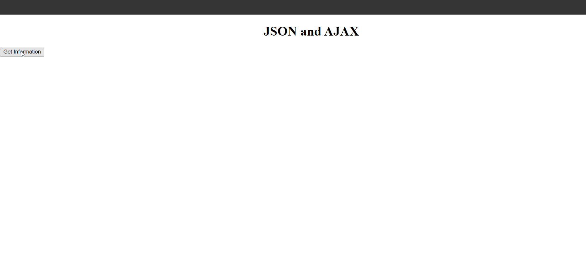
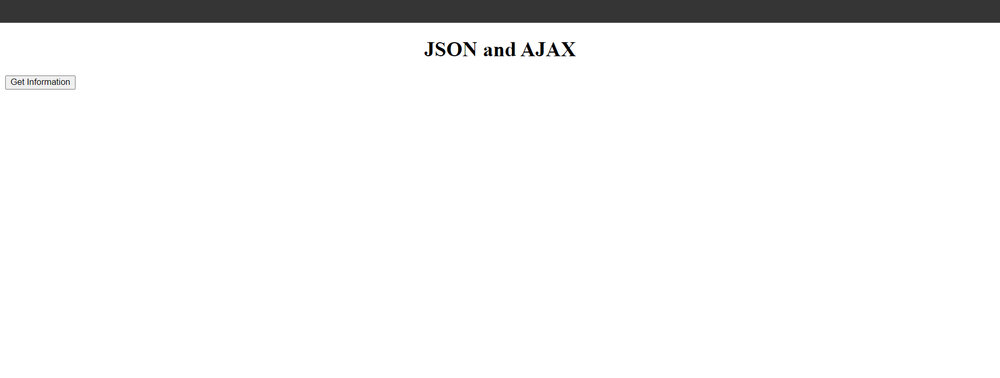
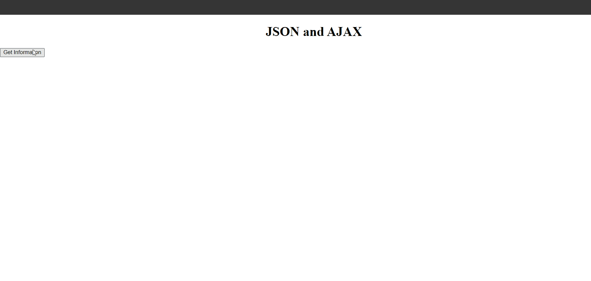
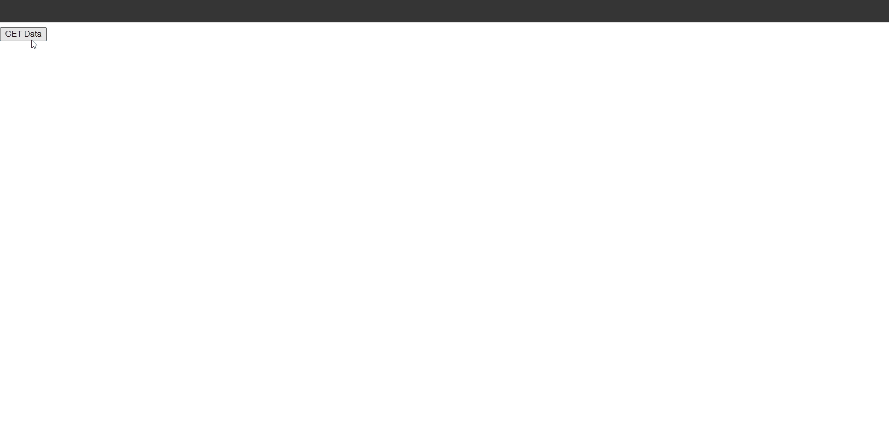

## JSON Snippets

### Example 0

#### HTML

```HTML
<!DOCTYPE html>

<html>

	<head>

		<title>This is the title</title>

        <link  rel="stylesheet" href="jquery-ui.min.css" type="text/css" />

        <link href="style.css" rel="stylesheet" type="text/css" />

	</head>

<body>

    <h1 style="text-align:center;">JSON and AJAX</h1>

    <input type="button" value="Get Information" id="infoBtn" />

    <div id="info">

    </div>

    <script src="jquery-3.2.1.min.js" type="text/javascript"></script>
    <script src="jquery-ui.min.js" type="text/javascript"></script>

    <script src="js.js" type="text/javascript"></script>

</body>

</html>
```

#### JavaScript

```JavaScript
var thePets = [

    {
        name: "kuna",
        age: "20",
        ambition: "Software Engineer"

    }, {

        name: "Emaldon",
        age: "25",
        ambition: "Network Engineer"

    }, {

        name: "Joy",
        age: "19",
        ambition: "Mutimedia Engineer"

    }

];

console.log(thePets[0].name + " is a " + thePets[0].ambition + " and he is " + thePets[0].age + " years old");
console.log(thePets[1].name + " is a " + thePets[1].ambition + " and he is " + thePets[0].age + " years old");

//This is is JSON
//JSON stands for Java Script object Notation.
//JSON is the mixed of arrays and objects.
//This is like JSON but not JSON.JSON is in the file directory named jsonfile.json
```

### Output



### Example 1

#### HTML

```HTML
<!DOCTYPE html>

<html>

	<head>

		<title>This is the title</title>

        <link  rel="stylesheet" href="jquery-ui.min.css" type="text/css" />

        <link href="style.css" rel="stylesheet" type="text/css" />

	</head>

<body>

    <h1 style="text-align:center;">JSON and AJAX</h1>

    <input type="button" value="Get Information" id="infoBtn" />

    <div id="info">

    </div>

    <script src="jquery-3.2.1.min.js" type="text/javascript"></script>
    <script src="jquery-ui.min.js" type="text/javascript"></script>

    <script src="js.js" type="text/javascript"></script>

</body>

</html>
```

#### JavaScript

```JavaScript
var ourRequest = new XMLHttpRequest();//This is request Object.
ourRequest.open("GET", "http://localhost:8016/jsonfile.json");//This is the link that the JSON is Stored.

ourRequest.onload = function () {//This runs when the josn is loaded.

    var ourData = JSON.parse(ourRequest.responseText);//We convert the file as json.

    console.log(ourData[0]);//Print.
};

ourRequest.send();//Send


//Sever is requried XAAMP or Anything.
```

```JavaScript
[

    {
        "name": "kuna",
        "age": "20",
        "ambition": "Software Engineer"

    },
	{

        "name": "Emaldon",
        "age": "25",
        "ambition": "Network Engineer"

    },
	{

        "name": "Joy",
        "age": "19",
        "ambition": "Mutimedia Engineer"

    }

]
```

### Output


### Example 2

#### HTML

```HTML
<!DOCTYPE html>

<html>

	<head>

		<title>This is the title</title>

        <link  rel="stylesheet" href="jquery-ui.min.css" type="text/css" />

        <link href="style.css" rel="stylesheet" type="text/css" />

	</head>

<body>

    <h1 style="text-align:center;">JSON and AJAX</h1>

    <input type="button" value="Get Information" id="infoBtn" />

    <div id="info">

    </div>

    <script src="jquery-3.2.1.min.js" type="text/javascript"></script>
    <script src="jquery-ui.min.js" type="text/javascript"></script>

    <script src="js.js" type="text/javascript"></script>

</body>

</html>
```

#### JavaScript

```JavaScript
document.getElementById("infoBtn").addEventListener("click", ajaxJson);//Button Event.
var displayPlace = document.getElementById("info");//The place that we want to print the data.


function ajaxJson() {

    var ourRequest = new XMLHttpRequest();//This is the tool to commiucate with other resourses.
    ourRequest.open("GET", "http://localhost:8016/jsonfile.json");//This is the link that we want to get.We have used a GET Method.

    ourRequest.onload = function () {//once the JSON loaded.

        var ourData = JSON.parse(ourRequest.responseText);//convert the data as JSON.

        renderHTML(ourData);//call the funtion with the JOSN Data,

    }

    ourRequest.send();//This is imfortant.

}

function renderHTML(data) {

    var htmlString = "";

    for (e = 0; e < data.length; e++) {//We run the function and prints and data that are in the JSON file.

        htmlString += "<h4>" + data[e].name + " and he is a" + data[e].ambition + "</h4>";

    }

    displayPlace.insertAdjacentHTML("beforeend", htmlString)//I have used insertAdjacentHTML.

}
```

```JavaScript
[

    {
        "name": "kuna",
        "age": "20",
        "ambition": "Software Engineer"

    },
	{

        "name": "Emaldon",
        "age": "25",
        "ambition": "Network Engineer"

    },
	{

        "name": "Joy",
        "age": "19",
        "ambition": "Mutimedia Engineer"

    }

]
```

### Output



### Example 3

#### HTML

```HTML
<!DOCTYPE html>

<html>

	<head>

		<title>This is the title</title>

        <link  rel="stylesheet" href="jquery-ui.min.css" type="text/css" />

        <link href="style.css" rel="stylesheet" type="text/css" />

	</head>

<body>

    <h1 style="text-align:center;">JSON and AJAX</h1>

    <input type="button" value="Get Information" id="infoBtn" />

    <div id="info">

    </div>

    <script src="jquery-3.2.1.min.js" type="text/javascript"></script>
    <script src="jquery-ui.min.js" type="text/javascript"></script>

    <script src="js.js" type="text/javascript"></script>

</body>

</html>
```

#### JavaScript

```JavaScript
document.getElementById("infoBtn").addEventListener("click", ajaxJson);//Button Event.
var displayPlace = document.getElementById("info");//The place that we want to print the data.
var pageCounter = 1;//This is the index position of the page.

function ajaxJson() {

    var ourRequest = new XMLHttpRequest();//This is the tool to commiucate with other resourses.
    ourRequest.open("GET", "http://localhost:8016/jsonfile"+pageCounter+".json");//This is the link that we want to get.We have used a GET Method.

    ourRequest.onload = function () {//once the JSON loaded.

        var ourData = JSON.parse(ourRequest.responseText);//convert the data as JSON.

        renderHTML(ourData);//call the funtion with the JOSN Data,

    }

    ourRequest.send();//This is imfortant.
    pageCounter++;//increment the value ate here.

    if (pageCounter > 3) {//if the pageCounter greather than 2 hide the btn.

        document.getElementById("infoBtn").style.display = "none";
    }

}

function renderHTML(data) {

    var htmlString = "";

    for (e = 0; e < data.length; e++) {//We run the function and prints and data that are in the JSON file.

        htmlString += "<h4>" + data[e].name + " and he is a" + data[e].ambition + "</h4>";

    }

    displayPlace.insertAdjacentHTML("beforeend", htmlString)//I have used insertAdjacentHTML.

}

//Multiple JSON files.
//XAAMP is requried.
```

```JavaScript
[

    {
        "name": "kuna",
        "age": "20",
        "ambition": "Software Engineer"

    },
	{

        "name": "Emaldon",
        "age": "25",
        "ambition": "Network Engineer"

    },
	{

        "name": "Joy",
        "age": "19",
        "ambition": "Mutimedia Engineer"

    }

]
```

```JavaScript
[

    {
        "name": "Joker",
        "age": "20",
        "ambition": "Eletronic Engineer"

    },
	{

        "name": "Hacker",
        "age": "25",
        "ambition": "Computer Engineer"

    },
	{

        "name": "Maker",
        "age": "19",
        "ambition": "Cvil Engineer"

    }

]
```

```JavaScript
[

    {
        "name": "GTA",
        "age": "20",
        "ambition": "game Engineer"

    },
	{

        "name": "Javakan",
        "age": "25",
        "ambition": "Network admin"

    },
	{

        "name": "mahan",
        "age": "19",
        "ambition": "Mutimedia admin"

    }

]
```
### Output



### Example 4

#### HTML

```HTML
<!DOCTYPE html>

<html>

	<head>

		<title>This is the title</title>

        <link  rel="stylesheet" href="jquery-ui.min.css" type="text/css" />

        <link href="style.css" rel="stylesheet" type="text/css" />

	</head>

<body>

    <input type="button" id="btn"  value="GET Data"/>

    <div id="dataBox">

    </div>

    <script src="jquery-3.2.1.min.js" type="text/javascript"></script>
    <script src="jquery-ui.min.js" type="text/javascript"></script>

    <script src="js.js" type="text/javascript"></script>

</body>

</html>
```

#### JavaScript

```JavaScript
document.getElementById("btn").onclick = function () { jsonFunction(); };
var place = document.getElementById("dataBox");

function jsonFunction() {
    var request = new XMLHttpRequest();
    request.open("GET", "http://localhost:8016/jsonfile1.json");

    request.onload = function () {

        if (request.status >= 200 && request.status <= 400) {

            var newData = JSON.parse(request.responseText);

            diliverFunction(newData);
        }

    }

    request.send();

}

function diliverFunction(datas) {

    var htmlS=""

    for (e = 0; e < datas.length; e++) {

        htmlS += "<p>" + datas[e].name + " and he is a " + datas[e].ambition + "</p>";

    }

    place.insertAdjacentHTML("beforeend", htmlS);

}
```

```JavaScript
[

    {
        "name": "kuna",
        "age": "20",
        "ambition": "Software Engineer"

    },
	{

        "name": "Emaldon",
        "age": "25",
        "ambition": "Network Engineer"

    },
	{

        "name": "Joy",
        "age": "19",
        "ambition": "Mutimedia Engineer"

    }

]
```

### Output


