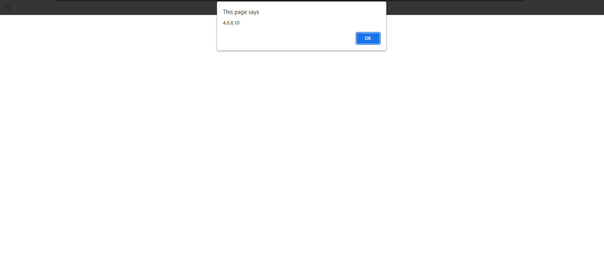

## 1. Multi Array Snippets

### Example 0

#### HTML

```HTML
<!DOCTYPE html>

<html>

    <head>

        <title>This is the title</title>

        <style>

        </style>

    </head>

    <body>

		<h1 id="dis1"></h1>

        <h1 id="dis2"></h1>

          <script src="js.js"></script>

    </body>

</html>
```

#### JavaScript

```JavaScript
var mulArr=[[1,2,3,4,5],[6,7,8,9]];
alert(mulArr[1][2]);

for(a=0;a<mulArr.length;a++){

	for(b=0;b<mulArr[a].length;b++){

		document.write(mulArr[a][b]+"<br>");

	}

}
````

### Output


## 2. Arguments Snippets

### Example 0

#### HTML

```HTML
<!DOCTYPE html>

<html>

    <head>

        <title>This is the title</title>

        <style>

        </style>

    </head>

    <body>

		<h1 id="dis1"></h1>

        <h1 id="dis2"></h1>

          <script src="js.js"></script>

    </body>

</html>
```

#### JavaScript

```JavaScript
function argChecker(){

	var arg=0;
	var i=0;

	while(i<arguments.length){

		arg+=arguments[i];
		i++;
	}

	alert("The total value is "+arg);
	alert(arguments.length);

}

argChecker(10,23,5,6,9,8,5);

/*Notes
*It returns the total value and the arguments length;
*/
````

### Output


## 3. Change Text Node Snippets

### Example 0

#### HTML

```HTML
<!DOCTYPE html>

<html>

    <head>

        <title>This is the title</title>

        <style>

        </style>

    </head>

    <body>

		<input type="button" value="Remove and replace" onclick="change('dis1','I\'m not a Joker i\'m a hacker')">

		<h1 id="dis1">This is Joker</h1>

        <h1 id="dis2">This is Hacker</h1>

          <script src="js.js"></script>

    </body>

</html>
```

#### JavaScript

```JavaScript
function change(id,texts){

	var node=document.getElementById(id);

	while(node.firstChild){

		node.removeChild(node.firstChild);

	}

node.appendChild(document.createTextNode(texts));

node.style.color="red";

}

change();
/*Notes
*/
````

### Output


### Example 1

#### HTML

```HTML
<!DOCTYPE html>

<html>

    <head>

        <title>This is the title</title>

        <style>

        </style>

    </head>

    <body>

		<input type="button" value="Remove and replace" onclick="change('dis2','My name is hacker')">

		<h1 id="dis1">This is Joker</h1>

        <h1 id="dis2">This is Hacker</h1>

          <script src="js.js"></script>

    </body>

</html>
```

#### JavaScript

```JavaScript
function change(id,texts){

	var node=document.getElementById(id).firstChild;
	node.nodeValue=texts;
}
````

### Output


### Example 2

#### HTML

```HTML
<!DOCTYPE html>

<html>

    <head>

        <title>This is the title</title>

        <style>

        </style>

    </head>

    <body>

		<input type="button" value="Remove and replace" onclick="change('dis2','My name is hacker')">

		<h1 id="dis1">This is Joker</h1>

        <h1 id="dis2">This is Hacker</h1>

          <script src="js.js"></script>

    </body>    

</html>
```

#### JavaScript

```JavaScript
function change(id,texts){

	var node=document.getElementById(id);
	node.removeChild(node.childNodes[0]);

}

/*Notes
*We use childNodes insted of firstChild.
*/
````

### Output


### Example 3

#### HTML

```HTML
<!DOCTYPE html>

<html>

    <head>

        <title>This is the title</title>

        <style>

        </style>

    </head>

    <body>

		<input type="button" value="Remove and replace" onclick="change('dis2','My name is hacker')">

		<h1 id="dis1">This is Joker</h1>

        <h1 id="dis2">This is Hacker</h1>

          <script src="js.js"></script>

    </body>

</html>
```

#### JavaScript

```JavaScript
function change(id,texts){

	var node=document.getElementById(id);
	node.removeChild(node.childNodes[0]);

   var newnode1=document.createElement("hr");
   node.appendChild(newnode1);

}

/*Notes
*This example remove the first element and replace with an hr tag.
*/
````

### Output


## 4. Outputting Strings Methods Snippets

### Example 0

#### HTML

```HTML
<!DOCTYPE html>

<html>

    <head>

        <title>This is the title</title>

        <style>

        </style>

    </head>

    <body>

		<h1 id="dis1"></h1>

        <h1 id="dis2"></h1>

          <script src="js.js"></script>

    </body>

</html>
```

#### JavaScript

```JavaScript
document.write("5+4 ",5+4,"<br>");//use this method
document.write("5+4 "+5+4+"<br>");//don't use it

/*Notes

*The number one method is works fine.
*The number two method is concate the number with the string.
*We can use (,) instead of using (+) but it does not work in alert box.
*/
````

### Output


## 5. Increment  Technic Snippets

### Example 0

#### HTML

```HTML
<!DOCTYPE html>

<html>

    <head>

        <title>This is the title</title>

        <style>

        </style>

    </head>

    <body>

		<h1 id="dis1"></h1>

        <h1 id="dis2"></h1>

          <script src="js.js"></script>

    </body>

</html>
```

#### JavaScript

```JavaScript
var a=5;

a++;
alert(a);

alert(++a);

/*Notes

a++ //print this out on screen and then increment the value.
a-- //print this out on screen and then decrement the value.

++a //increment the value and then print it out on screen.
--a //decrement the value and then print it out on screen.

Ex:
var a=5;
alert(a++) // it does not work.
alert(++a) // it's right.
*/
````

### Output


## 6. Array Some() Code Snippets

### Example 0

#### HTML

```HTML
<!DOCTYPE html>

<html>

    <head>

        <title>Excrise</title>

        <link rel="stylesheet" type="text/css" href="style.css">

    </head>

<body>

    <script src="js.js"></script>

</body>

</html>
```

#### JavaScript

```JavaScript
function someArr(arr, value) {

    for (a = 0; a < arr.length; a++) {

        if (arr[a] == value) {

            return true;
        }

    }

    return false;

}

alert(someArr([1, 2, 3, 4, 5, 6], 1));

````

### Output


### Example 1

#### HTML

```HTML
<!DOCTYPE html>

<html>

    <head>

        <title>Excrise</title>

        <link rel="stylesheet" type="text/css" href="style.css">

    </head>

<body>

    <script src="js.js"></script>

</body>

</html>
```

#### JavaScript

```JavaScript
Array.prototype.someIn = function (value) {

    for (i = 0; i < this.length; i++) {

        if (this[i] == value) {

            return true;
        }
    }

    return false;
}

var arr = [1, 23, 5, 6, 8, 9, 5];
alert(arr.someIn(23));
````

### Output


### Example 2

#### HTML

```HTML
<!DOCTYPE html>

<html>

    <head>

        <title>Excrise</title>

        <link rel="stylesheet" type="text/css" href="style.css">

    </head>

<body>

    <input type="text" id="txt">
    <input type="button" id="btn"  value="Click"/>

    <script src="js.js"></script>

</body>

</html>
```

#### JavaScript

```JavaScript
window.onload = function () {

    document.getElementById("btn").onclick = checkerFunction;

}

function checkerFunction() {


    var inp = document.getElementById("txt").value;
    var toStr = String(inp)
    var splitStr = toStr.split("");
    splitStr.pop();
    var last = toStr.split("");
    last = toStr[toStr.length - 1];

    (function () {

        var s = 0;

        for (a = 0; a < splitStr.length; a++) {

            if (splitStr[a] == last) {

                alert(true)
                s++;
            }

        }

        if (s == 0) {

            alert(false);
        }

    })();    

}
````

### Output


### Example 3

#### HTML

```HTML
<!DOCTYPE html>

<html>

    <head>

        <title>This is the title</title>

        <style>

        </style>

    </head>

    <body>

		<h1 id="dis1"></h1>

        <h1 id="dis2"></h1>

          <script src="js.js"></script>

    </body>

</html>
```

#### JavaScript

```JavaScript
function arrSome(arr1,userInp){

	for(a=0;a<arr1.length;a++){

		if(arr1[a]===userInp){

			return true;
		}

	}
	return false;

}

var userarr=new Array(5);

for(a=0;a<userarr.length;a++){

	userarr[a]=Number(prompt("Enter numberic value"));
}

var myVal=arrSome(userarr,2);
alert(myVal)

/*Notes
*It is the code of sone() Array method
*/
````

### Output


## 7. Arguments Snippets

### Example 0

#### HTML

```HTML
<!DOCTYPE html>

<html>

    <head>

        <title>This is the title</title>

        <style>

        </style>

    </head>

    <body>

		<h1 id="dis1"></h1>

        <h1 id="dis2"></h1>

          <script src="js.js"></script>

    </body>

</html>
```

#### JavaScript

```JavaScript
function getArgs(){

	var totalArgs=0;

	for(u=0;u<arguments.length;u++){

		totalArgs+=arguments[u];

	}

	return totalArgs;

}

var a=getArgs(1,2,3,6,5,4,9,5);
alert(a);

/*Notes
*It is returns the all arguments value.
*/
````

### Output


## 8. Array as Argument Snippets

### Example 0

#### HTML

```HTML
<!DOCTYPE html>

<html>

    <head>

        <title>This is the title</title>

        <style>

        </style>

    </head>

    <body>

		<h1 id="dis1"></h1>

        <h1 id="dis2"></h1>

          <script src="js.js"></script>

    </body>

</html>
```

#### JavaScript

```JavaScript
function arrArg(arrArg1){

	var localArr=[];

	for(d=0;d<arrArg1.length;d++){

		localArr.push(arrArg1[d]*2);

	}

	return localArr;
}

var myVal=arrArg([2,3,4,5]);
alert(myVal);

/*Notes

*We are passing arguments value in Array format.
*/
````

### Output


