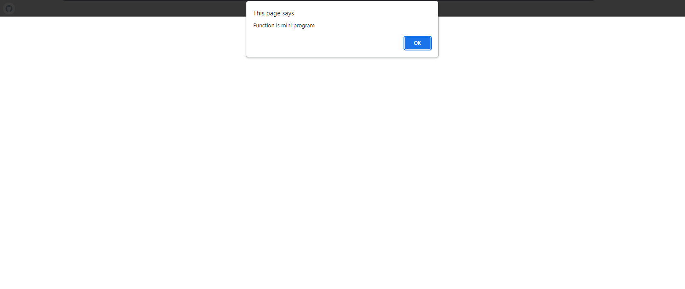
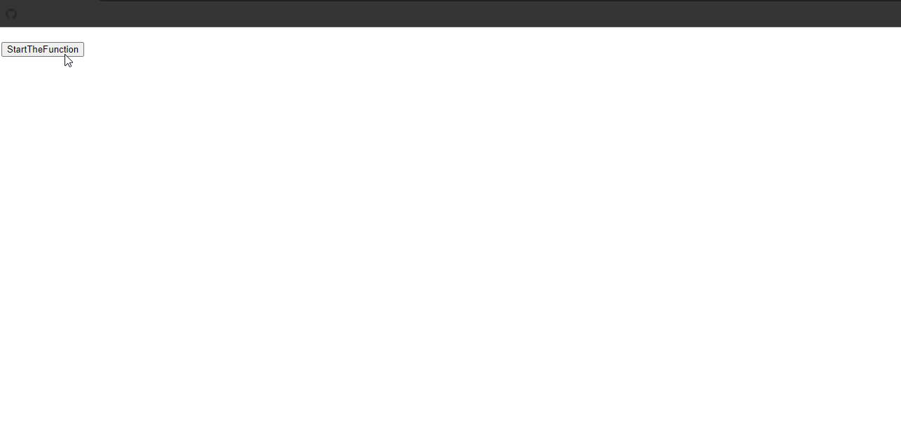
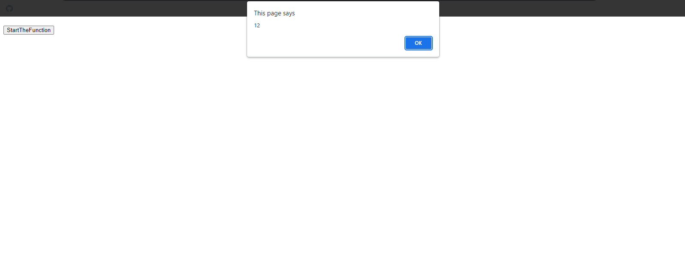

## Function Basic Snippets

### Function 1

#### HTML

```HTML
<!DOCTYPE html>

<html>

    <head>

        <title>This is the title</title>

        <style>

        </style>

    </head>

    <body>

		<h1 id="dis1"></h1>

        <h1 id="dis2"></h1>

          <script src="js.js"></script>

    </body>

</html>
```

#### JavaScript

```JavaScript
function fun1(){

	alert("Function is mini program");

}
fun1();
````

### Output



### Function 2

#### HTML

```HTML
<!DOCTYPE html>

<html>

    <head>

        <title>This is the title</title>

        <style>

        </style>

    </head>

    <body>

		<h1 id="dis1"></h1>

        <h1 id="dis2"></h1>

          <script src="js.js"></script>

    </body>

</html>
```

#### JavaScript

```JavaScript
function fun1(){
	alert("Function is mini program");
}
fun1();
````

### Output


### Function 3

#### HTML

```HTML
<!DOCTYPE html>

<html>

    <head>

        <title>This is the title</title>

        <style>

        </style>

    </head>

    <body>

		<h1 id="dis1"></h1>

        <h1 id="dis2"></h1>

		<input type="button" value="StartTheFunction" onclick="fun1()" id="b1">

          <script src="js.js"></script>

    </body>

</html>
```

#### JavaScript

```JavaScript
function fun1(a,b){
	alert("The Toatal is "+a+b);
}
fun1("kuna","Joker");
````

### Output



### Function 4

#### HTML

```HTML
<!DOCTYPE html>

<html>

    <head>

        <title>This is the title</title>

        <style>

        </style>

    </head>

    <body>

		<h1 id="dis1"></h1>

        <h1 id="dis2"></h1>

		<input type="button" value="StartTheFunction" onclick="fun1()" id="b1">

          <script src="js.js"></script>

    </body>

</html>
```

#### JavaScript

```JavaScript
var a=function fun1(a,b){
	alert(a+b);
}
a(10,2);
/*Notes
*A function can be declared as an expression(function expression)
*/
````

### Output



### Function 5

#### HTML

```HTML
<!DOCTYPE html>

<html>

    <head>

        <title>This is the title</title>

        <style>

        </style>

    </head>

    <body>

		<h1 id="dis1"></h1>

        <h1 id="dis2"></h1>

		<input type="button" value="StartTheFunction" onclick="fun1()" id="b1">

          <script src="js.js"></script>

    </body>

</html>
```

#### JavaScript

```JavaScript
function argFun(){
	var value1=0;
	for(a=0;a<arguments.length;a++){
		value1+=arguments[a];
	}
	return value1;
}
alert(argFun(10,2,3,5,4,6,6));
````

### Output


### Function 6

#### HTML

```HTML
<!DOCTYPE html>

<html>

    <head>

        <title>This is the title</title>

        <style>


        </style>

    </head>

    <body>

		<h1 id="dis1"></h1>

        <h1 id="dis2"></h1>

		<input type="button" value="StartTheFunction" onclick="fun1()" id="b1">

          <script src="js.js"></script>

    </body>

</html>
```

#### JavaScript

```JavaScript
function mainFun(arg1){
	return function(){
		alert(arg1)
	}
}
var subFun=mainFun("Kuna");
subFun();
/*Notes
*This mainFun returns a sub function inside it.The value will be stored in the main mainFun.
*So we have to catch the return value in a variable and call the variable.
*/
````

### Output


### Function 7

#### HTML

```HTML
<!DOCTYPE html>

<html>

    <head>

        <title>This is the title</title>

        <style>

        </style>

    </head>

    <body>

		<h1 id="dis1"></h1>

        <h1 id="dis2"></h1>

		<input type="button" value="StartTheFunction" onclick="fun1()" id="b1">

          <script src="js.js"></script>

    </body>

</html>
```

#### JavaScript

```JavaScript
function mainFun(a,b,fun){
	return fun(a,b);
}
function function_1(a,b){
	return a+b;
}
function function_2(a,b){
	return a-b;
}
var rel1=mainFun(5,2,function_1);
var rel2=mainFun(3,2,function_2);
alert(rel1);
alert(rel2);
/*Notes
*/
````

### Output


