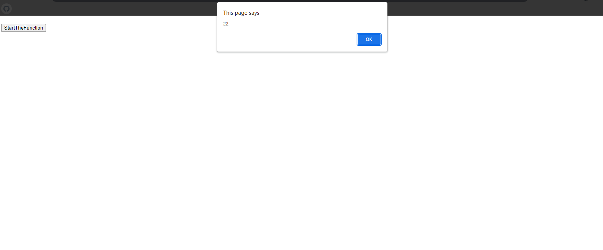
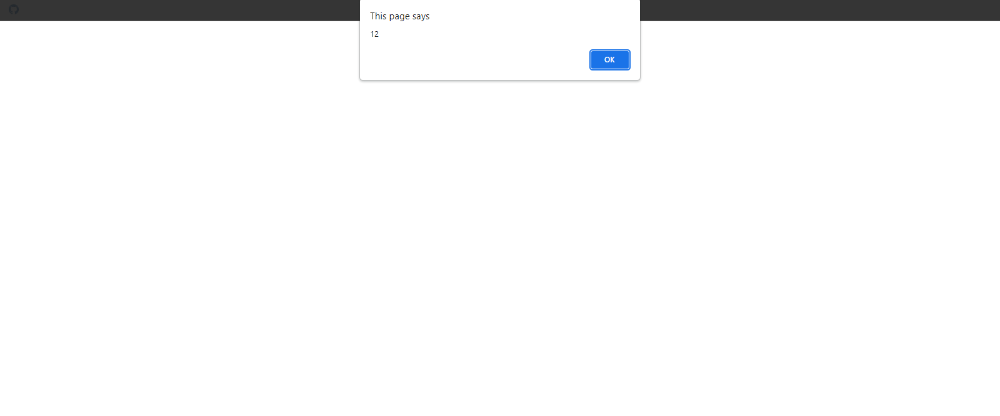

## Self Invoking Function Snippets

### Function 1

#### HTML

```HTML
<!DOCTYPE html>

<html>

    <head>

        <title>This is the title</title>

        <style>

        </style>

    </head>

    <body>

		<h1 id="dis1"></h1>

        <h1 id="dis2"></h1>

		<input type="button" value="StartTheFunction" onclick="fun1()" id="b1">

          <script src="js.js"></script>

    </body>    

</html>
```

#### JavaScript

```JavaScript
(function(){
	alert("This is self invoking function");
})();
````

### Output


### Function 2

#### HTML

```HTML
<!DOCTYPE html>

<html>

    <head>

        <title>This is the title</title>

        <style>

        </style>

    </head>

    <body>

		<h1 id="dis1"></h1>

        <h1 id="dis2"></h1>

		<input type="button" value="StartTheFunction" onclick="fun1()" id="b1">

          <script src="js.js"></script>

    </body>

</html>
```

#### JavaScript

```JavaScript
(function(a,b){
	alert(a+b);
})(10,2);

/*Notes
*It can have parameters.
*/
````

### Output


### Function 3

#### HTML

```HTML
<!DOCTYPE html>

<html>

    <head>

        <title>This is the title</title>

        <style>

        </style>

    </head>

    <body>

		<h1 id="dis1"></h1>

        <h1 id="dis2"></h1>

		<input type="button" value="StartTheFunction" onclick="fun1()" id="b1">

          <script src="js.js"></script>

    </body>

</html>
```

#### JavaScript

```JavaScript
(function(){

	var value1=0;

	for(r=0;r<arguments.length;r++){

		value1+=arguments[r]

	}
	alert(value1);

})(10,2,3,5,2);
````

### Output



### Function 4

#### HTML

```HTML
<!DOCTYPE html>

<html>

    <head>

        <title>This is the title</title>

        <style>

        </style>

    </head>

    <body>

		<h1 id="dis1"></h1>

        <h1 id="dis2"></h1>

		<input type="button" value="StartTheFunction" onclick="fun1()" id="b1">

          <script src="js.js"></script>

    </body>

</html>
```

#### JavaScript

```JavaScript
var x=(function(a,b){

	var c=a+b;

	return c;

})(10,2);

alert(x);
````

### Output



### Function 5

#### HTML

```HTML
<!DOCTYPE html>

<html>

    <head>

        <title>This is the title</title>

        <style>

        </style>

    </head>

    <body>

		<h1 id="dis1"></h1>

        <h1 id="dis2"></h1>

		<input type="button" value="StartTheFunction" onclick="fun1()" id="b1">

          <script src="js.js"></script>

    </body>

</html>
```

#### JavaScript

```JavaScript
alert((function(a,b){

	return a+b;

})(10,2));
/*Notes
*We can use this methods for document.write and innerHTML;
*/
````

### Output


