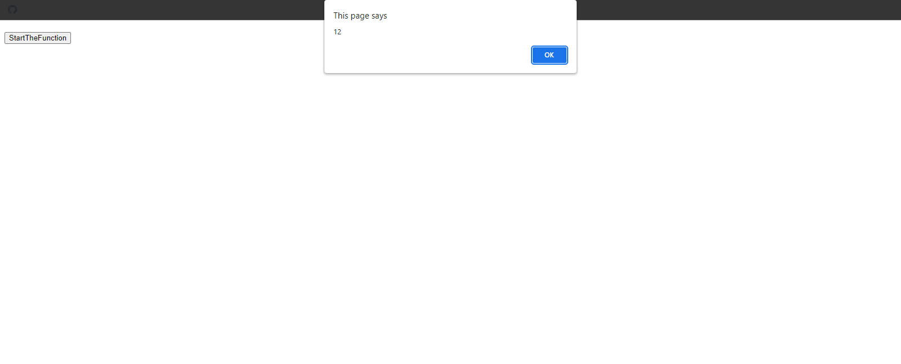
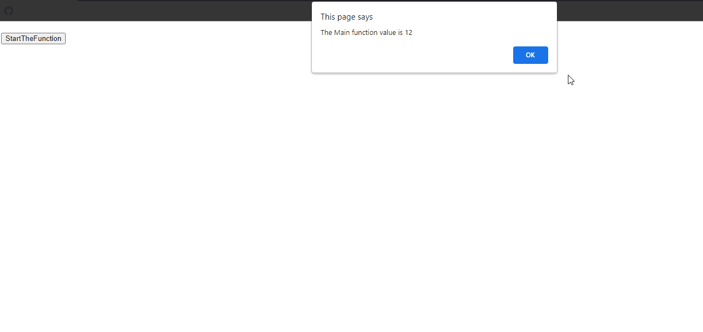
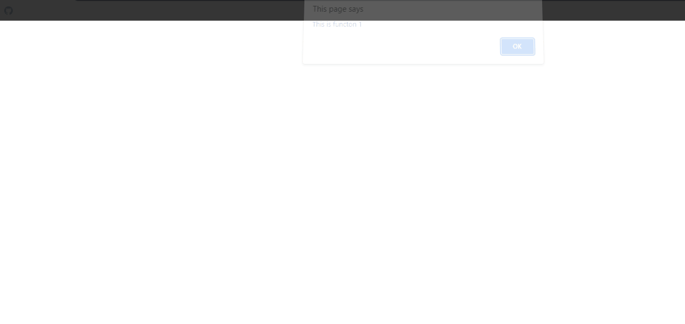
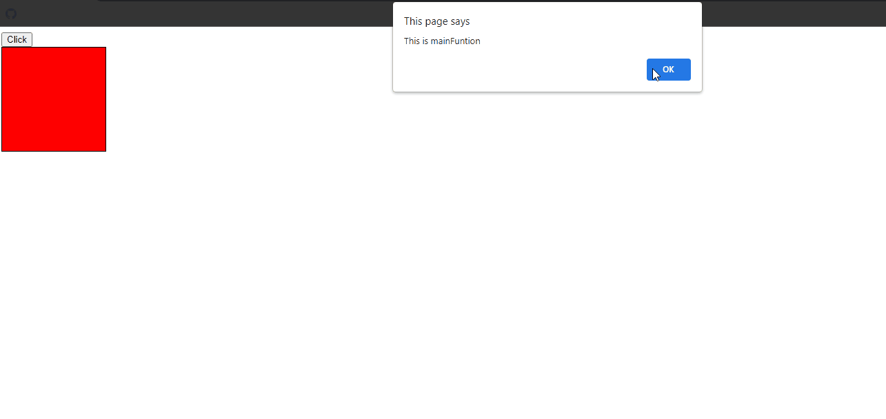
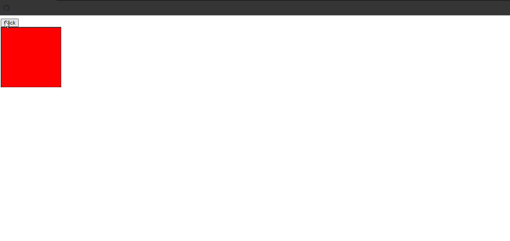

## Function Callback Snippets

### Function 1

#### HTML

```HTML
<!DOCTYPE html>

<html>

    <head>

        <title>This is the title</title>

        <style>

        </style>

    </head>

    <body>

		<h1 id="dis1"></h1>

        <h1 id="dis2"></h1>

		<input type="button" value="StartTheFunction" onclick="fun1()" id="b1">

          <script src="js.js"></script>

    </body>

</html>
```

#### JavaScript

```JavaScript
function function_1(a,b,newFun){
 	alert(a+b);
    newFun(10,3);
}
function function_2(c,d){
	alert(c-d);
}
function_1(10,2,function_2);

/*Notes
*When we send a function as an argument value we don't have to use this '()'.
*Only when we are calling a function we have to use it '()'.
*/
````

### Output



### Function 2

#### HTML

```HTML
<!DOCTYPE html>

<html>

    <head>

        <title>This is the title</title>

        <style>

        </style>

    </head>

    <body>

		<h1 id="dis1"></h1>

        <h1 id="dis2"></h1>

		<input type="button" value="StartTheFunction" onclick="fun1()" id="b1">

          <script src="js.js"></script>

    </body>

</html>
```

#### JavaScript

```JavaScript
function function_1(a,b,newFun){

	alert(a+b);
	newFun(a,b);

}

function function_2(c,d){

	alert(c-d);

}

function function_3(e,f){

	alert(e*f);
}
//function_1(10,2,function_2);
function_1(10,2,function_3);

/*Notes
*We can also give the parameter values to the sub function arguments.
*/
````

### Output


### Function 3

#### HTML

```HTML
<!DOCTYPE html>

<html>

    <head>

        <title>This is the title</title>

        <style>

        </style>

    </head>

    <body>

		<h1 id="dis1"></h1>

        <h1 id="dis2"></h1>

		<input type="button" value="StartTheFunction" onclick="fun1()" id="b1">

          <script src="js.js"></script>

    </body>

</html>
```

#### JavaScript

```JavaScript
function mainFun(a,b,subFun){

	alert(a+b);
	subFun(a,b);

}

mainFun(10,2,function(x,y){alert(x-y)});

/*Notes
*We can also give the function while we are invoking.
*/
````

### Output


### Function 4

#### HTML

```HTML
<!DOCTYPE html>

<html>

    <head>

        <title>This is the title</title>

        <style>

        </style>

    </head>

    <body>

		<h1 id="dis1"></h1>

        <h1 id="dis2"></h1>

		<input type="button" value="StartTheFunction" onclick="fun1()" id="b1">

          <script src="js.js"></script>

    </body>

</html>
```

#### JavaScript

```JavaScript
function mainFuntion(a,b,fun1,fun2){

	alert("The Main function value is "+(a+b));
	fun1(a,b);
	fun2(5,5);
}

function function_1(c,d){

	alert("The Function 1 value is "+(c-d));

}

function function_2(e,f){

	alert("The Function 2 value is "+(e*f));

}
mainFuntion(10,2,function_1,function_2);

/*Notes
*We can send a thousand of functions as arguments value.
*/
````

### Output



### Function 5

#### HTML

```HTML
<!DOCTYPE html>

<html>

    <head>

        <title>Excrise</title>

        <link rel="stylesheet" type="text/css" href="style.css">

    </head>

<body>


    <input type="text" id="txt" />
    <input type="button" id="btn1" value="Click" />
    <script src="js.js"></script>

</body>

</html>
```

#### JavaScript

```JavaScript
function fun() {

    for (a = 0; arguments.length; a++) {

        arguments[a]();
    }
}
function fun1() {

    alert("This is functon 1");

}
function fun2() {

    alert("This is functon 2");
}

function fun3() {
    alert("This is functon 3");
}
fun(fun1, fun2, fun3, function () {
    alert("This is the last function");
})
````

### Output



### Function 6

#### HTML

```HTML
<!DOCTYPE html>

<html>

    <head>

        <title>Excrise</title>

        <link rel="stylesheet" type="text/css" href="style.css">

    </head>

<body>

    <input type="button" id="btn" value="Click" />

    <div id="box"></div>

    <script src="js.js"></script>

</body>

</html>
```

#### CSS

```css
#box {
    width:150px;
    height:150px;
    background-color:red;
    border:1px solid black;
    position:relative;
    transition:transform 5s;
}
```
#### JavaScript

```JavaScript
function mainFun(fun1, fun2, fun3, fun4) {
    alert("This is mainFuntion");
    fun1(fun2, fun3, fun4);
}
function ani1(fun2,fun3,fun4) {
    alert("This is funtion 1");
    fun2(fun3, fun4);
}
function ani2(fun3,fun4) {
    alert("This is function 2");
    fun3(fun4);
}
function ani3(fun4) {
    alert("This is function 3");
    fun4();
}
function ani4() {
    alert("This is function 4");
}
mainFun(ani1, ani2, ani3, ani4);
````

### Output



### Function 7

#### HTML

```HTML
<!DOCTYPE html>

<html>

    <head>

        <title>Excrise</title>

        <link rel="stylesheet" type="text/css" href="style.css">

    </head>

<body>

    <input type="button" id="btn" value="Click" />

    <div id="box"></div>

    <script src="js.js"></script>

</body>

</html>
```

#### CSS
```CSS
#box {
    width:150px;
    height:150px;
    background-color:red;
    border:1px solid black;
    position:relative;
}
```

#### JavaScript

```JavaScript
window.onload = function () {

    document.getElementById("btn").onclick = function () { mainFun(ani1, ani2, ani3) };

}


function mainFun(fun1,fun2,fun3) {

    var boxElement = document.getElementById("box");
    var position = 0;
    var setTimer = setInterval(animationFunction, 5);

    function animationFunction() {

        if (position == 450) {

            clearInterval(setTimer);
            fun1(fun2, fun3);


        } else {

            position++;
            boxElement.style.left = position + "px";
            boxElement.style.transform = "rotate(" + position + "deg)";


        }
    }

}

function ani1(fun2, fun3) {

    var box = document.getElementById("box");
    var startingPosition = 0;
    var timerSystem = setInterval(aniSystem, 5);

    function aniSystem() {

        if (startingPosition == 270) {

            clearInterval(timerSystem);
            fun2(fun3);

        } else {
            startingPosition++;
            box.style.top = startingPosition + "px";
            box.style.transform = "rotate(" + -startingPosition + "deg)";

        }
    }
}

function ani2(fun3) {

    var ele = document.getElementById("box");
    var pos = 450
    var timer = setInterval(frame, 5);
    function frame() {
        if (pos == 0) {
            clearInterval(timer);
            fun3();
        } else {
            pos--;
            ele.style.left = pos + "px";
            ele.style.transform = "rotate(" + pos + "deg)";
        }
    }
}
function ani3() {
    var element = document.getElementById("box");
    var start = 270;
    var time = setInterval(fun, 5);
    function fun() {
        if (start == 0) {
            clearInterval(time);
        } else {
            start--;
            element.style.top = start + "px";
            element.style.transform = "rotate(" + start + "deg)";
        }
    }
}
````

### Output


