## More Advanced Function Snippets

### Advanced Function 1

### Example 0

#### HTML

```HTML
<!DOCTYPE html>

<html>

    <head>

        <title>Excrise</title>    

        <link rel="stylesheet" type="text/css" href="style.css">

    </head>

<body>

    <input type="button" id="btn" value="Click" />

    <div id="box"></div>

    <script src="js.js"></script>

</body>

</html>
```

#### CSS

```CSS
#box {
    width:150px;
    height:150px;
    background-color:red;
    border:1px solid black;
    position:relative;

}
```
#### JavaScript

```JavaScript
function mainFun(a, b) {

    function fun1() {

        function fun2() {

            alert(a + b);
        }

        fun2();
    }

    fun1();

}
mainFun(10, 2);
````

### Output

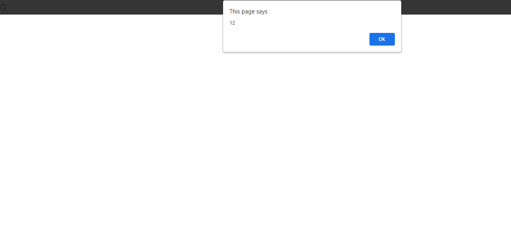

### Example 1

#### HTML

```HTML
<!DOCTYPE html>

<html>

    <head>

        <title>This is the title</title>

        <style>

        </style>

    </head>

    <body>

		<h1 id="dis1"></h1>

        <h1 id="dis2"></h1>

		<input type="button" value="StartTheFunction" onclick="fun1()" id="b1">

          <script src="js.js"></script>

    </body>

</html>
```

#### JavaScript

```JavaScript
function mainFun(a,b){

	function subFun1(){

		alert(a+b);

	}

	function subFun2(){

		alert(a-b);

	}

	subFun1();
	subFun2();

}

mainFun(10,2);

/*Notes
*The nested functions can use the parent's function parametrs.
*/
````

### Output


### Advanced Function 2

### Example 0

#### HTML

```HTML
<!DOCTYPE html>

<html>

    <head>

        <title>This is the title</title>

        <style>

        </style>

    </head>

    <body>

		<h1 id="dis1"></h1>

        <h1 id="dis2"></h1>

		<input type="button" value="StartTheFunction" onclick="fun1()" id="b1">

          <script src="js.js"></script>

    </body>

</html>
```

#### JavaScript

```JavaScript
function mainFun(a,b){

	function subFun1(){

		alert(a+b);

	}

	return function(){

		alert(a-b);

	}

}

var a=mainFun(10,2);

a();
/*Notes
*We can directly give the function like this.
*We can return a nested function inside the parent function.
*The return value stored in the parent function so we have to catch the value in a variable.
*Then run the variable with "()" this.
*Keep it in mind when we are returning a nested function we don't have to use the ().Just type function name.
*/
````

### Output


### Example 1

#### HTML

```HTML
<!DOCTYPE html>

<html>

    <head>

        <title>Excrise</title>

        <link rel="stylesheet" type="text/css" href="style.css">

    </head>

<body>

    <script src="js.js"></script>

</body>

</html>
```

#### JavaScript

```JavaScript
function fun(a,b) {

    return function () {

        alert(a + b);
    }

}
fun(10, 2)();
````

### Output


### Example 2

#### HTML

```HTML
<!DOCTYPE html>

<html>

    <head>

        <title>Excrise</title>

        <link rel="stylesheet" type="text/css" href="style.css">

    </head>

<body>

    <script src="js.js"></script>

</body>

</html>
```

#### JavaScript

```JavaScript
function fun(a,b) {

    return function () {

       return a+b
    }
}
alert(fun(10, 2)());
````

### Output

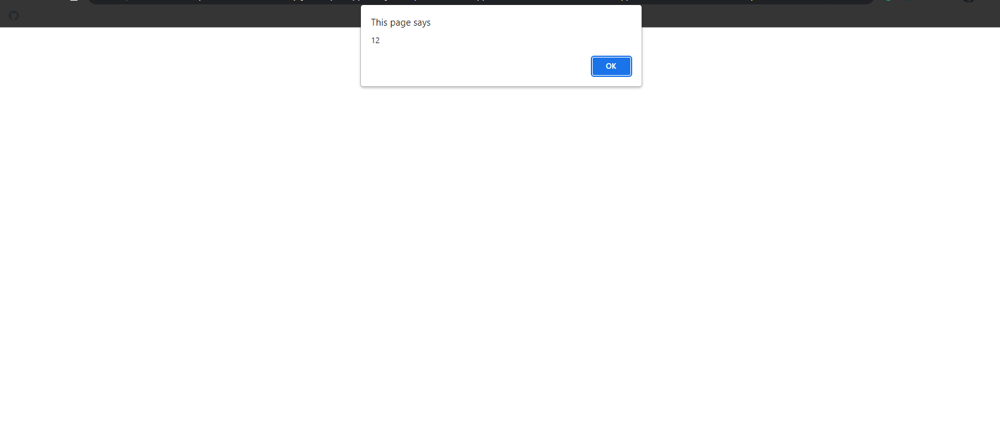

### Example 3

#### HTML

```HTML
<!DOCTYPE html>

<html>

    <head>

        <title>Excrise</title>

        <link rel="stylesheet" type="text/css" href="style.css">

    </head>

<body>

    <script src="js.js"></script>

</body>

</html>
```

#### JavaScript

```JavaScript
function fun(a,b) {

    return function () {

       return a+b
    }
}
var a = fun(10, 2);
alert(a());
````

### Output

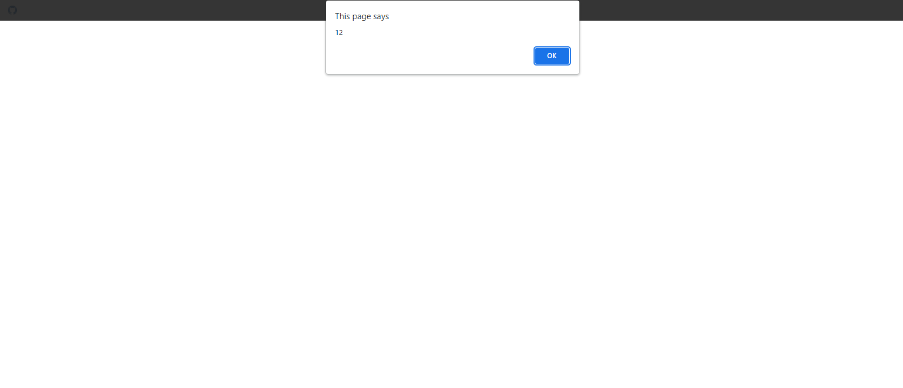

### Example 4

#### HTML

```HTML
<!DOCTYPE html>

<html>

    <head>

        <title>Excrise</title>

        <link rel="stylesheet" type="text/css" href="style.css">

    </head>

<body>

    <script src="js.js"></script>

</body>

</html>
```

#### JavaScript

```JavaScript
function fun() {

    return function () {

        alert("This is joker");
    }
}
fun()();
````

### Output

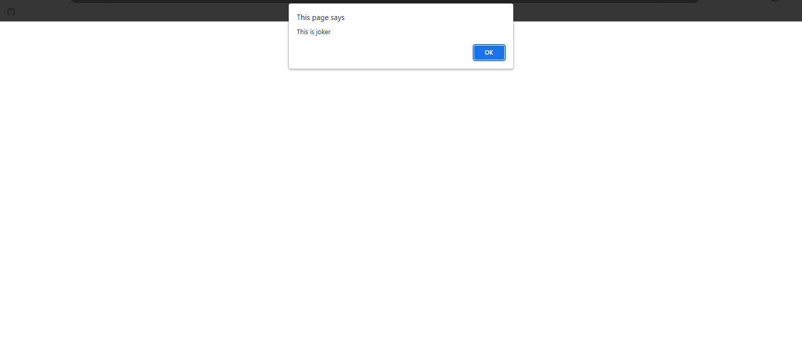

### Example 5

#### HTML

```HTML
<!DOCTYPE html>

<html>

    <head>

        <title>Excrise</title>

        <link rel="stylesheet" type="text/css" href="style.css">

    </head>

<body>

    <script src="js.js"></script>

</body>

</html>
```

#### JavaScript

```JavaScript
function fun() {

    return function () {
        return "This is Joker";
    }
}
var a=fun()();
alert(a);
````

### Output

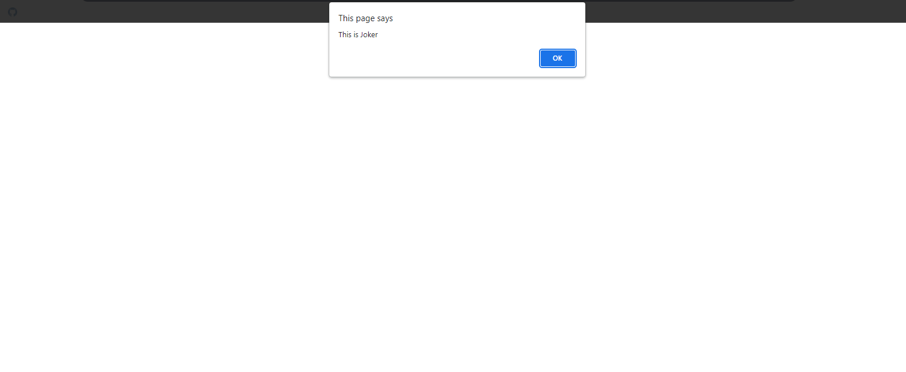

### Advanced Function 3

### Example 0

#### HTML

```HTML
<!DOCTYPE html>

<html>

    <head>

        <title>Excrise</title>

        <link rel="stylesheet" type="text/css" href="style.css">

    </head>

<body>

    <script src="js.js"></script>

</body>

</html>
```

#### JavaScript

```JavaScript
function fun() {

    function subFun() {

        document.body.style.backgroundColor = "red";
    }

    subFun();

    fun = function () {

        document.body.style.backgroundColor = "yellow";
    }
}
fun();
fun();
````

### Output

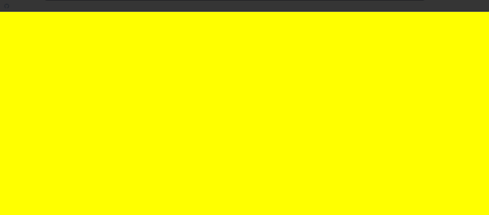

### Example 1

#### HTML

```HTML
<!DOCTYPE html>

<html>

    <head>

        <title>This is the title</title>

        <style>

        </style>

    </head>

    <body>

		<h1 id="dis1"></h1>

        <h1 id="dis2"></h1>

		<input type="button" value="StartTheFunction" onclick="fun1()" id="b1">

          <script src="js.js"></script>

    </body>

</html>
```

#### JavaScript

```JavaScript
function mainFun(a,b){

	function subFun1(){

		alert("The subFun1 value is "+(a+b));

	}

	subFun1();

	mainFun=function(a,b){

		alert(a-b);

	}

}
mainFun(10,2);
mainFun(10,2);
mainFun(10,5);

/*Notes
*When the first time run this program it will run the subFun1 function
 then it read the entire program the mainFun assigned to the Anonymous function then it runs second or anytime
 it runs the Anonymous function.
*/
````

### Output


### Advanced Function 4

### Example 0

#### HTML

```HTML
<!DOCTYPE html>

<html>

    <head>

        <title>This is the title</title>

        <style>

        </style>

    </head>

    <body>

		<h1 id="dis1"></h1>

        <h1 id="dis2"></h1>

		<input type="button" value="StartTheFunction" onclick="fun1()" id="b1">

          <script src="js.js"></script>

    </body>

</html>
```

#### JavaScript

```JavaScript
var functionArr=[];

functionArr[0]=function(){

	alert("This is function 1");

}

functionArr[1]=function(){

	alert("This is function 2");

}

functionArr[2]=function(){

	alert("This is function 3");

}

functionArr[3]=function(){

	alert("This is function 4");

}

functionArr[4]=function(){

	alert("This is function 5");

}

for(e=0;e<functionArr.length;e++){

	functionArr[e]();

}
````

### Output

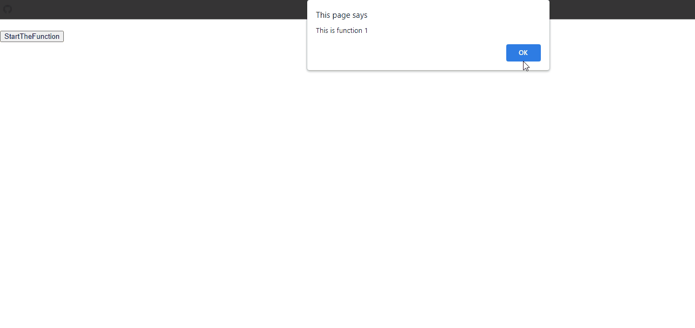

### Example 1

#### HTML

```HTML
<!DOCTYPE html>

<html>

    <head>

        <title>This is the title</title>

        <style>

        </style>

    </head>

    <body>

		<h1 id="dis1"></h1>

        <h1 id="dis2"></h1>

		<input type="button" value="StartTheFunction" onclick="fun1()" id="b1">

          <script src="js.js"></script>

    </body>

</html>
```

#### JavaScript

```JavaScript
var functionArr=[];

functionArr[0]=function(){

	alert("This is function 1");

}

functionArr[1]=function(){

	alert("This is function 2");

}

functionArr[2]=function(){

	alert("This is function 3");

}

functionArr[3]=function(){

	alert("This is function 4");

}

functionArr[4]=function(){

	alert("This is function 5");

}

for(e=0;e<functionArr.length;e++){

	var a=functionArr[e];
	a();

}
````

### Output


### Advanced Function 5

### Example 0

#### HTML

```HTML
<!DOCTYPE html>

<html>

    <head>

        <title>This is the title</title>

        <style>

        </style>

    </head>

    <body>

		<input type="button" id="b1" value="Click Me">
		<input type="button" id="b2" value="I connot work">

          <script src="js.js"></script>

    </body>

</html>
```

#### JavaScript

```JavaScript
window.onload=function(){

	document.getElementById("b1").onclick=tryMe;
}

function tryMe(){

var newBtn=document.getElementById("b2");
	newBtn.value="I can work";
	newBtn.style.color="red";

	newBtn.onclick=function(){

		alert("Now I can work");

	}
}

/*Notes
*In this program i have two buttons.
*The first button make the second button to work.
*The codiing is above.
*/
````

### Output

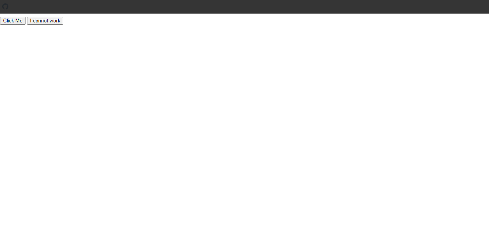

### Example 1

#### HTML

```HTML
<!DOCTYPE html>

<html>

    <head>

        <title>Excrise</title>

        <link rel="stylesheet" type="text/css" href="style.css">

    </head>

<body>

   <input type="button" id="btn1"  value="Click"/>
  <input type="button" id="btn2" value="I cannot work" />
    <input type="button" id="btn3" value="I cannot work" />
    <script src="js.js"></script>

</body>

</html>
```

#### CSS

```CSS
#box {

    width:100px;
    height:100px;
    background-color:red;
    position:relative;
}
````

#### JavaScript

```JavaScript
window.onload = function () {

    document.getElementById("btn1").onclick = makerOfBtn;

}
function makerOfBtn() {

    var newBtn = document.getElementById("btn2");
    newBtn.value = "I can work";
    newBtn.style.color = "green";
    newBtn.onclick = function () {

        var newBtn1 = document.getElementById("btn3").onclick = function () { alert("Now I am working fine") };
       var btn= document.getElementById("btn3");
       btn.value = "I can also work";
       btn.style.color = "blue";

    }
}
````

### Output

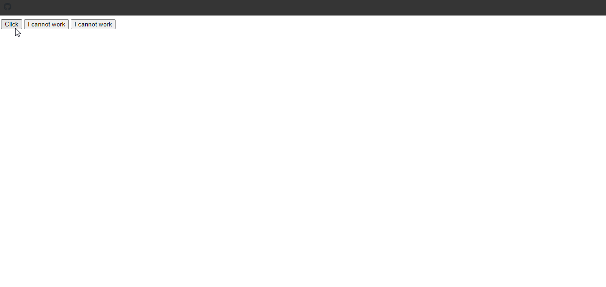

### Example 2

#### HTML

```HTML
<!DOCTYPE html>

<html>

    <head>

        <title>Excrise</title>

        <link rel="stylesheet" type="text/css" href="style.css">

    </head>

<body>

    <input type="button"  value="on" id="btn1" />

    <script src="js.js"></script>

</body>

</html>
```

#### CSS

```CSS
#box {
    width:100px;
    height:100px;
    bakground-color:red;
    position:relative;
}
````

#### JavaScript

```JavaScript
window.onload = function () {

    document.getElementById("btn1").onclick = newFun;
}
function newFun() {

    var btn = document.getElementById("btn1");

    if (btn.value == "on") {

        btn.value = "off";
        btn.style.color = "red";

    } else {
        btn.value = "on"
        btn.style.color = "blue";
    }
}
````

### Output

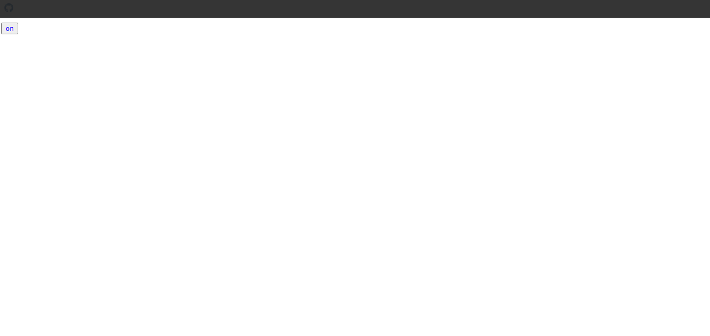


### Example 3

#### HTML

```HTML
<!DOCTYPE html>

<html>

    <head>

        <title>Excrise</title>

        <link rel="stylesheet" type="text/css" href="style.css">

    </head>

<body>

    <input type="button"  value="click" id="btn1" />

    <script src="js.js"></script>

</body>

</html>
```

#### CSS

```CSS
#box {

    width:100px;
    height:100px;
    background-color:red;
    position:relative;
}
````

#### JavaScript

```JavaScript
window.onload = function () {

    document.getElementById("btn1").onclick = fun;
}

function fun() {

    var btn = document.getElementById("btn1");
    btn.style.color = "green";

    btn.onclick = function () {

        var btn2 = document.getElementById("btn1");
        btn2.style.color = "red";

        btn2.onclick = function () {

            document.getElementById("btn1").style.color = "yellow";

        }
    }
}
````

### Output

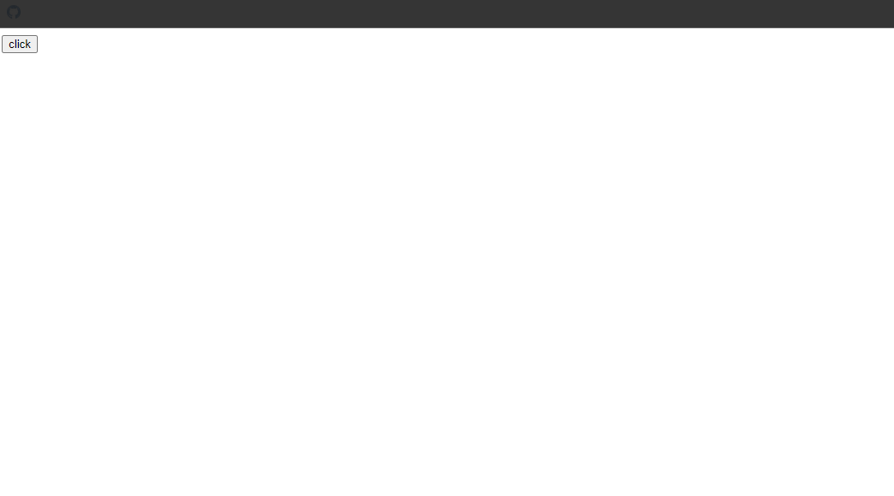
