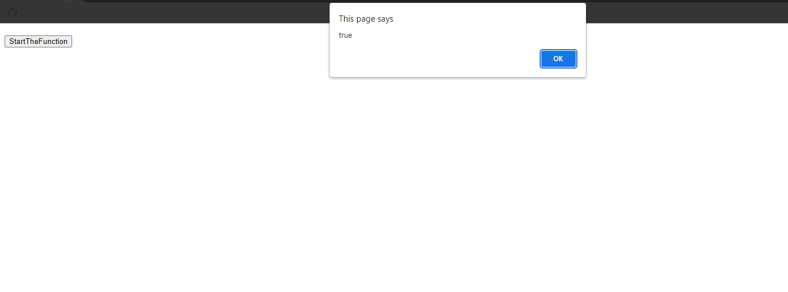
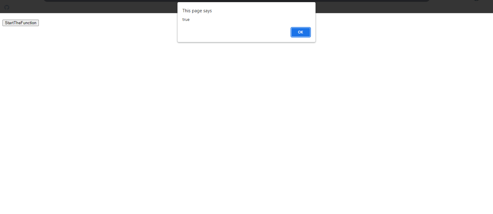
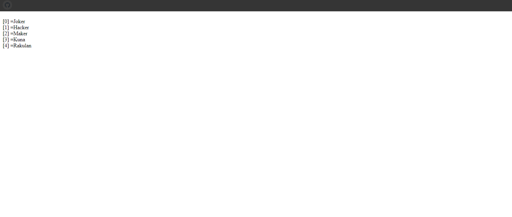
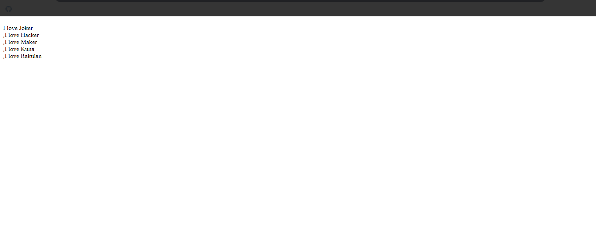
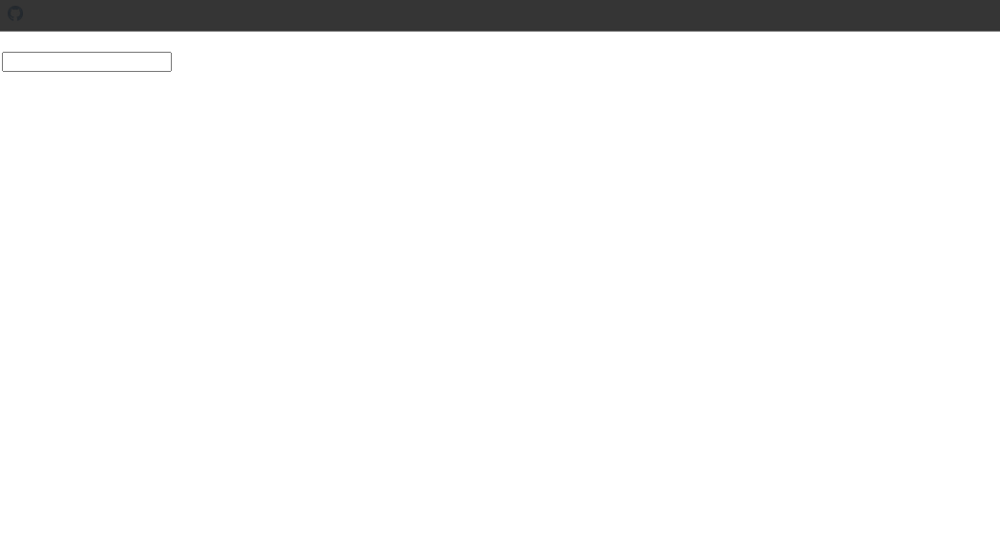
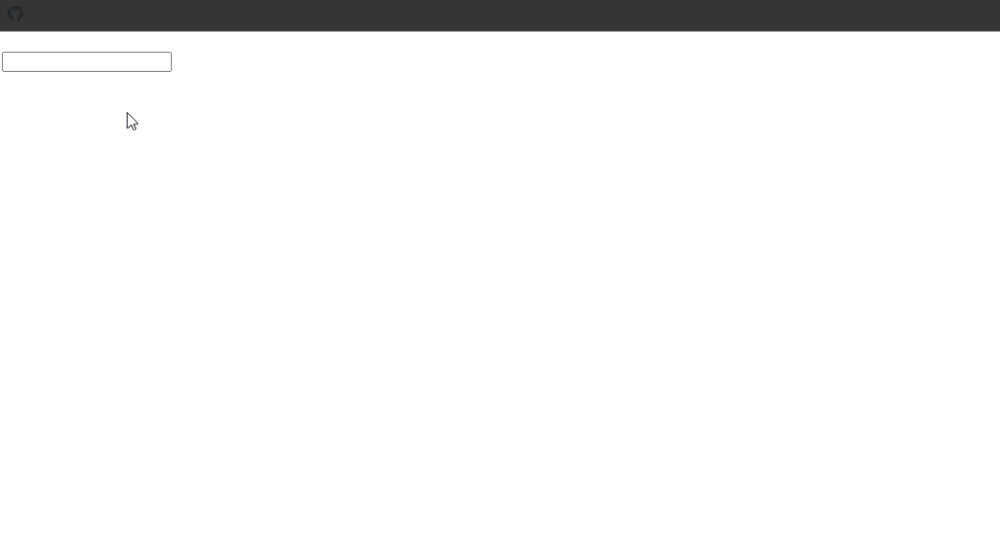
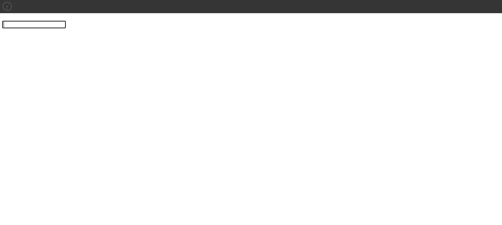

## 1. Every ( ) Array Method

### Example 0

#### HTML

```HTML
<!DOCTYPE html>

<html>

    <head>

        <title>This is the title</title>

        <style>

        </style>

    </head>

    <body>

		<h1 id="dis1"></h1>

        <h1 id="dis2"></h1>

		<input type="button" value="StartTheFunction" onclick="fun1()" id="b1">

          <script src="js.js"></script>

    </body>

</html>
```

#### JavaScript

```JavaScript
var arr1=["Kuna","Rakulan","Gta","Hacker","Joker"];

function sub(currentValue,index,array){

	return typeof currentValue==="string";

}

var a=arr1.every(sub);
alert(a);

/*
*every() is an array method.
*every()method checks if all elements in an array pass a test.
you can also do it like this.
arr1.every(function(currentValue,index,array){
	return typeof currentValue==="string";
})
*/
````

### Output



## 2. Some ( ) Array Method

### Example 0

#### HTML

```HTML
<!DOCTYPE html>

<html>

    <head>

        <title>This is the title</title>

        <style>

        </style>

    </head>

    <body>

		<h1 id="dis1"></h1>

        <h1 id="dis2"></h1>

		<input type="button" value="StartTheFunction" onclick="fun1()" id="b1">

          <script src="js.js"></script>

    </body>

</html>
```

#### JavaScript

```JavaScript
var names = ["Joker", "Hacker", "Maker", "Kuna", "Rakulan"];

function sub(currentValue,index,array){

	return currentValue[0]==="H";

}

var a=names.some(sub);
alert(a);

/*Notes
*some is an array method.
*it checks if one of the element in an array pass a test.
*in line five currentValue[0] is mean the first letter of the currentValue.
you can also do it like this.
names.some(function(currentValue,index,array){
	return currentValue[0]==="H";
})
*/
````

### Output



## 3. For Each Array Method

### Example 0

#### HTML

```HTML
<!DOCTYPE html>

<html>

    <head>

        <title>This is the title</title>

        <style>

        </style>

    </head>

    <body>

		<h1 id="dis1"></h1>

        <h1 id="dis2"></h1>

          <script src="js.js"></script>

    </body>

</html>
```

#### JavaScript

```JavaScript
var names = ["Joker", "Hacker", "Maker", "Kuna", "Rakulan"];

function forSub(currentValue,index,array){

	document.write("["+index+"] ="+currentValue+"<br>");
}
names.forEach(forSub);

/*Notes
*The forEach() method calls a provided function once for each element in an array, in order.
You can do it like this
names.forEach(function(currentValue,index,array){
	document.write("["+index+"] ="+currentValue+"<br>");
})
*/
````

### Output



## 4. Map ( ) Array Method

### Example 0

#### HTML

```HTML
<!DOCTYPE html>

<html>

    <head>

        <title>This is the title</title>

        <style>

        </style>

    </head>

    <body>

		<h1 id="dis1"></h1>

        <h1 id="dis2"></h1>

          <script src="js.js"></script>

    </body>

</html>
```

#### JavaScript

```JavaScript
var names = ["Joker", "Hacker", "Maker", "Kuna", "Rakulan"];

function mapSys(currentValue,index,array){

	return "I love "+currentValue+"<br>";

}
var a=names.map(mapSys);
document.write(a);

/*Notes
*The map() method creates a new array with the results of calling a function for every array element.
*The map() method calls the provided function once for each element in an array, in order.
*Note: map() does not execute the function for array elements without values.
*Note: map() does not change the original array.
*/
````

### Output



## 5. Keyboard Key Actions

### Example 0

#### HTML

```HTML
<!DOCTYPE html>

<html>

    <head>

        <title>This is the title</title>

        <style>

        </style>

    </head>

    <body>

		<h1 id="dis1"></h1>

        <h1 id="dis2"></h1>

		<input type="text"  id="txt1">

          <script src="js.js"></script>

    </body>

</html>
```

#### JavaScript

```JavaScript
window.onload=function(){

	document.getElementById("txt1").onkeypress=myFunction;

}

function myFunction(event) {
    var x = event.charCode;
    document.getElementById("dis1").innerHTML = "The Unicode value is: " + x;
}

/*Notes
*keydown This occurs wnen the user presses any key the on the keyborad.
*keyup that occurs when the the user releses  any key on the keyborad.
*keypress event does not occur for modifier keys such as shift,alt,control,and caps lock.
 This is the differnce between the keypress and the keydown and the keyup.
 because the keydown and the keyup does work for modifier keys.
 the keypress event Primarily designed for user input.
*/
````

### Output



### Example 1

#### HTML

```HTML
<!DOCTYPE html>

<html>

    <head>

        <title>This is the title</title>

        <style>

        </style>

    </head>

    <body>

		<h1 id="dis1"></h1>

        <h1 id="dis2"></h1>

		<input type="text"  id="txt1">

          <script src="js.js"></script>

    </body>

</html>
```

#### JavaScript

```JavaScript
window.onload=function(){

	document.getElementById("txt1").onkeypress=myFunction;

}

function myFunction(event){

	var code=event.charCode;

	if((code>=65 && code<=90)||(code>=97&&code<=122)){

		document.getElementById("txt1").style.color="red";

	}else{
		document.getElementById("txt1").style.color="green";

	}
}

/*Notes

*if any key presses between 65 and 122 the text color will be red.
 or the the text color will be green.
 charCode ASSII code

 0 48
 9 57
 A 65
 B 66
 Z 90
 a 97
 z 122
*/
````

### Output



### Example 2

#### HTML

```HTML
<!DOCTYPE html>

<html>

    <head>

        <title>This is the title</title>

        <style>

        </style>

    </head>

    <body>

		<h1 id="dis1"></h1>

        <h1 id="dis2"></h1>

		<input type="text"  id="txt1">

          <script src="js.js"></script>

    </body>

</html>
```

#### JavaScript

```JavaScript
window.onload=function(){

	document.getElementById("txt1").onkeydown=myFunction;

}

function myFunction(event){

	var code=event.keyCode,
	altKey=event.altKey,
	ctrlKey=event.ctrlKey,
	shiftKey=event.shiftKey,
	capsKey=event.capsKey;

	if(ctrlKey&&code===66){

		alert("You pressed ctrlKey and b or B");

	}

}
/*Notes

*The keydown method can return altKey,ctrlKey,shiftKey and any other modifier keys.
*You can applay this method to keyup event.
*Keep it in mind the keydown and keyup events do not care about the lowercase letter.
*if any modifier key presses it returns true or false.
 Ex:if altKey presses it returns true otherwise false.

 66==b
*/
````

### Output


