## 1. Call

### Example 0

#### HTML

```HTML
<!DOCTYPE html>

<html>

    <head>

        <title>This is the title</title>

       <style>

	   </style>

    </head>

    <body>

	   <h1 id="h1"></h1>

	 <form>

	 <input type="text" id="fnum">
	 <input type="text" id="snum"><br>
	 <input type="button" id="submit" value="submit">

	 </form>

          <script src="js.js"></script>

    </body>

</html>
```

#### JavaScript

```JavaScript
var obj1={

	num1:3,
	num2:2

}
obj2 = {

    num1: 10,
    num2:20
}

function addTothis(a,b,c,d){

	return this.num1+a+b+c+d-this.num2;

}

var ans1=addTothis.call(obj1,2,2,2,2);
alert(ans1);

/*

*Call method is used to call a specific function with
 an object values and with arguments values.

*In call method we have to pass arguments (paramers) values one by one.
*/
````

### Output

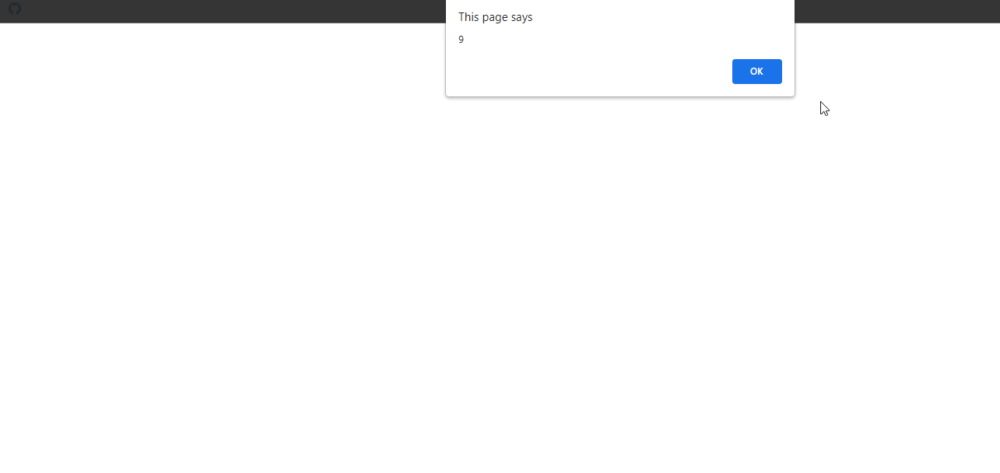

### Example 1

#### HTML

```HTML
<!DOCTYPE html>

<html>

    <head>

        <title>This is the title</title>

       <style>

	   </style>

    </head>

    <body>

	   <h1 id="h1"></h1>

	 <form>

	 <input type="text" id="fnum">
	 <input type="text" id="snum"><br>
	 <input type="button" id="submit" value="submit">

	 </form>

          <script src="js.js"></script>

    </body>

</html>
```

#### JavaScript

```JavaScript
var dataAboutme={

	name:"Guna",
	age:19
}

function sayAboutme(lang1,lang2,lang3){

	document.write("My name is "+this.name+" and my age is "+this.age+" I know "+lang1+" "+lang2+" and "+lang3);
}

var programmingLanguages=["JavaScript","PhP","C++"];

sayAboutme.call(dataAboutme,programmingLanguages[0],programmingLanguages[1],programmingLanguages[2]);

/*

*Call method is used to call a specific function with
 an object values and with arguments values.

*In call method we have to pass arguments (paramers) values one by one.
*/
````

### Output


## 1. Apply

### Example 0

#### HTML

```HTML
<!DOCTYPE html>

<html>

    <head>

        <title>This is the title</title>

       <style>

	   </style>

    </head>

    <body>

	   <h1 id="h1"></h1>

	 <form>

	 <input type="text" id="fnum">
	 <input type="text" id="snum"><br>
	 <input type="button" id="submit" value="submit">

	 </form>

          <script src="js.js"></script>

    </body>

</html>
```

#### JavaScript

```JavaScript
var obj1={

	num1:5,
	num2:7

}

obj2 = {

    num1: 10,
    num2:20
}

function addTothis(a,b,c,d,e,f){

	return this.num1+a+b+c+d+e+f-this.num2;

}

var argValues=[2,3,6,5,4,2];
var argValues2 = [5, 5, 5, 5, 5];

var ans1=addTothis.apply(obj1,argValues);

alert(ans1);

/*

*apply calls a specific function with an object values
 and with an array values.
 .
 *In call method we have to pass arguments (paramers) values one by one.
  But in apply method we can pass arguments values in an array formet.
  This is the differences between call() and apply().

 */
````

### Output

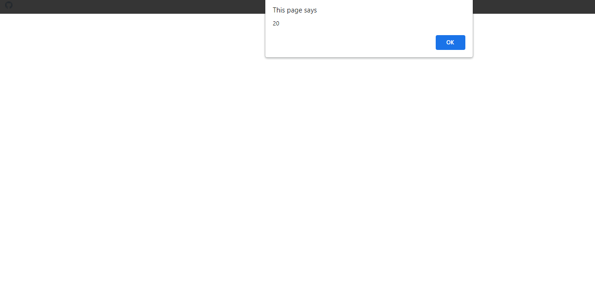

### Example 1

#### HTML

```HTML
<!DOCTYPE html>

<html>

    <head>

        <title>This is the title</title>

       <style>

	   </style>

    </head>

    <body>

	   <h1 id="h1"></h1>

	 <form>

	 <input type="text" id="fnum">
	 <input type="text" id="snum"><br>
	 <input type="button" id="submit" value="submit">

	 </form>

          <script src="js.js"></script>

    </body>

</html>
```

#### JavaScript

```JavaScript
var dataAboutme={

	name:"Guna",
	age:19
}

function sayAboutme(lang1,lang2,lang3){

	document.write("My name is "+this.name+" and my age is "+this.age+" I know "+lang1+" "+lang2+" and "+lang3);

}

var programmingLanguages=["JavaScript","PhP","Java"];

sayAboutme.apply(dataAboutme,programmingLanguages);

/*

*apply calls a specific function with an object values
 and with an array values.
 .

 *In call method we have to pass arguments (paramers) values one by one.
  But in apply method we can pass arguments values in array formet.
  This is the differences between call() and apply().

*/
````

### Output


## 3. Bind

### Example 0

#### HTML

```HTML
<!DOCTYPE html>

<html>

    <head>

        <title>This is the title</title>

       <style>

	   </style>

    </head>

    <body>

	   <h1 id="h1"></h1>

	 <form>

	 <input type="text" id="fnum">
	 <input type="text" id="snum"><br>
	 <input type="button" id="submit" value="submit">

	 </form>

          <script src="js.js"></script>

    </body>

</html>
```

#### JavaScript

```JavaScript
var obj1={

	num1:2,
	num2:4

}

var obj2={

	num1:4,
	num2:5

}

function addTothis(a,b,c,d){

	return (this.num1+a+b+c+d)/this.num2;

}

var bound=addTothis.bind(obj2);

var ans1=bound(1,3,2,4);
var ans2=bound(5,5,5,5);
var ans3=bound(10,5,5,6);

alert(ans1);
alert(ans2);
alert(ans3);

/*Notes

*Bind calls a function with an object values.
*Bind is like call().But it returns a function back for later use.
*The bind() method returns a brand new  function for later use.
 We can use the brand new function many times with differnt values.

*/
````

### Output


### Example 1

#### HTML

```HTML
<!DOCTYPE html>

<html>

    <head>

        <title>This is the title</title>

       <style>

	   </style>

    </head>

    <body>

	   <h1 id="h1"></h1>

	 <form>

	 <input type="text" id="fnum">
	 <input type="text" id="snum"><br>
	 <input type="button" id="submit" value="submit">

	 </form>

          <script src="js.js"></script>

    </body>

</html>
```

#### JavaScript

```JavaScript
var dataAboutme={

	name:"Guna",
	age:19

}

function sayAboutme(lang1,lang2,lang3){

   document.write("My name is "+this.name+" and my age is "+this.age+" I know "+lang1+" "+lang2+" "+lang3+"<br>");

}

var programmingLanguages=["JavaScript","PhP","C#","C++","Java","Python"];

var bound=sayAboutme.bind(dataAboutme);

bound(programmingLanguages[0],programmingLanguages[1],programmingLanguages[2]);
bound(programmingLanguages[3],programmingLanguages[4],programmingLanguages[5]);

/*Notes

*Bind calls a function with an object values.
*Bind is like call().But it returns a function back for later use.
*The bind() method returns a brand new  function for later use.
 We can use the brand new function many times with differnt values.

*/
````

### Output

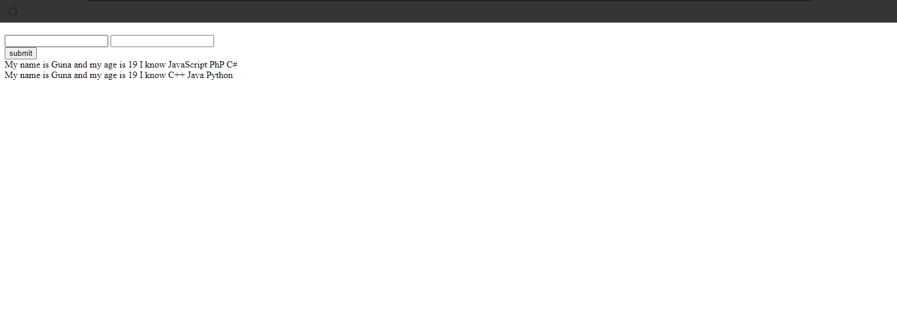

## 4. Callback Basic

### Example 0

#### HTML

```HTML
<!DOCTYPE html>

<html>

    <head>

        <title>This is the title</title>

       <style>

	   </style>

    </head>

    <body>

	   <h1 id="h1"></h1>

	 <form>

	 <input type="text" id="fnum">
	 <input type="text" id="snum"><br>
	 <input type="button" id="submit" value="submit">

	 </form>

          <script src="js.js"></script>

    </body>

</html>
```

#### JavaScript

```JavaScript
function myFun(x,subFun){

	alert("I love "+x);
	subFun();

}

function fun1(){

	alert("Hello my name is kuna");

}

myFun("Programming",fun1);

/*Notes

*callback means we send an entire function as an argument value.

*/
````

### Output

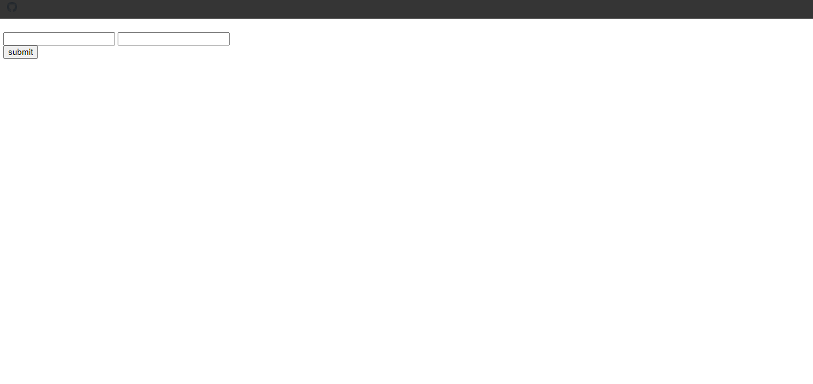

## 5. Find

### Example 0

#### HTML

```HTML
<!DOCTYPE html>

<html>

    <head>

        <title>This is the title</title>

       <style>

	   </style>

    </head>

    <body>

	   <h1 id="h1"></h1>

	 <form>

	 <input type="text" id="fnum">
	 <input type="text" id="snum"><br>
	 <input type="button" id="submit" value="submit">

	 </form>

          <script src="js.js"></script>

    </body>

</html>
```

#### JavaScript

```JavaScript
var colors = ["black", "orange", "blue", "red", "white"];

function sub(currentValue,index,array){


	return String(currentValue).length>=5;

}

var a=colors.find(sub);

alert(a);

/*Notes

*We can use the this method to find a specific value in an array.
*This method finds a single value it does not continue.

*/
````

### Output

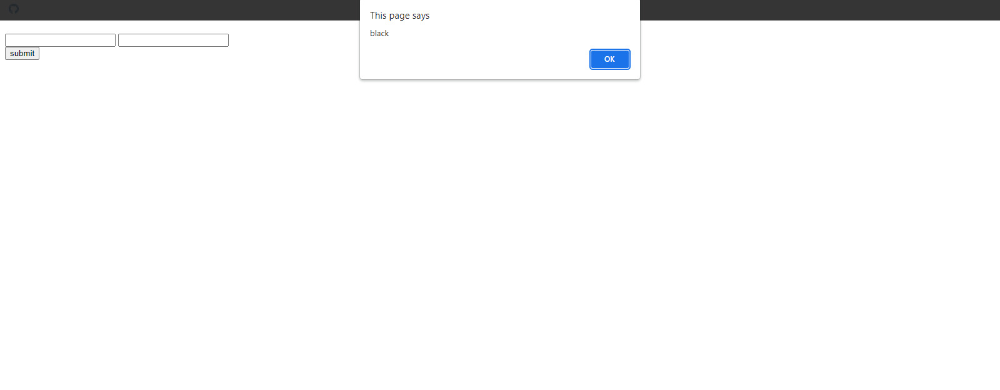

## 6. Filtter

### Example 0

#### HTML

```HTML
<!DOCTYPE html>

<html>

    <head>

        <title>This is the title</title>

       <style>

	   </style>

    </head>

    <body>

	   <h1 id="h1"></h1>

	 <form>

	 <input type="text" id="fnum">
	 <input type="text" id="snum"><br>
	 <input type="button" id="submit" value="submit">

	 </form>

          <script src="js.js"></script>

    </body>

</html>
```

#### JavaScript

```JavaScript
var colors = ["black", "orange", "blue", "red", "white"];

function fillterSubfun(currentValue,index,array){

	return String(currentValue).length>=5;

}

var a=colors.filter(fillterSubfun);
alert(a);

/*Notes

*This method filters a collation of values bashed on a type.
*It finds all the values that is match with the programming style.
*It continues finding value but find method finds a single value.

*/
````

### Output

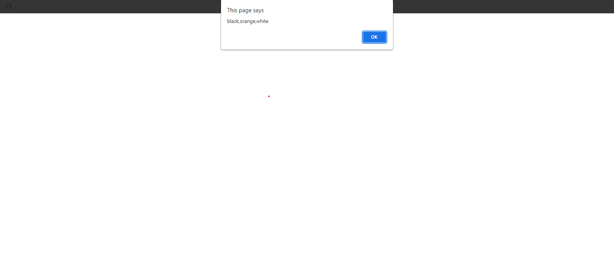

## 7. For Each

### Example 0

#### HTML

```HTML
<!DOCTYPE html>

<html>

    <head>

        <title>This is the title</title>

       <style>

	   </style>

    </head>

    <body>

	   <h1 id="h1"></h1>

	 <form>

	 <input type="text" id="fnum">
	 <input type="text" id="snum"><br>
	 <input type="button" id="submit" value="submit">

	 </form>

          <script src="js.js"></script>

    </body>

</html>
```

#### JavaScript

```JavaScript
var arr = ["kuna", "rakulan", "joker", "hacker"];

arr.forEach(function(currentValue,index,array){

	document.write("["+index+"]"+" "+currentValue+"<br>");

})

/*Notes

*The forEach() method calls a provided function once for each element in an array, in order.

*/
````

### Output


### Example 1

#### HTML

```HTML
<!DOCTYPE html>

<html>

    <head>

        <title>This is the title</title>

       <style>

	   </style>

    </head>

    <body>

	   <h1 id="h1"></h1>

	 <form>

	 <input type="text" id="fnum">
	 <input type="text" id="snum"><br>
	 <input type="button" id="submit" value="submit">

	 </form>

          <script src="js.js"></script>

    </body>

</html>
```

#### JavaScript

```JavaScript
var arrs=[];

arrs[0]=function(){

	alert("I am the first function");

}

arrs[1]=function(){

	alert("I am the second function");

}

arrs[2]=function(){

	alert("I am the third function");

}

arrs[3]=function(){

	alert("I am the fourth function");

}

arrs[4]=function(){

	alert("I am the fifth function");

}

arrs.forEach(function(currentValue,index,array){

	return currentValue();
})
````

### Output


## 8. Map

### Example 0

#### HTML

```HTML
<!DOCTYPE html>

<html>

    <head>

        <title>This is the title</title>

       <style>

	   </style>

    </head>

    <body>

	   <h1 id="h1"></h1>

          <script src="js.js"></script>

    </body>

</html>
```

#### JavaScript

```JavaScript
var arr = ["Kuna", "Rakulan", "Gta", "Joker", "Hacker","Maker"];

arr.map(function(currentValue,index,array){

	document.write("I love "+currentValue+"<br>");

})

/*Notes

*The map() method creates a new array with the results of calling a function for every array element.

*The map() method calls the provided function once for each element in an array, in order.

*/
````

### Output

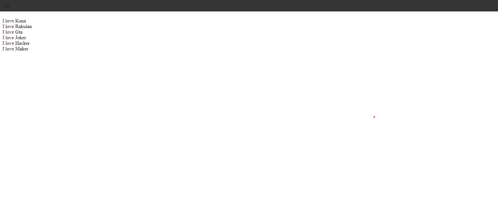

## 9. Player

### Example 0

#### HTML

```HTML
<!DOCTYPE html>

<html>

    <head>

        <title>This is the title</title>

       <style>

	   </style>

    </head>

    <body>

	   <div id="printCon"></div>

          <script src="js.js"></script>

    </body>

</html>
```

#### JavaScript

```JavaScript
var Players=function(name,hitpoints,strenth){

	this.name=name;
	this.hitpoints=hitpoints;
	this.strenth=strenth;

}

var arrplayers=[];

Players.prototype.printPlayer=function(){

	var html="The Player name is <br>"+this.name+" The Hitpoints is <br>"+this.hitpoints+" The strenth is <br>"+this.strenth+"<hr>";

	return html;

}

var player1=new Players("Kuna",1000,20);
arrplayers.push(player1);

var player2=new Players("Joker",5000,300);
arrplayers.push(player2);

var player3=new Players("Hacker",10000,1000);
arrplayers.push(player3);


window.onload=function(){

	var printer=document.getElementById("printCon");

	for(q in arrplayers){

		var myDiv=document.createElement("div");
		myDiv.innerHTML=arrplayers[q].printPlayer();
		printer.appendChild(myDiv);

	}
}
````

### Output

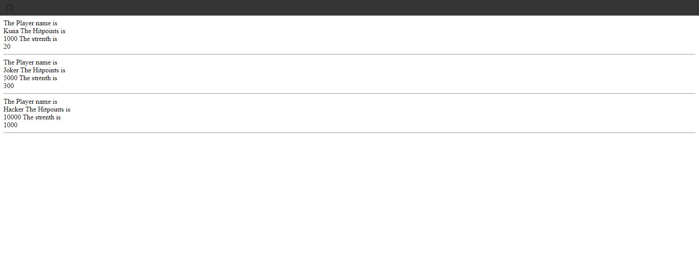

## 10. Regular Exp

### Example 0

#### HTML

```HTML
<!DOCTYPE html>

<html>

    <head>

        <title>This is the title</title>

       <style>

	   </style>

    </head>

    <body>

    <h1 id="dis">
	<input type="text" id="txt1">
	<input type="button" value="Click" id="b1">

          <script src="js.js"></script>

    </body>

</html>
```

#### JavaScript

```JavaScript
window.onload=function(){

	document.getElementById("b1").onclick=getNums;

}

function getNums(){

	var inpStr=document.getElementById("txt1").value;
	var result=inpStr.match(/\d+/g);

	if(result!=null){

		for(y=0;y<result.length;y++){

			document.getElementById("dis").innerHTML=result[y]+"\r"+"\n";

		}

	}

}
/*Notes

*This program gets only numbers and stored in the display.

*/
````

### Output

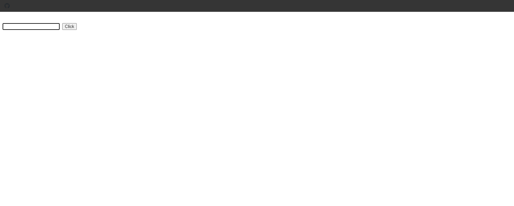

### Example 1

#### HTML

```HTML
<!DOCTYPE html>

<html>

    <head>

        <title>Excrise</title>

        <link rel="stylesheet" type="text/css" href="style.css">

    </head>

<body>

    <input type="text" id="txt" />
    <button id="btn">Click</button>
    <h1 id="dis"></h1>

    <script src="js.js"></script>

</body>

</html>
```

#### JavaScript

```JavaScript
var students = ["Kuna", "kunagta@yahoo.com", "Joker", "Joker@gmail.com", "hacker", "hacker@yahoo.com"];

var reg = /@/;
var names = [];
var emails = [];

for (a = 0; a < students.length; a++) {

    if (students[a].match(reg)) {

        emails.push(students[a]);

    } else {

        names.push(students[a]);
    }

}

alert(emails);
alert(names);
````

### Output

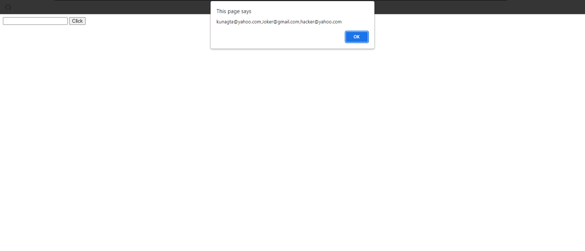

### Example 2

#### HTML

```HTML
<!DOCTYPE html>

<html>

    <head>

        <title>Excrise</title>

        <link rel="stylesheet" type="text/css" href="style.css">

    </head>

<body>

    <input type="text" id="txt" />
    <button id="btn">Click</button>
    <h1 id="dis"></h1>

    <script src="js.js"></script>

</body>

</html>
```

#### JavaScript

```JavaScript
var students = ["Kuna", "kunagta@yahoo.com", "Joker", "Joker@gmail.com", "hacker", "hacker@yahoo.com"];

var names = [];
var emails = [];

for (a = 0; a < students.length; a++) {

    var result = students[a].search(/@/);

    if (result == -1) {

        names.push(students[a]);

    } else {

        emails.push(students[a]);
    }

    }

alert(emails);
alert(names);
````

### Output

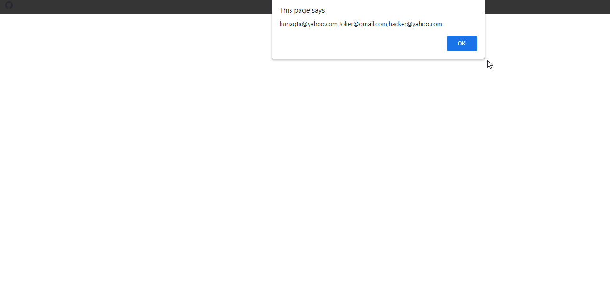

### Example 3

#### HTML

```HTML
<!DOCTYPE html>

<html>

    <head>

        <title>This is the title</title>

       <style>

	   </style>

    </head>

    <body>

          <script src="js.js"></script>

    </body>

</html>
```

#### JavaScript

```JavaScript
var students = ["Kuna", "kunagta@yahoo.com", "Joker", "Joker@gmail.com", "hacker", "hacker@yahoo.com"];

var stuNames=[];

var errors=[];

for(i=0;i<students.length;i++){

	var regExp=students[i].search(/@/g);

	try{

		if(regExp==-1){

			stuNames.push(students[i]);

		}else{

			throw students[i]+" Is not a name";
		}

	}catch(err){

		var a=errors.push(err);

	}

}

alert("Names are "+stuNames);
document.write(errors+"<br>");
```

### Output

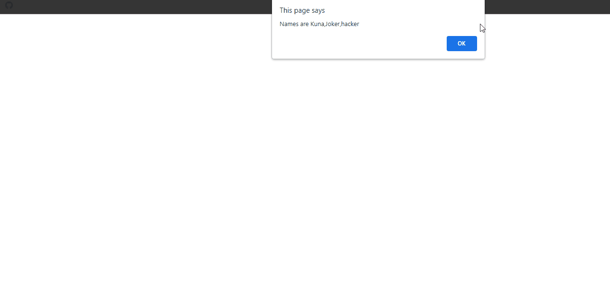

## 11. Other Notes

### Example 0

#### HTML

```HTML
<!DOCTYPE html>

<html>

    <head>

        <title>This is the title</title>

       <style>

	   </style>

    </head>

    <body>

          <script src="js.js"></script>

    </body>

</html>
```

#### JavaScript

```JavaScript

var price = 150;
var sale = 25;
var savings = (price * sale) / 100;
var salePrice = price-savings;

document.write("The Original price " + price + "<br>");
document.write("The sale is " + sale +"%"+ "<br>");
document.write("The sale price is " + salePrice + "<br>");
document.write("The savings " + savings);
```

### Output

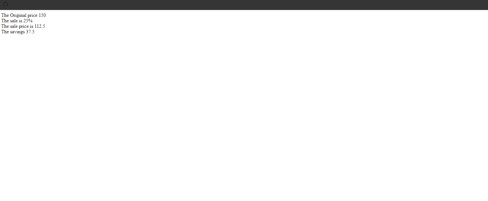

### Example 1

#### HTML

```HTML
<!DOCTYPE html>

<html>

    <head>

        <title>This is the title</title>

       <style>
	   #mainBox {

            height:40px;
            width:400px;
            background-color:#eee;

             }
        #subBox{

            position:relative;width:3px;height:40px;background:black;

        }

	   </style>


    </head>

    <body>

	   <div id="mainBox">

        <div id="subBox"></div>

    </div>

          <script src="js.js"></script>

    </body>

</html>
```

#### JavaScript

```JavaScript
var theBox = document.getElementById("mainBox");
var subBox = document.getElementById("subBox");
var percent = 50;
var newLeft = Math.round(theBox.offsetWidth * percent / 100);

subBox.style.left = newLeft + "px";
```

### Output


