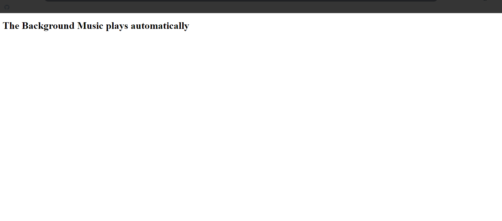
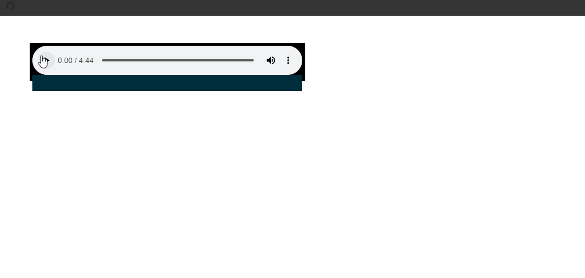
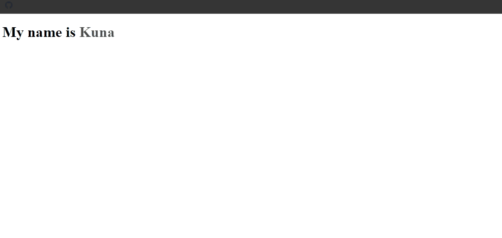
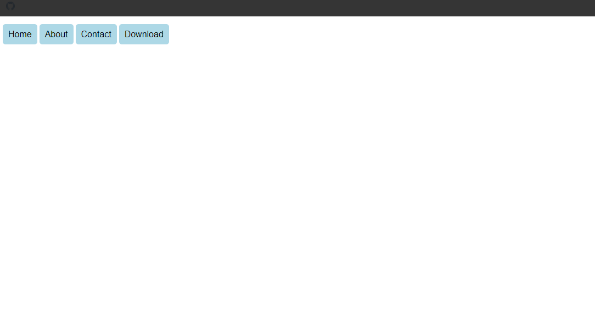
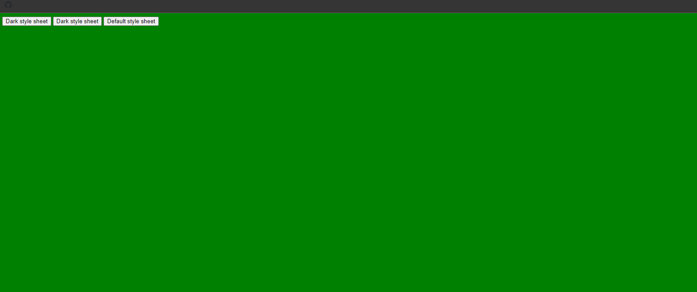
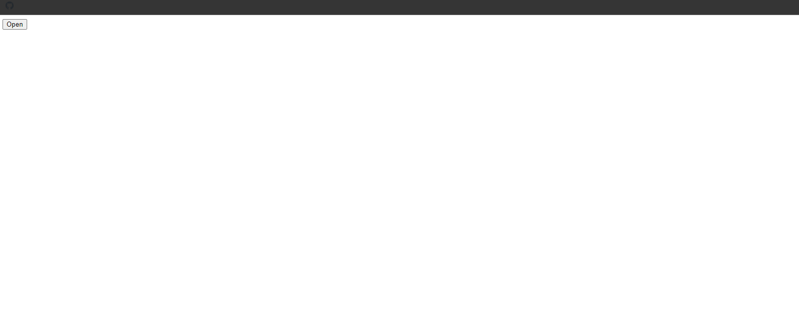
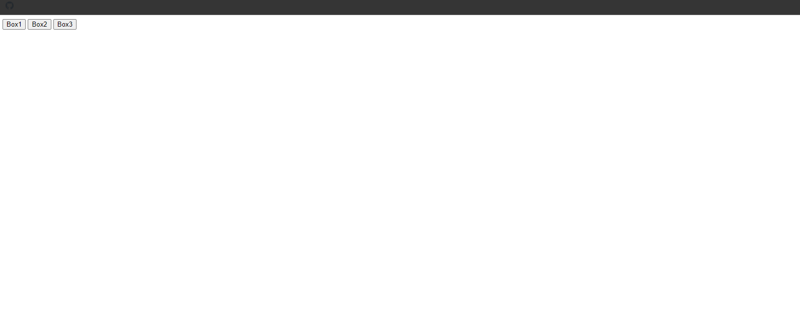
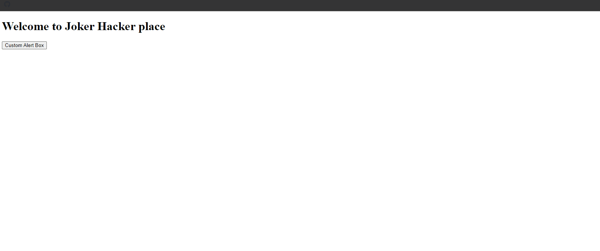
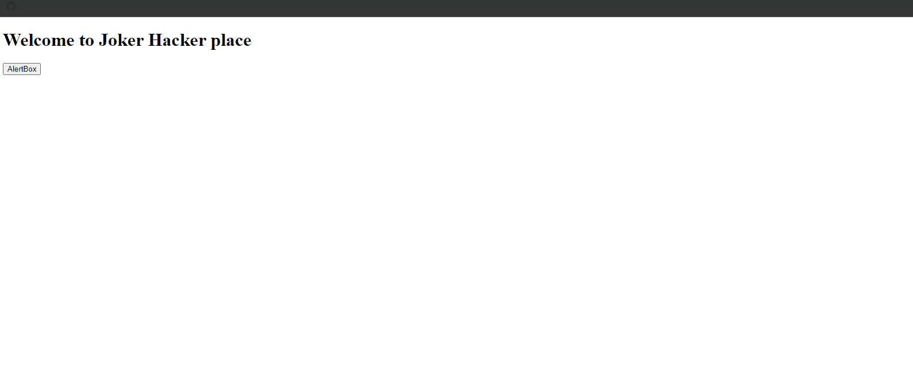

## 1. Custom Media Player Snippets

### Example 0

#### HTML

```HTML
<!DOCTYPE html>

<html>

    <head>

        <title>This is the title</title>

        <link rel="stylesheet" type="text/css" href="style.css">

    </head>

    <body>

        <div id="videoPlayer">

            <div id="videoBox1">

                <video id="video1">

                    <source src="video1.mp4">

                </video>

            </div>

            <div id="videoControler">

              <button onclick="playPausebtn(this,'video1')">Play</button>

            </div>

        </div>       

          <script src="js.js"></script>

    </body>

</html>
```

#### CSS

```CSS
#videoPlayer{

    width: 500px;
    background-color: black;

}
#videoControler{

    background-color:black;
    padding: 10px;
    border: 1px solid white;

}
```

#### JavaScript

```JavaScript
function playPausebtn(btn,vid){

    var vid1=document.getElementById(vid);

    if(vid1.paused){

        vid1.play();
        btn.innerHTML="Pause";

    }else{

        vid1.pause();
        btn.innerHTML="Play";
    }
}
```

### Output


### Example 1

#### HTML

```HTML
<!DOCTYPE html>

<html>

    <head>

        <title>This is the title</title>

        <link rel="stylesheet" type="text/css" href="style.css">

    </head>

    <body>

        <div id="videoPlayer">

            <div id="videos">

                <video id="video1">

                    <source src="video1.mp4">

                </video>

            </div>

            <div id="videoControls">

                <input type="button" id="playBtn" value="Play">

            </div>

        </div>

          <script src="js.js"></script>

    </body>

</html>
```

#### CSS

```CSS
#videoPlayer{

    background-color: black;
    width: 500px;
    border: 10px solid gray;

}

#videoControls{

    color: white;
    padding: 10px;
    background-color: gray;
}
```

#### JavaScript

```JavaScript
var video1,playBtn;

window.onload=function(){

    //Sets Objects References
    video1=document.getElementById("video1");
    playBtn=document.getElementById("playBtn");

    //Add Events
    playBtn.addEventListener("click",playSystem);
}

function playSystem(){

    if(video1.paused){

        video1.play();
        playBtn.value="Pause";

    }else{

        video1.pause();
        playBtn.value="Play";

    }
}
```

### Output


### Example 2

#### HTML

```HTML
<!DOCTYPE html>

<html>

    <head>

        <title>This is the title</title>

        <link rel="stylesheet" type="text/css" href="style.css">

    </head>

    <body>

        <div id="videoPlayer">

            <div id="videos">

                <video id="video1">

                    <source src="video1.mp4">

                </video>

            </div>

            <div id="videoControls">

                <input type="button" id="playBtn" value="Play">
                <input type="range" id="seekBar" min="0" max="100" value="0" step="1">

            </div>

        </div>

         <script src="js.js"></script>

    </body>

</html>
```

#### CSS

```CSS
#videoPlayer{

    background-color: black;
    width: 500px;
    border: 10px solid gray;

}

#videoControls{

    color: white;
    padding: 10px;
    background-color: gray;
}
#seekBar{
    width: 500px;
}
```

#### JavaScript

```JavaScript
var video1,playPausebtn,seekBar;

window.onload=function(){

    //Sets Objects References

    video1=document.getElementById("video1");
    playPausebtn=document.getElementById("playBtn");
    seekBar=document.getElementById("seekBar");

    //Add Events
    playPausebtn.addEventListener("click",playSystem);
    seekBar.addEventListener("change",seekingSys);
    video1.addEventListener("timeupdate",video1TimeSystem);
}

function playSystem(){

    if(video1.paused){

        video1.play();
        playPausebtn.value="Pause";

    }else{

        video1.pause();
        playPausebtn.value="Play";

    }
}

function seekingSys(){

    var seek=video1.duration*(seekBar.value/100);
    video1.currentTime=seek;

}

function video1TimeSystem(){

var theTime=video1.currentTime*(100/video1.duration);
    seekBar.value=theTime;
}
```

### Output


### Example 3

#### HTML

```HTML
<!DOCTYPE html>

<html>

    <head>

        <title>This is the title</title>

        <link rel="stylesheet" type="text/css" href="style.css">

    </head>

    <body>

        <div id="videoPlayer">

            <div id="videos">

                <video id="video1">

                    <source src="video1.mp4">

                </video>

            </div>

            <div id="videoControls">

                <input type="button" id="playBtn" value="Play">
                <input type="range" id="seekBar" min="0" max="100" value="0" step="1">
                <span id="time"></span> / <span id="duration"></span>

            </div>

        </div>

          <script src="js.js"></script>

    </body>

</html>
```

#### CSS

```CSS
#videoPlayer{

    background-color: black;
    width: 500px;
    border: 10px solid gray;

}

#videoControls{

    color: white;
    padding: 10px;
    background-color: gray;

}
#seekBar{

    width: 150px;
}
```

#### JavaScript

```JavaScript

var video1,playPausebtn,seekBar,time,duration;

window.onload=function(){

    //Sets Objects References

    video1=document.getElementById("video1");
    playPausebtn=document.getElementById("playBtn");
    seekBar=document.getElementById("seekBar");
    time=document.getElementById("time");
    duration=document.getElementById("duration");

    //Add Events
    playPausebtn.addEventListener("click",playSystem);
    seekBar.addEventListener("change",seekingSys);
    video1.addEventListener("timeupdate",video1TimeSystem);
}

function playSystem(){

    if(video1.paused){

        video1.play();
        playPausebtn.value="Pause";

    }else{

        video1.pause();
        playPausebtn.value="Play";

    }

}
function seekingSys(){

    var seek=video1.duration*(seekBar.value/100);
    video1.currentTime=seek;

}

function video1TimeSystem(){

var theTime=video1.currentTime*(100/video1.duration);
    seekBar.value=theTime;

    var currentMins=Math.floor(video1.currentTime/60);
    var currentSecs=Math.floor(video1.currentTime-currentMins*60);
    var durMins=Math.floor(video1.duration/60);
    var durSecs=Math.floor(video1.duration-durMins*60);

    if(currentMins<10){

        currentMins="0"+currentMins;

    }

    if(currentSecs<10){

        currentSecs="0"+currentSecs;

    }

    if(durMins<10){

        durMins="0"+durMins;

    }

    if(durSecs<10){

        durSecs="0"+durSecs;

    }

    time.innerHTML=currentMins+":"+currentSecs;
    duration.innerHTML=durMins+":"+durSecs;

}
```

### Output


### Example 4

#### HTML

```HTML
<!DOCTYPE html>

<html>

    <head>

        <title>This is the title</title>

        <link rel="stylesheet" type="text/css" href="style.css">

    </head>

    <body>

        <div id="videoPlayer">

            <div id="videos">

                <video id="video1">

                    <source src="video1.mp4">

                </video>

            </div>

            <div id="videoControls">

                <input type="button" id="playBtn" value="Play">
                <input type="range" id="seekBar" min="0" max="100" value="0" step="1">
                <span id="time"></span> / <span id="duration"></span>
                <input type="button" id="mute" value="Mute">
                <input type="range" id="volumeseek" min="0" max="100" value="100" step="1">

            </div>

        </div>

          <script src="js.js"></script>

    </body>

</html>
```

#### CSS

```CSS
#videoPlayer{

    background-color: black;
    width: 500px;
    border: 10px solid gray;

}

#videoControls{

    color: white;
    padding: 10px;
    background-color: gray;

}

#seekBar{

    width: 150px;
}

#volumeseek{

    width: 80px;  
}
```

#### JavaScript

```JavaScript

var video1,playPausebtn,seekBar,time,duration,mute,volumeSeeker;

window.onload=function(){

    //Sets Objects References

    video1=document.getElementById("video1");
    playPausebtn=document.getElementById("playBtn");
    seekBar=document.getElementById("seekBar");
    time=document.getElementById("time");
    duration=document.getElementById("duration");
    muteBtn=document.getElementById("mute");
    volumeSeeker=document.getElementById("volumeseek");

    //Add Events
    playPausebtn.addEventListener("click",playSystem);
    seekBar.addEventListener("change",seekingSys);
    video1.addEventListener("timeupdate",video1TimeSystem);
    muteBtn.addEventListener("click",muteSystem)
    volumeSeeker.addEventListener("change",volumeSeekFun);
}

function playSystem(){

    if(video1.paused){

        video1.play();
        playPausebtn.value="Pause";

    }else{

        video1.pause();
        playPausebtn.value="Play";

    }

}

function seekingSys(){

    var seek=video1.duration*(seekBar.value/100);
    video1.currentTime=seek;

}

function video1TimeSystem(){

    var theTime=video1.currentTime*(100/video1.duration);
    seekBar.value=theTime;

    var currentMins=Math.floor(video1.currentTime/60);
    var currentSecs=Math.floor(video1.currentTime-currentMins*60);
    var durMins=Math.floor(video1.duration/60);
    var durSecs=Math.floor(video1.duration-durMins*60);

    if(currentMins<10){

        currentMins="0"+currentMins;

    }

    if(currentSecs<10){

        currentSecs="0"+currentSecs;

    }

    if(durMins<10){

        durMins="0"+durMins;

    }

    if(durSecs<10){

        durSecs="0"+durSecs;

    }

    time.innerHTML=currentMins+":"+currentSecs;
    duration.innerHTML=durMins+":"+durSecs;

}

function muteSystem(){


    if(!video1.muted){

        video1.muted=true;
        muteBtn.value="Unmute";
        volumeSeeker.value=0;

    }else{

         video1.muted=false;
         muteBtn.value="Mute";
         volumeSeeker.value=100;
    }

}

function volumeSeekFun(){

    if(video1.muted){

          video1.muted=false;
          muteBtn.value="Mute";

    }

  video1.volume=volumeSeeker.value/100;

}
```

### Output


### Example 5

#### HTML

```HTML
<!DOCTYPE html>

<html>

    <head>

        <title>This is the title</title>

        <link rel="stylesheet" type="text/css" href="style.css">

    </head>

    <body>

 <div id="videoPlayer">

 <div id="videos">

     <video id="video1">

         <source src="video1.mp4">

     </video>

     </div>   

     <div id="controlsSystem">

         <input type="button" id="playBtn" value="Play">
         <input type="range" id="seeker" value="0" min="0" max="100" step="1">
         <span id="time"></span> / <span id="duration"></span>
         <input type="button" id="mute" value="Mute">
         <input type="range" id="volumeSeeker" value="100" min="0" max="100" step="1">
         <input type="button" id="full" value="[==]">

     </div>

    </div>

          <script src="js.js"></script>

    </body>

</html>
```

#### JavaScript

```JavaScript
var video1,playBtn,seekBar,time,duration,muteBtn,volumeSeeker,fullScreen;

window.onload=function(){

    //Sets Objects References.
    video1=document.getElementById("video1");
    playBtn=document.getElementById("playBtn");
    seekBar=document.getElementById("seeker");
    time=document.getElementById("time");
    duration=document.getElementById("duration");
    muteBtn=document.getElementById("mute");
    volumeSeeker=document.getElementById("volumeSeeker");
    fullScreen=document.getElementById("full");

    //Add Events

    playBtn.addEventListener("click",playSystemFun);
    seekBar.addEventListener("change",seekerFun);
    video1.addEventListener("timeupdate",video1Timer);
    muteBtn.addEventListener("click",muteSystemFun);
    volumeSeeker.addEventListener("change",volumeSeekerFun);
    fullScreen.addEventListener("click",fullScreenSystemFun);
}


function playSystemFun() {

    if(!video1.paused){

        video1.pause();
        playBtn.value="Play";

    }else{

        video1.play();
        playBtn.value="Pause";

    }


}


function seekerFun(){

    var seeksValue=video1.duration*(seekBar.value/100);
    video1.currentTime=seeksValue;
}

function video1Timer(){

    var theTime=video1.currentTime*(100/video1.duration);
    seekBar.value=theTime;

    var currentMins=Math.floor(video1.currentTime/60);
    var currentSecs=Math.floor(video1.currentTime-currentMins*60);
    var durMins=Math.floor(video1.duration/60);
    var durSecs=Math.floor(video1.duration-durMins*60);

    if(currentMins<10){

        currentMins="0"+currentMins;

    }

    if(currentSecs<10){

        currentSecs="0"+currentSecs;

    }

    if(durMins<10){

        durMins="0"+durMins;
    }

    if(durSecs<10){

        durSecs="0"+durSecs;


    }

    time.innerHTML=currentMins+":"+currentSecs;
    duration.innerHTML=durMins+":"+durSecs;

}

function muteSystemFun(){

    if(video1.muted){

        video1.muted=false;
        muteBtn.value="Mute";
        volumeSeeker.value=100;


    }else{

        video1.muted=true;
        muteBtn.value="Unmute";
        volumeSeeker.value=0;
    }

}

function volumeSeekerFun(){

    video1.volume=volumeSeeker.value/100;

    if(video1.muted){

        video1.muted=false;
        muteBtn.value="Mute";

    }

	if(volumeSeeker.value==0){

		 muteBtn.value="Unmute";

	}else if(volumeSeeker.value>0){

		muteBtn.value="Mute";

	}

}

function fullScreenSystemFun(){

    if(video1.requestFullScreen){

        video1.requestFullScreen();

    }else if(video1.webkitRequestFullScreen){

        video1.webkitRequestFullScreen();

    }else if(video1.mozRequestFullScreen){

        video1.mozRequestFullScreen();
    }

}

/*Notes

*We can add grapihcal images for play,pause and mute buttons;

*/
```

### Output


## 2. Website Background Music Snippets

### Example 0

#### HTML

```HTML
<!DOCTYPE html>

<html>

    <head>

        <title>This is the title</title>

        <link rel="stylesheet" type="text/css" href="style.css">

    </head>

    <body>

 <h1>The Background Music plays automatically</h1>

          <script src="js.js"></script>

    </body>

</html>
```

#### CSS

```CSS
div#mp3_player{

    width: 500px;
    height:60px;
    background:#000;
    padding: 5px;
    margin: 50px;

}

div#mp3_player > div > audio{

    width: 500px;
    background: #000;
    float: left;
}

div#mp3_player > canvas{

    width:500px;
    height: 30px;
    background: #002d3c;
    float: left;
}
```

#### JavaScript

```JavaScript
//Create a new instance of an audio object and adjust some its properties.

var theAudio=new Audio();
theAudio.src="audio1.mp3";
theAudio.controls=true;
theAudio.loop=true;
theAudio.autoplay=true;
```

### Output



## 3. Custom Audio Analyser Snippets

### Example 0

#### HTML

```HTML
<!DOCTYPE html>

<html>

    <head>

        <title>This is the title</title>

        <link rel="stylesheet" type="text/css" href="style.css">

    </head>

    <body>

        <div id="mp3_player">

        <div id="audio_box"></div>

            <canvas id="analyser_render"></canvas>

        </div>

          <script src="js.js"></script>

    </body>

</html>
```

#### CSS

```CSS
div#mp3_player{

    width: 500px;
    height:60px;
    background:#000;
    padding: 5px;
    margin: 50px;

}

div#mp3_player > div > audio{

    width: 500px;
    background: #000;
    float: left;
}

div#mp3_player > canvas{

    width:500px;
    height: 30px;
    background: #002d3c;
    float: left;
}
```

#### JavaScript

```JavaScript
//Create a new instance of an audio object and adjust some its properties.
var audio=new Audio();
audio.src= 'audio1.mp3';
audio.controls=true;
audio.loop=true;
audio.autoplay=false;

//Establish all variables that your analyser will use.

var canvas,ctx,source,context,analyser,fbc_array,bars,bar_x,bar_width,bar_height;
//Initialize the MP3 player after the page loads all of its HTML into the window.

window.addEventListener("load",initMp3Player,false);

function initMp3Player(){

    document.getElementById("audio_box").appendChild(audio);
    context=new AudioContext();//Audio Context object instance.
    analyser=context.createAnalyser();//AnalyserNode method.
    canvas=document.getElementById("analyser_render");
    ctx=canvas.getContext('2d');
    //Re-route audio playback into the processing graph of the AudioContext.
    source=context.createMediaElementSource(audio);
    source.connect(analyser);
    analyser.connect(context.destination);
    frameLooper();

}

//frameLooper() animates any style of graphics you wish to the audio frequency.
//Looping at the default frame rate that the browswer provideos(approx. 60 FPS).
function frameLooper(){

    window.requestAnimationFrame(frameLooper);
    fbc_array=new Uint8Array(analyser.frequencyBinCount);
    analyser.getByteFrequencyData(fbc_array);
    ctx.clearRect(0,0,canvas.width,canvas.height)//clear the canvas.
    ctx.fillStyle='#00CCFF';//Color the bars.
    bars=100;

    for(var i=0;i<bars;i++){

        bar_x = i * 3;
        bar_width = 2;
        bar_height= - (fbc_array[i]/2);

        //fillRect(x,y,width,height) // Explanation of the parameters.
        ctx.fillRect(bar_x,canvas.height,bar_width,bar_height);

    }    
}

/*Notes
*It is only work in firefox
*/
```

### Output



## 4. Array Slides Show Animation Snippets

### Example 0

#### HTML

```HTML
<!DOCTYPE html>

<html>

    <head>

        <title>This is the title</title>

        <link rel="stylesheet" type="text/css" href="style.css">

    </head>

    <body>

        <h1>My name is <span id="myNames">xmdmsakl</span></h1>

          <script src="js.js"></script>

    </body>

</html>
```

#### CSS

```CSS
#myNames {

    opacity:0;
    -webkit-transition:opacity 1s linear 0s;
    transition:opacity 1s linear 0s;
}
```

#### JavaScript

```JavaScript
var index = 0;
var myNamesArr = ["Kuna", "Rakulan", "Gta", "Joker", "Hacker"];
var myNameDisplay;

window.onload = function () {

    myNameDisplay = document.getElementById("myNames");
    mainSlider();
}

function mainSlider() {

    myNameDisplay.innerHTML = myNamesArr[index];
    myNameDisplay.style.opacity = 1;

    setTimeout("nextSlider()", 2000);
}
function nextSlider() {

    index++;
    myNameDisplay.style.opacity = 0;

    if (index > (myNamesArr.length - 1)) {

        index = 0;

    }

    setTimeout("mainSlider()", 1000);

}

/*Notes
  explanation of the program.
  *Once the entire web application finishes.This program get the 'myName' element and store to the myNameDisplay variable.
  *Then it calls the mainSlider() function.
  *inside the mainSlider() function it displays the Array value depending on the index value.Then it sets the opacity to 1.
  *After two seconds it runs the nextSlider() function.
  *The nextSlider() function increments the index value each time depending on the loop.
  *Then its sets the  myNameDisplay opacity to 0.
  *If the index value is gretar than the  myNamesArr length,it sets the index value to 0.
  *This way the loop runs agian after it finishes all array elements;
  *Then the nextSlider() function runs mainSlider() function after one second.
*/
```

### Output



### Example 1

#### HTML

```HTML
<!DOCTYPE html>

<html>

    <head>

        <title>This is the title</title>

        <link rel="stylesheet" type="text/css" href="style.css">

    </head>

    <body>

       <div id="Img_box">

       </div>

          <script src="js.js"></script>

    </body>

</html>
```

#### CSS

```CSS
#Img_box {
    opacity: 0;
    -moz-transition: opacity 1s linear 0s;
    -o-transition: opacity 1s linear 0s;
    -webkit-transition: opacity 1s linear 0s;
    transition: opacity 1s linear 0s;
    width: 500px;
    height: 500px;
    border: 2px solid green;
}
```

#### JavaScript

```JavaScript
var index = 0;

var imgs = new Array();
imgs[0] = ""
imgs[1] = ""
imgs[2] = ""
imgs[3] = ""
imgs[4] = ""


window.onload = function () {

    display = document.getElementById("Img_box");
    sliderFun1();
}


function sliderFun2() {

    index++;
    display.style.opacity = 0;

    if (index > (imgs.length - 1)) {

        index = 0;
    }

    setTimeout("sliderFun1()", 1000);

}

function sliderFun1() {

    display.innerHTML = imgs[index];
    display.style.opacity = 1;

    setTimeout("sliderFun2()", 2000);

}

/*Notes
*We can use any kinds of HTML elements as an array value like above.
*/
```

### Output


## 5. Button Sound Effects Snippets

### Example 0

#### HTML

```HTML
<!DOCTYPE html>

<html>

    <head>

        <title>This is the title</title>

        <link rel="stylesheet" type="text/css" href="style.css">

    </head>

    <body>

        <nav>

            <a href="#" onmousedown="sound1.play()">Home</a>
            <a href="#" onmousedown="sound1.play()">About</a>
            <a href="#" onmousedown="sound1.play()">Contact</a>
            <a href="#" onmousedown="sound1.play()">Download</a>
        </nav>

          <script src="js.js"></script>

    </body>

</html>
```

#### CSS

```CSS
nav{

    margin-top: 24px;

}

nav > a{

    text-decoration: none;
    padding: 10px;
    background-color: lightblue;
    border-radius: 5px;
    font-family: sans-serif;
    color: black;

}

nav > a:hover{

    background-color: aquamarine;
}

nav > a:active{

    background-color: aliceblue;
    color: red;
}
```

#### JavaScript

```JavaScript
var sound1=new Audio();
sound1.src="au1.mp3";
```

### Output



### Example 1

#### HTML

```HTML
<!DOCTYPE html>

<html>

    <head>

        <title>This is the title</title>

        <link rel="stylesheet" type="text/css" href="style.css">

    </head>

    <body>

        <nav>

            <a href="#">Home</a>
            <a href="#">About</a>
            <a href="#">Contact</a>
            <a href="#">Download</a>
        </nav>

          <script src="js.js"></script>

    </body>

</html>
```

#### CSS

```CSS
nav{

    margin-top: 24px;

}

nav > a{

    text-decoration: none;
    padding: 10px;
    background-color: lightblue;
    border-radius: 5px;
    font-family: sans-serif;
    color: black;

}

nav > a:hover{

    background-color: aquamarine;
}

nav > a:active{

    background-color: aliceblue;
    color: red;
}
```

#### JavaScript

```JavaScript
var sound1=new Audio();
sound1.src="au1.mp3";

var btns=document.getElementsByTagName("a");

    for(a=0;a<btns.length;a++){

        btns[a].onmousedown=function(){

            sound1.play();

        }

    }
```

### Output


### Example 2

#### HTML

```HTML
<!DOCTYPE html>

<html>

    <head>

        <title>This is the title</title>

        <link rel="stylesheet" type="text/css" href="style.css">

    </head>

    <body>

        <nav>

            <a href="#" onclick="loadContent(1)">Home</a>
            <a href="#" onclick="loadContent(2)">About</a>
            <a href="#" onclick="loadContent(3)">Contact</a>
            <a href="#" onclick="loadContent(4)">Download</a>
        </nav>

		<h1 id="dis"></h1>

          <script src="js.js"></script>

    </body>

</html>
```

#### CSS

```CSS
nav{

    margin-top: 24px;

}

nav > a{

    text-decoration: none;
    padding: 10px;
    background-color: lightblue;
    border-radius: 5px;
    font-family: sans-serif;
    color: black;

}

nav > a:hover{

    background-color: aquamarine;
}

nav > a:active{

    background-color: aliceblue;
    color: red;

}
```

#### JavaScript

```JavaScript
var sound1=new Audio();
sound1.src="au1.mp3";


function loadContent(num){

    sound1.play();

    document.getElementById("dis").innerHTML="The content "+num;

}
```

### Output


## 6.Change Style Sheet Snippets

### Example 0

#### HTML

```HTML
<!DOCTYPE html>

<html>

    <head>

        <title>This is the title</title>

        <link id="pageStyle" rel="stylesheet" type="text/css" href="style.css">

    </head>

    <body>

        <nav>

            <input type="button" onclick="swapStyleSheet('dark.css')" value="Dark style sheet">
             <input type="button" onclick="swapStyleSheet('blue.css')" value="Dark style sheet">
             <input type="button" onclick="swapStyleSheet('style.css')" value="Default style sheet">

        </nav>

		<h1 id="dis"></h1>

          <script src="js.js"></script>

    </body>

</html>
```

#### CSS

```CSS
body{

	background-color:green;

}
```
```CSS
body{

	background-color:blue;

}
```
```CSS
body{

	background-color:black;

}
```

#### JavaScript

```JavaScript
function swapStyleSheet(sheet) {

    document.getElementById("pageStyle").href = sheet;
}
```

### Output



## 7. Click Outside Close Menu Box Snippets

### Example 0

#### HTML

```HTML
<!DOCTYPE html>

<html>

    <head>

        <title>This is the title</title>

        <link rel="stylesheet" type="text/css" href="style.css">

    </head>

    <body>

      <div id="box">

          <h1>This is JokerHacker</h1>
          <p>KUna</p>
      </div>

        <button id="open">Open</button>

          <script src="js.js"></script>

    </body>

</html>
```

#### CSS

```CSS
#box {

    width:500px;
    height:500px;
    border:2px solid black;
    position:absolute;
    top:0;
    left:0;
    display:none;
    background-color:lightblue;
}
```

#### JavaScript

```JavaScript
window.onload = function () {

    document.getElementById("open").onclick = boxFun;

}
var box = document.getElementById("box");

function boxFun() {

    box.style.display="block"

}

window.addEventListener("mouseup", function (event) {

    if (event.target != box && event.target.parentNode!=box) {

        box.style.display = 'none';
    }
})

/*Notes

*We must use mouseup for window.addEventListener becasue the event will apply to the window object.
* if we add onclick it wont work.
*/
```

### Output



### Example 1

#### HTML

```HTML
<!DOCTYPE html>

<html>

    <head>

        <title>This is the title</title>

        <link rel="stylesheet" type="text/css" href="style.css">

    </head>

    <body>

        <div id="box1" class="boxes">

            <h1>JokerHacker 1</h1>

        </div>

        <div id="box2" class="boxes">

            <h1>JokerHacker 2</h1>

        </div>

        <div id="box3" class="boxes">

            <h1>JokerHacker 3</h1>

        </div>

        <button id="btn1">Box1</button>
        <button id="btn2">Box2</button>
        <button id="btn3">Box3</button>
          <script src="js.js"></script>

    </body>

</html>
```

#### CSS

```CSS
.boxes {


    width:250px;
    height:250px;
    background-color:lightblue;
    border:2px solid black;
    position:absolute;
    display:none;

}

#box1 {

   top:100px;
   left:0px;

}

#box2 {

   top:100px;
   left:250px;

}

#box3 {

   top:100px;
   left:500px;

}
```

#### JavaScript

```JavaScript
window.onload = function () {

    document.getElementById("btn1").onclick = box1Fun;
    document.getElementById("btn2").onclick = box2Fun;
    document.getElementById("btn3").onclick = box3Fun;

}

var boxes = document.getElementsByClassName("boxes");

function box1Fun() {

    boxes[0].style.display = 'block';

}

function box2Fun() {

    boxes[1].style.display = "block";
}

function box3Fun() {

    boxes[2].style.display = 'block';

}

var boxesArr=['box1','box2','box3']

window.addEventListener("mouseup", function (event) {

    for (g = 0; g < boxesArr.length; g++) {

        var box = document.getElementById(boxesArr[g]);

        if (event.target != box &&event.target.parentNode!=box) {

            box.style.display = "none";
        }

    }

})

/*Notes

*We must use mouseup for window.addEventListener becasue the event will apply to the window object.
* if we add onclick it wont work.
*/
```

### Output



## 8. Custom Alert Box Snippets

### Example 0

#### HTML

```HTML
<!DOCTYPE html>

<html>

    <head>

        <title>This is the title</title>

        <link rel="stylesheet" type="text/css" href="style.css">

    </head>

    <body>

        <h1>Welcome to Joker Hacker place</h1>

        <div id="dialogoverlay"></div>

            <div id="dialogbox">

                <div>

                    <div id="dialogboxhead"></div>
                    <div id="dialogboxbody"></div>
                    <div id="dialogboxfoot"></div>

                </div>

            </div>

        <button onclick="Alert.render('kuna')">Custom Alert Box</button>

        <script src="js.js" type="text/javascript"></script>

    </body>

</html>
```

#### CSS

```CSS
#dialogoverlay {
display:none;
opacity:0.8;
position:fixed;
top:0;
left:0;
background:#FFF;
width:100%;
z-index:10;

}

#dialogbox {

    display:none;
    position:fixed;
    background:#000;
    border-radius:7px;
    width:550px;
    z-index:10;
  }

    #dialogbox > div {

        background:#FFF;
        margin:8px;

    }

        #dialogbox > div >#dialogboxhead {

            background:#666;
            font-size:19px;
            padding:10px;
            color:#ccc;

        }
        #dialogbox > div #dialogboxbody {

            background:#333;
            padding:20px;
            color:#fff;

        }

        #dialogbox > div #dialogboxfoot {

            background:#666;
            padding:10px;
            text-align:right;

        }
```

#### JavaScript

```JavaScript

function customAlert() {

    this.render = function (dialog) {

        var winW = window.innerWidth;
        var winH = window.innerHeight;
        var dialogboxoverlay = document.getElementById("dialogoverlay");//Obj reference of dialogoverlay.
        var dialogbox = document.getElementById("dialogbox");//Obj reference of dialogbox.
        dialogboxoverlay.style.display = "block";
        dialogboxoverlay.style.height = winH + 'px';
        dialogbox.style.left = (winW / 2) - (550 * 0.5) + "px" //This will center the box. 550 is the width of the dialog box.550 * 0.5 means 550 is devided by 2.
        dialogbox.style.top = '100px';
        dialogbox.style.display = "block";
        document.getElementById("dialogboxhead").innerHTML="Acknowladge This Message"
        document.getElementById("dialogboxbody").innerHTML = dialog;
        document.getElementById("dialogboxfoot").innerHTML = '<button onclick="Alert.ok()">OK</button>'

        if (dialog == undefined) {

            document.getElementById("dialogboxbody").innerHTML = "";
        }
    }

    this.ok = function () {

        document.getElementById("dialogbox").style.display = "none";
        document.getElementById("dialogoverlay").style.display = "none";

    }
}

var Alert = new customAlert();
```

### Output



### Example 1

#### HTML

```HTML
<!DOCTYPE html>

<html>

    <head>

        <title>This is the title</title>


        <link rel="stylesheet" type="text/css" href="style.css">

    </head>

<body>

    <h1>Welcome to Joker Hacker place</h1>

    <div id="alertBoxBg"></div>

    <div id="alertBox">

        <div id="alertHead"></div>
        <div id="alertBody"></div>
        <div id="alertFoot"></div>

    </div>

    <input type="button" value="AlertBox" id="alertBox1"  />

    <script src="js.js" type="text/javascript"></script>

</body>

</html>
```

#### CSS

```CSS
#alertBoxBg {

    width:100%;

    position:fixed;
    top:0;
    left:0;
    background-color:white;
    opacity:0.7;
    height:100%;
    display:none;

}
#alertBox {

    width:700px;
    padding:20px;
    position:fixed;
    top:200px;

    left:300px;
    background-color:black;
    display:none;
}

    #alertBox #alertHead {

        padding:10px;
        background-color:#666;
        text-align:center;
        font-size:20px;
        color:white;

    }

    #alertBox #alertBody {

        padding:25px;
        background-color:#333;
        font-size:20px;
        color:white;

    }

    #alertBox #alertFoot {

        font-size:20px;
        text-align:right;
        padding:10px;
         background-color:#666;

    }
```

#### JavaScript

```JavaScript
window.onload = function () {

    document.getElementById("alertBox1").onclick=function(){alertBox.render("JokerHacker")}
}

    function customDialogBox() {

        this.render = function (msg) {

            //Sets Objects References

            var alertBoxBg = document.getElementById("alertBoxBg");
            var alertBox = document.getElementById("alertBox");
            alertBoxBg.style.display = "block";
            alertBox.style.display = "block";
            document.getElementById("alertHead").innerHTML = "Acknowladge This Massage";
            document.getElementById("alertBody").innerHTML = msg;
            document.getElementById("alertFoot").innerHTML = "<button onclick='alertBox.ok()'>OK</button>"

        }

        this.ok = function () {

            document.getElementById("alertBoxBg").style.display = "none";
            document.getElementById("alertBox").style.display = "none";

        }
    }

    var alertBox = new customDialogBox("");
```

### Output


