# 21. WYSIWYG Rich Text HTML Editor Text Area Replacement for Web Site Snippets

### Example 0

#### HTML

```HTML
<!DOCTYPE html>

<html>

    <head>

        <title>This is the title</title>

        <link rel="stylesheet" type="text/css" href="style.css">

    </head>

<body onload="iFrameOn();">

    <h2>My web application that intakes data from users</h2>

    <form action="myFile.php" name="myform" id="myform" method="post">

        <p>
            Entry Titile<br />

            <div id="wysiwyg_cp" style="padding:8px;width:700px;">

                <input type="button" onclick="iBold()" value="B" />
                <input type="button" onclick="iUnderline()" value="U" />
                <input type="button" onclick="iItalic()" value="I" />
                <input type="button" onclick="iFontSize()" value="Text Size" />
                <input type="button" onclick="iFontColor()" value="Text Color" />
                <input type="button" onclick="iHorizontalRule()" value="HR" />
                <input type="button" onclick="iUnorderedList()" value="UL" />
                <input type="button" onclick="iOrderedList()" value="OL" />
                <input type="button" onclick="iLink()" value="Link" />
                <input type="button" onclick="iUnLink()" value="UnLink" />
                <input type="button" onclick="iImage()" value="Image" />

            </div>

            <input type="text" name="title" id="title" size="80" maxlength="80" />
        </p>
        <p>Entry Titile<br /><textarea style="display:none;" name="myTextArea" id="myTextArea" cols="100" rows="15"></textarea></p>.

        <iframe name="richTextField" id="richTextField" style="border:#000000 1px solid;width:700px;height:300px"></iframe>
        <br />

        <input type="button" value="Submit Data" name="myBtn" onclick="javascript:submit_form();" />

    </form>

    <script src="js.js" type="text/javascript"></script>

</body>

</html>
```

#### JavaScript

```JavaScript
function iFrameOn() {

    document.richTextField.document.designMode = 'on';
}

function iBold() {

    document.richTextField.document.execCommand('bold', false, null);

}
function iUnderline() {

    richTextField.document.execCommand('underline', false, null);
}

function iItalic() {

    document.richTextField.document.execCommand("italic", false, null);
}

function iFontSize() {

    var size = prompt("Enter Text Size 1-7", "");
    richTextField.document.execCommand("FontSize", false, size);

}

function iFontColor() {

    var color = prompt("Enter Text Color", '');
    document.richTextField.document.execCommand("ForeColor", false, color);
}

function iHorizontalRule() {

    richTextField.document.execCommand("inserthorizontalrule", false, null);
}

function iUnorderedList() {

    document.richTextField.document.execCommand("insertunorderedlist",false,"newUL")
}

function iOrderedList() {

  richTextField.document.execCommand("insertorderedlist", false, "newOL")
}

function iLink() {

    var linkURL = prompt("Enter the URL or this link", 'http://');
    document.richTextField.document.execCommand("createlink", false, linkURL);
}

function iUnLink() {

    richTextField.document.execCommand("unlink", false, null);

}

function iImage() {

    var img = prompt("Enter a image location", '');

    if (img != null) {

        document.richTextField.document.execCommand("insertimage", false, img);
    }

}

function submit_form() {

    var theForm = document.getElementById("myform");
    theForm.elements['myTextArea'].value = window.frames['richTextField'].document.body.innerHTML;
    theForm.submit();

}

/*
*execCommand notes are in a image file.
*execCommand doesn't care about case we can use lowercase or uppercase.
*in some places i used  document.richTextField.document.execCommand this is same as  richTextField.document.execCommand.
 becasue document is default .
*/
```

### Output

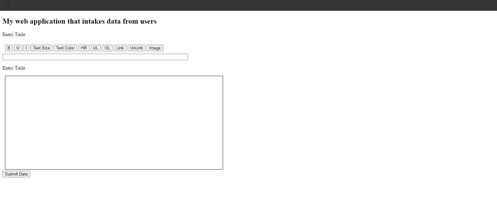

## 22. How to Detect User Browser Snippets

### Example 0

#### HTML

```HTML
<!DOCTYPE html>

<html>

    <head>

        <title>This is the title</title>

        <link rel="stylesheet" type="text/css" href="style.css">

    </head>

<body>

    <script src="js.js" type="text/javascript"></script>

</body>

</html>
```

#### JavaScript

```JavaScript
var ba = ["Chrome", "Firefox", "Safari", "Opera", "MSIE", "Trident","Edge"];

var userA=navigator.userAgent;

var bName;

for (a = 0;a< ba.length; a++) {

    if (userA.indexOf(ba[a]) > -1) {

        bName = ba[a];
        break;
    }

}

if (bName == "MSIE" || bName == "Trident" || bName == "Edge") {

    alert("You are using "+bname+" Browser")
}

alert("You are Using "+bName+" Browser");
```

### Output

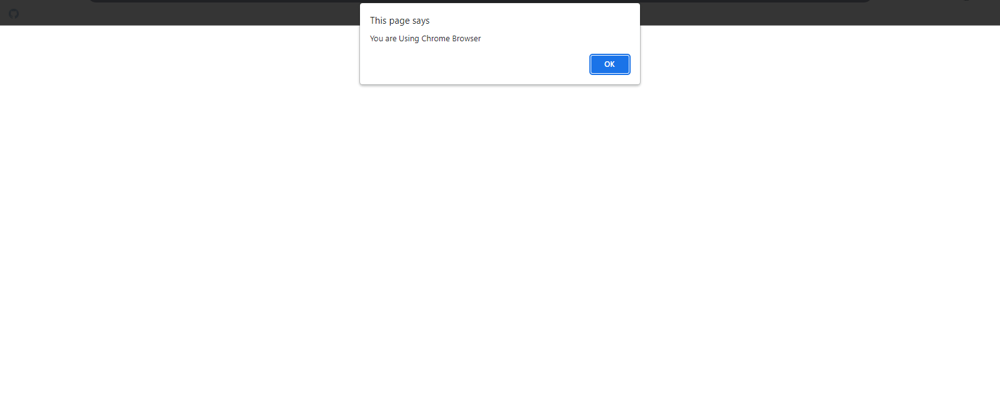

## 23. How to Program Code Syntax Highlighter Snippets

### Example 0

#### HTML

```HTML
<!DOCTYPE html>

<html>

    <head>

        <title>This is the title</title>

        <link rel="stylesheet" type="text/css" href="style.css">

    </head>

<body>

    <h2>Code Example</h2>

    <code>
        &lt;script&gt;

        /* Create a String object variale */

        var name="JokerHacker";

        &lt;/script&gt;

        &lt;h2 id="dis"&gt;Welcome to the website&lt;/h2&gt;

        &lt;p&gt;This JokerHacker &lt;/p&gt;

    </code>

    <script src="js.js" type="text/javascript"></script>

</body>

</html>
```

#### CSS

```CSS
code {

    display:block;
    white-space:pre-wrap;
    border:1px solid #000;
    padding:10px;
    line-height:1.5em;
    font-family:'Lucida Console',monaco,monospace;
}
.bulet {

    color:#f90;
}

.qoutation {


    color:green;
}

.cammand {

    color:gray;

}
```

#### JavaScript

```JavaScript
window.addEventListener("load", syntaxHilighter);

function syntaxHilighter() {

    var ca = document.getElementsByTagName("code");

    for (i = 0; i < ca.length; i++) {

        var data = ca[i].innerHTML;

        data = data.replace(/"(.*?)"/g, '<span class="qoutation">&quot;$1&quot;</span>');
        data = data.replace(/&lt;(.*?)&gt;/g, '<span class="bulet">&lt;$1&gt;</span>');
        data=data.replace(/\/\* (.*?) *\//g,'<span class="cammand">/*$1*/</span>')

	  ca[i].innerHTML = data;

    }

}

/*

*(.*?) This means everything inside.
* $1 This also means everything inside.
*/
```

### Output

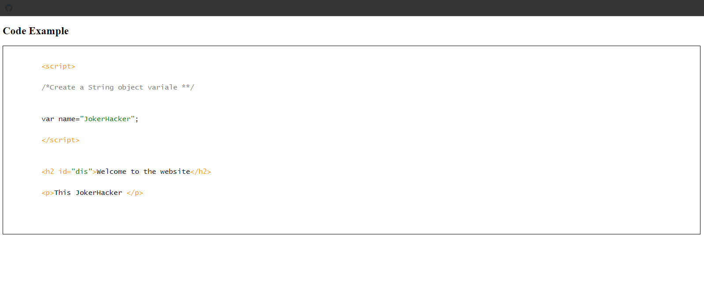

## 24. Image Cycle JavaScript HTML CSS Web Snippets

### Example 0

#### HTML

```HTML
<!DOCTYPE html>

<html>

    <head>

        <title>This is the title</title>

        <link rel="stylesheet" type="text/css" href="style.css">

    </head>

<body>

    <div id="item_container"></div>

    <script src="js.js" type="text/javascript"></script>

</body>

</html>
```

#### CSS

```CSS
.item {

    float:left;
    border:#aaa 1px solid;
    padding:10px;
    margin:10px;

}

.item >img {

 width:180px;
 height:140px;
 border:#666 1px solid;
 cursor:pointer;

}
.item >span {

display:block;
text-align:center;
margin-top:10px;

}
```

#### JavaScript

```JavaScript
window.addEventListener("load", function () {

    var items_container = document.getElementById("item_container");
    var thumbtimer, ti = 0; dir = "images/";

    var obj1 = { name: "Image 1", pics: ['img1.jpg', 'img2.jpg', 'img3.jpg'] };//This is JSON Object.
    var obj2 = { name: "Image 2", pics: ['img4.jpg', 'img5.jpg', 'img6.jpg'] };//This is JSON Object.
    var obj3 = { name: "Image 3", pics: ['img7.jpg', 'img8.jpg', 'img9.jpg'] };//This is JSON Object.

    var arr = [obj1, obj2, obj3];//I stored the JSON Objects in an array.

    for (i = 0; i < arr.length; i++) {//This for loop runs 3 times.

        var div = document.createElement("div");//each time runs it creates a div element.
        var img = document.createElement("img");//each time runs it creates a img element.
        var span = document.createElement("span");//each time runs it creates a span element.

        div.className = "item";//I have given the .item style to the div.

        img.oi = i;//I have created an attribute in the image element and i have set the value bashed on looping iteration value.
        img.src = dir + arr[i].pics[0];//I have set the first image as default. it works like img.src=images/arr['The iteration value 0 or 1 or 2'].pics[0] first image.
        span.innerHTML = arr[i].name;//I have get the name.It works like arr['The iteration value 0 or 1 or 2'].name and store to the span element.
        items_container.appendChild(div);//it appends the div element into the items_container for each time when the loop runs.
        div.appendChild(img);//it appends the img element into the div for each time when the loop runs.
        div.appendChild(span);//it appends the span element into the div for each time when the loop runs.

        img.addEventListener("mouseover", function (event) {//This function runs when the user mouse over the img element.

            thumbtimer = setInterval(function () {

                ti++;//It increments the value every 700 milli seconds one by one
                if (ti == arr[event.target.oi].pics.length) {//It means ti is equal to the arr[img.oi 'it is the iteration value 0 or 1 or 2''].pics.length and set the ti to 0.

                    ti = 0;

                }

                event.target.src = dir + arr[event.target.oi].pics[ti];//it means changes the image every 700 milli seconds.

            }, 700)//I have set the time as 700 milli seconds

        });

        img.addEventListener("mouseout", function () {//This function works when  the user mouse leave form the image element.


                clearInterval(thumbtimer);//it stops the thumbtimer setInterval method.
                ti = 0;//Then change the ti value to 0.
                event.target.src = dir + arr[event.target.oi].pics[ti];//After change the first image.

        })
        }
});
```

### Output

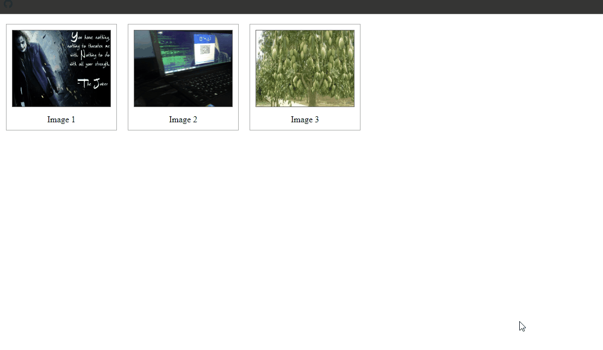

## 25. In Place Editing CMS Development Snippets

### Example 0

#### HTML

```HTML
<!DOCTYPE html>

<html>

    <head>

        <title>This is the title</title>

        <link rel="stylesheet" type="text/css" href="style.css">

    </head>

<body>

    <h2 style="color:red"> click two time on the text for edit the content</h2>

    <div ondblclick="makeEditable(this)" onblur="makesave(this)">

        My name is JokerHacker I'm going to hack your system

    </div>

    <script src="js.js" type="text/javascript"></script>

</body>

</html>
```

#### JavaScript

```JavaScript
function makeEditable(div) {

    div.style.border = "1px solid #000";
    div.style.padding = "20px";
    div.contentEditable = true;
}

function makesave(div) {

    div.style.border = "none";
    div.style.padding = "0";
    div.contentEditable = false;
}
```

### Output

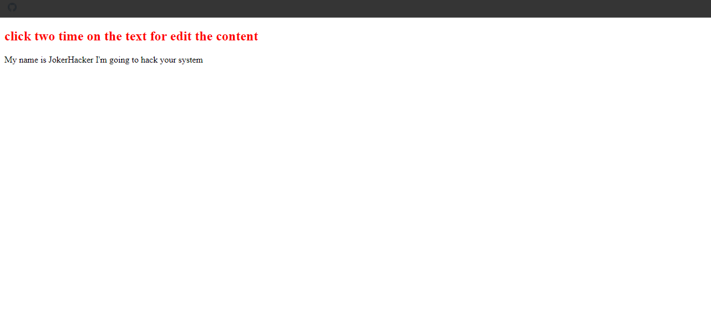

## 26. Animation Tutorial HTML CSS Transform Rotate Snippets

### Example 0

#### HTML

```HTML
<!DOCTYPE html>

<html>

    <head>

        <title>This is the title</title>

        <link rel="stylesheet" type="text/css" href="style.css">

    </head>

<body>

    

    <h3 style="position:relative;top:50px;" id="dis"></h3>

    <script src="js.js" type="text/javascript"></script>

</body>

</html>
```

#### JavaScript

```JavaScript
window.addEventListener("load", rotateAnimation("img1", 20));

var degrees = 0;
var looper;

function rotateAnimation(ele, speed) {

    elem = document.getElementById(ele);

    if (navigator.userAgent.match("Chrome")) {

        elem.style.WebkitTransform = "rotate(" + degrees + "deg)";

    } else if (navigator.userAgent.match("Firefox")) {

        elem.style.MozTransform = "rotate(" + degrees + "deg)";

    } else if (navigator.userAgent.match("MSIE")) {

        ele.style.MsTransform = "rotate(" + degrees + "deg)";

    } else if (navigator.userAgent.match("Opera")) {

        ele.style.MsTransform = "rotate(" + degrees + "deg)";

    } else {

        ele.style.transform = "rotate(" + degrees + "deg)";

    }

    looper = setTimeout('rotateAnimation(\'' + ele + '\',' + speed + ')', speed);

    degrees++;

    if (degrees > 359) {

        degrees = 1;
    }

    document.getElementById("dis").innerHTML = "rotate(" + degrees + "deg)";
}

/*
 *for reverse rotatation
   degrees--;
    if (degrees < -359) {
        degrees = -1;
    }
*/
```

### Output

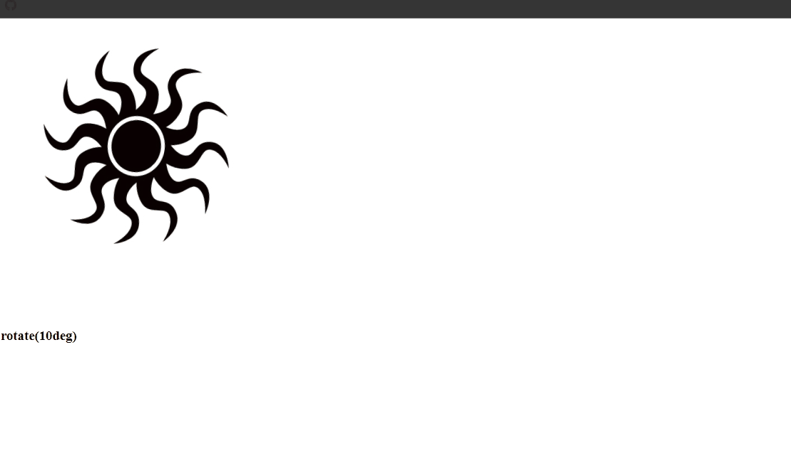

## 27. JavaScript Arguments Object Function Snippets

### Example 0

#### HTML

```HTML
<!DOCTYPE html>

<html>

    <head>

        <title>This is the title</title>

        <link rel="stylesheet" type="text/css" href="style.css">

    </head>

<body>

    <script src="js.js" type="text/javascript"></script>

</body>

</html>
```

#### JavaScript

```JavaScript
function doSomething(name) {

    alert("My name is " + name);
}

doSomething("Kuna");
```

### Output


### Example 1

#### HTML

```HTML
<!DOCTYPE html>

<html>

    <head>

        <title>This is the title</title>

        <link rel="stylesheet" type="text/css" href="style.css">

    </head>

<body>

    <script src="js.js" type="text/javascript"></script>

</body>

</html>
```

#### JavaScript

```JavaScript
function doSomething(name) {

    alert("My name is " + arguments[0]);
}

doSomething("Kuna");
```

### Output


### Example 2

#### HTML

```HTML
<!DOCTYPE html>

<html>

    <head>

        <title>This is the title</title>

        <link rel="stylesheet" type="text/css" href="style.css">

    </head>

<body>

    <script src="js.js" type="text/javascript"></script>

</body>

</html>
```

#### JavaScript

```JavaScript
function doSomething(name) {

    alert("My name is " + doSomething.arguments[0]); //you can use this like this
}

doSomething("Kuna");
```

### Output


### Example 3

#### HTML

```HTML
<!DOCTYPE html>

<html>

    <head>

        <title>This is the title</title>

        <link rel="stylesheet" type="text/css" href="style.css">

    </head>

<body>

    <script src="js.js" type="text/javascript"></script>

</body>

</html>
```

#### JavaScript

```JavaScript
function doSomething(name) {

    alert("My name is " + window.doSomething.arguments[0]); //you can also use this like this
}

doSomething("Kuna");
```

### Output

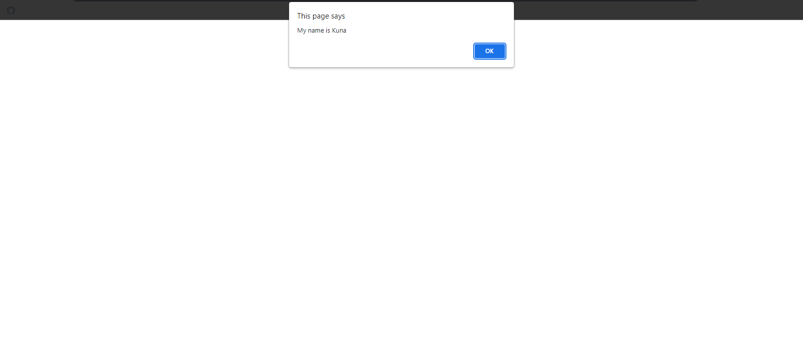

### Example 4

#### HTML

```HTML
<!DOCTYPE html>

<html>

    <head>

        <title>This is the title</title>

        <link rel="stylesheet" type="text/css" href="style.css">

    </head>

<body>

    <script src="js.js" type="text/javascript"></script>

</body>

</html>
```

#### JavaScript

```JavaScript
function doSomething(name) {

    alert("My name is " + window["doSomething"].arguments[0]); //It can also work.
}

doSomething("Kuna");
```

### Output


### Example 5

#### HTML

```HTML
<!DOCTYPE html>

<html>

    <head>


        <link rel="stylesheet" type="text/css" href="style.css">

    </head>

<body>

    <script src="js.js" type="text/javascript"></script>

</body>

</html>
```

#### JavaScript

```JavaScript
function doSomething(str1,str2) {

    alert(str1 + " " + str2);
}

doSomething("Joker","Hacker");
```

### Output

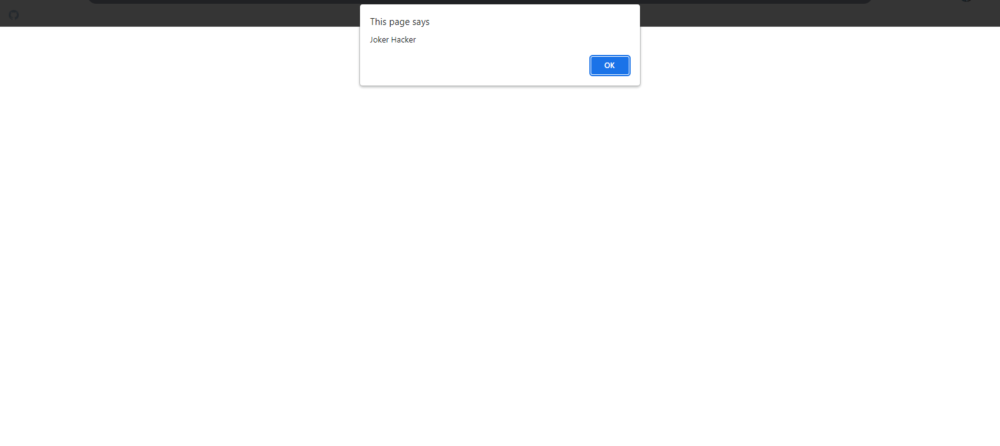

### Example 6

#### HTML

```HTML
<!DOCTYPE html>

<html>

    <head>

        <title>This is the title</title>

        <link rel="stylesheet" type="text/css" href="style.css">

    </head>

<body>

    <script src="js.js" type="text/javascript"></script>

</body>

</html>
```

#### JavaScript

```JavaScript
function doSomething(str1,str2) {

    for (i = 0; i < arguments.length; i++) {

        alert(arguments[i]);

    }
}

doSomething("Joker","Hacker");
```

### Output


### Example 7

#### HTML

```HTML
<!DOCTYPE html>

<html>

    <head>

        <title>This is the title</title>

        <link rel="stylesheet" type="text/css" href="style.css">

    </head>

<body>

    <script src="js.js" type="text/javascript"></script>

</body>

</html>
```

#### JavaScript

```JavaScript
function doSomething() {// We dont have to paramenters it will still work fine.

    arguments[0] = "Kuna";//We can also change arguments value like this.

    for (i = 0; i < arguments.length; i++) {

        alert(arguments[i]);

    }
}
doSomething("Joker","Hacker","Gta","maker",100,true);//We can add a thousand of arguments.
```

### Output


### Example 8

#### HTML

```HTML
<!DOCTYPE html>

<html>

    <head>

        <title>This is the title</title>

        <link rel="stylesheet" type="text/css" href="style.css">

    </head>

<body>

    <script src="js.js" type="text/javascript"></script>

</body>

</html>
```

#### JavaScript

```JavaScript
function doSomething() {// We dont have to paramenters it will still work fine.

   alert(typeof arguments);
   alert(arguments.constructor);

}

doSomething("Joker","Hacker","Gta","maker",100,true);//We can add a thousand of arguments.
//It's an object object.It's not an array.

```

### Output

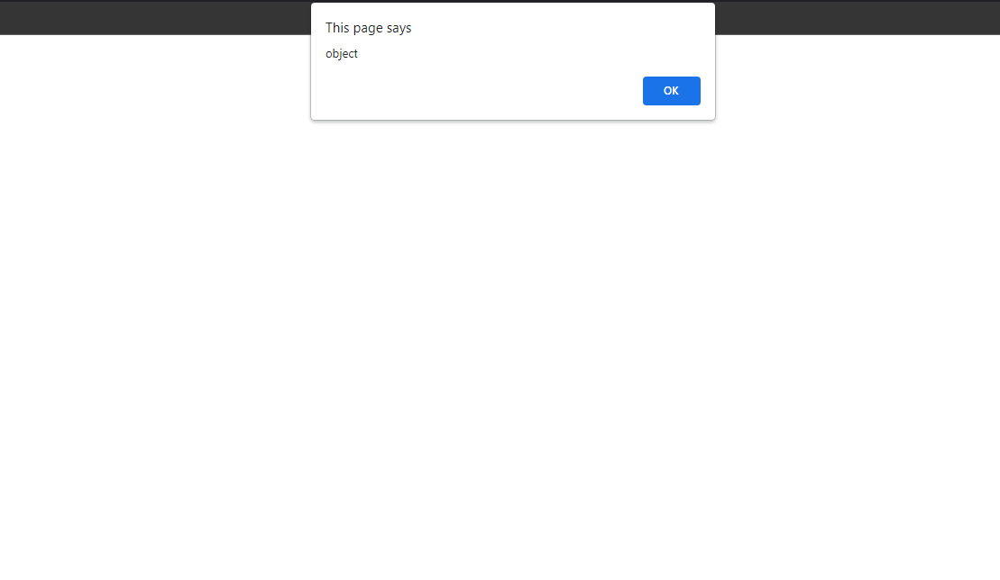

### Example 9

#### HTML

```HTML
<!DOCTYPE html>

<html>

    <head>

        <title>This is the title</title>

        <link rel="stylesheet" type="text/css" href="style.css">

    </head>

<body>

    <script src="js.js" type="text/javascript"></script>

</body>

</html>
```

#### JavaScript

```JavaScript
function doSomething() {

    var result = 0;

    for (i = 0; i < arguments.length; i++) {

        result += arguments[i];

    }

    return result;
}

alert(doSomething(10, 2, 35, 3));
```

### Output


## 28. JavaScript Capture Keyboard Input Snippets

### Example 0

#### HTML

```HTML
<!DOCTYPE html>

<html>

    <head>

        <title>This is the title</title>

        <link rel="stylesheet" type="text/css" href="style.css">

    </head>

<body>

    <h1>JavaScript Capture keyboard input Example</h1>

    <h2>The Key Pressed <span style="color:red;" id="kp"></span></h2>
    <h2>The Key Code <span style="color:red;" id="kc"></span></h2>

    <h2 id="status">Keyboard Event key status</h2>

    <script src="js.js" type="text/javascript"></script>

</body>

</html>
```

#### JavaScript

```JavaScript
document.onkeydown = function (event) {

    var key_press = String.fromCharCode(event.keyCode);
    var key_code = event.keyCode;

    document.getElementById("kp").innerHTML = key_press;
    document.getElementById("kc").innerHTML = key_code;

    var status = document.getElementById("status");

    status.innerHTML = "Down event fired for " + key_press.fontcolor("red");

}
document.onkeyup=function(event){

    var key_press = String.fromCharCode(event.keyCode);

    document.getElementById("status").innerHTML = "Up event fired for " + key_press.fontcolor("green");
}
```

### Output

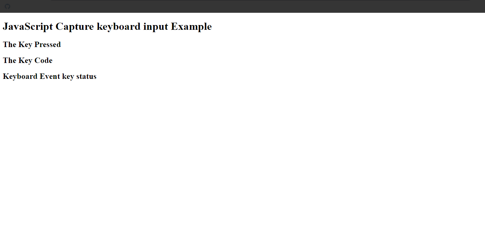

## 29. JavaScript Change CSS Class Style Class Name Toggle Snippets

### Example 0

#### HTML

```HTML
<!DOCTYPE html>

<html>

    <head>

        <title>This is the title</title>

        <link rel="stylesheet" type="text/css" href="style.css">

    </head>

<body>

    <div class="class1" onclick="toggleClass(this)"></div>
    <div class="class1" onclick="toggleClass(this)"></div>
    <div class="class1" onclick="toggleClass(this)"></div>
    <div class="class1" onclick="toggleClass(this)"></div>
    <div class="class1" onclick="toggleClass(this)"></div>

    <script src="js.js" type="text/javascript"></script>

</body>

</html>
```

#### CSS

```CSS
.class1 {

    float:left;
    margin:10px;
    background:#09c;
    width:100px;
    height:100px;
    cursor:pointer;

}
.class2 {

    float:left;
    margin:10px;
    background:#0c0;
    width:100px;
    height:100px;
    cursor:pointer;
}
```

#### JavaScript

```JavaScript
toggleClass = function (ele) {

    if (ele.className == "class1") {

        ele.className = "class2";

    }else{

        ele.className = "class1";
    }
}
```

### Output

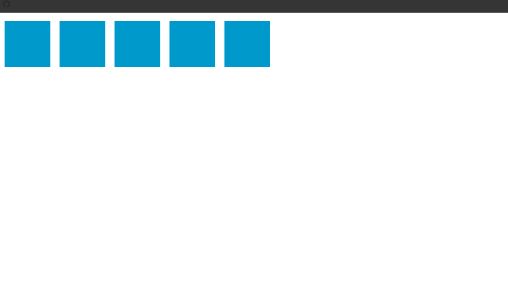

### Example 1

#### HTML

```HTML
<!DOCTYPE html>

<html>

    <head>

        <title>This is the title</title>

        <link rel="stylesheet" type="text/css" href="style.css">

    </head>

<body>

    <div id="menu1">

        <div class="class1" onclick="toggleClass(this)"></div>
        <div class="class1" onclick="toggleClass(this)"></div>
        <div class="class1" onclick="toggleClass(this)"></div>
        <div class="class1" onclick="toggleClass(this)"></div>
        <div class="class1" onclick="toggleClass(this)"></div>

    </div>

    <script src="js.js" type="text/javascript"></script>

</body>

</html>
```

#### CSS

```CSS
.class1 {

    float:left;
    margin:10px;
    background:#09c;
    width:100px;
    height:100px;
    cursor:pointer;

}

.class2 {

    float:left;
    margin:10px;
    background:#0c0;
    width:100px;
    height:100px;
    cursor:pointer;
}
```

#### JavaScript

```JavaScript
toggleClass = function (ele) {

    var kids = document.getElementById("menu1").children;

    for (i = 0; i < kids.length; i++) {

        kids[i].className = "class1";
    }

    ele.className = "class2";
}
```

### Output


## 30. JavaScript Change Tab Text and Title on the Fly Snippets

### Example 0

#### HTML

```HTML
<!DOCTYPE html>

<html>

    <head>

        <title>&#9654This is the title</title>

        <link rel="stylesheet" type="text/css" href="style.css">

    </head>

<body>

    <button onclick="tabText('&#9654; This is the title')">Play</button>
    <button onclick="tabText('This is the title')">Pause</button>

    <script src="js.js" type="text/javascript"></script>

</body>

</html>
```

#### CSS

```CSS
.class1 {

    float:left;
    margin:10px;
    background:#09c;
    width:100px;
    height:100px;
    cursor:pointer;

}

.class2 {

    float:left;
    margin:10px;
    background:#0c0;
    width:100px;
    height:100px;
    cursor:pointer;

}
```

#### JavaScript

```JavaScript
function tabText(text) {

    document.title = text;

}
```

### Output

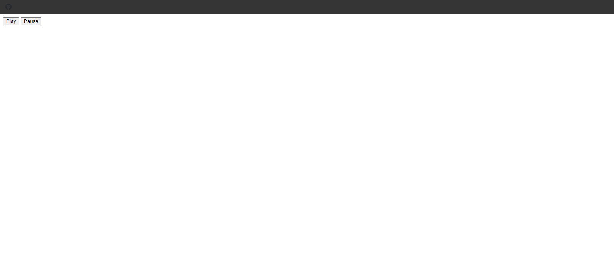

## 31. Checkbox Toggle Tutorial Select Deselec All Check Boxes Snippets

### Example 0

#### HTML

```HTML
<!DOCTYPE html>

<html>

    <head>

        <title>This is the title</title>

        <link rel="stylesheet" type="text/css" href="style.css">

    </head>

<body>

    <input type="checkbox" id="masterCheckBox" onclick="toggleAllCheckBoxes(this, 'checkBoxes')" />Toggle All
    <br />
    <br />
    <input type="checkbox" id="checkBox1" class="checkBoxes" />Car<br />
    <input type="checkbox" id="checkBox2" class="checkBoxes" />Bike<br />
    <input type="checkbox" id="checkBox3" class="checkBoxes" />Computer<br />
    <input type="checkbox" id="checkBox4" class="checkBoxes" />iPhone<br />
    <script src="js.js" type="text/javascript"></script>

</body>

</html>
```

#### CSS

```CSS
.class1 {

    float:left;
    margin:10px;
    background:#09c;
    width:100px;
    height:100px;
    cursor:pointer;

}

.class2 {

    float:left;
    margin:10px;
    background:#0c0;
    width:100px;
    height:100px;
    cursor:pointer;

}
```

#### JavaScript

```JavaScript
function toggleAllCheckBoxes(master,cn) {

    var cArray = document.getElementsByClassName(cn);

    for (i = 0; i < cArray.length; i++) {

        var cb = document.getElementById(cArray[i].id);
        cb.checked = master.checked;

    }

}
```

### Output

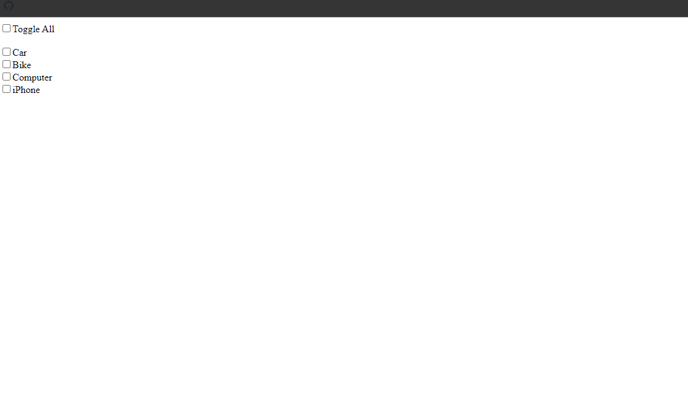

## 32. JavaScript Class OOP Tutorial Intro to Object Oriented Snippets

### Example 0

#### HTML

```HTML
<!DOCTYPE html>

<html>

    <head>

        <title>This is the title</title>

        <link rel="stylesheet" type="text/css" href="style.css">

    </head>

<body>

    <script src="js.js"></script>

</body>

</html>
```

#### JavaScript

```JavaScript
function exampleClass() {

    this.property1 = 5;
    this.property2 = "World";

    this.method1 = function (arg1) {

        return arg1 + " " + this.property2;
    }

}

var instance1 = new exampleClass();
var instance2 = new exampleClass();
var result = instance1.method1("Hello");

alert(result);

instance1.property1 = 10;//We can change the values.

alert(instance1.property1);

alert(instance2.property1);//But in instance2 i did not change the value.The value would be 5.
```

### Output

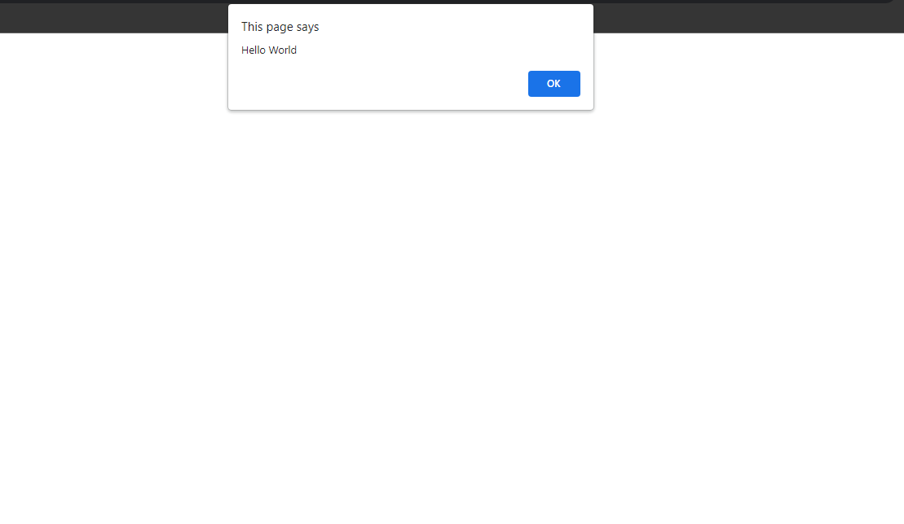

### Example 1

#### HTML

```HTML
<!DOCTYPE html>

<html>

    <head>

        <title>This is the title</title>

        <link rel="stylesheet" type="text/css" href="style.css">

    </head>

<body>

    
    
    

    <script src="js.js"></script>

</body>

</html>
```

#### JavaScript

```JavaScript
var d = 0;

function rotateAnimation(ele, dir) {

  var elem= document.getElementById(ele);

    if (dir == "ccw") {

        d--;

    } else {

        d++;

    }

    elem.style.WebkitTransform = "rotate(" + d + "deg)";
    elem.style.MozTransform = "rotate(" + d + "deg)";
    elem.style.msTransform = "rotate(" + d + "deg)";
    elem.style.OTransform = "rotate(" + d + "deg)";
    elem.style.transform = "rotate(" + d + "deg)";

    if (d > 359) {

        d = 1;

    } else if (d < -359) {

        d = -1;

    }

    setTimeout(function () { rotateAnimation(ele,dir)},20)

}

rotateAnimation("img1", "cw");
rotateAnimation("img2", "ccw");
rotateAnimation("img3", "cw");

//It's not object orended method.
```

### Output

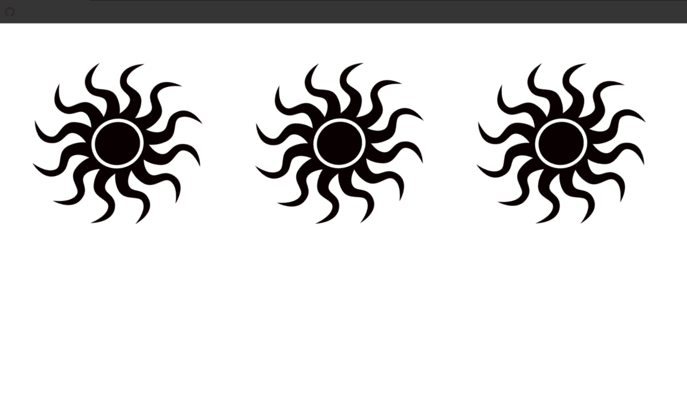

### Example 2

#### HTML

```HTML
<!DOCTYPE html>

<html>

    <head>

        <title>This is the title</title>

        <link rel="stylesheet" type="text/css" href="style.css">

    </head>

<body>

    
    
    

    <script src="js.js"></script>
</body>

</html>
```

#### JavaScript

```JavaScript
function rotateAnimation() {
    this.d = 0;

    this.animate = function animate(ele, dir) {

        var elem = document.getElementById(ele);
        var me = this;

        if (dir == "ccw") {

            this.d--;

        } else {

            this.d++;

        }

        elem.style.WebkitTransform = "rotate(" + this.d + "deg)";
        elem.style.MozTransform = "rotate(" + this.d + "deg)";
        elem.style.msTransform = "rotate(" + this.d + "deg)";
        elem.style.OTransform = "rotate(" + this.d + "deg)";
        elem.style.transform = "rotate(" + this.d + "deg)";

        if (this.d > 359) {

            this.d = 1;

        } else if (this.d < -359) {

            this.d = -1;

        }

        setTimeout(function () { me.animate(ele, dir); }, 20)//we can also  give rotateImg1.animate(ele, dir)
    }
}

var rotateImg1 = new rotateAnimation();
var rotateImg2 = new rotateAnimation();
var rotateImg3 = new rotateAnimation();

rotateImg1.animate("img1", "cw");
rotateImg1.animate("img2", "ccw");
rotateImg1.animate("img3", "cw");
```

### Output


## 33. JavaScript Countdown Timer Tutoria Settimeout Cleartimeout Snippets

### Example 0

#### HTML

```HTML
<!DOCTYPE html>

<html>

    <head>

        <title>This is the title</title>

        <link rel="stylesheet" type="text/css" href="style.css">

    </head>

<body>

    <div id="status"></div>

    <script src="js.js"></script>

</body>

</html>
```

#### JavaScript

```JavaScript
function countDown(sec, ele) {

    var elem = document.getElementById(ele);
    elem.innerHTML = "Plase Wait for " + sec + " Secounds";

    sec--;

    if (sec < 1) {

        elem.innerHTML = "<h2>This is JokerHacker</h2>";
        elem.innerHTML += "<a href='www.google.lk'>Click Here</a>";

    }

    var timer=setTimeout('countDown('+sec+',"'+ele+'")',1000);

}

window.addEventListener("load",countDown(10,"status"))
```

### Output

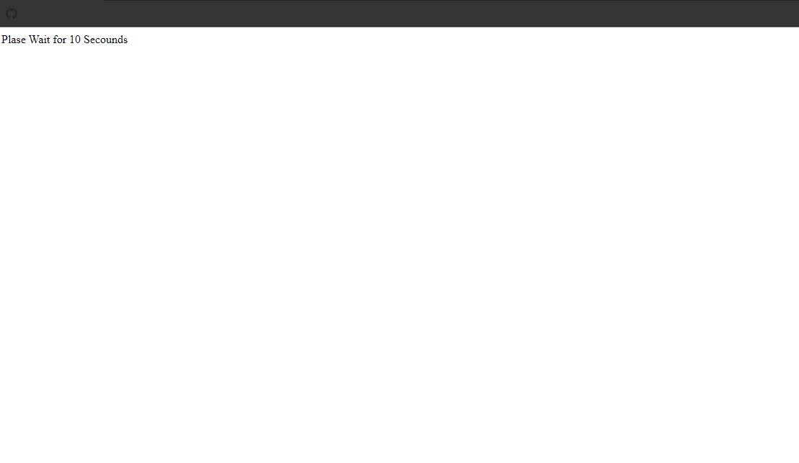

## 34. Custom Drop Down Menu System Snippets

### Example 0

#### HTML

```HTML
<!DOCTYPE html>

<html>

    <head>

        <title>This is the title</title>

        <link rel="stylesheet" type="text/css" href="style.css">

    </head>

<body>

    <div id="myheader">

        <div id="logo">Our Company Logo</div>

        <div id="headermenusystem">

            <div id="con1">

                <a href="#" onclick="return false" onmousedown="dropMenu('dropmenu1')">Services</a>

                <div id="dropmenu1" class="dropmenus">

                    <a href="#">Java</a>
                    <a href="#">C++</a>
                    <a href="#">C#</a>
                    <a href="#">JavaScript</a>

                </div>

            </div>

                <div id="con2">

                    <a href="#" onclick="return false" onmousedown="    dropMenu('dropmenu2')">Works</a>

                    <div id="dropmenu2" class="dropmenus">

                        <a href="#">PhP</a>
                        <a href="#">Matlab</a>
                        <a href="#">VB</a>
                        <a href="#">C</a>

                    </div>

                </div>

                <div id="con3">

                    <a href="#" onclick="return false" onmousedown="    dropMenu('dropmenu3')">Services</a>

                    <div id="dropmenu3" class="dropmenus">

                        <a href="#">Action</a>
                        <a href="#">G++</a>
                        <a href="#">Node.JS</a>
                        <a href="#">MongoDB</a>

                    </div>

                </div>

                <div>

                    <a href="somepahe.php">Contact Us</a>

                </div>

            </div>

        </div>

        <script src="js.js"></script>
		<script src="fadeEffects.js"></script>

</body>

</html>
```

#### CSS

```CSS
body {

    margin:0;
}

div#myheader{

    height:100px;
    background:#D2E9FF;
    border:1px solid #09F;

}

div#logo {

    height:75px;
    border:#09f 1px dashed;
    font-size:44px;
    padding:0px 12px;
}

div#headermenusystem {

    margin-left:16px;

}

div#headermenusystem > div {

   float:left;
   margin:0px 20px;

}

div.dropmenus {
    display:none;
    position: absolute;
    top: 100px;
    width: 120px;
    background: #D2E9FF;
    z-index: 2;
    padding: 4px;
    border: #0385cb 3px solid;
    border-top: none;
    -moz-border-radius: 0 0 8px 8px;
    -webkit-border-radius: 0 0 8px 8px;
    border-radius: 0 0 8px 8px;
}

    div.dropmenus > a {

        margin: 4px;
        padding: 7px;
        font-size: 14px;
        text-decoration: none;
        background: #E8E8E8;
        border: #666 1px solid;
        -moz-border-radius: 3px;
        -webkit-border-radius: 3px;
        border-radius: 3px;
        color:#000;
    }

    div.dropmenus > a:hover{
       background:#fff;
       border:#06f 1px solid;
       color:#000;
    }

div#dropmenu1 {
}

div#dropmenu2 {
}

div#dropmenu3 {
}
```

#### JavaScript

```JavaScript
var fade_in_from = 0;
var fade_out_from = 10;

function fadeIn(element) {

    var target = document.getElementById(element);
    target.style.display = "block";
    var newSetting = fade_in_from / 10;//why i divided it by 10. The answer is the target.style.opacity has to be 0 to 1.
    target.style.opacity = newSetting;
    fade_in_from++;

    //Opacity ranges form  0 to 1 (0 -.1 0 -.2 0 -.3 0 -.4 0 -.5 -etc).

    if (fade_in_from == 10) {

        target.style.opacity = 1;
        clearTimeout(loopTimer);
        fade_in_from = 0;
        return false;
    }

    var loopTimer = setTimeout('fadeIn(\'' + element + '\')', 50);
}

function fadeOut(element) {

    var target = document.getElementById(element);

    var newSetting = fade_out_from / 10;
    target.style.opacity = newSetting;
    fade_out_from--;

    if (fade_out_from == 0) {

        target.style.opacity = 0;
        target.style.display = "none";
        clearTimeout(loopTimer);
        fade_out_from = 10;
        return false;
    }

    var loopTimer = setTimeout('fadeOut(\'' + element + '\')', 50);

}
```

```JavaScript
var ma = ["dropmenu1", "dropmenu2", "dropmenu3"];

function dropMenu(x) {

    for (m in ma) {

        if (ma[m] != x) {//This line means ma[m] element is not equal to the current element hide all other elements exepect the current element.

            document.getElementById(ma[m]).style.display = "none";
        }

        if (document.getElementById(x).style.display = "block") {

           fadeIn(x);

        } else {

            fadeOut(x);
        }

    }
}
```
### Output

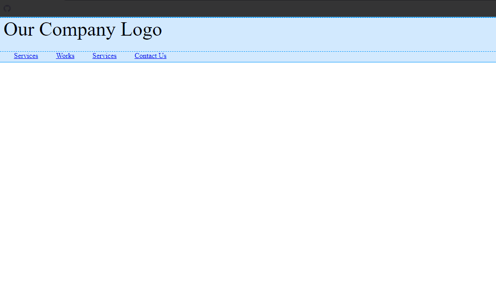

## 35. JavaScript Custom Fade Animation Functions Snippets

### Example 0

#### HTML

```HTML
<!DOCTYPE html>

<html>

    <head>

        <title>This is the title</title>

        <link rel="stylesheet" type="text/css" href="style.css">

    </head>

<body>

    <h2>Fade In and Fade Out without Frameworks</h2>

    <button onclick="fadeOut('div1')">Fade Out</button>
    <button onclick="fadeIn('div1')">Fade In</button>

    <div id="div1" class="contentbox">ContentBox</div>

    <button onclick="fadeOut('div2')">Fade Out</button>
    <button onclick="fadeIn('div2')">Fade In</button>

    <div id="div2" class="contentbox">ContentBox</div>

    <button onclick="fadeOut('div3')">Fade Out</button>
    <button onclick="fadeIn('div3')">Fade In</button>

    <div id="div3" class="contentbox">ContentBox</div>

        <script src="js.js"></script>

</body>

</html>
```

#### CSS

```CSS
div.contentbox {

    background:#1C9EFF;
    width:300px;
    height:100px;
    padding:12px;
}
```

#### JavaScript

```JavaScript
var fade_in_from = 0;
var fade_out_from = 10;


function fadeIn(element) {

    var target = document.getElementById(element);
    target.style.display = "block";
    var newSetting = fade_in_from / 10;//why i divided it by 10. The answer is the target.style.opacity has to be 0 to 1.
    target.style.opacity = newSetting;
    fade_in_from++;

    //Opacity ranges form  0 to 1 (0 -.1 0 -.2 0 -.3 0 -.4 0 -.5 -etc).

    if (fade_in_from == 10) {

        target.style.opacity = 1;
        clearTimeout(loopTimer);
        fade_in_from = 0;
        return false;
    }

    var loopTimer = setTimeout('fadeIn(\'' + element + '\')', 50);
}

function fadeOut(element) {

    var target = document.getElementById(element);

    var newSetting = fade_out_from / 10;
    target.style.opacity = newSetting;
    fade_out_from--;

    if (fade_out_from == 0) {

        target.style.opacity = 0;
        target.style.display = "none";
        clearTimeout(loopTimer);
        fade_out_from = 10;
        return false;
    }

    var loopTimer = setTimeout('fadeOut(\'' + element + '\')', 50);

}
```

```JavaScript
var fade_in_from = 0;
var fade_out_from = 10;


function fadeIn(element) {

    var target = document.getElementById(element);
    target.style.display = "block";
    var newSetting = fade_in_from / 10;//why i divided it by 10. The answer is the target.style.opacity has to be 0 to 1.
    target.style.opacity = newSetting;
    fade_in_from++;

    //Opacity ranges form  0 to 1 (0 -.1 0 -.2 0 -.3 0 -.4 0 -.5 -etc).

    if (fade_in_from == 10) {

        target.style.opacity = 1;
        clearTimeout(loopTimer);
        fade_in_from = 0;
        return false;
    }

    var loopTimer = setTimeout('fadeIn(\'' + element + '\')', 50);
}

function fadeOut(element) {

    var target = document.getElementById(element);

    var newSetting = fade_out_from / 10;
    target.style.opacity = newSetting;
    fade_out_from--;

    if (fade_out_from == 0) {

        target.style.opacity = 0;
        target.style.display = "none";
        clearTimeout(loopTimer);
        fade_out_from = 10;
        return false;
    }

    var loopTimer = setTimeout('fadeOut(\'' + element + '\')', 50);

}
```

### Output

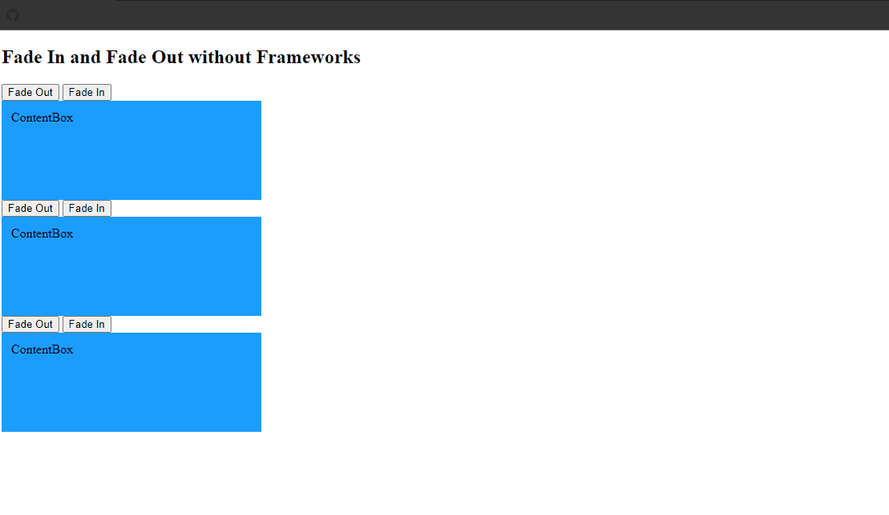

## 36. Time Countdown Tutorial Christmas Snippets

### Example 0

#### HTML

```HTML
<!DOCTYPE html>

<html>

    <head>

        <title>This is the title</title>

        <link rel="stylesheet" type="text/css" href="style.css">

    </head>

<body>

    Day:<div id="days"></div>
    Hours:<div id="hours"></div>
    Minutes:<div id="mins"></div>
    Seconds:<div id="secs"></div>

        <script src="js.js"></script>

</body>

</html>
```

#### JavaScript

```JavaScript
function cdtd() {

    var xmas = new Date("December 25, 2016 00:01:00");
    var now = new Date();

    var timeDiff = xmas.getTime() - now.getTime();

    if (timeDiff <= 0) {

        clearTimeout(timer);
        document.write("The Christmas is here");

    }

    var seconds = Math.floor(timeDiff / 1000);
    var minutes = Math.floor(seconds / 60);
    var hours = Math.floor(minutes / 60);
    var days = Math.floor(hours / 24);

    seconds %= 60;//It is for get the right seconds method.
    hours %= 60;//It is for get the right hours.
    minutes %= 60;//It is for get the right minutes.

    document.getElementById("days").innerHTML = days;
    document.getElementById("hours").innerHTML = hours;
    document.getElementById("mins").innerHTML = minutes;
    document.getElementById("secs").innerHTML = seconds;

    var timer = setTimeout("cdtd()", 1000);

}

window.addEventListener("load", cdtd());
```

### Output

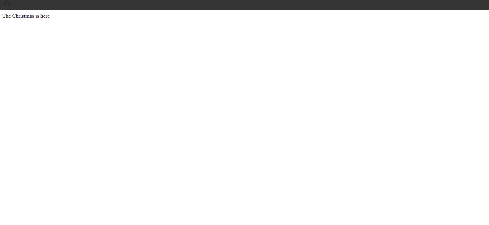

## 37. JavaScript Disabled User Handling Page Efficiency Snippets

### Example 0

#### HTML

```HTML
<!DOCTYPE html>

<html>

    <head>

        <title>This is the title</title>

        <link rel="stylesheet" type="text/css" href="style.css">

    </head>

<body>

    <h1 style="color:green" id="dis"></h1>

    <noscript>

        <meta http-equiv="refresh" content="0; url=NoScriptIndex.html" />

    </noscript>

    <!--

        This code won't let the user to visit the site if the JavaScript is disabled.It will take the user to the "NoScriptIndex.html".
        -->

    <script src="js.js"></script>

</body>

</html>
```

```HTML
<h1 style="color:red">Please turn on the JavaScript if you want to visit this site</h1>
```

#### JavaScript

```JavaScript
document.getElementById("dis").innerHTML = "JavaScript is Enabled because of that you can asscess anything in this page";
//If the JavaScript is enabled the script will work.see the HTML for more details.
```

### Output

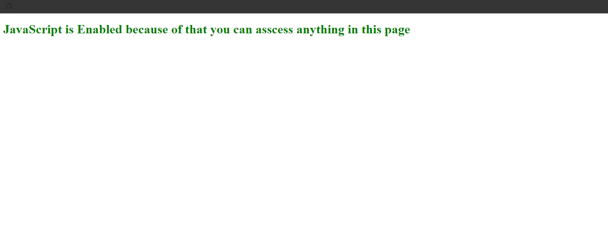

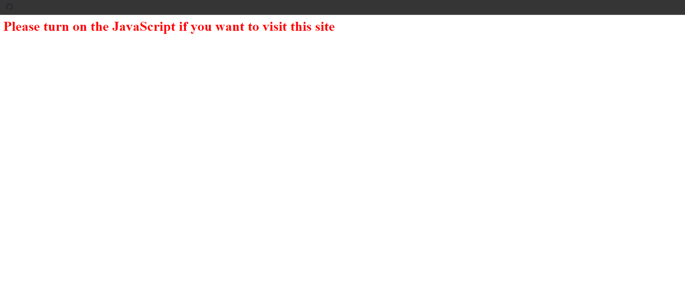

## 38. Expand () Retract () Animation Function Programming Snippets

### Example 0

#### HTML

```HTML
<!DOCTYPE html>

<html>

    <head>

        <title>This is the title</title>

        <link rel="stylesheet" type="text/css" href="style.css">

    </head>

<body>

    <h1>Programming Raw JavaScript expand() and retract() Animation Functions</h1>

    <p>

        <a href="#" onclick="return false" onmousedown="expand('div1')">Expand Box</a>
        <a href="#" onclick="return false" onmousedown="retract('div1')">Retract Box</a>

    </p>

    <div id="div1" class="mydivs">

        <p>Box 1 Content</p>
        <p>Box 1 Content</p>
        <p>Box 1 Content</p>
        <p>Box 1 Content</p>
        <p>Box 1 Content</p>
        <p>Box 1 Content</p>

    </div>

    <p>

        <a href="#" onclick="return false" onmousedown="expand('div2')">Expand Box</a>
        <a href="#" onclick="return false" onmousedown="retract('div2')">Retract Box</a>

    </p>

    <div id="div2" class="mydivs">

        <p>Box 2 Content</p>
        <p>Box 2 Content</p>
        <p>Box 2 Content</p>
        <p>Box 2 Content</p>
        <p>Box 2 Content</p>
        <p>Box 2 Content</p>
        <p>Box 2 Content</p>
        <p>Box 2 Content</p>
        <p>Box 2 Content</p>
        <p>Box 2 Content</p>
        <p>Box 2 Content</p>
        <p>Box 2 Content</p>

    </div>

    <script src="js.js"></script>

</body>

</html>
```

#### CSS

```CSS
p {

    padding:10px 20px;
    background-color:#D9ECFF;

}

div.mydivs {

    background:#97D6FB;
    width:500px;
    height:0;
    overflow:hidden;

}

div.mydivs >p {

   padding:4px 16px;
   background:#97D6fb;

}
```

#### JavaScript

```JavaScript
function expand(ele) {

    var target = document.getElementById(ele);
    var h = target.offsetHeight;//offsetHeight is the height of the div.It set tov 0 in the css.
    var sh = target.scrollHeight;// ScrollHeight means content height within the div. It is the content height of the div.

    var loopTimer = setTimeout('expand(\'' + ele + '\')', 8);//This is the looper it runs the function every 8 milliseconds.


    if (h < sh) { //If the offsetHeight is less than the ScrollHeight when every time the loop runs.It has to increment the value by 5 to h variable.
                 //offsetHeight is the height of the div,ScrollHeight is the content height of the div.
        h += 5;

    } else {  //If the offsetHeight is greter than the ScrollHeight then run the bellow code.

        clearTimeout(loopTimer);
        alert("Expansion Completed");

    }

    target.style.height = h + "px";//This line means when the every time the loop runs increment the value by px.

}

function retract(ele) {
    var target = document.getElementById(ele);
    var h = target.offsetHeight;

    var loopTimer = setTimeout('retract(\'' + ele + '\')', 8);

    if (h > 0) {

        h -= 5;

    } else {


        clearTimeout(loopTimer);

    }

    target.style.height = h + "px"

}

//The Speed is depands on the 8,5 values.
```

```JavaScript
function expand(ele) {

    var target = document.getElementById(ele);
    var h = target.offsetHeight;//offsetHeight is the height of the div.It set tov 0 in the css.
    var sh = target.scrollHeight;// ScrollHeight means content height within the div. It is the content height of the div.

    var loopTimer = setTimeout('expand(\'' + ele + '\')', 8);//This is the looper it runs the function every 8 milliseconds.


    if (h < sh) { //If the offsetHeight is less than the ScrollHeight when every time the loop runs.It has to increment the value by 5 to h variable.
                 //offsetHeight is the height of the div,ScrollHeight is the content height of the div.
        h += 5;

    } else {  //If the offsetHeight is greter than the ScrollHeight then run the bellow code.

        clearTimeout(loopTimer);
        alert("Expansion Completed");

    }

    target.style.height = h + "px";//This line means when the every time the loop runs increment the value by px.

}

function retract(ele) {
    var target = document.getElementById(ele);
    var h = target.offsetHeight;

    var loopTimer = setTimeout('retract(\'' + ele + '\')', 8);

    if (h > 0) {

        h -= 5;

    } else {

        clearTimeout(loopTimer);

    }

    target.style.height = h + "px"

}

//The Speed is depands on the 8,5 values.
```

### Output

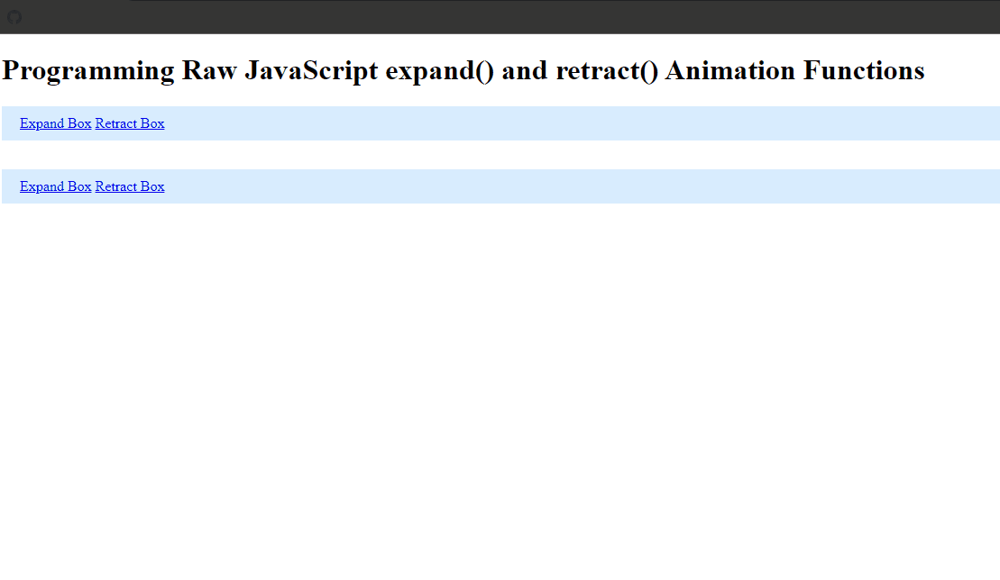

## 39. JavaScript Form Select Change Options Tutorial Dynamic List Snippets

### Example 0

#### HTML

```HTML
<!DOCTYPE html>

<html>

    <head>

        <title>This is the title</title>

        <link rel="stylesheet" type="text/css" href="style.css">

    </head>

<body>

    <h1>Choose Your Car</h1>

    <hr />

    Choose Car Make:

    <select id="slct1" name="slct1" onchange="populate(this.id, 'slct2')"> <!-- The this.id represents the 'slct1' or we can directly give it  -->

        <option value=""></option> <!--I Put First Value as empty-->
        <option value="Chevy">Chevy</option>
        <option value="Dodge">Dodge</option>
        <option value="Ford">Ford</option>

    </select>

    Choose Car Modal:
    <select id="slct2" name="slct2"></select>

    <script src="js.js"></script>

</body>

</html>
```

#### JavaScript

```JavaScript
function populate(s1, s2) {

    var s1 = document.getElementById(s1);
    var s2 = document.getElementById(s2);
    s2.innerHTML = "";

    if (s1.value == "Chevy") {

        var optionArr = ["|", "imbale|Imbale","moto|Moto","greter|Greter"]//I put the first one as empty.

    } else if (s1.value == "Dodge") {

        var optionArr = ["|", "m4568|M4568", "luvanda|Luvanda", "moter|Moter"]//I put the first one as empty.

    } else if (s1.value == "Ford") {

        var optionArr = ["|", "linker|Linker", "dodo|Dodo", "thus|Thus"]//I put the first one as empty.

    }

    for (op in optionArr) {

        var pair = optionArr[op].split("|");//This code splited by the pipe (|) and it returns two values like pair[0] and pair[1].
        var newOption = document.createElement("option");
        newOption.value = pair[0];
        newOption.innerHTML = pair[1];
        s2.options.add(newOption);

    }

}
```

### Output

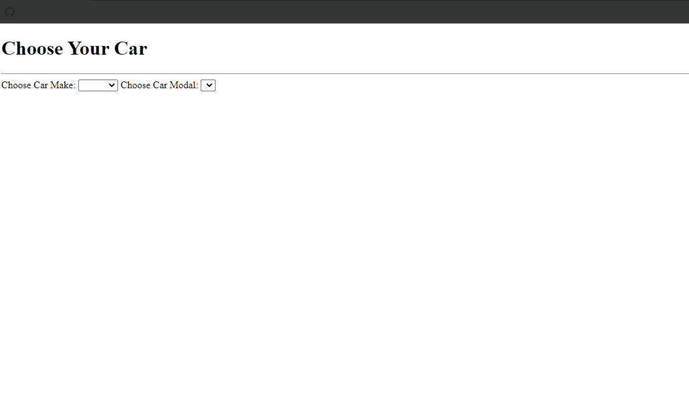

## 40. Prototype Tutorial Add Object Method And Property Snippets

### Example 0

#### HTML

```HTML
<!DOCTYPE html>

<html>

    <head>

        <title>This is the title</title>

        <link rel="stylesheet" type="text/css" href="style.css">

    </head>

<body>

    <script src="js.js"></script>

</body>

</html>
```

#### JavaScript

```JavaScript
//Establish the player class-bashed object.

function Player() {

    this.name;
    this.hitpoints = 100;
    this.attack = function (opponent) {

        opponent.hitpoints -= 10;
        alert(this.name + " just hit " + opponent.name);

    }


}


//Create two new separate Player instances

var p1 = new Player();
var p2 = new Player();


//Name the players

p1.name = "Conan"
p2.name = "Hercules";

//Make the player1 attack player2.
p1.attack(p2);

alert(p2.name + " has " + p2.hitpoints + " hit points left");

//Add a heal method to the player object using the prototype property.

Player.prototype.heal = function (targetPlayer) {

    targetPlayer.hitpoints+=5;

}

p1.heal(p2);

alert(p2.name + " has " + p2.hitpoints + " hit points left");
alert(p1.name + " has " + p1.hitpoints + " hit points left");

//add an energy prototype to the Player object using prototype property.

Player.prototype.energy = 200;

alert("Player 1 " + p1.energy);
alert("Player 2 " + p2.energy);

```

### Output

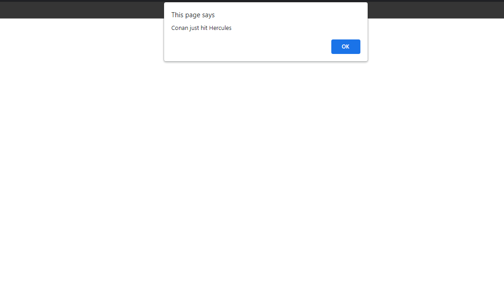
