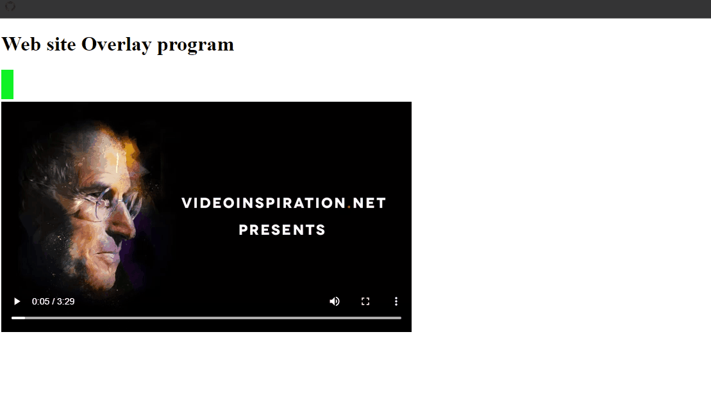

## 41. JavaScript Inheritance Tutorial Object Oriented Class Snippets

### Example 0

#### HTML

```HTML
<!DOCTYPE html>

<html>

    <head>

        <title>This is the title</title>

        <link rel="stylesheet" type="text/css" href="style.css">

    </head>

<body>

    <script src="js.js"></script>

</body>

</html>
```

#### JavaScript

```JavaScript
//Establish parent class.

function Parentclass() {

    this.parent_property_1 = "Hola";

    this.parentmethod1 = function parentmethod1(arg1) {

        return arg1 + " parentmethod_1 returns data..";
    }

}

//Establish child class.

function Childclass() {

    this.child_property_1 = "Adios";

    this.childmethod1 = function childmethod1(arg1) {

        return arg1 + " child method returns data...";

    }
}

//Make the Childclass inherit all of the parent characeristics by using the prototype property.

Childclass.prototype = new Parentclass();

//Creates a new instance of Childclass.

var instance1 = new Childclass();

//Checks to see if instance1 is an instance of both object.

alert(instance1 instanceof Parentclass);
alert(instance1 instanceof Childclass);
```

### Output


### Example 1

#### HTML

```HTML
<!DOCTYPE html>

<html>

    <head>

        <title>This is the title</title>

        <link rel="stylesheet" type="text/css" href="style.css">

    </head>

<body>

    <script src="js.js"></script>

</body>

</html>
```

#### JavaScript

```JavaScript
//Establish parent class.

function Parentclass() {

    this.parent_property_1 = "Hola";

    this.parentmethod1 = function parentmethod1(arg1) {

        return arg1 + " parentmethod_1 returns data..";
    }

}

//Establish child class.

function Childclass() {

    this.child_property_1 = "Adios";

    this.childmethod1 = function childmethod1(arg1) {

        return arg1 + " child method returns data...";

    }
}

//Make the Childclass inherit all of the parent characeristics by using the prototype property.

Childclass.prototype = new Parentclass();

//Creates a new instance of Childclass.

var instance1 = new Childclass();

//Access the instance method and properties.

alert(instance1.parentmethod1("Result:- "));
alert(instance1.childmethod1("Result:- "));
alert(instance1.parent_property_1);
alert(instance1.child_property_1);
```

### Output


### Example 2

#### HTML

```HTML
<!DOCTYPE html>

<html>

    <head>

        <title>This is the title</title>

        <link rel="stylesheet" type="text/css" href="style.css">

    </head>

<body>

    <script src="js.js"></script>

</body>

</html>
```

#### JavaScript

```JavaScript
//Establish parent class.

function Parentclass() {

    this.parent_property_1 = "Hola";

    this.parentmethod1 = function parentmethod1(arg1) {

        return arg1 + " parentmethod_1 returns data..";
    }

}

//Establish child class.

function Childclass() {

    this.child_property_1 = "Adios";

    this.childmethod1 = function childmethod1(arg1) {

        return arg1 + " child method returns data...";

    }
}

//Make the Childclass inherit all of the parent characeristics by using the prototype property.

Childclass.prototype = new Parentclass();

//Creates a new instance of Childclass.

var instance1 = new Childclass();


//Override parentmethod1 in the Childclass.

Childclass.prototype.parent_property_1 = function (arg1) {

    return arg1 + " I have overriden parentmethod1";

}

alert(instance1.parent_property_1("Result:-"));
```

### Output


## 42. Monthly Payment Loan Calculator Programming Snippets

### Example 0

#### HTML

```HTML
<!DOCTYPE html>

<html>

    <head>

        <title>This is the title</title>

        <link rel="stylesheet" type="text/css" href="style.css">

    </head>

<body>

    <p>Loan Amount:$ <input type="number" id="amount" min="1" max="1000000" onchange="computeLoan()" /></p>
    <p>Interest Rate <input type="number" id="interest_rate" min="0" max="100" value="10" step=".1" onchange="computeLoan()" /></p>
    <p><input type="number" id="months" min="1" max="72" value="1" step="1"  onchange="computeLoan()" /> </p>

    <h1 id="payment"></h1>
    <script src="js.js"></script>

</body>

</html>
```

#### JavaScript

```JavaScript
function computeLoan() {

    var amount = document.getElementById("amount").value;
    var interest_rate = document.getElementById("interest_rate").value;
    var months = document.getElementById("months").value;

    var interest = (amount * (interest_rate * .01)) / months;//.01 /It is moves decimal point two places left.
    var payment = ((amount / months) + interest).toFixed(2);
    payment = payment.toString().replace(/\B(?=(\d{3})+(?!\d))/g, ",");
    document.getElementById("payment").innerHTML ="Monthly Payment $"+ payment;

}
```

### Output


## 43. Load Dynamic Content Into Page When User Reaches Bottom Ajax Snippets

### Example 0

#### HTML

```HTML
<!DOCTYPE html>

<html>

    <head>

        <title>This is the title</title>

        <link rel="stylesheet" type="text/css" href="style.css">

    </head>

<body>

    <div id="status">0 | 0</div>

    <div id="wrap"></div>

    <script src="js.js"></script>

</body>

</html>
```

#### CSS

```CSS
div#wrap {

    width:800px;
    margin:0 auto;  /*This is the way to center any div in web page */
}
div#status {

    position:fixed;
    font-size:24px;

}
div.newData {
    width:800px;
    height:1500px;
    background-color:red;

}
```

#### JavaScript

```JavaScript
window.onscroll = yHandler;

function yHandler() {

    var wrap = document.getElementById("wrap");
    var contentHeight = wrap.offsetHeight; //Gets page content height.
    var yOffset = window.pageYOffset//Get vertical scroll position.
    var y = yOffset + window.innerHeight;//If we want to target the bottom of the page we have to pageYOffset shows how much it scrolls

    if (y >= contentHeight) {

        wrap.innerHTML += "<div class='newData'></div>";//why i put += sign the reson is if i only put = sign it will override the content.but it keeps data already in that div and add more.

        //Ajax call to get more dynamic data goes here.
    }

    var status = document.getElementById("status");
    status.innerHTML = contentHeight + " | " + y;

}
```

### Output


## 44. Setattribute Remove Attribute  Methods Snippets

### Example 0

#### HTML

```HTML
<!DOCTYPE html>

<html>

    <head>

        <title>This is the title</title>

        <link rel="stylesheet" type="text/css" href="style.css">

    </head>

<body>

    <h1 id="e1">This is JokerHacker</h1>
    <h1 id="e2">I know JavaScript PhP and C++</h1>
    <h1 id="e3">My name is Guna</h1>

    <script src="js.js"></script>

</body>

</html>
```

#### CSS

```CSS
.style1 {

    color:red;

}
```

#### JavaScript

```JavaScript
window.addEventListener("load", changeAttr);

function changeAttr() {

    document.getElementById("e1").setAttribute("align", "center");
    document.getElementById("e2").setAttribute("class", "style1");
    document.getElementById("e3").setAttribute("title", "I'm not Guna my name is JokerHacker");

}
```

### Output


### Example 1

#### HTML

```HTML
<!DOCTYPE html>

<html>

    <head>

        <title>This is the title</title>

        <link rel="stylesheet" type="text/css" href="style.css">

    </head>

<body>

    <h1 id="e1">This is JokerHacker</h1>

    <button onclick="addAtter('e1','align','center')">Apply</button>
    <button onclick="removeAtter('e1','align')">Remove</button>
    <script src="js.js"></script>

</body>

</html>
```

#### JavaScript

```JavaScript
function addAtter(target,att,valueAtter) {

    document.getElementById(target).setAttribute(att, valueAtter);

}

function removeAtter(target,att) {

    document.getElementById(target).removeAttribute(att);

}
```

### Output


## 45. Storage Interface Session Storage Local Storage Snippets

### Example 0

#### HTML

```HTML
<script>

    localStorage.setItem("username", "Joker");
    sessionStorage.setItem("username", "Hacker");

    /*

    we have to work with localStorage when we want things to be remembered longer like when the user close the browser down or in other tabs.
    But we use sessionStorage for more short lives memory for just one browering session.
    If the user shout the browser down ,the sessionStorage data will automaticaly destroyed.
    And also sessionStorage data connot be accessed by in multiple broweing tabs.

    Methods and properties like setItem() all that can be used on both localStorage and sessionStorage.

    */

</script>

<a href="otherIndex.html">Go to Other Page</a>
```

```HTML
<body>

    <script>

        document.write("<h1> Hi " + localStorage.username + "</h1>");
        document.write("<h1> Hi " + sessionStorage.username + "</h1>");

    </script>

</body>
```

### Output


### Example 1

#### HTML

```HTML
<script>

    localStorage.clear()//This line of code clear out the localStorage every time before the new storage item put in bellow.This way that is empty each time we set it new.
    localStorage.setItem("username", "Joker");
    localStorage.setItem("country","USA");

    /*

    The data are stored in localStorage all of the other pages on the website can access when they need to access them

    */

</script>

<a href="otherIndex.html">Go to Other Page</a>
```

```HTML
<body>

    <script>

        document.write("<h1> Hi " + localStorage.username + " form "+localStorage.country+"</h1>");

    </script>

</body>
```

### Output


### Example 2

#### HTML

```HTML
<script>

    localStorage.setItem("username", "Joker");
	localStorage.clear()//This line of code clear out the localStorage every time before the new storage item put in bellow.This way that is empty each time we set it new.
    localStorage.setItem("country","USA");


    /*

    The data are stored in localStorage all of the other pages on the website can access when they need to access them

    */

</script>

<a href="otherIndex.html">Go to Other Page</a>
```

```HTML
<body>

    <script>

        document.write("<h1> Hi " + localStorage.username + " form "+localStorage.country+"</h1>");

    </script>

</body>
```

### Output


### Example 3

#### HTML

```HTML
<script>

    localStorage.clear()//This line of code clear out the localStorage every time before the new storage item put in bellow.This way that is empty each time we set it new.
    localStorage.setItem("username", "Joker");
    localStorage.setItem("country","USA");
    localStorage.setItem("color", "Blue");

</script>

<a href="otherIndex.html">Go to Other Page</a>
```

```HTML
<body>

    <script>

        document.write(localStorage.length);

        /*

       This is way  We can loop over the localStorage for accessing all of the items in localStorage object.

        */

    </script>

</body>
```

### Output


### Example 4

#### HTML

```HTML
<script>

    localStorage.clear()//This line of code clear out the localStorage every time before the new storage item put in bellow.This way that is empty each time we set it new.
    localStorage.setItem("username", "Joker");//This is index 2.
    localStorage.setItem("country","USA");//This is index 1.
    localStorage.setItem("color", "Blue");//This is index 0.

</script>

<a href="otherIndex.html">Go to Other Page</a>
```

```HTML
<body>

    <script>

        document.write(localStorage.key(0));

        /*
        The key method returns the name of the key.But it does not return the value.
        */

    </script>

</body>
```

### Output


### Example 5

#### HTML

```HTML
<script>

    localStorage.clear()//This line of code clear out the localStorage every time before the new storage item put in bellow.This way that is empty each time we set it new.
    localStorage.setItem("username", "Joker");//This is index 2.
    localStorage.setItem("country","USA");//This is index 1.
    localStorage.setItem("color", "Blue");//This is index 0.

</script>

<a href="otherIndex.html">Go to Other Page</a>
```

```HTML
<body>

    <script>

    document.write(localStorage.getItem("color"))
        /*
        The getItem method returns actual value.
        */

    </script>

</body>
```

### Output


### Example 6

#### HTML

```HTML
<script>

    localStorage.clear()//This line of code clear out the localStorage every time before the new storage item put in bellow.This way that is empty each time we set it new.
    localStorage.setItem("username", "Joker");//This is index 2.
    localStorage.setItem("country","USA");//This is index 1.
    localStorage.setItem("color", "Blue");//This is index 0.

</script>

<a href="otherIndex.html">Go to Other Page</a>
```

```HTML
<body>

    <script>

        localStorage.removeItem("country");
        document.write(localStorage.getItem("username")+"<br>");
        document.write(localStorage.getItem("country")+"<br>");
        document.write(localStorage.length);

        /*
        removeItem method is use to remove an item form the localStorage object.
        */
    </script>

</body>
```

### Output


## 46. Toggle Password Security Field Text HTML Form Login Switch Snippets

### Example 0

#### HTML

```HTML
<!DOCTYPE html>

<html>

    <head>

        <title>This is the title</title>

        <link rel="stylesheet" type="text/css" href="style.css">

    </head>

<body>

    <input type="password" id="pass" name="pass" />
    <input type="button" id="passBtn" onclick="passwordSystem()"  value="Show the Password"/>

    <script src="js.js"></script>

</body>

</html>
```

#### JavaScript

```JavaScript
function passwordSystem() {

    var pass = document.getElementById("pass");
    var passBtn = document.getElementById("passBtn");

    if (pass.type == "password") {

        pass.type = "text";
        passBtn.value = "Hide the password";

    } else {

        pass.type = "password";
        passBtn.value = "Show the password";

    }
}
```

### Output


### Example 1

#### HTML

```HTML
<!DOCTYPE html>

<html>

    <head>

        <title>This is the title</title>

        <link rel="stylesheet" type="text/css" href="style.css">

    </head>

<body>

    <input type="password" id="pass" name="pass" />
    <input type="button" id="passBtn" onclick="passwordSystem()"  value="Show the Password"/>

    <script src="js.js"></script>

</body>

</html>
```

#### JavaScript

```JavaScript
function passwordSystem() {

    var pass = document.getElementById("pass");
    var passBtn = document.getElementById("passBtn");

    if (pass.type == "text") {

        pass.type = "password";
        passBtn.value = "Hide The Password";

    } else {

        pass.type = "text";
        passBtn.value = "Show The Password";

    }
}
```

### Output


## 47. Dice Roll Programming Snippets

### Example 0

#### HTML

```HTML
<!DOCTYPE html>

<html>

    <head>

        <title>This is the title</title>

        <link rel="stylesheet" type="text/css" href="style.css">

    </head>

<body>

    <div id="die1" class="dice"></div>
    <div id="die2" class="dice"></div>

    <button onclick="rollDice()">Roll Dice</button>

    <h2 id="status" style="clear:left"></h2>
    <script src="js.js"></script>

</body>

</html>
```

#### CSS

```CSS
div.dice {

    float:left;
    width:32px;
    height:15px;
    background:#F5F5F5;
    border:#999 1px solid;
    padding:12px;
    font-size:24px;
    text-align:center;
    margin:5px;
}
```

#### JavaScript

```JavaScript
function rollDice() {

    var die1 = document.getElementById("die1");
    var die2 = document.getElementById("die2");
    var status = document.getElementById("status");

    var d1 = Math.floor(Math.random() * 6) + 1;//This line of means to get numbers between 1 and 6
    var d2 = Math.floor(Math.random() * 6) + 1;//This line of means to get numbers between 1 and 6

    var diceTotal = d1 + d2;

    die1.innerHTML = d1;
    die2.innerHTML = d2;

    status.innerHTML = "You rolled " + diceTotal;

    if(d1==d2){

        status.innerHTML = "DOUBLES you got a free turn";

    }
}
```

### Output


## 48. Dynamic Select Year List Script HTML Form Elements Snippets

### Example 0

#### HTML

```HTML
<!DOCTYPE html>

<html>

    <head>

        <title>This is the title</title>

        <link rel="stylesheet" type="text/css" href="style.css">

    </head>

<body>

    <select id="year" name="year">

        <script>

            for (a = 1990; a <= 2016; a++) {

                document.write('<option value="'+a+'">'+a+'</option>')
            }

        </script>

    </select>

    <script src="js.js"></script>

</body>

</html>
```

### Output


## 49. Get or Remove Random Array Elements Snippets

### Example 0

#### HTML

```HTML
<!DOCTYPE html>

<html>

    <head>

        <title>This is the title</title>

        <link rel="stylesheet" type="text/css" href="style.css">

    </head>

<body>

    <script src="js.js"></script>

</body>

</html>
```

#### JavaScript

```JavaScript
var my_array = ["A", "B", "C", "D", "E", "F", "G"];

var ri = Math.floor(Math.random() * my_array.length);//It gives a randam index within in the array.

document.write(my_array[ri]);
document.write("<hr>");
document.write(my_array);
```

### Output


### Example 1

#### HTML

```HTML
<!DOCTYPE html>

<html>

    <head>

        <title>This is the title</title>

        <link rel="stylesheet" type="text/css" href="style.css">

    </head>

<body>

    <script src="js.js"></script>

</body>

</html>
```

#### JavaScript

```JavaScript
var my_array = ["A", "B", "C", "D", "E", "F", "G"];

var ri = Math.floor(Math.random() * my_array.length);//It gives a randam index within in the array.
var rs = my_array.splice(ri, 1);//This line of code get one element form the array.

document.write(rs);
document.write("<hr>");
document.write(my_array);
```

### Output


### Example 2

#### HTML

```HTML
<!DOCTYPE html>

<html>

    <head>

        <title>This is the title</title>

        <link rel="stylesheet" type="text/css" href="style.css">

    </head>

<body>

    <script src="js.js"></script>

</body>

</html>
```

#### JavaScript

```JavaScript
Array.prototype.randsplice = function () {

    var ri = Math.floor(Math.random() * this.length);
    var rs = this.splice(ri, 1);

    return rs;
}

var my_array = ["A", "B", "C", "D", "E", "F", "G"];

var result = my_array.randsplice();

document.write(result);
document.write("<hr>");
document.write(my_array);

//This program will affect the original array.
```

### Output


### Example 3

#### HTML

```HTML
<!DOCTYPE html>

<html>

    <head>

        <title>This is the title</title>

        <link rel="stylesheet" type="text/css" href="style.css">

    </head>

<body>

    <script src="js.js"></script>

</body>

</html>
```

#### JavaScript

```JavaScript
Array.prototype.randval = function () {

    var ri = Math.floor(Math.random() * this.length);
    var val = this[ri];

    return val;
}

var my_array = ["A", "B", "C", "D", "E", "F", "G"];

var result = my_array.randval();

document.write(result);
document.write("<hr>");
document.write(my_array);

//This program won't afect the original array.
```

### Output


## 50. Text Area Counting and Limiting Snippets

### Example 0

#### HTML

```HTML
<!DOCTYPE html>

<html>

    <head>

        <title>This is the title</title>

        <link rel="stylesheet" type="text/css" href="style.css">

    </head>

<body>

    <form>

        <textarea name="ta" id="ta" rows="6" style="width:340px" onkeyup="textCounter(this.form.ta, this.form.countDisplay)" onkeydown="textCounter(this.form.ta, this.form.countDisplay)"></textarea>

        <input type="text" readonly name="countDisplay" size="3" maxlength="3" value="250" />

    </form>

    <script src="js.js"></script>

</body>

</html>
```

#### JavaScript

```JavaScript
var maxAmount=250;

function textCounter(textField,showCountFiled) {

    if (textField.value.length > maxAmount) {

        textField.value = textField.value.substring(0, maxAmount);//This line of code cuts everythig of more than 250.

    } else {

        showCountFiled.value = maxAmount - textField.value.length;

    }

}
```

### Output


## 51. Tip Calculator HTML 5 Application Snippets

### Example 0

#### HTML

```HTML
<!DOCTYPE html>

<html>

    <head>

        <title>This is the title</title>

        <link rel="stylesheet" type="text/css" href="style.css">

    </head>

<body>

    <h1>Tip Calculator</h1>

    <h2>Enter Amount $</h2>

    <input type="text" id="bill" /><br />

    <h2>Tip Percentage</h2>

    <input type="range" onchange="tipCalculate(this.value,'bill')" min="0" max="100" value="0" step="1" style="width:500px" />

    <span id="slideval"> 0%</span>

    <h2>Tip top leave $ <span style="color:red;" id="tip"></span></h2>

    <script src="js.js"></script>

</body>

</html>
```

#### JavaScript

```JavaScript
function tipCalculate(slider,bill) {

    var tip = document.getElementById("tip");
    var slideval = document.getElementById("slideval");
    var bill = document.getElementById(bill).value;

    var prcnt = slider * .01;//It is moves decimal point two places left.

     tip.innerHTML = "$" +(bill * prcnt).toFixed(2);
     slideval.innerHTML = slider + "%";

}
```

### Output


### Example 1

#### HTML

```HTML
<!DOCTYPE html>

<html>

    <head>

        <title>This is the title</title>

        <link rel="stylesheet" type="text/css" href="style.css">

    </head>

<body>

    <h1>Tip Calculator</h1>

    <h2>Enter Amount $</h2>

    <input type="text" id="bill" /><br />

    <h2>Tip Percentage</h2>

    <input type="range" onchange="tipCalculate(this.value,'bill')" min="0" max="100" value="0" step="1" style="width:500px" />

    <span id="slideval"> 0%</span>

    <h2>Tip top leave $<span style="color:red;" id="tip"></span></h2>

    <h2>Sale Price <span style="color:red;" id="sale"></span></h2>

    <script src="js.js"></script>

</body>

</html>
```

#### JavaScript

```JavaScript
function tipCalculate(slider,bill) {

    var tip = document.getElementById("tip");
    var slideval = document.getElementById("slideval");
    var bill = document.getElementById(bill).value;
    var slaprice = document.getElementById("sale");

   var prcnt = slider * .01;//It is moves decimal point two places left.
   var a = tip.innerHTML = (bill * prcnt).toFixed(2);

   slideval.innerHTML = slider + "%";
   slaprice.innerHTML = bill - a;

}
```

### Output


## 52. Trigger CSS 3 Transitions Control Animations Snippets

### Example 0

#### HTML

```HTML
<!DOCTYPE html>

<html>

    <head>

        <title>This is the title</title>

        <link rel="stylesheet" type="text/css" href="style.css">

    </head>

<body>

    <button onclick="changeBg('box1', '#f0f');">Magenta</button>

    <div id="box1">Content in box 1...</div>

    <script src="js.js"></script>

</body>

</html>
```

#### CSS

```CSS
#box1 {

    background:lightblue;
    width:400px;
    height:200px;

}
```

#### JavaScript

```JavaScript
function changeBg(ele,clr) {

    var elemt = document.getElementById(ele);
    elemt.style.transition = "background 1s linear 0s";//'background' is the transition property, '1s' is the duration of the animtion, 'linear' is the method of animation.
    elemt.style.backgroundColor = clr;                 //We can have ease-in or ease-out or any other methods instead of linear,'0s' delay time but i put it to 0.

}

/*
*By using the css3 properties in JavaScript We can make many transition effects and aniamtion effects.
*We don't have to use any third party of library.
*We can also change the user interaction intead of onclick we can use onmouseover,onmouseout and any events.
*But we have to use all the browser pre-fixes such as webkitTransition,MozTranstion and all the pre-fixes.

*/
```

### Output


### Example 1

#### HTML

```HTML
<!DOCTYPE html>

<html>

    <head>

        <title>This is the title</title>

        <link rel="stylesheet" type="text/css" href="style.css">

    </head>

<body>

    <button onclick="changeBg('box1', '#f0f');">Magenta</button>
    <button onclick="changeBg('box1', 'red');">Red</button>
    <button onclick="changeBg('box1', 'green');">Green</button>

    <div id="box1">Content in box 1...</div>

    <script src="js.js"></script>

</body>

</html>
```

#### CSS

```CSS
#box1 {

    background:lightblue;
    width:400px;
    height:200px;
}
```

#### JavaScript

```JavaScript
function changeBg(ele,clr) {

    var elemt = document.getElementById(ele);
    elemt.style.transition = "background 1s linear 0s";//'background' is the transition property, '1s' is the duration of the animtion, 'linear' is the method of animation.
    elemt.style.backgroundColor = clr;                 //We can have ease-in or ease-out or any other methods instead of linear,'0s' delay time but i put it to 0.

}

/*

*By using the css3 properties in JavaScript We can make many transition effects and aniamtion effects.
*We don't have to use any third party of library.
*We can also change the user interaction intead of onclick we can use onmouseover,onmouseout and any events.
*But we have to use all the browser pre-fixes such as webkitTransition,MozTranstion and all the pre-fixes.

*/
```

### Output


### Example 2

#### HTML

```HTML
<!DOCTYPE html>

<html>

    <head>

        <title>This is the title</title>

        <link rel="stylesheet" type="text/css" href="style.css">

    </head>

<body>

    <button onclick="fadeIn('box1')">Fade in</button>
    <button onclick="fadeOut('box1')">Fade Out</button>

    <div id="box1">Content in box 1...</div>

    <script src="js.js"></script>

</body>

</html>
```

#### CSS

```CSS
#box1 {

    background:lightblue;
    width:400px;
    height:200px;
}
```

#### JavaScript

```JavaScript
function fadeOut(ele) {

    var element = document.getElementById(ele);
    element.style.transition = "opacity 1s linear 0s";
    element.style.opacity = 0;

}

function fadeIn(ele) {

    var element = document.getElementById(ele);
    element.style.transform = "opacity 1s linear 0s";
    element.style.opacity = 1;

}
/*
*By using the css3 properties in JavaScript We can make many transition effects and aniamtion effects.
*We don't have to use any third party of library.
*We can also change the user interaction intead of onclick we can use onmouseover,onmouseout and any events.
*But we have to use all the browser pre-fixes such as webkitTransition,MozTranstion and all the pre-fixes.

*/
```

### Output


### Example 3

#### HTML

```HTML
<!DOCTYPE html>

<html>

    <head>

        <title>This is the title</title>

        <link rel="stylesheet" type="text/css" href="style.css">

    </head>

<body>

    <button onclick="slideClose('box1')">slideClose</button>
    <button onclick="slideOpen('box1')">slideOpen</button>

    <div id="box1">Content in box 1...</div>

    <script src="js.js"></script>

</body>

</html>
```

#### CSS

```CSS
#box1 {

    background:lightblue;
    width:400px;
    height:200px;
}
```

#### JavaScript

```JavaScript
function slideClose(ele) {

    var element = document.getElementById(ele);
    element.style.transition = "height 1s linear 0s";
    element.style.height = '0px';
    element.style.overflow = "hidden";

}

function slideOpen(ele) {

    var element = document.getElementById(ele);
    element.style.transition = "height 1s linear 0s";
    element.style.height = '200px';

}

/*
*By using the css3 properties in JavaScript We can make many transition effects and aniamtion effects.
*We don't have to use any third party of library.
*We can also change the user interaction intead of onclick we can use onmouseover,onmouseout and any events.
*But we have to use all the browser pre-fixes such as webkitTransition,MozTranstion and all the pre-fixes.
*/
```

### Output


### Example 4

#### HTML

```HTML
<!DOCTYPE html>

<html>

    <head>

        <title>This is the title</title>

        <link rel="stylesheet" type="text/css" href="style.css">

    </head>

<body>

    <button onclick="slideIn('box1')">slideOpen</button>
    <button onclick="slideOut('box1')">slideClose</button>

    <div id="box1">Content in box 1...</div>

    <script src="js.js"></script>

</body>

</html>
```

#### CSS

```CSS
#box1 {

    background:lightblue;
    width:400px;
    height:200px;
    position:absolute;
    top:100px;
    left:-400px;

}
```

#### JavaScript

```JavaScript
function slideIn(ele) {

    var element = document.getElementById(ele);
    element.style.transition = "left 1s linear 0s";
    element.style.left = "0px";

}

function slideOut(ele) {

    var element = document.getElementById(ele);
    element.style.transition = "left 1s linear 0s";
    element.style.left = '-400px';

}

/*
*By using the css3 properties in JavaScript We can make many transition effects and aniamtion effects.
*We don't have to use any third party of library.
*We can also change the user interaction intead of onclick we can use onmouseover,onmouseout and any events.
*But we have to use all the browser pre-fixes such as webkitTransition,MozTranstion and all the pre-fixes.
*/
```

### Output


## 53. Add Event Listener Best HTML Event Handling W3C Recommended Snippets

### Example 0

#### HTML

```HTML
<!DOCTYPE html>

<html>

    <head>

        <title>This is the title</title>

        <link rel="stylesheet" type="text/css" href="style.css">

    </head>

<body>

    <button id="btn" onclick="fun()">Click</button>

    <script src="js.js"></script>

</body>

</html>
```

#### JavaScript

```JavaScript
function fun() {

    alert("This is the old way to handle events");
}

//This is the old way to handle events.
```

### Output


### Example 1

#### HTML

```HTML
<!DOCTYPE html>

<html>

    <head>

        <title>This is the title</title>

        <link rel="stylesheet" type="text/css" href="style.css">

    </head>

<body>

    <button id="btn">Click</button>

    <script src="js.js"></script>

</body>

</html>
```

#### JavaScript

```JavaScript
function addEvents() {

    document.getElementById("btn").onclick = function () { fun1() };

    function fun1() {

        alert("This is the second old way to handle events");
    }
}

window.onload = addEvents();

//This is the second old way to handle events.
```

### Output


### Example 2

#### HTML

```HTML
<!DOCTYPE html>

<html>

    <head>

        <title>This is the title</title>

        <link rel="stylesheet" type="text/css" href="style.css">

    </head>

<body>

    <button id="btn">Click</button>

    <script src="js.js"></script>

</body>

</html>
```

#### JavaScript

```JavaScript
function addEvents() {

    document.getElementById("btn").onclick = function () { fun1() };

}

window.onload = addEvents();

function fun1() {

        alert("This is the second old way to handle events");
    }

//This is the second old way to handle events.
```

### Output


### Example 3

#### HTML

```HTML
<!DOCTYPE html>

<html>

    <head>

        <title>This is the title</title>

        <link rel="stylesheet" type="text/css" href="style.css">

    </head>

<body>

    <button id="btn">Click</button>

    <script src="js.js"></script>

</body>

</html>
```

#### JavaScript

```JavaScript
function addEvents() {

    if (window.addEventListener) { //This line means if the window.addEventListener method avaliable for use then use this block of code.

        document.getElementById("btn").addEventListener("click", fun1, false);
        document.getElementById("btn").addEventListener("mouseleave", fun2, false);

    } else if (window.attachEvent) { //Added for Internet explorer previous to IE9.This is for older browsers.

        document.getElementById("btn").attachEvent("onclick", fun1);
        document.getElementById("btn").attachEvent("onmouseleave", fun2);
    }

}

window.onload = addEvents;

function fun1() {

    alert("This is Mouse Click events");
}

function fun2() {

    alert("This is mouse leave");
}

//Put Javascript here when ready.

//We don't have to 'on' prefiex for addEventListener.but do have to use it for attachEvent.
```

### Output


### Example 4

#### HTML

```HTML
<!DOCTYPE html>

<html>

    <head>

        <title>This is the title</title>

        <link rel="stylesheet" type="text/css" href="style.css">

    </head>

<body>

    <button id="btn">Click</button>
    <button id="btn2">click 2</button>

    <script src="js.js"></script>

</body>

</html>
```

#### JavaScript

```JavaScript
function addEvents() {

    if (window.addEventListener) { //This line means if the window.addEventListener method avaliable for use then use this block of code.

        document.getElementById("btn").addEventListener("click", fun1, false);
        document.getElementById("btn2").addEventListener("mouseover", fun2, false);

    } else if (window.attachEvent) { //Added for Internet explorer previous to IE9.This is for older browsers.

        document.getElementById("btn").attachEvent("onclick", fun1);
        document.getElementById("btn2").attachEvent("onmouseover", fun2);
    }

}

window.onload = addEvents;

function fun1() {

    alert(this.id + " mouse click makes script run");//this.id means the id of the button.

}

function fun2() {

    alert(this.id + " mouse over makes scipt run");//this.id means the id of the button.
}

//Put Javascript here when ready.

//We don't have to 'on' prefiex for addEventListener.but do have to use it for attachEvent.
```

### Output


### Example 5

#### HTML

```HTML
<!DOCTYPE html>

<html>

    <head>

        <title>This is the title</title>

        <link rel="stylesheet" type="text/css" href="style.css">

    </head>

<body>

    <button id="btn">Click</button>
    <button id="btn2">click 2</button>

    <script src="js.js"></script>

</body>

</html>
```

#### JavaScript

```JavaScript
window.onload = function () {


    document.getElementById("btn").addEventListener("click", fun1);
    document.getElementById("btn2").addEventListener("mouseover", fun2);
}

function fun1() {

    alert(this.id + " mouse click makes script run");//this.id means the id of the button.

}

function fun2() {

    alert(this.id + " mouse over makes scipt run");//this.id means the id of the button.
}

//Put Javascript here when ready.

//We don't have to 'on' prefiex for addEventListener.but do have to use it for attachEvent.

//We don't have to use if else if condition if we don't want to make the script to work in all old and new browers.
```

### Output


## 54. TV Screen Slideshow Timed Image Rotation Snippets

### Example 0

#### HTML

```HTML
<!DOCTYPE html>

<html>

    <head>

        <title>This is the title</title>

<link rel="stylesheet" type="text/css" href="style.css" />

    </head>

<body>

    <div id="myTv"><div id="myScreen"></div></div>

    <script src="js.js"></script>

</body>

</html>
```

#### CSS

```CSS
#myTv {

    background-image: url(tv.jpg);
    height: 164px;
    width: 269px;
    padding:15px;
    border:2px solid black;

}

#myScreen {

    width:228px;
    height:164px;

}

#myScreen >img {

   width:228px;
    height:164px;
    margin-left:21px;
}
```

#### JavaScript

```JavaScript
var myScreen = document.getElementById("myScreen");
var myPics = ["pic1.jpg", "pic2.jpg", "pic3.jpg"];

var totalPics = myPics.length;

var i = 0;//i is the index.

function loop() {

    if (i > (totalPics - 1)) {//All array index is default starts with 0.pic3.jpg has the index number of two.

        i = 0;

    }

    myScreen.innerHTML = '';
    i++//This is the way to increse by one each time the function works.This is same as i=i+1 and i+=1;

    loopTimer = setTimeout('loop()', 3000);//Every 3 seconds this funvtion runs.
}

loop();
```

### Output


## 55. Typing Text Effect Snippets

### Example 0

#### HTML

```HTML
<!DOCTYPE html>

<html>

    <head>

        <title>This is the title</title>

        <link rel="stylesheet" type="text/css" href="style.css">

    </head>

<body>

    <div id="texts">

    </div>

    <script src="js.js"></script>

</body>

</html>
```

#### JavaScript

```JavaScript
var textStr = "My name is JokerHacker I am going to hack your system in ten minutes";
var myArr = textStr.split("");
var myTimer;

function frameLooper() {

    if (myArr.length > 0) {

        document.getElementById("texts").innerHTML += myArr.shift();//i use += to append to it.if i use only = sign it will only show one charactor at a time.

    } else {

        clearTimeout(myTimer);
    }

    myTimer = setTimeout("frameLooper();",70);//if you want to type faster you have to give smaller number or you want slower give bigger number.

}
frameLooper();
```

### Output


## 56. Web Page Overlay Snippets

### Example 0

#### HTML

```HTML
<!DOCTYPE html>

<html>

    <head>

        <title>This is the title</title>

        <link rel="stylesheet" type="text/css" href="style.css">

    </head>

<body>

    <div id="overlay"></div>

    <button onclick="startOverlay()" id="btn">Start Overlay</button>

    <script src="js.js"></script>

</body>

</html>
```

#### CSS

```CSS
#overlay {
    display:none;
    z-index:2;
    background:#000;
    position:fixed;
    width:100%;
    height:100%;
    top:0px;
    left:0px;
   text-align:center;

}

#btn {
z-index:3;

    position:relative;
    top:150px;
    left:200px;

}
```

#### JavaScript

```JavaScript
function startOverlay() {

    var bg = document.getElementById("overlay");
    bg.style.opacity = 0.7;

    if (bg.style.display == "block") {

        bg.style.display = "none";

    } else {

        bg.style.display = "block";
    }

}
```

### Output


## 57. Web Page Theatre Mode Overlay Snippets

### Example 0

#### HTML

```HTML
<!DOCTYPE html>

<html>

    <head>

        <title>This is the title</title>

        <link rel="stylesheet" type="text/css" href="style.css">

    </head>

<body>

    <h1>Web site Overlay program</h1>

    <div id="overlay"></div>

    

  <div id="video">

      <video controls="controls">

          <source src="video1.MP4" type="video/mp4" />

      </video>

  </div>

    <script src="js.js"></script>

</body>

</html>
```

#### CSS

```CSS
div#overlay {

    display:none;
    z-index:2;
    background:#000;
    opacity:0.7;
    position:fixed;
    width:100%;
    height:100%;
    top:0px;
    left:0px;
    text-align:center;

}

img#lightSwtich {

    position:relative;
    z-index:3;
    cursor:pointer;

}

#video {
    position:relative;
    z-index:4;
}
```

#### JavaScript

```JavaScript
function toggleTheatreMode() {

    var bg = document.getElementById("overlay");
    var img = document.getElementById("lightSwtich");

    if (bg.style.display == "block") {

        bg.style.display = "none";
        img.src = "on.jpg";
        img.title = "Enter Theatre Mode";

    } else {

        bg.style.display = "block";
        img.src = "off.jpg";
        img.title = "Close Theatre Mode";
    }
}
```

### Output



## 58. Lights Out for Earth Day Snippets

### Example 0

#### HTML

```HTML
<!DOCTYPE html>

<html>

    <head>

        <title>This is the title</title>

        <link id="styleSheets" rel="stylesheet" type="text/css" href="default.css">

    </head>

<body>

    <h1>This is Joker Hacker site</h1>

    <h2>This webpage can be interactive by user</h2>
    <div id="overlay"></div>

    

    <div id="video">

      <video controls="controls">

        <source src="video1.MP4" type="video/mp4" />

     </video>

    </div>

    <script src="js.js"></script>

</body>

</html>
```

#### CSS

```CSS
body {

    background-color:black;
    color:white;
    z-index:1;
}

#video {
z-index:2;

}
```

```css
#lightSwtich {

    cursor:pointer;
}
```
#### JavaScript

```JavaScript
var mode = "default";

function swapStyleSheets() {

    var styleSheets = document.getElementById('styleSheets');
    var img = document.getElementById("lightSwtich");

    if (mode == "default") {

        styleSheets.setAttribute("href", "dark.css");
        img.src = "off.jpg";
        img.title = "Close theatre mode";
        mode = "dark";

    } else {
        styleSheets.setAttribute("href", "default.css");
        img.src ="on.jpg";
        img.title = "Make Theatre mode";
        mode = "default";
    }

}
```

### Output


## 59. Magic Header Scroll Page Snippets

### Example 0

#### HTML

```HTML
<!DOCTYPE html>

<html>

    <head>

        <title>This is the title</title>

        <link rel="stylesheet" type="text/css" href="style.css">

    </head>

<body>

    <div id="pagetop">
        Header
        <div id="menu">Menu System</div>

    </div>

    <div id="wraper">

        <script>

            for (i = 0; i < 40; i++) {

                document.write("<h3>"+(i+1)+" This is Jokerhacker</h3>")//(i+1) means start with 1 instead of 0.
            }

        </script>

    </div>

    <script src="js.js"></script>

</body>

</html>
```

#### CSS

```CSS
body {

    margin:0;
    text-align:center;
}

#pagetop {

    position:fixed;
    top:0;
    width:100%;
    height:120px;
    background:#06c;
    color:#fff;
    font-size:23px;
    padding-top:50px;
    transition:height 0.3s linear 0s, padding-top 0.3s linear 0s;
    overflow:hidden;
}

#menu{

    position:absolute;
    bottom:0px;
    width:100%;
    background:#004A95;
    height:50px;
    transition:height 0.3s linear 0s;

}

#wraper {

    margin-top:230px;
}
```

#### JavaScript

```JavaScript
var pagetop, menu, ypos;

function yscroll() {

    pagetop = document.getElementById("pagetop");
    menu = document.getElementById("menu");
    ypos = window.pageYOffset;

    if (ypos > 150) {

        pagetop.style.height = "36px";
        pagetop.style.padding = "8px";
        menu.style.height = "0";
    } else {

        pagetop.style.height = "120px";
        pagetop.style.paddingTop = "50px";
        menu.style.height = "50px";
    }
}

window.addEventListener("scroll", yscroll);
```

### Output


## 60. Menu Button Marker Animation Snippets

### Example 0

#### HTML

```HTML
<!DOCTYPE html>

<html>

    <head>

        <title>This is the title</title>

        <link rel="stylesheet" type="text/css" href="style.css">

    </head>

<body>

    <div id="mymenu">

        <div id="btn_maker"></div>

        <button id="btn1" onclick="loadContent(this)">HTML</button>
        <button id="btn2" onclick="loadContent(this)">CSS</button>
        <button id="btn3" onclick="loadContent(this)">JavaScript</button>
        <button id="btn4" onclick="loadContent(this)">PhP</button>

    </div>

    <div id="mycontent">Content For HTML</div>

    <script src="js.js"></script>

</body>

</html>
```

#### CSS

```CSS
div#mycontent {

    font-size:18px;
    border:#000 1px solid;
    width:450px;
    height:250px;
    padding:20px;
    background:#DFEFFF;

}

div#mymenu > button {

    padding:10px 30px;

}

div#btn_maker {
    position: absolute;
    border: #000 2px solid;
    border-bottom: none; /*This way the border-bottom is none*/
    width: 0;
    height: 10px;
    display: none;
    -moz-transition: left .5s ease 0s, width .5s linear 0s;
    -o-transition: left .5s ease 0s, width .5s linear 0s;
    -webkit-transition: left .5s ease 0s, width .5s linear 0s;
    transition: left .5s ease 0s, width .5s linear 0s;
}
```

#### JavaScript

```JavaScript
window.addEventListener("load", function (event) { initemenu() });

function _(x) {

    return document.getElementById(x);

}

function initemenu() {

    _("btn_maker").style.left = _("btn1").offsetLeft + "px";//The btn_maker left is assigned to the btn1 offsetleft value.
    _("btn_maker").style.width = _("btn1").offsetWidth - 2 + "px";//This is same above but i put offsetWidth-2 because the btn_maker has a border to match exactly of the width of the button.
    _("btn_maker").style.display = "block";//It shows on the page.

}

function loadContent(btn) {

    _("btn_maker").style.left = btn.offsetLeft + "px";//It get btn offsetLeft value dynamically.
    _("btn_maker").style.width = btn.offsetWidth - 2 + "px";//It get btn offsetWidth value dynamically.
    _("mycontent").innerHTML = "Content for " + btn.innerHTML + " Loaded";

}

    //We can load Ajax request if we want to get dynamic data form the server and bring it into the box.
    //We can have an array of data directly in your JavaScript.
```

### Output


