## 61. Multidimensional Array Snippets

### Example 0

#### HTML

```HTML
<!DOCTYPE html>

<html>

    <head>

        <title>This is the title</title>

        <link rel="stylesheet" type="text/css" href="style.css">

    </head>

<body>

    <script src="js.js"></script>

</body>

</html>
```

#### JavaScript

```JavaScript
var people = ["Joseph", "Maria", "Brian", "Susan"];

document.write(people[2]);//This will get the third element in the array that is Brian.
```

### Output

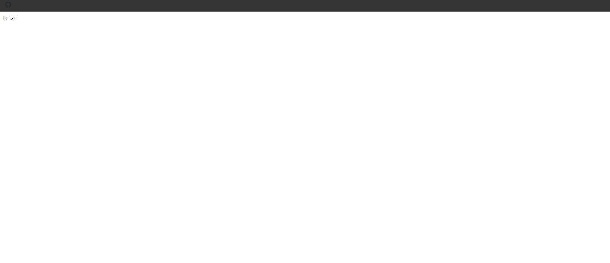

### Example 1

#### HTML

```HTML
<!DOCTYPE html>

<html>

    <head>

        <title>This is the title</title>

        <link rel="stylesheet" type="text/css" href="style.css">

    </head>

<body>

    <script src="js.js"></script>

</body>

</html>
```

#### JavaScript

```JavaScript
var people = [

    ["Joseph",27,"USA"],
    ["Maria",19,"Sri Lanka"],
    ["Brian",26,"India"],
    ["Susan", 15, "England"]

    ];

document.write("Joseph age is " + people[0][1]+"<br>")//This accessess joseph age element.
document.write("Susan is from " + people[3][2]);//This accesses susan country.

//Multidimensional Array is an array that contains another array.
```

### Output

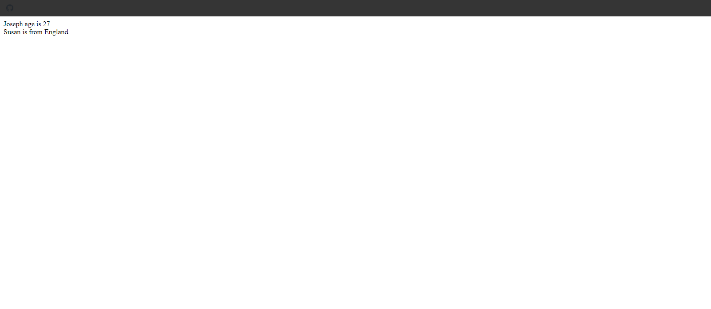

### Example 2

#### HTML

```HTML
<!DOCTYPE html>

<html>

    <head>

        <title>This is the title</title>

        <link rel="stylesheet" type="text/css" href="style.css">

    </head>

<body>

    <script src="js.js"></script>

</body>

</html>
```

#### JavaScript

```JavaScript
var people = [

    ["Joseph",27,"USA",["blue","black"]],
    ["Maria", 19, "Sri Lanka", ["green", "red"]],
    ["Brian",26,"India",["black","white"]],
    ["Susan", 15, "England",["Dark blue", "brown"]]

    ];

document.write("Joseph hair is " + people[0][3][1]+"<br>");
document.write("Susan eye color is " + people[3][3][0]);

//Multidimensional Array is an array that contains another array.
```

### Output

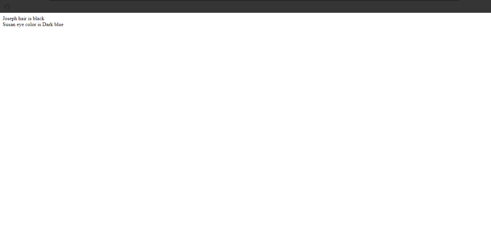

### Example 3

#### HTML

```HTML
<!DOCTYPE html>

<html>

    <head>

        <title>This is the title</title>

        <link rel="stylesheet" type="text/css" href="style.css">

    </head>

<body>

    <script src="js.js"></script>

</body>

</html>
```

#### JavaScript

```JavaScript
var people = [

    ["Joseph",27,"USA",["blue","black"]],
    ["Maria", 19, "Sri Lanka", ["green", "red"]],
    ["Brian",66,"India",["black","white"]],
    ["Susan", 15, "England",["Dark blue", "brown"]]

    ];

people[2][3][1] = "Black";//Change the brian hair color

document.write("Brain has dyed his hair as black "+people[2][3][1]);

//Multidimensional Array is an array that contains another array.
```

### Output

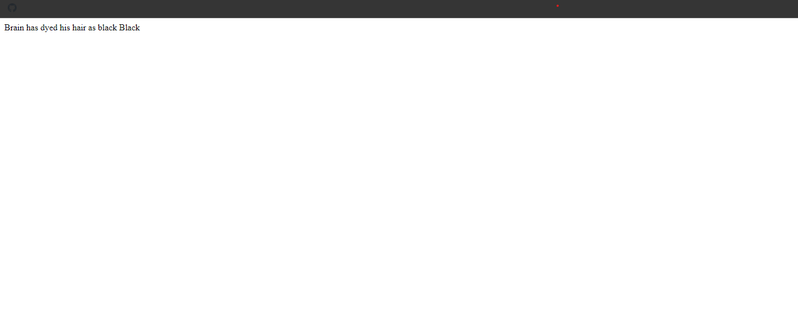

### Example 4

#### HTML

```HTML
<!DOCTYPE html>

<html>

    <head>

        <title>This is the title</title>

        <link rel="stylesheet" type="text/css" href="style.css">

    </head>

<body>

    <script src="js.js"></script>

</body>

</html>
```

#### JavaScript

```JavaScript
var people = [

    ["Joseph",27,"USA",["blue","black"]],
    ["Maria", 19, "Sri Lanka", ["green", "red"]],
    ["Brian",66,"India",["black","white"]],
    ["Susan", 15, "England",["Dark blue", "brown"]]

    ];

for (a = 0; a < people.length; a++) {

    document.write("<h1>Person "+(a+1)+"</h1>");

    for (details in people[a] ){

        document.write(people[a][details] + "<br>");

    }

}
//Multidimensional Array is an array that contains another array.
```

### Output


### Example 5

#### HTML

```HTML
<!DOCTYPE html>

<html>

    <head>

        <title>This is the title</title>

        <link rel="stylesheet" type="text/css" href="style.css">

    </head>

<body>

    <script src="js.js"></script>

</body>

</html>
```

#### JavaScript

```JavaScript
var people = [

    ["Joseph",27,"USA",["blue","black"]],
    ["Maria", 19, "Sri Lanka", ["green", "red"]],
    ["Brian",66,"India",["black","white"]],
    ["Susan", 15, "England",["Dark blue", "brown"]]

    ];

for (a = 0; a < people.length; a++) {

    document.write("<h1>Person "+(a+1)+"</h1>");

    for (details = 0; details < people[a].length; details = details+1) {

        document.write(people[a][details] + "<br>");

    }

}
//Multidimensional Array is an array that contains another array.
```

### Output

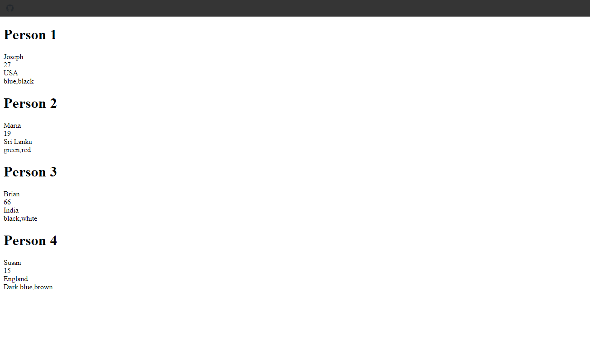

### Example 6

#### HTML

```HTML
<!DOCTYPE html>

<html>

    <head>

        <title>This is the title</title>

        <link rel="stylesheet" type="text/css" href="style.css">

    </head>

<body>

    <script src="js.js"></script>

</body>

</html>
```

#### JavaScript

```JavaScript
var people = [

    ["Joseph",27,"USA",["blue","black"]],
    ["Maria", 19, "Sri Lanka", ["green", "red"]],
    ["Brian",66,"India",["black","white"]],
    ["Susan", 15, "England",["Dark blue", "brown"]]

    ];

var a = 0;

while (a < people.length) {

    document.write("<h1> Person "+(a+1)+"</h1>")
    for (d in people[a]) {

        document.write(people[a][d]+"<br>");
    }
    a++;
}

//Multidimensional Array is an array that contains another array.
```

### Output

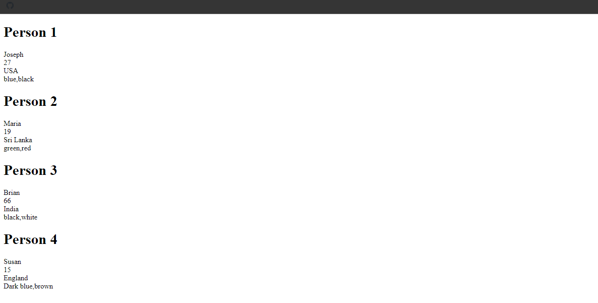

### Example 7

#### HTML

```HTML
<!DOCTYPE html>

<html>

    <head>

        <title>This is the title</title>

        <link rel="stylesheet" type="text/css" href="style.css">

    </head>

<body>

    <script src="js.js"></script>

</body>

</html>
```

#### JavaScript

```JavaScript
var people = [

    ["Joseph",27,"USA",["blue","black"]],
    ["Maria", 19, "Sri Lanka", ["green", "red"]],
    ["Brian",66,"India",["black","white"]],
    ["Susan", 15, "England",["Dark blue", "brown"]]

    ];

var a = 0;

while (a < people.length) {

    document.write("<h1> Person "+(a+1)+"</h1>")

    var d = 0;

    while (d < people[a].length) {

        document.write(people[a][d] + "<br>");
        d += 1;
    }
    a=a+1;
}
//Multidimensional Array is an array that contains another array.
```

### Output

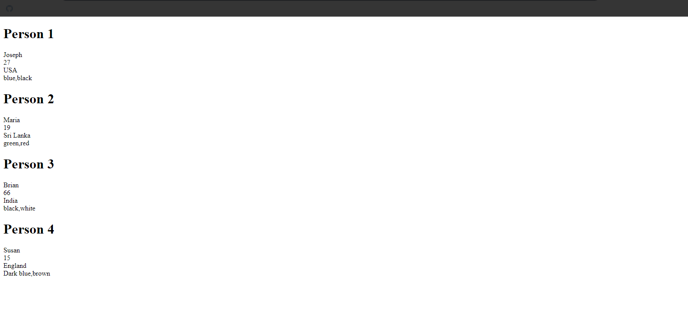

## 62. Multiphase Form Programming Snippets

### Example 0

#### HTML

```HTML
<!DOCTYPE html>

<html>

    <head>

        <title>This is the title</title>

        <link rel="stylesheet" type="text/css" href="style.css">

    </head>

<body>

   <progress id="porgress1" value="0" max="100" style="width:500px;background-color:greenyellow;"></progress>
    <h2 id="status">Phase 1 of 3</h2>

   <form id="multiphase" onsubmit="return false">

       <div id="phase1">

           Firstname:- <input type="text" id="firstname" name="firstname" /><br />
           Lastname:- <input type="text" id="lastname" name="lastname" /><br />
           <button onclick="processPhase1()">Continue</button>
       </div>

       <div id="phase2">

           Genter:<select id="genter" name="genter">

           <option value=""></option>
           <option value="Male">Male</option>
           <option value="Female">Female</option>

           </select><br />

           <button onclick="processPhase2()">Continue</button>
       </div>

       <div id="phase3">

           Country:<select id="country" name="country">

               <option value=""></option>
               <option value="USA">USA</option>
               <option value="Sri Lanka">Sri Lanka</option>

           </select><br />

           <button onclick="processPhase3()">Continue</button>
       </div>

       <div id="allData">

           Firstname:-<span id="dis_fname"></span><br />
           Lastname:-<span id="dis_lname"></span><br />
           Gender:-<span id="dis_gender"></span><br />
           Firstname:-<span id="dis_country"></span><br />
           <button onclick="submitForm()">Submit Data</button>
       </div>

   </form>

    <script src="js.js"></script>

</body>

</html>
```

#### CSS

```CSS
form#multiphase {

    border:2px solid black;
    padding:24px;
    width:350px;

}

form#multiphase >#phase2,#phase3,#allData {

    display:none;
}
```

#### JavaScript

```JavaScript
var fname, lname, gender, country;


function _(x) {

    return document.getElementById(x);
}

function processPhase1() {

    fname = _("firstname").value;
    lname = _("lastname").value;
    _("porgress1").value = 33;
    _("status").innerHTML = "Phase 2 of 3";

    if (fname.length > 2 && lname.length > 2) {

        _("phase1").style.display = "none";// When the user presses the continue button phase1 has to disapper.
        _("phase2").style.display = "block";//And the phase2 has to apper.


    } else {

        alert("Please Fill the fields");
    }


}


function processPhase2() {

    gender = _("genter").value;

    if (gender.length > 0) {

        _("phase2").style.display = "none";
        _("phase3").style.display = "block";
        _("porgress1").value = 66;
        _("status").innerHTML = "Phase 3 of 3";

    } else {

        alert("Please Choose your gender");
    }

}


function processPhase3() {

    country = _("country").value;

    if (country.length > 0) {

        _("phase3").style.display = "none";
        _("allData").style.display = "block";
        _("dis_fname").innerHTML = fname;
        _("dis_lname").innerHTML = lname;
        _("dis_gender").innerHTML = gender;
        _("dis_country").innerHTML = country;

        _("porgress1").value = 100;
        _("status").innerHTML = "Data Overview";

    } else {

        alert("Please Choose your country");
    }

}

function submitForm() {

    _("multiphase").method = "post";
    _("multiphase").action = "kuna.php";
    _("multiphase").submit();
}
```

### Output

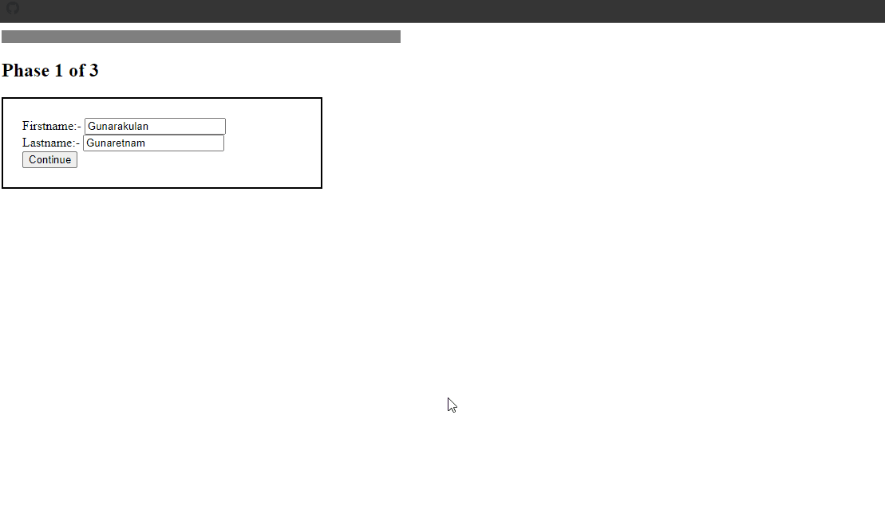

## 63. Page Loading Screen Document Preloader Snippets

### Example 0

#### HTML

```HTML
<!DOCTYPE html>

<html>

    <head>

        <title>This is the title</title>

        <link rel="stylesheet" type="text/css" href="style.css">

    </head>

<body>

    <div id="load_screen"><div id="loading">Loading Document</div></div>

    <script src="js.js"></script>

</body>

</html>
```

#### CSS

```CSS
div#load_screen {

    background:#000;
    opacity:1;
    position:fixed;
    z-index:10;
    top:0;
    width:100%;
    height:1600px;

}

div#load_screen  div#loading{

    color:#fff;
    width:120px;
    height:24px;
    margin:300px auto;

}
```
#### JavaScript

```JavaScript
window.addEventListener("load", function () {

    var load_screen = document.getElementById("load_screen");
    document.body.removeChild(load_screen);

});

//This is program means one the full document of the webpage load succsesfully delete the load_screen or display it untill it loads fully.
```

### Output

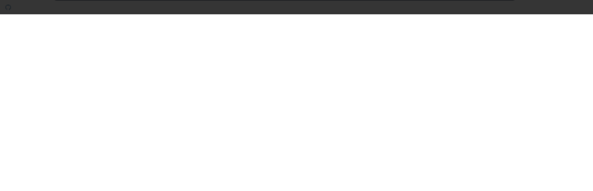

## 64. Parallax Scroll Effect Tutorial Snippets

### Example 0

#### HTML

```HTML
<!DOCTYPE html>

<html>

    <head>

        <title>This is the title</title>

        <link rel="stylesheet" type="text/css" href="style.css">

    </head>

<body>

    <div id="prlx_lyr_1"></div>
    <div id="content_layer">

      <script>

          var a = 0;

          for (a = 0; a < 80; a++) {

              document.write("<h1> Doument " + (a + 1) + "</h1>");
          }

      </script>

    </div>

    <script src="js.js"></script>

</body>

</html>
```

#### CSS

```CSS
body {

    margin:0;

}

#prlx_lyr_1 {

    position:fixed;
    background:url(box1.png) no-repeat 0px 200px; /*0px 200px position value 0px is left 200px is top*/
    width:100%;
    height:800px;

}
#content_layer {

    position:absolute;

}
```

#### JavaScript

```JavaScript
function paralex() {

   var k=  document.getElementById("prlx_lyr_1");
   k.style.top = window.pageYOffset + "px";//window.pageYOffset  works as downwords but if you put -window.pageYOffset it will work upwords

}

window.addEventListener("scroll", paralex);
```

### Output

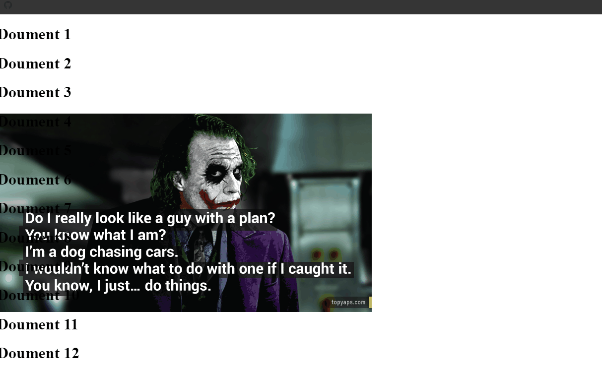

### Example 1

#### HTML

```HTML
<!DOCTYPE html>

<html>

    <head>

        <title>This is the title</title>

        <link rel="stylesheet" type="text/css" href="style.css">

    </head>

<body>

    <div id="prlx_lyr_1"></div>
    <div id="content_layer">

      <script>

          var a = 0;

          for (a = 0; a < 80; a++) {

              document.write("<h1> Doument " + (a + 1) + "</h1>");
          }

      </script>

    </div>

    <script src="js.js"></script>

</body>

</html>
```

#### CSS

```CSS
body {

    margin:0;

}

#prlx_lyr_1 {

    position:fixed;
    background:url(box1.png) no-repeat 0px 200px; /*0px 200px position value 0px is left 200px is top*/
    width:100%;
    height:800px;
=
}
#content_layer {

    position:absolute;

}
```

#### JavaScript

```JavaScript
function paralex() {

   var k=  document.getElementById("prlx_lyr_1");
   k.style.top = -window.pageYOffset + "px";//It will work as upwords
}

window.addEventListener("scroll", paralex);
```

### Output


### Example 2

#### HTML

```HTML
<!DOCTYPE html>

<html>

    <head>

        <title>This is the title</title>

        <link rel="stylesheet" type="text/css" href="style.css">

    </head>

<body>

    <div id="prlx_lyr_1"></div>
    <div id="content_layer">

      <script>

          var a = 0;

          for (a = 0; a < 80; a++) {

              document.write("<h1> Doument " + (a + 1) + "</h1>");
          }

      </script>

    </div>

    <script src="js.js"></script>

</body>

</html>
```

#### CSS

```CSS
body {

    margin:0;

}

#prlx_lyr_1 {

    position:fixed;
    background:url(box1.png) no-repeat 0px 200px; /*0px 200px position value 0px is left 200px is top*/
    width:100%;
    height:800px;

}
#content_layer {

    position:absolute;

}
```

#### JavaScript

```JavaScript
function paralex() {

   var k=  document.getElementById("prlx_lyr_1");
   k.style.top = -(window.pageYOffset/4) + "px";//4 is the speed value. if you give higher number it will be very slow.
}

window.addEventListener("scroll", paralex);
```

### Output


### Example 3

#### HTML

```HTML
<!DOCTYPE html>

<html>

    <head>

        <title>This is the title</title>

        <link rel="stylesheet" type="text/css" href="style.css">

    </head>

<body>

    <div id="prlx_lyr_1"></div>
    <div id="content_layer">

      <script>

          var a = 0;

          for (a = 0; a < 80; a++) {

              document.write("<h1> Doument " + (a + 1) + "</h1>");
          }

      </script>

    </div>

    <script src="js.js"></script>

</body>

</html>
```

#### CSS

```CSS
body {

    margin:0;

}

#prlx_lyr_1 {

    position:fixed;
    background:url(box1.png) no-repeat 0px 200px;/*0px 200px position value 0px is left 200px is top*/
    width:100%;
    height:800px;

}
#content_layer {

    position:absolute;

}
```

#### JavaScript

```JavaScript
function paralex() {

   var k=  document.getElementById("prlx_lyr_1");
   k.style.top = -(window.pageYOffset/18) + "px";//4 is the speed value. if you give higher number it will be very slow.
}

window.addEventListener("scroll", paralex);
```

### Output


### Example 4

#### HTML

```HTML
<!DOCTYPE html>

<html>

    <head>

        <title>This is the title</title>

        <link rel="stylesheet" type="text/css" href="style.css">

    </head>

<body>

    <div id="prlx_lyr_1"></div>
    <div id="prlx_lyr_2"></div>

    <div id="content_layer">

      <script>

          var a = 0;

          for (a = 0; a < 80; a++) {

              document.write("<h1> Doument " + (a + 1) + "</h1>");
          }

      </script>

    </div>

    <script src="js.js"></script>

</body>

</html>
```

#### CSS

```CSS
body {

    margin:0;

}

#prlx_lyr_1 {

    position:fixed;
    background:url(box1.png) no-repeat 0px 200px; /*0px 200px position value 0px is left 200px is top*/
    width:100%;
    height:800px;

}

#prlx_lyr_2 {

    position:fixed;
    background:url(box2.jpg) no-repeat 800px 300px;
    width:100%;
    height:600px;

}
#content_layer {

    position:absolute;

}
```

#### JavaScript

```JavaScript
function paralex() {

    var box1 = document.getElementById("prlx_lyr_1");
    var box2 = document.getElementById("prlx_lyr_2");
    box1.style.top = -(window.pageYOffset / 4) + "px";
    box2.style.top = -(window.pageYOffset / 14) + "px";
}

window.addEventListener("scroll", paralex);
```

### Output

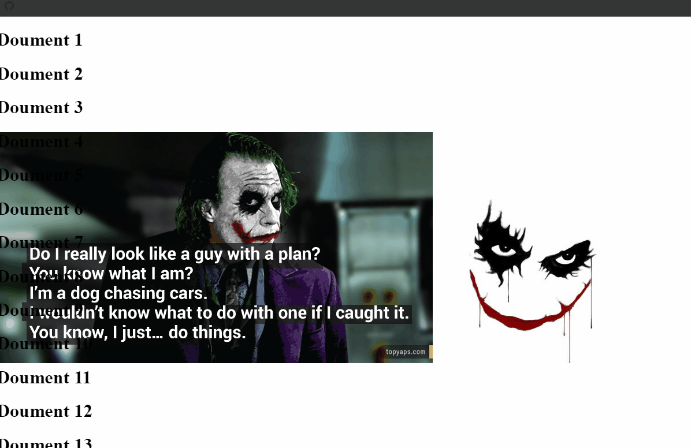

## 65. Partial Print Document Snippets

### Example 0

#### HTML

```HTML
<!DOCTYPE html>

<html>

    <head>

        <title>This is the title</title>

        <link rel="stylesheet" type="text/css" href="style.css">

    </head>

<body>

    <div id="div1">Content 1</div>

    <button onclick="printContent('div1')">Print div 1</button>

    <div id="div2">Content 2</div>

    <button onclick="printContent('div2')">Print div 2</button>

    <p id="p1">Paragrph div1</p>

    <button onclick="printContent('p1')">Print P1</button>

    <script src="js.js"></script>

</body>

</html>
```

#### JavaScript

```JavaScript
function printContent(ele) {

    var restorepage = document.body.innerHTML//This will allow to pack everthing whithin the body element to the restorepage variable.
    var printContent = document.getElementById(ele).innerHTML;
    document.body.innerHTML = printContent;//We take the document.body.innerHTML and made it eqaul to only printContent.This means document.body.innerHTML only eqaul to printContent.
    window.print();//Then we run the print method if we only run window.print() method it will allow to print the whole document.
    document.body.innerHTML = restorepage;//after the printing i restored the the original HTML.

}
```

### Output


## 66. Peekaboo Box Tutorial Scroll Bottom Snippets

### Example 0

#### HTML

```HTML
<!DOCTYPE html>

<html>

    <head>

        <title>This is the title</title>

        <link rel="stylesheet" type="text/css" href="style.css">

    </head>

<body>

    <h1>Scroll bottom Y handler Funtion</h1>

    <p style="height:1600px; font-size:18px">Scroll the bottom of the page to see peekaboo box &darr;</p>

    <div id="peekaboo">Peekaboo</div>

    <script src="js.js"></script>

</body>

</html>
```

#### CSS

```CSS
#peekaboo {

    position:fixed;
    bottom:0;
    right:-352px;/* To hide the box*/
    background:#c4e6ff;
    padding:25px;
    width:300px;
    height:200px;
    font-size:48px;
}
```

#### JavaScript

```JavaScript
function yScrollHandler() {

    var win = document.getElementById("peekaboo");

    if ((window.pageYOffset + window.innerHeight) >= document.body.offsetHeight) {

        win.style.transition = "right 0.7s ease-in-out 0s";
        win.style.right = "0px";
    } else {

        win.style.transition = "right 0.7s ease-in-out 0s";
        win.style.right = "-352px";

    }
}

window.onscroll = yScrollHandler;

/*Notes
*pageYOffset method returns the scroll position value.
*InnrHeight returns the height of the window object.
*offsetHeight returns the webpage height.
*/
```

### Output

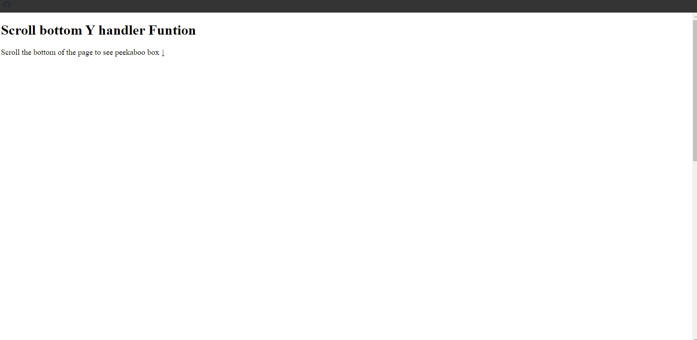
