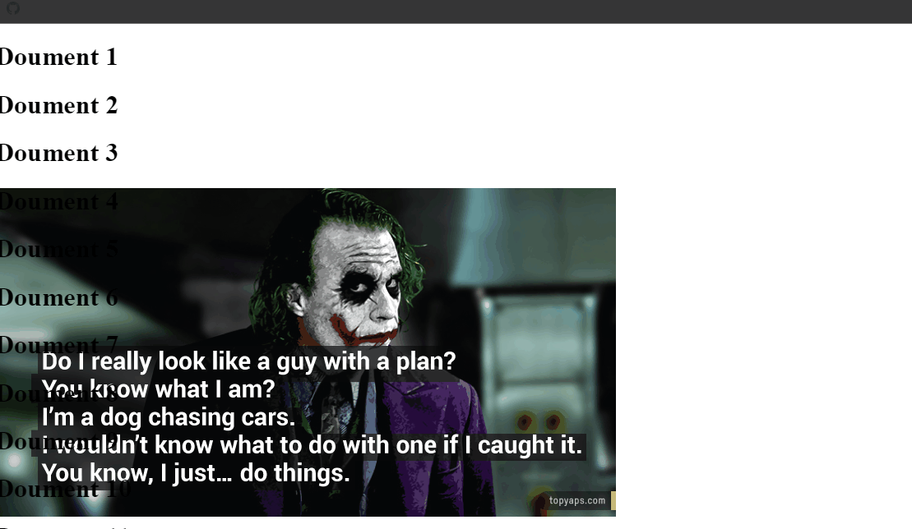

## 61. Multidimensional Array Snippets

### Example 0

#### HTML

```HTML
<!DOCTYPE html>

<html>

    <head>

        <title>This is the title</title>

        <link rel="stylesheet" type="text/css" href="style.css">

    </head>

<body>

    <script src="js.js"></script>

</body>

</html>
```

#### JavaScript

```JavaScript
var people = ["Joseph", "Maria", "Brian", "Susan"];

document.write(people[2]);//This will get the third element in the array that is Brian.
```

### Output


### Example 1

#### HTML

```HTML
<!DOCTYPE html>

<html>

    <head>

        <title>This is the title</title>

        <link rel="stylesheet" type="text/css" href="style.css">

    </head>

<body>

    <script src="js.js"></script>

</body>

</html>
```

#### JavaScript

```JavaScript
var people = [

    ["Joseph",27,"USA"],
    ["Maria",19,"Sri Lanka"],
    ["Brian",26,"India"],
    ["Susan", 15, "England"]

    ];

document.write("Joseph age is " + people[0][1]+"<br>")//This accessess joseph age element.
document.write("Susan is from " + people[3][2]);//This accesses susan country.

//Multidimensional Array is an array that contains another array.
```

### Output


### Example 2

#### HTML

```HTML
<!DOCTYPE html>

<html>

    <head>

        <title>This is the title</title>

        <link rel="stylesheet" type="text/css" href="style.css">

    </head>

<body>

    <script src="js.js"></script>

</body>

</html>
```

#### JavaScript

```JavaScript
var people = [

    ["Joseph",27,"USA",["blue","black"]],
    ["Maria", 19, "Sri Lanka", ["green", "red"]],
    ["Brian",26,"India",["black","white"]],
    ["Susan", 15, "England",["Dark blue", "brown"]]

    ];

document.write("Joseph hair is " + people[0][3][1]+"<br>");
document.write("Susan eye color is " + people[3][3][0]);

//Multidimensional Array is an array that contains another array.
```

### Output


### Example 3

#### HTML

```HTML
<!DOCTYPE html>

<html>

    <head>

        <title>This is the title</title>

        <link rel="stylesheet" type="text/css" href="style.css">

    </head>

<body>

    <script src="js.js"></script>

</body>

</html>
```

#### JavaScript

```JavaScript
var people = [

    ["Joseph",27,"USA",["blue","black"]],
    ["Maria", 19, "Sri Lanka", ["green", "red"]],
    ["Brian",66,"India",["black","white"]],
    ["Susan", 15, "England",["Dark blue", "brown"]]

    ];

people[2][3][1] = "Black";//Change the brian hair color

document.write("Brain has dyed his hair as black "+people[2][3][1]);

//Multidimensional Array is an array that contains another array.
```

### Output


### Example 4

#### HTML

```HTML
<!DOCTYPE html>

<html>

    <head>

        <title>This is the title</title>

        <link rel="stylesheet" type="text/css" href="style.css">

    </head>

<body>

    <script src="js.js"></script>

</body>

</html>
```

#### JavaScript

```JavaScript
var people = [

    ["Joseph",27,"USA",["blue","black"]],
    ["Maria", 19, "Sri Lanka", ["green", "red"]],
    ["Brian",66,"India",["black","white"]],
    ["Susan", 15, "England",["Dark blue", "brown"]]

    ];

for (a = 0; a < people.length; a++) {

    document.write("<h1>Person "+(a+1)+"</h1>");

    for (details in people[a] ){

        document.write(people[a][details] + "<br>");

    }

}
//Multidimensional Array is an array that contains another array.
```

### Output


### Example 5

#### HTML

```HTML
<!DOCTYPE html>

<html>

    <head>

        <title>This is the title</title>

        <link rel="stylesheet" type="text/css" href="style.css">

    </head>

<body>

    <script src="js.js"></script>

</body>

</html>
```

#### JavaScript

```JavaScript
var people = [

    ["Joseph",27,"USA",["blue","black"]],
    ["Maria", 19, "Sri Lanka", ["green", "red"]],
    ["Brian",66,"India",["black","white"]],
    ["Susan", 15, "England",["Dark blue", "brown"]]

    ];

for (a = 0; a < people.length; a++) {

    document.write("<h1>Person "+(a+1)+"</h1>");

    for (details = 0; details < people[a].length; details = details+1) {

        document.write(people[a][details] + "<br>");

    }

}
//Multidimensional Array is an array that contains another array.
```

### Output


### Example 6

#### HTML

```HTML
<!DOCTYPE html>

<html>

    <head>

        <title>This is the title</title>

        <link rel="stylesheet" type="text/css" href="style.css">

    </head>

<body>

    <script src="js.js"></script>

</body>

</html>
```

#### JavaScript

```JavaScript
var people = [

    ["Joseph",27,"USA",["blue","black"]],
    ["Maria", 19, "Sri Lanka", ["green", "red"]],
    ["Brian",66,"India",["black","white"]],
    ["Susan", 15, "England",["Dark blue", "brown"]]

    ];

var a = 0;

while (a < people.length) {

    document.write("<h1> Person "+(a+1)+"</h1>")
    for (d in people[a]) {

        document.write(people[a][d]+"<br>");
    }
    a++;
}

//Multidimensional Array is an array that contains another array.
```

### Output


### Example 7

#### HTML

```HTML
<!DOCTYPE html>

<html>

    <head>

        <title>This is the title</title>

        <link rel="stylesheet" type="text/css" href="style.css">

    </head>

<body>

    <script src="js.js"></script>

</body>

</html>
```

#### JavaScript

```JavaScript
var people = [

    ["Joseph",27,"USA",["blue","black"]],
    ["Maria", 19, "Sri Lanka", ["green", "red"]],
    ["Brian",66,"India",["black","white"]],
    ["Susan", 15, "England",["Dark blue", "brown"]]

    ];

var a = 0;

while (a < people.length) {

    document.write("<h1> Person "+(a+1)+"</h1>")

    var d = 0;

    while (d < people[a].length) {

        document.write(people[a][d] + "<br>");
        d += 1;
    }
    a=a+1;
}
//Multidimensional Array is an array that contains another array.
```

### Output


## 62. Multiphase Form Programming Snippets

### Example 0

#### HTML

```HTML
<!DOCTYPE html>

<html>

    <head>

        <title>This is the title</title>

        <link rel="stylesheet" type="text/css" href="style.css">

    </head>

<body>

   <progress id="porgress1" value="0" max="100" style="width:500px;background-color:greenyellow;"></progress>
    <h2 id="status">Phase 1 of 3</h2>

   <form id="multiphase" onsubmit="return false">

       <div id="phase1">

           Firstname:- <input type="text" id="firstname" name="firstname" /><br />
           Lastname:- <input type="text" id="lastname" name="lastname" /><br />
           <button onclick="processPhase1()">Continue</button>
       </div>

       <div id="phase2">

           Genter:<select id="genter" name="genter">

           <option value=""></option>
           <option value="Male">Male</option>
           <option value="Female">Female</option>

           </select><br />

           <button onclick="processPhase2()">Continue</button>
       </div>

       <div id="phase3">

           Country:<select id="country" name="country">

               <option value=""></option>
               <option value="USA">USA</option>
               <option value="Sri Lanka">Sri Lanka</option>

           </select><br />

           <button onclick="processPhase3()">Continue</button>
       </div>

       <div id="allData">

           Firstname:-<span id="dis_fname"></span><br />
           Lastname:-<span id="dis_lname"></span><br />
           Gender:-<span id="dis_gender"></span><br />
           Firstname:-<span id="dis_country"></span><br />
           <button onclick="submitForm()">Submit Data</button>
       </div>

   </form>

    <script src="js.js"></script>

</body>

</html>
```

#### CSS

```CSS
form#multiphase {

    border:2px solid black;
    padding:24px;
    width:350px;

}

form#multiphase >#phase2,#phase3,#allData {

    display:none;
}
```

#### JavaScript

```JavaScript
var fname, lname, gender, country;


function _(x) {

    return document.getElementById(x);
}

function processPhase1() {

    fname = _("firstname").value;
    lname = _("lastname").value;
    _("porgress1").value = 33;
    _("status").innerHTML = "Phase 2 of 3";

    if (fname.length > 2 && lname.length > 2) {

        _("phase1").style.display = "none";// When the user presses the continue button phase1 has to disapper.
        _("phase2").style.display = "block";//And the phase2 has to apper.


    } else {

        alert("Please Fill the fields");
    }


}


function processPhase2() {

    gender = _("genter").value;

    if (gender.length > 0) {

        _("phase2").style.display = "none";
        _("phase3").style.display = "block";
        _("porgress1").value = 66;
        _("status").innerHTML = "Phase 3 of 3";

    } else {

        alert("Please Choose your gender");
    }

}


function processPhase3() {

    country = _("country").value;

    if (country.length > 0) {

        _("phase3").style.display = "none";
        _("allData").style.display = "block";
        _("dis_fname").innerHTML = fname;
        _("dis_lname").innerHTML = lname;
        _("dis_gender").innerHTML = gender;
        _("dis_country").innerHTML = country;

        _("porgress1").value = 100;
        _("status").innerHTML = "Data Overview";

    } else {

        alert("Please Choose your country");
    }

}

function submitForm() {

    _("multiphase").method = "post";
    _("multiphase").action = "kuna.php";
    _("multiphase").submit();
}
```

### Output


## 63. Page Loading Screen Document Preloader Snippets

### Example 0

#### HTML

```HTML
<!DOCTYPE html>

<html>

    <head>

        <title>This is the title</title>

        <link rel="stylesheet" type="text/css" href="style.css">

    </head>

<body>

    <div id="load_screen"><div id="loading">Loading Document</div></div>

    <script src="js.js"></script>

</body>

</html>
```

#### CSS

```CSS
div#load_screen {

    background:#000;
    opacity:1;
    position:fixed;
    z-index:10;
    top:0;
    width:100%;
    height:1600px;

}

div#load_screen  div#loading{

    color:#fff;
    width:120px;
    height:24px;
    margin:300px auto;

}
```
#### JavaScript

```JavaScript
window.addEventListener("load", function () {

    var load_screen = document.getElementById("load_screen");
    document.body.removeChild(load_screen);

});

//This is program means one the full document of the webpage load succsesfully delete the load_screen or display it untill it loads fully.
```

### Output


## 64. Parallax Scroll Effect Tutorial Snippets

### Example 0

#### HTML

```HTML
<!DOCTYPE html>

<html>

    <head>

        <title>This is the title</title>

        <link rel="stylesheet" type="text/css" href="style.css">

    </head>

<body>

    <div id="prlx_lyr_1"></div>
    <div id="content_layer">

      <script>

          var a = 0;

          for (a = 0; a < 80; a++) {

              document.write("<h1> Doument " + (a + 1) + "</h1>");
          }

      </script>

    </div>

    <script src="js.js"></script>

</body>

</html>
```

#### CSS

```CSS
body {

    margin:0;

}

#prlx_lyr_1 {

    position:fixed;
    background:url(box1.png) no-repeat 0px 200px; /*0px 200px position value 0px is left 200px is top*/
    width:100%;
    height:800px;

}
#content_layer {

    position:absolute;

}
```

#### JavaScript

```JavaScript
function paralex() {

   var k=  document.getElementById("prlx_lyr_1");
   k.style.top = window.pageYOffset + "px";//window.pageYOffset  works as downwords but if you put -window.pageYOffset it will work upwords

}

window.addEventListener("scroll", paralex);
```

### Output


### Example 1

#### HTML

```HTML
<!DOCTYPE html>

<html>

    <head>

        <title>This is the title</title>

        <link rel="stylesheet" type="text/css" href="style.css">

    </head>

<body>

    <div id="prlx_lyr_1"></div>
    <div id="content_layer">

      <script>

          var a = 0;

          for (a = 0; a < 80; a++) {

              document.write("<h1> Doument " + (a + 1) + "</h1>");
          }

      </script>

    </div>

    <script src="js.js"></script>

</body>

</html>
```

#### CSS

```CSS
body {

    margin:0;

}

#prlx_lyr_1 {

    position:fixed;
    background:url(box1.png) no-repeat 0px 200px; /*0px 200px position value 0px is left 200px is top*/
    width:100%;
    height:800px;
=
}
#content_layer {

    position:absolute;

}
```

#### JavaScript

```JavaScript
function paralex() {

   var k=  document.getElementById("prlx_lyr_1");
   k.style.top = -window.pageYOffset + "px";//It will work as upwords
}

window.addEventListener("scroll", paralex);
```

### Output


### Example 2

#### HTML

```HTML
<!DOCTYPE html>

<html>

    <head>

        <title>This is the title</title>

        <link rel="stylesheet" type="text/css" href="style.css">

    </head>

<body>

    <div id="prlx_lyr_1"></div>
    <div id="content_layer">

      <script>

          var a = 0;

          for (a = 0; a < 80; a++) {

              document.write("<h1> Doument " + (a + 1) + "</h1>");
          }

      </script>

    </div>

    <script src="js.js"></script>

</body>

</html>
```

#### CSS

```CSS
body {

    margin:0;

}

#prlx_lyr_1 {

    position:fixed;
    background:url(box1.png) no-repeat 0px 200px; /*0px 200px position value 0px is left 200px is top*/
    width:100%;
    height:800px;

}
#content_layer {

    position:absolute;

}
```

#### JavaScript

```JavaScript
function paralex() {

   var k=  document.getElementById("prlx_lyr_1");
   k.style.top = -(window.pageYOffset/4) + "px";//4 is the speed value. if you give higher number it will be very slow.
}

window.addEventListener("scroll", paralex);
```

### Output


### Example 3

#### HTML

```HTML
<!DOCTYPE html>

<html>

    <head>

        <title>This is the title</title>

        <link rel="stylesheet" type="text/css" href="style.css">

    </head>

<body>

    <div id="prlx_lyr_1"></div>
    <div id="content_layer">

      <script>

          var a = 0;

          for (a = 0; a < 80; a++) {

              document.write("<h1> Doument " + (a + 1) + "</h1>");
          }

      </script>

    </div>

    <script src="js.js"></script>

</body>

</html>
```

#### CSS

```CSS
body {

    margin:0;

}

#prlx_lyr_1 {

    position:fixed;
    background:url(box1.png) no-repeat 0px 200px;/*0px 200px position value 0px is left 200px is top*/
    width:100%;
    height:800px;

}
#content_layer {

    position:absolute;

}
```

#### JavaScript

```JavaScript
function paralex() {

   var k=  document.getElementById("prlx_lyr_1");
   k.style.top = -(window.pageYOffset/18) + "px";//4 is the speed value. if you give higher number it will be very slow.
}

window.addEventListener("scroll", paralex);
```

### Output



### Example 4

#### HTML

```HTML
<!DOCTYPE html>

<html>

    <head>

        <title>This is the title</title>

        <link rel="stylesheet" type="text/css" href="style.css">

    </head>

<body>

    <div id="prlx_lyr_1"></div>
    <div id="prlx_lyr_2"></div>

    <div id="content_layer">

      <script>

          var a = 0;

          for (a = 0; a < 80; a++) {

              document.write("<h1> Doument " + (a + 1) + "</h1>");
          }

      </script>

    </div>

    <script src="js.js"></script>

</body>

</html>
```

#### CSS

```CSS
body {

    margin:0;

}

#prlx_lyr_1 {

    position:fixed;
    background:url(box1.png) no-repeat 0px 200px; /*0px 200px position value 0px is left 200px is top*/
    width:100%;
    height:800px;

}

#prlx_lyr_2 {

    position:fixed;
    background:url(box2.jpg) no-repeat 800px 300px;
    width:100%;
    height:600px;

}
#content_layer {

    position:absolute;

}
```

#### JavaScript

```JavaScript
function paralex() {

    var box1 = document.getElementById("prlx_lyr_1");
    var box2 = document.getElementById("prlx_lyr_2");
    box1.style.top = -(window.pageYOffset / 4) + "px";
    box2.style.top = -(window.pageYOffset / 14) + "px";
}

window.addEventListener("scroll", paralex);
```

### Output


## 65. Partial Print Document Snippets

### Example 0

#### HTML

```HTML
<!DOCTYPE html>

<html>

    <head>

        <title>This is the title</title>

        <link rel="stylesheet" type="text/css" href="style.css">

    </head>

<body>

    <div id="div1">Content 1</div>

    <button onclick="printContent('div1')">Print div 1</button>

    <div id="div2">Content 2</div>

    <button onclick="printContent('div2')">Print div 2</button>

    <p id="p1">Paragrph div1</p>

    <button onclick="printContent('p1')">Print P1</button>

    <script src="js.js"></script>

</body>

</html>
```

#### JavaScript

```JavaScript
function printContent(ele) {

    var restorepage = document.body.innerHTML//This will allow to pack everthing whithin the body element to the restorepage variable.
    var printContent = document.getElementById(ele).innerHTML;
    document.body.innerHTML = printContent;//We take the document.body.innerHTML and made it eqaul to only printContent.This means document.body.innerHTML only eqaul to printContent.
    window.print();//Then we run the print method if we only run window.print() method it will allow to print the whole document.
    document.body.innerHTML = restorepage;//after the printing i restored the the original HTML.

}
```

### Output


## 66. Peekaboo Box Tutorial Scroll Bottom Snippets

### Example 0

#### HTML

```HTML
<!DOCTYPE html>

<html>

    <head>

        <title>This is the title</title>

        <link rel="stylesheet" type="text/css" href="style.css">

    </head>

<body>

    <h1>Scroll bottom Y handler Funtion</h1>

    <p style="height:1600px; font-size:18px">Scroll the bottom of the page to see peekaboo box &darr;</p>

    <div id="peekaboo">Peekaboo</div>

    <script src="js.js"></script>

</body>

</html>
```

#### CSS

```CSS
#peekaboo {

    position:fixed;
    bottom:0;
    right:-352px;/* To hide the box*/
    background:#c4e6ff;
    padding:25px;
    width:300px;
    height:200px;
    font-size:48px;
}
```

#### JavaScript

```JavaScript
function yScrollHandler() {

    var win = document.getElementById("peekaboo");

    if ((window.pageYOffset + window.innerHeight) >= document.body.offsetHeight) {

        win.style.transition = "right 0.7s ease-in-out 0s";
        win.style.right = "0px";
    } else {

        win.style.transition = "right 0.7s ease-in-out 0s";
        win.style.right = "-352px";

    }
}

window.onscroll = yScrollHandler;

/*Notes
*pageYOffset method returns the scroll position value.
*InnrHeight returns the height of the window object.
*offsetHeight returns the webpage height.
*/
```

### Output


## 67. Percent Math Calculations Programming Snippets

### Example 0

#### HTML

```HTML
<!DOCTYPE html>

<html>

    <head>

        <title>This is the title</title>

        <link rel="stylesheet" type="text/css" href="style.css">

    </head>

<body>

    <script src="js.js"></script>

</body>

</html>
```

#### JavaScript

```JavaScript
var price = 150;
var sale = 25;
var savings = (price * sale) / 100;
var salePrice = price - savings;

document.write("Original price $ " + price.toFixed(2) + "<br>");
document.write("Sale: " + sale +"%"+ "<br>");
document.write("Saving " + savings + "<br>");
document.write("The salePrice " + salePrice);
```

### Output


### Example 1

#### HTML

```HTML
<!DOCTYPE html>

<html>

    <head>

        <title>This is the title</title>

        <link rel="stylesheet" type="text/css" href="style.css">

    </head>

<body>

  <div id="bar1">

      <div></div>

  </div>

    <script src="js.js"></script>

</body>

</html>
```

#### CSS

```CSS
div#bar1 {

    width:500px;
    height:40px;
    background:#eee;

}

div#bar1 >div {

   position:relative;/*This way we can access the position dynamically*/
   width:3px;
   height:40px;
   background:#000;

}
```

#### JavaScript

```JavaScript
var bar1 = document.getElementById("bar1");
var precent = 50;
var newleft = Math.round(bar1.offsetWidth * precent) / 100;
bar1.children[0].style.left = newleft+"px";
```

### Output


### Example 2

#### HTML

```HTML
<!DOCTYPE html>

<html>

    <head>

        <title>This is the title</title>

        <link rel="stylesheet" type="text/css" href="style.css">

    </head>

<body>

  <div id="bar1">

      <div></div>

  </div>

    <script src="js.js"></script>

</body>

</html>
```

#### CSS

```CSS
div#bar1 {

    width:500px;
    height:40px;
    background:#eee;

}

div#bar1 >div {

   position:relative;/*This way we can access the position dynamically*/
   width:35px;
   height:40px;
   background:#000;

}
```

#### JavaScript

```JavaScript
var bar1 = document.getElementById("bar1");
var precent = 50;
var newleft = Math.round(bar1.offsetWidth * precent) / 100;
bar1.children[0].style.left = newleft - bar1.children[0].offsetWidth / 2 + "px";//This code is center corrcetly even if the width of the div is heigh.
```

### Output


### Example 3

#### HTML

```HTML
<!DOCTYPE html>

<html>

    <head>

        <title>This is the title</title>

        <link rel="stylesheet" type="text/css" href="style.css">

    </head>

<body>

    <script src="js.js"></script>

</body>

</html>
```

#### JavaScript

```JavaScript
var v1 = 150;
var v2 = 80;
var diffPercent = (((v1 - v2) / v1) * 100).toFixed(2);
document.write(v2 + " is " + diffPercent + " % samler than " + v1);
```

### Output


## 68. Read Mouse Coordinates Position X and Y Snippets

### Example 0

#### HTML

```HTML
<!DOCTYPE html>

<html>

    <head>

        <title>This is the title</title>

        <link rel="stylesheet" type="text/css" href="style.css">

    </head>

<body>

    <h1>Document that reads mouse movement</h1>

    <h2 id="result_x">0</h2>
    <h2 id="result_y">0</h2>

    <script src="js.js"></script>

</body>

</html>
```

#### JavaScript

```JavaScript
window.addEventListener("mousemove", readMouseMove);

function readMouseMove(event) {

    var resualtX = document.getElementById("result_x");
    var resualtY = document.getElementById("result_y");

    resualtX.innerHTML = event.clientX;
    resualtY.innerHTML = event.clientY;

}
```

### Output


## 69. Real Time Text Input Filter Tutorial Program Textarea Snippets

### Example 0

#### HTML

```HTML
<!DOCTYPE html>

<html>

    <head>

        <title>This is the title</title>

        <link rel="stylesheet" type="text/css" href="style.css">

    </head>

<body>

    <textarea id="ta" onkeyup="clean('ta')" onkeydown="clean('ta')"></textarea>

    <script src="js.js"></script>

</body>

</html>
```

### Output


### Example 1

#### HTML

```HTML
<!DOCTYPE html>

<html>

    <head>

        <title>This is the title</title>

        <link rel="stylesheet" type="text/css" href="style.css">

    </head>

<body>

    <textarea id="ta" onkeyup="clean('ta')" onkeydown="clean('ta')"></textarea>

    <script src="js.js"></script>

</body>

</html>
```

#### JavaScript

```JavaScript
function clean(e) {

    var texts = document.getElementById(e);
    var regExp = /[^a-z]/ig;//This line of code means we want to raplace everyting that is not these charactors.
    texts.value = texts.value.replace(regExp, "");

}
```

### Output


### Example 2

#### HTML

```HTML
<!DOCTYPE html>

<html>

    <head>

        <title>This is the title</title>

        <link rel="stylesheet" type="text/css" href="style.css">

    </head>

<body>

    <textarea id="ta" onkeyup="clean('ta')" onkeydown="clean('ta')"></textarea>

    <script src="js.js"></script>

</body>

</html>
```

#### JavaScript

```JavaScript
function clean(e) {

    var texts = document.getElementById(e);
    var regExp = /[^a-z 0-9?!.,]/ig;//This line of code means we want to raplace everyting that is not these Characters.
    texts.value = texts.value.replace(regExp, "");

}
```

### Output


### Example 3

#### HTML

```HTML
<!DOCTYPE html>

<html>

    <head>

        <title>This is the title</title>

       <style>

	   </style>

    </head>

    <body>

	  <textarea id="txt1" col="5" rows="5"></textarea>

	<h1 id="display1"></h1>

          <script src="js.js"></script>

    </body>

</html>
```

#### JavaScript

```JavaScript
window.onload=function(){

	document.getElementById("txt1").addEventListener("keydown",clearing);
	document.getElementById("txt1").addEventListener("keyup",clearing);

}

function clearing(){

	var textFiled=document.getElementById("txt1");
	var regExp=/[^a-z 0-9]/gi;

	if(textFiled.value.search(regExp)>-1){

		document.getElementById("display1").innerHTML="We only allow [a-z,0-9]";
		textFiled.value=textFiled.value.replace(regExp,"");
	}

}

/*Notes
*This is program only allow [a-z,0-9];
*/
```

### Output


## 70. Restrict Text Input Characters Snippets

### Example 0

#### HTML

```HTML
<!DOCTYPE html>

<html>

    <head>

        <title>This is the title</title>

        <link rel="stylesheet" type="text/css" href="style.css">

    </head>

<body>

    <input type="text" placeholder="Firstname" onkeyup="letteronly(this)" />
    <input type="text" placeholder="Lasttname" onkeyup="letteronly(this)" />

    <script src="js.js"></script>

</body>

</html>
```

#### JavaScript

```JavaScript
function letteronly(inputs) {

    var regExps = /[^a-z]/gi;//This line of code means we want to raplace everyting that is not these Characters.
    inputs.value = inputs.value.replace(regExps, "");

}
```

### Output


## 71. Smooth Auto Scroll Animation Snippets

### Example 0

#### HTML

```HTML
<!DOCTYPE html>

<html>

    <head>

        <title>This is the title</title>

        <link rel="stylesheet" type="text/css" href="style.css">

    </head>

<body>

    <h1 id="myheading">JavaScript Animated Scroll Tutorial</h1>

    <a href="#" onclick="return false" onmousedown="autoScrollTo('div1')">Document Section 1</a><br />
    <a href="#" onclick="return false" onmousedown="autoScrollTo('div2')">Document Section 2</a><br />
    <a href="#" onclick="return false" onmousedown="autoScrollTo('div3')">Document Section 3</a><br />
    <a href="#" onclick="return false" onmousedown="autoScrollTo('div4')">Document Section 4</a><br />

    <div id="div1" class="contentBox">Div Content 1</div>

    <a href="#" onclick="return false" onmousedown="resetScroller('myheading')">Go back to top</a>
    <div id="div2" class="contentBox">Div Content 2</div>

    <a href="#" onclick="return false" onmousedown="resetScroller('myheading')">Go back to top</a>

    <div id="div3" class="contentBox">Div Content 3</div>

    <a href="#" onclick="return false" onmousedown="resetScroller('myheading')">Go back to top</a>

    <div id="div4" class="contentBox">Div Content 4</div>

    <a href="#" onclick="return false" onmousedown="resetScroller('myheading')">Go back to top</a>

       <!--Why i made the div onclick method as return false if the user clicks the link it will not put the # sign to the url -->
    <script src="js.js"></script>

</body>

</html>
```

#### CSS

```CSS
div.contentBox {

    background:#fff;
    height:500px;
    margin:20px;
    font-size:28px;
    border:#ccc 1px dashed;
}
```

#### JavaScript

```JavaScript
var scrollY = 0;
var distance = 40;
var speed = 25;

function autoScrollTo(ele) {

    var currentY = window.pageYOffset;//pageYOffset returns the exact number of scroll value.
    var targetY = document.getElementById(ele).offsetTop//offsetTop means how far is form it's parent element.But in our case the parent element is the body element.we get pixls on it.
    var bodyHeight = document.body.offsetHeight;
    var yPos = currentY + window.innerHeight;

    var animator = setTimeout('autoScrollTo(\''+ele+'\')', speed);//This setTimeout Method runs repetly many many times per seconds.This how aniamtion works in JavaScript.speed value is 25.1000 is one second.

    if (yPos > bodyHeight) {//If the yPos is greter than the bodyHeight.clearTimeout

        clearTimeout(animator);

        //If the user hits the bottom of the page stop the setTimeout animator method.

    } else {

        if (currentY < targetY) {

            scrollY = currentY + distance;//distance is the value every time it increments when the loop runs.
            window.scroll(0, scrollY);

        } else {//Once is gets there stop the animator.

            clearTimeout(animator);

        }

    }

}

function resetScroller(ele) {

    var currentY = window.pageYOffset;
    var targetY = document.getElementById(ele).offsetTop;
    var animator = setTimeout('resetScroller(\'' + ele + '\')', 10);

    if (currentY > targetY) {

        scrollY = currentY - distance;
        window.scroll(0, scrollY);

    } else {

        clearTimeout(animator);

    }

}

/*Notes
 * y position is vertical
 * x position is horzontail
 */
```

### Output


## 72. Social Network Website Building Tutorial Series Snippets

### Example 0

#### HTML

```HTML
<!DOCTYPE html>

<html>

    <head>

        <title>This is the title</title>

        <link rel="stylesheet" type="text/css" href="style.css">
		<link rel="icon" type="image/x-icon" href="images/night-owl-75.gif" />

    </head>

<body>

    <div id="pageTop">

        <div id="pageTopWrap">

            <div id="pageTopLogo">

              <a href="www.webkids.com"></a>

            </div>

            <div id="pageTopRest">

                <div id="menu1">

                    <div>
                    <a href="#">Sign Up /Log In</a>

                    </div>

                </div>

                <div id="menu2">
                    <div>
                        <a href="#">Home</a>
                        <a href="#">About</a>
                        <a href="#">Contect</a>
                    </div>
                </div>

            </div>

        </div>

    </div>

    <div id="pageMiddle"></div>
    <div id="pageBottom">&copy; 2016 JokerHacker</div>

    <script src="js.js"></script>

</body>

</html>
```

#### CSS

```CSS
body {

    margin:0;
    font-family:Tahoma,GENUINE,sans-serif;
    font-size:16px;

}
#pageTop {

    height:90px;
    background:url(images/jv0h.jpg) repeat-x;

}

#pageTop > #pageTopWrap {

      height:90px;
      margin:0 auto;
      width:1000px;

}

#pageTop > #pageTopWrap #pageTopLogo {

       width:108px;
       height:90px;
       float:left;

}

#pageTop > #pageTopWrap #pageTopLogo > a img {

     margin-top:15px;

}

#pageTop > #pageTopWrap #pageTopRest {

      float:left;
      width:892px;
      height:90px;

}

#pageTop > #pageTopWrap #pageTopRest >#menu1 {

      height:44px;

}

#pageTop > #pageTopWrap #pageTopRest >#menu1  div{

      margin-top:8px;
      padding:4px;
      text-align:right;

}

#pageTop > #pageTopWrap #pageTopRest >#menu1 div a {

     color:lightgray;
     text-decoration:none;

}

#pageTop > #pageTopWrap #pageTopRest >#menu1 div a:hover {

   color:lawngreen;

}

#pageTop > #pageTopWrap #pageTopRest >#menu2 {

      height:44px;

}

#pageTop > #pageTopWrap #pageTopRest >#menu2 div {

      margin-top:8px;
      padding:4px;

}

#pageTop > #pageTopWrap #pageTopRest >#menu2 div a {

     color:lightgray;
     text-decoration:none;
     margin:0 24px;
     display:block;
     float:left;

}

#pageTop > #pageTopWrap #pageTopRest >#menu2 div a:hover {

   color:lawngreen;

}

#pageMiddle {

    height:900px;
	margin:0 auto;
	width:1000px;
	background-color:#ccc;


}

#pageBottom {

    background:#666;
    padding:24px;
    font-size:12px;
    color:#ccc;
    text-align:center;

}
```

### Output


## 73. Start Stop CSS Sprite Keyframes Animation Snippets

### Example 0

#### HTML

```HTML
<!DOCTYPE html>

<html>

    <head>

        <title>This is the title</title>

        <link rel="stylesheet" type="text/css" href="style.css">

    </head>

<body>

    <div id="ball"></div>

    <script src="js.js"></script>

</body>

</html>
```

#### CSS

```CSS
#ball {

    background:url(ball.gif);
    width:70px;
    height:80px;

}

@keyframes ball-bounce {
    from {
        background-position: 0px;
    }

    to {
        background-position:-300px;
    }
}

@-moz-keyframes ball-bounce {
     from {
        background-position: 0px;
    }

    to {
        background-position:-300px;
    }
}

@-webkit-keyframes ball-bounce {
     from {
        background-position: 0px;
    }

    to {
        background-position:-300px;
    }
}

```

#### JavaScript

```JavaScript
document.getElementById("ball").addEventListener("click", function () {

    document.getElementById("ball").style.animation = "ball-bounce 0.7s steps(6) infinite";

})
```

### Output


### Example 1

#### HTML

```HTML
<!DOCTYPE html>

<html>

    <head>

        <title>This is the title</title>

        <link rel="stylesheet" type="text/css" href="style.css">

    </head>

<body>

    <div id="ball"></div>

    <button id="start">Start</button>
    <button id="stop">Stop</button>

    <script src="js.js"></script>

</body>

</html>
```

#### CSS

```CSS
#ball {

    background:url(ball.gif);
    width:70px;
    height:80px;

}

@keyframes ball-bounce {
    from {
        background-position: 0px;
    }

    to {
        background-position:-300px;
    }
}

@-moz-keyframes ball-bounce {
     from {
        background-position: 0px;
    }

    to {
        background-position:-300px;
    }
}

@-webkit-keyframes ball-bounce {
     from {
        background-position: 0px;
    }

    to {
        background-position:-300px;
    }
}
```

#### JavaScript

```JavaScript
document.getElementById("start").addEventListener("click", function () {

    document.getElementById("ball").style.animation = "ball-bounce 0.7s steps(6) infinite";

});

document.getElementById("stop").addEventListener("click", function () {

    document.getElementById("ball").style.animation = "";
})
```

### Output


## 74. Toggle Function Click Drop Down Menus CSS3 Snippets

### Example 0

#### HTML

```HTML
<!DOCTYPE html>

<html>

    <head>

        <title>This is the title</title>

        <link rel="stylesheet" type="text/css" href="style.css">

    </head>

<body>

    <div id="topbar">

        <div id="logo">LOGO</div>

        <div id="sections_btn_holder">

            <button onclick="toggleNavPanel('section_panel1')">Navigator<span id="navarrow">&#9662</span></button>

        </div>

        <div id="section_panel1">
            <div>
                void is a unary operator that appears before its single operand, which may be of any
                type. This operator is unusual and infrequently used: it evaluates its operand, then
                discards the value and returns undefined. Since the operand value is discarded, using
                the void operator makes sense only if the operand has side effects.
            </div>
        </div>

    </div>

    <script src="js.js"></script>

</body>

</html>
```

#### CSS

```CSS
body {

    margin:0;
    background:#999;
}

div#topbar {

    background:-webkit-linear-gradient(#666,#000);
    background:linear-gradient(#666,#000);
    height:60px;

}

div#topbar #logo {

   float:left;
   width:140px;
   height:35px;
   margin:8px 0 0 30px;
   font-size:36px;
   color:#999;

}

div#topbar > #sections_btn_holder{

  float:left;
  width:144px;
  height:46px;
  padding-top:16px;

}

div#topbar > #sections_btn_holder > button{

    background:#ff6a00;
}

div#topbar > #section_panel1{

    position:absolute;
    height:0;
    width:550px;
    background:#000;
    top:60px;
    left:160px;
    border-radius:0 0 8px 8px;
    overflow:hidden;
    z-index:10000;/*To view this content to top*/
    transition:height 0.3s linear 0s;

}

div#topbar > #section_panel1 > div{

    background:#333;
    padding:20px;
    height:238px;
    margin:10px;
    color:#fc0;

}
```

#### JavaScript

```JavaScript
function toggleNavPanel(x) {

    var panel = document.getElementById(x), navarrow = document.getElementById("navarrow"), maxH = "300px";

    if (panel.style.height == maxH) {

        panel.style.height = "0px";
        navarrow.innerHTML = "&#9662";

        /*
         * if the panel is opened close it
         *
         */

    } else {

        panel.style.height = maxH;
        navarrow.innerHTML = "&#9652";


        /*
         * if the panel is closed open it.
         *
         */
    }
}
```

### Output


## 75. Window Size Responsive CSS Layout Stylesheet Snippets

### Example 0

#### HTML

```HTML
<!DOCTYPE html>

<html>

    <head>

        <title>This is the title</title>

        <link id="styleSheets" rel="stylesheet" type="text/css" href="large.css">

    </head>

<body>

    <div id="my_header"></div>

    <div id="my_menu">

        <a href="#">Home</a>
        <a href="#">Services</a>
        <a href="#">Staff</a>
        <a href="#">Contact</a>

    </div>

    <div id="my_content">

        It's important to remember that a NAMED LAYER is addressed differently than
        a NAMED INDIVIDUAL STYLE. With a NAMED LAYER, you do not have to use the
        CLASS Attribute at all. You only use the ID Attribute to address or insert the NAMED
        LAYER into an Element.
        Technically you don't have to use the CLASS Attribute of an Element, even
        when you are implementing a NAMED INDIVIDUAL STYLE; but in that case, you are
        circumnavigating the intention of the NAMED INDIVIDUAL STYLE so that it is only
        being used as a regular CLASS of STYLE instead of as an EXCEPTION to a CLASS of
        STYLE. This defeats its intended purpose, but there's nothing wrong with it.
        Note that the two different capitalizations of "Layer" and "LAYER" are only used
        for emphasis purposes and should be, in all circumstances, considered interchangeable.
        The only time that the spelling of "Layer" is critical is when using the "layers[i]" Array
        in JavaScript code.

    </div>

    <script src="js.js"></script>

</body>

</html>
```

#### CSS

```CSS
#my_header{

    background-color:#ccc;
    width:1200px;
    height:140px;
    margin:0 auto;
    font-size:36px;

}

#my_menu {

    width:1200px;
    height:36px;
    margin:0 auto;
    background-color:#CAE4FF;

}

#my_menu a {

    float:left;
    padding:8px 12px;
    margin:0 4px;
    background:#D7F1FF;

}

#my_content {

     clear:left;
     width:1200px;
     margin:20px auto;
     font-size:16px;

}
```

```CSS
#my_header{

    background-color:#ccc;
    width:100%;
    height:40px;
    margin:0 auto;
    font-size:22px;

}

#my_menu {

    float:left;
    width:25%;
    min-width:120px;
    margin-right:2%;
}

#my_menu a {

    display:block;
    float:left;
    padding:12px 8px;
    background:#D7F1FF;
    border-bottom:#ADE7ff 1px solid;

}

#my_content {

     margin:20px auto;
     font-size:20px;
}
```

```CSS
#my_header{

    background-color:#ccc;
    width:800px;
    height:140px;
    margin:0 auto;
    font-size:36px;

}

#my_menu {

    width:800px;
    height:36px;
    margin:0 auto;
    background-color:#CAE4FF;

}

#my_menu a {

    float:left;
    padding:8px 12px;
    margin:0 4px;
    background:#D7F1FF;

}

#my_content {

     clear:left;
     width:800px;
     margin:20px auto;
     font-size:16px;

}
```

#### JavaScript

```JavaScript
function layoutHandler() {

    var styleLink = document.getElementById("styleSheets");

    if (window.innerWidth < 900) {//We can also use this.innerWidth

        styleLink.setAttribute("href", "mobile.css");

    } else if (window.innerWidth < 1200) {

        styleLink.setAttribute("href", "mudium.css");

    } else {

        styleLink.setAttribute("href", "large.css");
    }
}

layoutHandler();

window.addEventListener("resize", layoutHandler);
```

### Output


