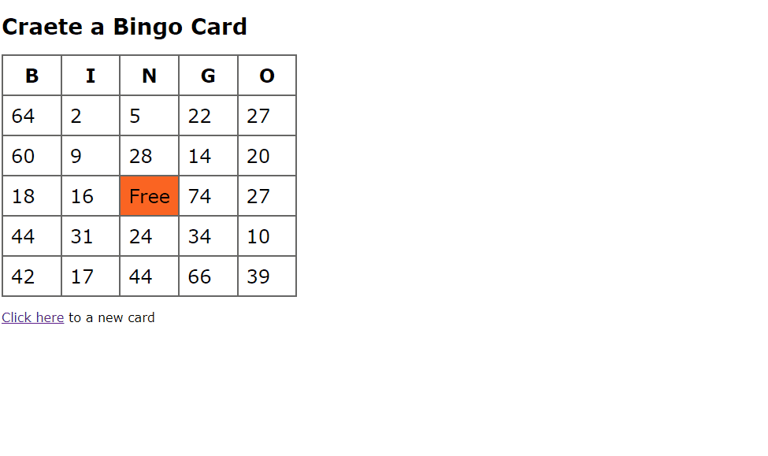
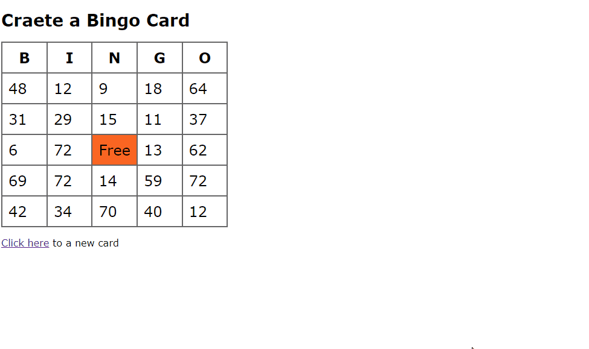
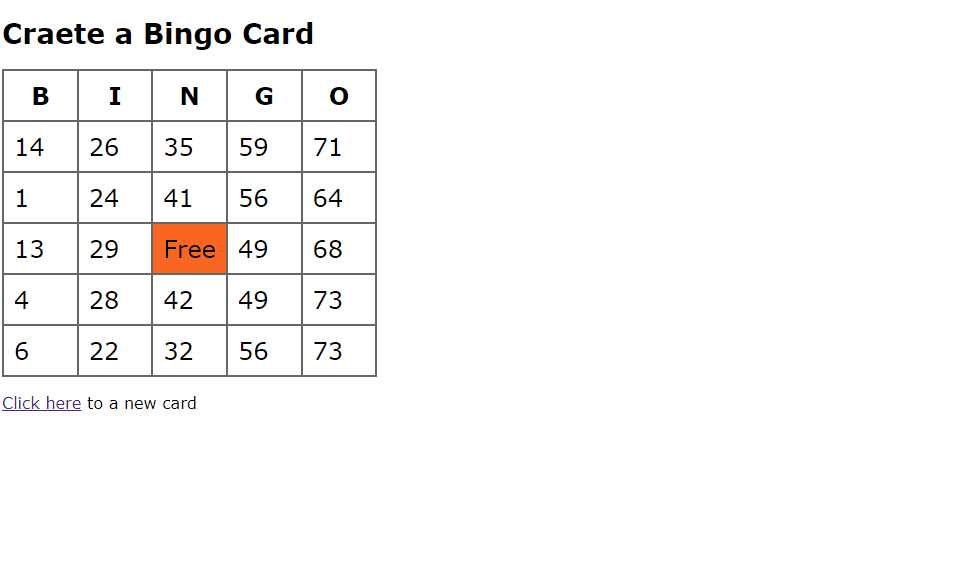
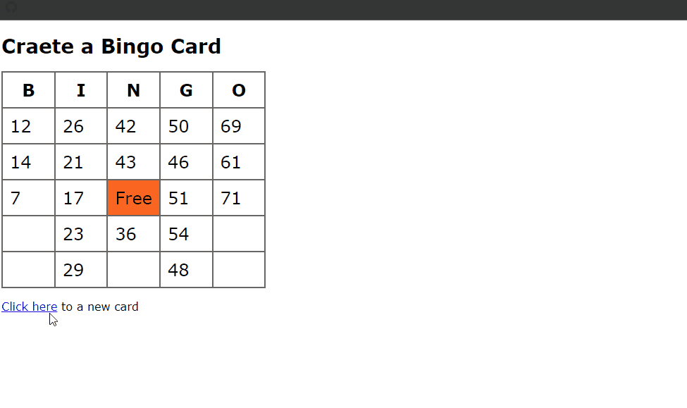
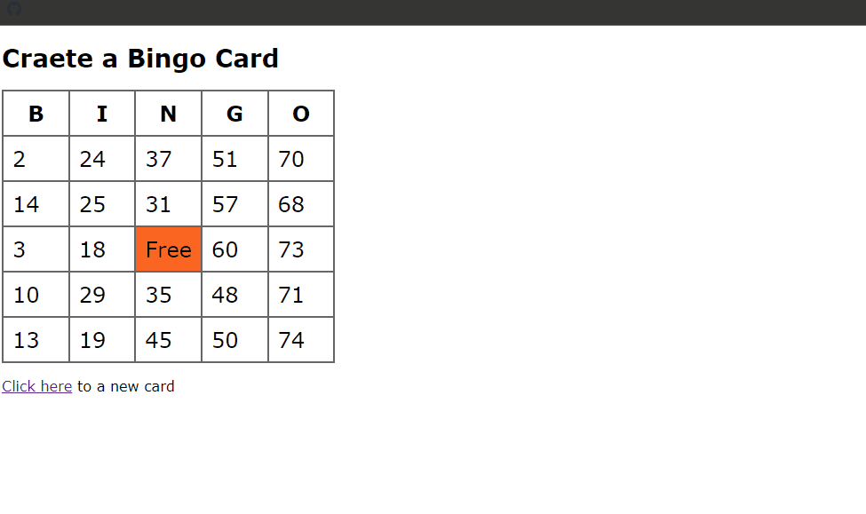
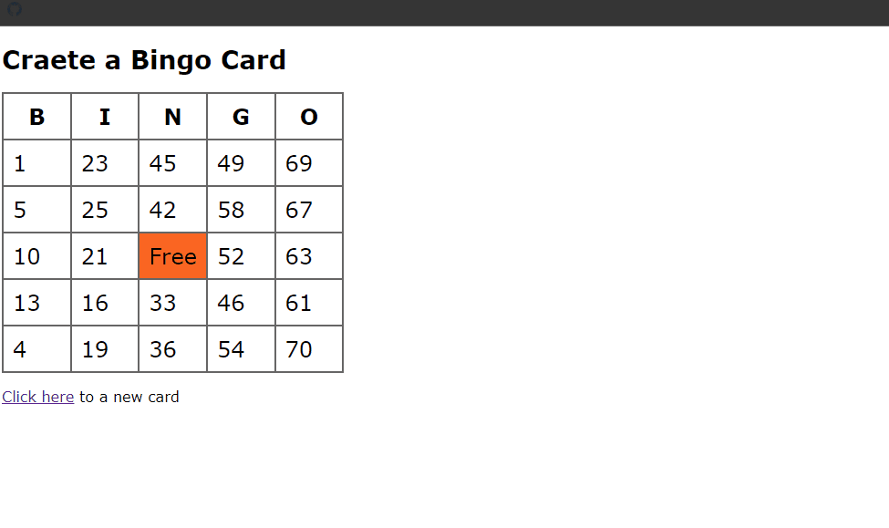

## Bingo Card Snippets Examples

### Example 0

#### HTML

```HTML
<!DOCTYPE html>

<html>

    <head>

        <title>This is the title</title>

        <link rel="stylesheet" type="text/css" href="style.css">

    </head>

<body>

    <h1>Craete a Bingo Card</h1>

    <table>

        <tr>
            <th width="20%">B</th>
            <th width="20%">I</th>
            <th width="20%">N</th>
            <th width="20%">G</th>
            <th width="20%">O </th>

        </tr>

        <tr>

            <td id="square0">&nbsp;</td>
            <td id="square1">&nbsp;</td>
            <td id="square2">&nbsp;</td>
            <td id="square3">&nbsp;</td>
            <td id="square4">&nbsp;</td>

        </tr>

        <tr>

            <td id="square5">&nbsp;</td>
            <td id="square6">&nbsp;</td>
            <td id="square7">&nbsp;</td>
            <td id="square8">&nbsp;</td>
            <td id="square9">&nbsp;</td>

        </tr>

        <tr>

            <td id="square10">&nbsp;</td>
            <td id="square11">&nbsp;</td>
            <td id="free">Free</td>
            <td id="square12">&nbsp;</td>
            <td id="square13">&nbsp;</td>

        </tr>

        <tr>

            <td id="square14">&nbsp;</td>
            <td id="square15">&nbsp;</td>
            <td id="square16">&nbsp;</td>
            <td id="square17">&nbsp;</td>
            <td id="square18">&nbsp;</td>

        </tr>

        <tr>

            <td id="square19">&nbsp;</td>
            <td id="square20">&nbsp;</td>
            <td id="square21">&nbsp;</td>
            <td id="square22">&nbsp;</td>
            <td id="square23">&nbsp;</td>

        </tr>

    </table>

    <p><a href="index.html" id="reload">Click here</a> to a new card</p>

    <script src="js.js" type="text/javascript"></script>

</body>

</html>
```

#### CSS

```CSS
body{

    background-color:white;
    color:black;
    font-family:'Lucida Bright',Verdana,Arial,sans-serif;

}

h1, th {

    font-family:'Times New Roman' serif;
}

h1 {

    font-size:28px;

}

table {

    border-collapse:collapse;

}

th, td {

    padding:10px;
    border:2px #666 solid;
    font-size:24px;


}

#free {

    background-color:#fb6522;

}
```

#### JavaScript

```JavaScript
window.onload = newCard;

function newCard() {


    for (var i = 0; i < 24; i++) {

        var newNum = Math.floor(Math.random() * 75) + 1;//We get decimal numbers between 0 to 74.We use Math.foor property get deciaml number.
        document.getElementById("square" + i).innerHTML = newNum;
    }

}
```

### Output



### Example 1

#### HTML

```HTML
<!DOCTYPE html>

<html>

    <head>

        <title>This is the title</title>

        <link rel="stylesheet" type="text/css" href="style.css">

    </head>    

<body>

    <h1>Craete a Bingo Card</h1>

    <table>

        <tr>
            <th width="20%">B</th>
            <th width="20%">I</th>
            <th width="20%">N</th>
            <th width="20%">G</th>
            <th width="20%">O </th>

        </tr>

        <tr>

            <td id="square0">&nbsp;</td>
            <td id="square1">&nbsp;</td>
            <td id="square2">&nbsp;</td>
            <td id="square3">&nbsp;</td>
            <td id="square4">&nbsp;</td>

        </tr>

        <tr>

            <td id="square5">&nbsp;</td>
            <td id="square6">&nbsp;</td>
            <td id="square7">&nbsp;</td>
            <td id="square8">&nbsp;</td>
            <td id="square9">&nbsp;</td>

        </tr>

        <tr>

            <td id="square10">&nbsp;</td>
            <td id="square11">&nbsp;</td>
            <td id="free">Free</td>
            <td id="square12">&nbsp;</td>
            <td id="square13">&nbsp;</td>

        </tr>

        <tr>

            <td id="square14">&nbsp;</td>
            <td id="square15">&nbsp;</td>
            <td id="square16">&nbsp;</td>
            <td id="square17">&nbsp;</td>
            <td id="square18">&nbsp;</td>

        </tr>

        <tr>

            <td id="square19">&nbsp;</td>
            <td id="square20">&nbsp;</td>
            <td id="square21">&nbsp;</td>
            <td id="square22">&nbsp;</td>
            <td id="square23">&nbsp;</td>

        </tr>

    </table>

    <p><a href="index.html" id="reload">Click here</a> to a new card</p>

    <script src="js.js" type="text/javascript"></script>

</body>

</html>
```

#### CSS

```CSS
body{

    background-color:white;
    color:black;
    font-family:'Lucida Bright',Verdana,Arial,sans-serif;

}

h1, th {

    font-family:'Times New Roman' serif;
}

h1 {

    font-size:28px;

}

table {

    border-collapse:collapse;

}

th, td {

    padding:10px;
    border:2px #666 solid;
    font-size:24px;


}

#free {

    background-color:#fb6522;

}
```

#### JavaScript

```JavaScript
window.onload = newCard;

function newCard() {

    for (var i = 0; i < 24; i++) {

        setSquare(i);//We call the setSquare function with the index value.
    }

}

function setSquare(thisSquare) {//The index value gets in the thisSquare paramter variable.

    var currSquare = "square" + thisSquare;//We add square with the index number value.

    var newNum = Math.floor(Math.random() * 75) + 1;//We get the deciaml point number between 754to 0;

    document.getElementById(currSquare).innerHTML = newNum;

}
```

### Output



### Example 2

#### HTML

```HTML
<!DOCTYPE html>

<html>

    <head>

        <title>This is the title</title>

        <link rel="stylesheet" type="text/css" href="style.css">

    </head>

<body>

    <h1>Craete a Bingo Card</h1>

    <table>

        <tr>
            <th width="20%">B</th>
            <th width="20%">I</th>
            <th width="20%">N</th>
            <th width="20%">G</th>
            <th width="20%">O </th>

        </tr>

        <tr>

            <td id="square0">&nbsp;</td>
            <td id="square1">&nbsp;</td>
            <td id="square2">&nbsp;</td>
            <td id="square3">&nbsp;</td>
            <td id="square4">&nbsp;</td>

        </tr>

        <tr>

            <td id="square5">&nbsp;</td>
            <td id="square6">&nbsp;</td>
            <td id="square7">&nbsp;</td>
            <td id="square8">&nbsp;</td>
            <td id="square9">&nbsp;</td>

        </tr>

        <tr>

            <td id="square10">&nbsp;</td>
            <td id="square11">&nbsp;</td>
            <td id="free">Free</td>
            <td id="square12">&nbsp;</td>
            <td id="square13">&nbsp;</td>

        </tr>

        <tr>

            <td id="square14">&nbsp;</td>
            <td id="square15">&nbsp;</td>
            <td id="square16">&nbsp;</td>
            <td id="square17">&nbsp;</td>
            <td id="square18">&nbsp;</td>

        </tr>

        <tr>

            <td id="square19">&nbsp;</td>
            <td id="square20">&nbsp;</td>
            <td id="square21">&nbsp;</td>
            <td id="square22">&nbsp;</td>
            <td id="square23">&nbsp;</td>

        </tr>

    </table>

    <p><a href="index.html" id="reload">Click here</a> to a new card</p>

    <script src="js.js" type="text/javascript"></script>

</body>

</html>
```

#### CSS

```CSS
body{

    background-color:white;
    color:black;
    font-family:'Lucida Bright',Verdana,Arial,sans-serif;


}

h1, th {

    font-family:'Times New Roman' serif;
}

h1 {

    font-size:28px;

}

table {

    border-collapse:collapse;

}

th, td {

    padding:10px;
    border:2px #666 solid;
    font-size:24px;

}

#free {

    background-color:#fb6522;

}
```

#### JavaScript

```JavaScript
window.onload = newCard;

function newCard() {

    for (var i = 0; i < 24; i++) {

        setSquare(i);
    }

}

function setSquare(thisSquare) {

    var currSquare = "square" + thisSquare;

    var colPlace = new Array(0, 1, 2, 3, 4, 0, 1, 2, 3, 4, 0, 1, 3, 4, 0, 1, 2, 3, 4, 0, 1, 2, 3, 4);

    var newNum =(colPlace[thisSquare]*15)+ Math.floor(Math.random() * 15) + 1;

    document.getElementById(currSquare).innerHTML = newNum;

}
```

### Output



### Example 3

#### HTML

```HTML
<!DOCTYPE html>

<html>

    <head>

        <title>This is the title</title>

        <link rel="stylesheet" type="text/css" href="style.css">

    </head>

<body>

    <h1>Craete a Bingo Card</h1>

    <table>

        <tr>
            <th width="20%">B</th>
            <th width="20%">I</th>
            <th width="20%">N</th>
            <th width="20%">G</th>
            <th width="20%">O </th>

        </tr>

        <tr>

            <td id="square0">&nbsp;</td>
            <td id="square1">&nbsp;</td>
            <td id="square2">&nbsp;</td>
            <td id="square3">&nbsp;</td>
            <td id="square4">&nbsp;</td>

        </tr>

        <tr>

            <td id="square5">&nbsp;</td>
            <td id="square6">&nbsp;</td>
            <td id="square7">&nbsp;</td>
            <td id="square8">&nbsp;</td>
            <td id="square9">&nbsp;</td>

        </tr>

        <tr>

            <td id="square10">&nbsp;</td>
            <td id="square11">&nbsp;</td>
            <td id="free">Free</td>
            <td id="square12">&nbsp;</td>
            <td id="square13">&nbsp;</td>

        </tr>

        <tr>

            <td id="square14">&nbsp;</td>
            <td id="square15">&nbsp;</td>
            <td id="square16">&nbsp;</td>
            <td id="square17">&nbsp;</td>
            <td id="square18">&nbsp;</td>

        </tr>

        <tr>

            <td id="square19">&nbsp;</td>
            <td id="square20">&nbsp;</td>
            <td id="square21">&nbsp;</td>
            <td id="square22">&nbsp;</td>
            <td id="square23">&nbsp;</td>

        </tr>

    </table>

    <p><a href="index.html" id="reload">Click here</a> to a new card</p>

    <script src="js.js" type="text/javascript"></script>

</body>

</html>
```

#### CSS

```CSS
body{

    background-color:white;
    color:black;
    font-family:'Lucida Bright',Verdana,Arial,sans-serif;

}

h1, th {

    font-family:'Times New Roman' serif;
}

h1 {

    font-size:28px;

}

table {

    border-collapse:collapse;

}

th, td {

    padding:10px;
    border:2px #666 solid;
    font-size:24px;

}

#free {

    background-color:#fb6522;

}
```

#### JavaScript

```JavaScript
window.onload = newCard;

var usedNums = new Array(76);

function newCard() {

    for (var i = 0; i < 24; i++) {

        setSquare(i);
    }

}

function setSquare(thisSquare) {

    var currSquare = "square" + thisSquare;

    var colPlace = new Array(0, 1, 2, 3, 4, 0, 1, 2, 3, 4, 0, 1, 3, 4, 0, 1, 2, 3, 4, 0, 1, 2, 3, 4);

    var colBasis = (colPlace[thisSquare] * 15);

    var newNum = colBasis + getNewNum() + 1;

    if (!usedNums[newNum]) {//if a number is been used don't do anything.or place it.

        usedNums[newNum] = true;

        document.getElementById(currSquare).innerHTML = newNum;

    }
}

function getNewNum() {

    return Math.floor(Math.random() * 15)
}
```

### Output



### Example 4

#### HTML

```HTML
<!DOCTYPE html>

<html>

    <head>

        <title>This is the title</title>

        <link rel="stylesheet" type="text/css" href="style.css">

    </head>

<body>

    <h1>Craete a Bingo Card</h1>

    <table>

        <tr>
            <th width="20%">B</th>
            <th width="20%">I</th>
            <th width="20%">N</th>
            <th width="20%">G</th>
            <th width="20%">O </th>

        </tr>

        <tr>

            <td id="square0">&nbsp;</td>
            <td id="square1">&nbsp;</td>
            <td id="square2">&nbsp;</td>
            <td id="square3">&nbsp;</td>
            <td id="square4">&nbsp;</td>

        </tr>

        <tr>

            <td id="square5">&nbsp;</td>
            <td id="square6">&nbsp;</td>
            <td id="square7">&nbsp;</td>
            <td id="square8">&nbsp;</td>
            <td id="square9">&nbsp;</td>

        </tr>

        <tr>

            <td id="square10">&nbsp;</td>
            <td id="square11">&nbsp;</td>
            <td id="free">Free</td>
            <td id="square12">&nbsp;</td>
            <td id="square13">&nbsp;</td>

        </tr>

        <tr>

            <td id="square14">&nbsp;</td>
            <td id="square15">&nbsp;</td>
            <td id="square16">&nbsp;</td>
            <td id="square17">&nbsp;</td>
            <td id="square18">&nbsp;</td>

        </tr>

        <tr>

            <td id="square19">&nbsp;</td>
            <td id="square20">&nbsp;</td>
            <td id="square21">&nbsp;</td>
            <td id="square22">&nbsp;</td>
            <td id="square23">&nbsp;</td>

        </tr>

    </table>

    <p><a href="index.html" id="reload">Click here</a> to a new card</p>

    <script src="js.js" type="text/javascript"></script>

</body>

</html>
```

#### CSS

```CSS
body{

    background-color:white;
    color:black;
    font-family:'Lucida Bright',Verdana,Arial,sans-serif;

}

h1, th {

    font-family:'Times New Roman' serif;
}

h1 {

    font-size:28px;

}

table {

    border-collapse:collapse;

}

th, td {

    padding:10px;
    border:2px #666 solid;
    font-size:24px;

}

#free {

    background-color:#fb6522;

}
```

#### JavaScript

```JavaScript
window.onload = newCard;

var usedNums = new Array(76);

function newCard() {

    for (var i = 0; i < 24; i++) {

        setSquare(i);
    }

}

function setSquare(thisSquare) {

    var currSquare = "square" + thisSquare;

    var colPlace = new Array(0, 1, 2, 3, 4, 0, 1, 2, 3, 4, 0, 1, 3, 4, 0, 1, 2, 3, 4, 0, 1, 2, 3, 4);

    var colBasis = (colPlace[thisSquare] * 15);

    var newNum;

    do {

        newNum = colBasis + getNewNum() + 1;


    } while (usedNums[newNum]);


        usedNums[newNum] = true;

        document.getElementById(currSquare).innerHTML = newNum;

}

function getNewNum() {

    return Math.floor(Math.random() * 15)
}
```

### Output



### Example 5

#### HTML

```HTML
<!DOCTYPE html>

<html>

    <head>

        <title>This is the title</title>

        <link rel="stylesheet" type="text/css" href="style.css">

    </head>

<body>

    <h1>Craete a Bingo Card</h1>

    <table>

        <tr>
            <th width="20%">B</th>
            <th width="20%">I</th>
            <th width="20%">N</th>
            <th width="20%">G</th>
            <th width="20%">O </th>

        </tr>

        <tr>

            <td id="square0">&nbsp;</td>
            <td id="square1">&nbsp;</td>
            <td id="square2">&nbsp;</td>
            <td id="square3">&nbsp;</td>
            <td id="square4">&nbsp;</td>

        </tr>

        <tr>

            <td id="square5">&nbsp;</td>
            <td id="square6">&nbsp;</td>
            <td id="square7">&nbsp;</td>
            <td id="square8">&nbsp;</td>
            <td id="square9">&nbsp;</td>

        </tr>

        <tr>

            <td id="square10">&nbsp;</td>
            <td id="square11">&nbsp;</td>
            <td id="free">Free</td>
            <td id="square12">&nbsp;</td>
            <td id="square13">&nbsp;</td>

        </tr>

        <tr>

            <td id="square14">&nbsp;</td>
            <td id="square15">&nbsp;</td>
            <td id="square16">&nbsp;</td>
            <td id="square17">&nbsp;</td>
            <td id="square18">&nbsp;</td>

        </tr>

        <tr>

            <td id="square19">&nbsp;</td>
            <td id="square20">&nbsp;</td>
            <td id="square21">&nbsp;</td>
            <td id="square22">&nbsp;</td>
            <td id="square23">&nbsp;</td>

        </tr>

    </table>

    <p><a href="index.html" id="reload">Click here</a> to a new card</p>

    <script src="js.js" type="text/javascript"></script>

</body>

</html>
```

#### CSS

```CSS
body{

    background-color:white;
    color:black;
    font-family:'Lucida Bright',Verdana,Arial,sans-serif;

}

h1, th {

    font-family:'Times New Roman' serif;
}

h1 {

    font-size:28px;

}

table {

    border-collapse:collapse;

}

th, td {

    padding:10px;
    border:2px #666 solid;
    font-size:24px;

}

#free {

    background-color:#fb6522;

}
```

#### JavaScript

```JavaScript
window.onload = initAll;

var usedNums = new Array(76);


function initAll() {

    document.getElementById("reload").onclick = anotherCard;
    newCard();


}

function newCard() {

    for (var i = 0; i < 24; i++) {

        setSquare(i);
    }

}

function setSquare(thisSquare) {

    var currSquare = "square" + thisSquare;

    var colPlace = new Array(0, 1, 2, 3, 4, 0, 1, 2, 3, 4, 0, 1, 3, 4, 0, 1, 2, 3, 4, 0, 1, 2, 3, 4);

    var colBasis = (colPlace[thisSquare] * 15);

    var newNum;

    do {

        newNum = colBasis + getNewNum() + 1;

    } while (usedNums[newNum]);

        usedNums[newNum] = true;

        document.getElementById(currSquare).innerHTML = newNum;

}

function getNewNum() {

    return Math.floor(Math.random() * 15)
}

function anotherCard() {

    for (var i = 1; i < usedNums.length; i++) {

        usedNums[i] = false;

    }

    newCard();
    return false;
}

//This program does not have to reload the page.I mean it does not have to request the server.
```

### Output


