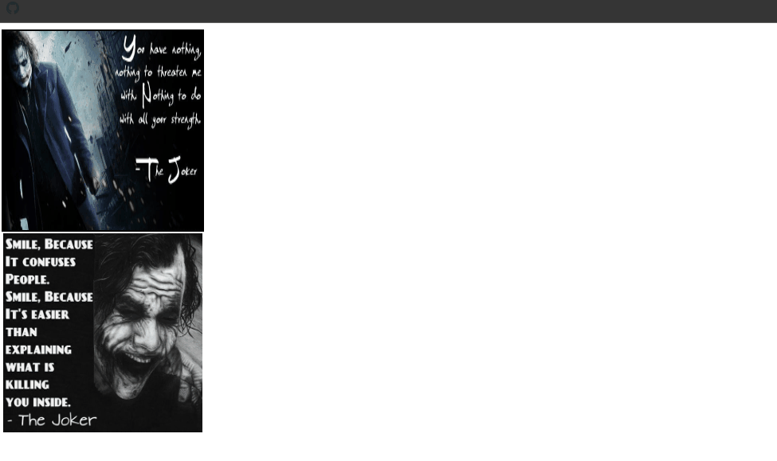
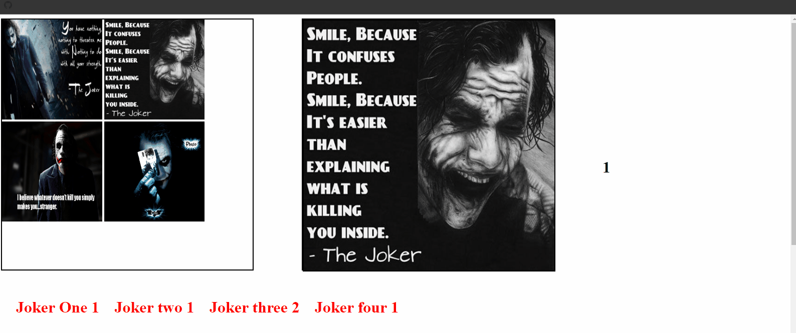
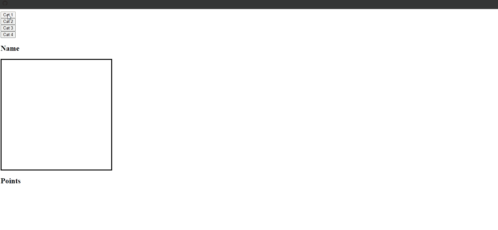
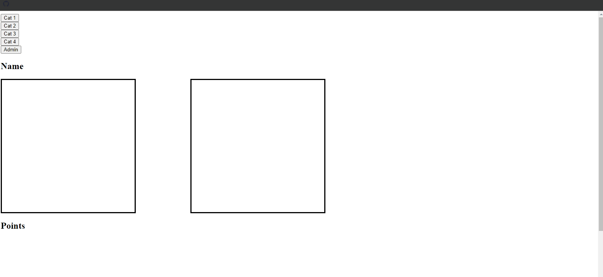

## JavaScript Design Patterns 1 Snippets

### Example 0

#### HTML

```HTML
<!DOCTYPE html>

<html>

    <head>

        <title>This is the title</title>

        <link rel="stylesheet" type="text/css" href="style.css">

    </head>

<body>

    <div id="clickerBox" onclick="clickerSub()">

    </div>

    <div id="box">

        

    </div>

   <h1 id="status"></h1>

    <script src="js.js" type="text/javascript"></script>

</body>

</html>
```

#### CSS

```CSS
#box {

    width:250px;
    height:250px;
    border:2px solid black;
}

    #box > img {

        width:250px;
        height:250px;
    }
```

#### JavaScript

```JavaScript
window.onload = function () {

    document.getElementById("img1").addEventListener("click", imgClicker);
}

var nameLists = ["Joker 1"];
var img1 = 0;

function imgClicker() {

    document.getElementById("status").innerHTML = nameLists[0].fontcolor("red") + " " + img1++;

}
```

### Output


### Example 1

#### HTML

```HTML
<!DOCTYPE html>

<html>

    <head>

        <title>This is the title</title>

        <link rel="stylesheet" type="text/css" href="style.css">

    </head>

<body>

    <div id="clickerBox" onclick="clickerSub()">

    </div>

    <div id="box">

        
        

    </div>

   <h1 id="status"></h1>

    <script src="js.js" type="text/javascript"></script>

</body>

</html>
```

#### CSS

```CSS
#box {

    width:250px;
    height:250px;
    border:2px solid black;
}

    #box > img {

        width:250px;
        height:250px;

    }

#status{

    position:relative;
    left:500px;

}
```

#### JavaScript

```JavaScript
window.onload = function () {

    document.getElementById("img1").addEventListener("click", imgClicker1);
    document.getElementById("img2").addEventListener("click",imgClicker2)
}

var nameLists = ["Joker 1","Joker 2"];
var img1 = 0;
var img2 = 0;

function imgClicker1() {

    document.getElementById("status").innerHTML = nameLists[0].fontcolor("red") + " " + img1++;

}

function imgClicker2() {

    document.getElementById("status").innerHTML = nameLists[1].fontcolor("red") + " " + img2++;

}
```

### Output



### Example 2

#### HTML

```HTML
<!DOCTYPE html>

<html>

    <head>

        <title>This is the title</title>

        <link rel="stylesheet" type="text/css" href="style.css">
        <meta charset="utf-8">

    </head>

<body>

    <div id="imgBox">

        
        
        
        

    </div>

    <div id="mainBox">

    </div>

   <h1 id="status"></h1>
    <h1 class="j" id="j1"></h1>
    <h1 class="j"  id="j2"></h1>
    <h1 class="j"  id="j3"></h1>
    <h1 class="j"  id="j4"></h1>

    <h1 id="total"></h1>

    <script src="js.js" type="text/javascript"></script>

</body>

</html>
```

#### CSS

```CSS
#imgBox{

    width:500px;
    height:500px;
    border:2px solid black;

}

#imgBox img{

    width:200px;
    height:200px;
    cursor:pointer;

}

#mainBox{

    width:500px;
    height:500px;
    border:2px solid black;
    position:relative;
    left:600px;
    top:-504px;

}

#mainBox >img{

    width:500px;
    height:500px;
    border:2px solid black;

    cursor:pointer;

}

#status {

   position:relative;
   top:-750px;
   left:1200px;

}

.j {

    position:relative;
    top:-550px;
    float:left;
    padding-left:30px;
    color:red;

}
```

#### JavaScript

```JavaScript
window.onload = function () {

    imgs = document.getElementsByClassName('img');

    imgs[0].addEventListener("click", img1Fun);
    imgs[1].addEventListener("click", img2Fun);
    imgs[2].addEventListener("click", img3Fun);
    imgs[3].addEventListener("click", img4Fun);
}

var namesLists = ["Joker 1", "Joker 2", "Joker 3", "Joker 4"];
var imgsVars = [img1 = 0, img2 = 0, img3 = 0, img4 = 0];

function img1Fun() {

    document.getElementById("mainBox").innerHTML="";
   var va= document.getElementById("status").innerHTML = imgsVars[0]++;
   document.getElementById("j1").innerHTML ="Joker One "+ va;

}

function img2Fun() {

    document.getElementById("mainBox").innerHTML = "";
    var va = document.getElementById("status").innerHTML = imgsVars[1]++;
 document.getElementById("j2").innerHTML = "Joker two " + va;

}

function img3Fun() {

    document.getElementById("mainBox").innerHTML = "";
    var va = document.getElementById("status").innerHTML = imgsVars[2]++;
   document.getElementById("j3").innerHTML = "Joker three " + va;
}

function img4Fun() {

    document.getElementById("mainBox").innerHTML = "";
    var va = document.getElementById("status").innerHTML = imgsVars[3]++;
   document.getElementById("j4").innerHTML = "Joker four " + va;

}
```

### Output



### Example 3

#### HTML

```HTML
<!DOCTYPE html>

<html>

    <head>

        <title>This is the title</title>

        <link rel="stylesheet" type="text/css" href="style.css">
        <meta charset="utf-8">

    </head>

<body>

    <button id="b1">Cat 1</button><br />
    <button id="b2">Cat 2</button><br />
    <button id="b3">Cat 3</button><br />
    <button id="b4">Cat 4</button><br />

    <h2>Name <span style="color:red" id="name"></span></h2>

    <div id="disBox"></div>

    <h2>Points <span style="color:red" id="point"></span></h2>

    <script src="js.js" type="text/javascript"></script>

</body>

</html>
```

#### CSS

```CSS
div#disBox {
    width:350px;
    height:350px;
    border:3px solid black;

}

div#disBox >img {

    width:300px;
    height:300px;
    margin:22px;

}
```

#### JavaScript

```JavaScript
window.onload = function () {

    var b1 = document.getElementById("b1").onclick = function () { cat1() };
    var b2 = document.getElementById("b2").onclick = function () { cat2() };
    var b3 = document.getElementById("b3").onclick = function () { cat3() };
    var b4 = document.getElementById("b4").onclick = function () { cat4() };
    var disBoxBtn = document.getElementById("disBox").onclick = function () { disBox() };

}

var cats = {

    cat1: {

        name: "Cat 1",
        point:0

    },

    cat2: {

        name: "Cat 2",
        point:0

    },

    cat3: {

        name: "Cat 3",
        point: 0

    },

    cat4: {

        name: "Cat 4",
        point:0
    }

}

var nameDis = document.getElementById("name");
var pointDis = document.getElementById("point");

function cat1() {

    document.getElementById("disBox").innerHTML = "";
    nameDis.innerHTML = cats.cat1.name;
    pointDis.innerHTML = cats.cat1.point;

}

function cat2() {

    document.getElementById("disBox").innerHTML = "";

    nameDis.innerHTML = cats.cat2.name;
    pointDis.innerHTML = cats.cat2.point;

}

function cat3() {

    document.getElementById("disBox").innerHTML = "";

    nameDis.innerHTML = cats.cat3.name;
    pointDis.innerHTML = cats.cat3.point;

}

function cat4() {

    document.getElementById("disBox").innerHTML = "";

    nameDis.innerHTML = cats.cat4.name;
    pointDis.innerHTML = cats.cat4.point;

}

function disBox() {

    if (document.getElementById("disBox").children[0].id == "i1") {

        pointDis.innerHTML = cats.cat1.point++;

    } else if (document.getElementById("disBox").children[0].id == "i2") {

        pointDis.innerHTML = cats.cat2.point++;

    } else if(document.getElementById("disBox").children[0].id == "i3"){

        pointDis.innerHTML = cats.cat3.point++;

    } else if (document.getElementById("disBox").children[0].id == "i4") {

        pointDis.innerHTML = cats.cat4.point++;

    }

}
```

### Output


### Example 4

#### HTML

```HTML
<!DOCTYPE html>

<html>

    <head>

        <title>This is the title</title>

        <link rel="stylesheet" type="text/css" href="style.css">
        <meta charset="utf-8">

    </head>

<body>

    <button id="b1">Cat 1</button><br />
    <button id="b2">Cat 2</button><br />
    <button id="b3">Cat 3</button><br />
    <button id="b4">Cat 4</button><br />

    <h2>Name <span style="color:red" id="name"></span></h2>

    <div id="disBox"></div>

    <h2>Points <span style="color:red" id="point"></span></h2>

    <script src="js.js" type="text/javascript"></script>

</body>  

</html>
```

#### CSS

```CSS
div#disBox {
    width:350px;
    height:350px;
    border:3px solid black;

}

div#disBox >img {

    width:300px;
    height:300px;
    margin:22px;

}
```

#### JavaScript

```JavaScript
window.onload = function () {

    var btns = document.getElementsByTagName("button");

    var funArrs = [fun1, fun2,fun3,fun4];

    for (i = 0; i < btns.length; i++) {

        btns[i].onclick = funArrs[i];

    }

}

var imgsDetails = {

    img1: {

        name: "Joker 1",
        points:0
    },

    img2: {
        name: "Joker 2",
        points:0

    },

    img3: {

        name: "Joker 3",
        points:0
    },

    img4: {

        name: "Joker 4",
        points:0

    }

}

function fun1() {

    document.getElementById("disBox").innerHTML = "";
    document.getElementById("name").innerHTML = imgsDetails.img1.name;
    document.getElementById("point").innerHTML = imgsDetails.img1.points;

}

function fun2() {

    document.getElementById("disBox").innerHTML = "";
    document.getElementById("name").innerHTML = imgsDetails.img2.name;
    document.getElementById("point").innerHTML = imgsDetails.img2.points;

}

function fun3() {

    document.getElementById("disBox").innerHTML = "";
    document.getElementById("name").innerHTML = imgsDetails.img3.name;
    document.getElementById("point").innerHTML = imgsDetails.img3.points;

}

function fun4() {

    document.getElementById("disBox").innerHTML = "";
    document.getElementById("name").innerHTML = imgsDetails.img4.name;
    document.getElementById("point").innerHTML = imgsDetails.img4.points;

}

document.getElementById("disBox").onclick = disBox;

function disBox() {

    if (document.getElementById("disBox").children[0].id == "i1") {

        document.getElementById("point").innerHTML = imgsDetails.img1.points++;

    } else if (document.getElementById("disBox").children[0].id == "i2") {

        document.getElementById("point").innerHTML = imgsDetails.img2.points = imgsDetails.img2.points + 1;

    } else if (document.getElementById("disBox").children[0].id == 'i3') {

        document.getElementById("point").innerHTML = imgsDetails.img3.points += 1;

    } else if (document.getElementById("disBox").children[0].id == 'i4') {

        document.getElementById("point").innerHTML = imgsDetails.img4.points++;
    }
}
```

### Output



### Example 5

#### HTML

```HTML
<!DOCTYPE html>

<html>

    <head>

        <title>This is the title</title>

        <link rel="stylesheet" type="text/css" href="style.css">
        <meta charset="utf-8">

    </head>

<body>

    <button class="catbtn" id="b1">Cat 1</button><br />
    <button class="catbtn" id="b2">Cat 2</button><br />
    <button class="catbtn" id="b3">Cat 3</button><br />
    <button class="catbtn" id="b4">Cat 4</button><br />

   <button id="adminbtn">Admin</button>

    <h2>Name <span style="color:red" id="name"></span></h2>

    <div id="disBox"></div>

    <h2>Points <span style="color:red" id="point"></span></h2>

    <div id="adminBox">

        <button class="adminbtns" id="ab1">Cat 1</button><br />
        <button class="adminbtns" id="ab2">Cat 2</button><br />
        <button class="adminbtns" id="ab3">Cat 3</button><br />
        <button class="adminbtns" id="ab4">Cat 4</button><br />

        <h3 id="adname"></h3>
        <h3 id="adpoints"></h3>

    </div>

    <script src="js.js" type="text/javascript"></script>

</body>

</html>
```

#### CSS

```CSS
div#disBox {
    width:350px;
    height:350px;
    border:3px solid black;

}

div#disBox >img {

    width:300px;
    height:300px;
    margin:22px;

}

div#adminBox{

    width:350px;
    height:350px;
    position:relative;
    left:500px;
    border:3px solid black;
    top:-423px;

}

.adminbtns {

    display:none;
}
```

#### JavaScript

```JavaScript
window.onload = function () {

    var btns = document.getElementsByClassName('catbtn');

    var funArrs = [fun1, fun2,fun3,fun4];

    for (i = 0; i < btns.length; i++) {

        btns[i].onclick = funArrs[i];

    }

}

var imgsDetails = {

    img1: {

        name: "Joker 1",
        points:0
    },

    img2: {
        name: "Joker 2",
        points:0

    },

    img3: {

        name: "Joker 3",
        points:0
    },

    img4: {

        name: "Joker 4",
        points:0

    }

}

function fun1() {

    document.getElementById("disBox").innerHTML = "";
    document.getElementById("name").innerHTML = imgsDetails.img1.name;
    document.getElementById("point").innerHTML = imgsDetails.img1.points;

}

function fun2() {

    document.getElementById("disBox").innerHTML = "";
    document.getElementById("name").innerHTML = imgsDetails.img2.name;
    document.getElementById("point").innerHTML = imgsDetails.img2.points;

}

function fun3() {

    document.getElementById("disBox").innerHTML = "";
    document.getElementById("name").innerHTML = imgsDetails.img3.name;
    document.getElementById("point").innerHTML = imgsDetails.img3.points;

}

function fun4() {

    document.getElementById("disBox").innerHTML = "";
    document.getElementById("name").innerHTML = imgsDetails.img4.name;
    document.getElementById("point").innerHTML = imgsDetails.img4.points;

}

document.getElementById("disBox").onclick = disBox;


function disBox() {

    if (document.getElementById("disBox").children[0].id == "i1") {

        document.getElementById("point").innerHTML = imgsDetails.img1.points++;

    } else if (document.getElementById("disBox").children[0].id == "i2") {

        document.getElementById("point").innerHTML = imgsDetails.img2.points = imgsDetails.img2.points + 1;

    } else if (document.getElementById("disBox").children[0].id == 'i3') {

        document.getElementById("point").innerHTML = imgsDetails.img3.points += 1;

    } else if (document.getElementById("disBox").children[0].id == 'i4') {

        document.getElementById("point").innerHTML = imgsDetails.img4.points++;
    }
}

document.getElementById("adminbtn").onclick = adminFun;

function adminFun() {

    document.getElementById('ab1').style.display = "block";
    document.getElementById('ab2').style.display = "block";
    document.getElementById('ab3').style.display = "block";
    document.getElementById('ab4').style.display = "block";

     document.getElementById('ab1').onclick = function () {

        document.getElementById('adname').innerHTML = imgsDetails.img1.name;
        document.getElementById('adpoints').innerHTML = imgsDetails.img1.points;

        var input0name = document.createElement("input");
        input0name.id = "input0name";
        input0name.placeholder = "Name";
        input0name.type = "text";

        document.getElementById("adminBox").appendChild(input0name);

        var input0point = document.createElement("input");
        input0point.type = "text";
        input0point.id = "input0point";
        input0point.placeholder = "Points";

        document.getElementById("adminBox").appendChild(input0point);

        var save0 = document.createElement("button");
        save0.innerHTML="Save";
        save0.id = "save0";

        document.getElementById("adminBox").appendChild(save0);

        var cancel0 = document.createElement("button");
        cancel0.id = "cancel0";
        cancel0.innerHTML = "Calcel";

        document.getElementById("adminBox").appendChild(cancel0);

        document.getElementById("save0").onclick = function () {

            var input0name=document.getElementById("input0name").value;
            var input0point=document.getElementById("input0point").value;

            if (input0name && input0point != "") {

                imgsDetails.img1.name = input0name;
                imgsDetails.img1.points = input0point;

                document.getElementById("input0name").style.display = "none";
                document.getElementById("input0point").style.display = "none";
                document.getElementById("cancel0").style.display = "none";
                document.getElementById("save0").style.display = "none";
            } else {

                alert("Please Enter Valid Value");
            }
        }

        document.getElementById("cancel0").onclick = function () {

            document.getElementById("input0name").style.display = "none";
            document.getElementById("input0point").style.display = "none";
            document.getElementById("save0").style.display = "none";
            document.getElementById("cancel0").style.display = "none";
        }

     }

     document.getElementById('ab2').onclick = function () {

         document.getElementById('adname').innerHTML = imgsDetails.img2.name;
         document.getElementById('adpoints').innerHTML = imgsDetails.img2.points;

         var input1name = document.createElement("input");
         input1name.id = "input1name";
         input1name.type = "text";
         input1name.placeholder = "Name";

         document.getElementById("adminBox").appendChild(input1name);

         var input1points = document.createElement("input");
         input1points.type = "text";
         input1points.id = 'input1points';
         input1points.placeholder = "Points";

         document.getElementById("adminBox").appendChild(input1points);

         var save1 = document.createElement("button");
         save1.id = "save1";
         save1.innerHTML = "Save";

         document.getElementById("adminBox").appendChild(save1);

         var cancel1 = document.createElement("button");
         cancel1.id = "cancel1";
         cancel1.innerHTML = "Cancel";

         document.getElementById("adminBox").appendChild(cancel1);

         document.getElementById("save1").onclick = function () {

             var input1name = document.getElementById("input1name").value;
             var input1points = document.getElementById("input1points").value;

             if (input1name && input1points != "") {

                 imgsDetails.img2.name = input1name;
                 imgsDetails.img2.points = input1points;

                 document.getElementById("input1name").style.display = "none";
                 document.getElementById("input1points").style.display = "none";
                 document.getElementById("cancel1").style.display = "none";
                 document.getElementById("save1").style.display = "none";

             } else {

                 alert("Please Enter Valid value");
             }
         }

         document.getElementById("cancel1").onclick = function () {

             document.getElementById("input1name").style.display = "none";
             document.getElementById("input1points").style.display = "none";
             document.getElementById("cancel1").style.display = "none";
             document.getElementById("save1").style.display = "none";
         }

     }

     document.getElementById('ab3').onclick = function () {

         document.getElementById('adname').innerHTML = imgsDetails.img3.name;
         document.getElementById('adpoints').innerHTML = imgsDetails.img3.points;

         var input2name = document.createElement("input");
         input2name.type = "text";
         input2name.id = "input2name";
         input2name.placeholder = "Name";

         document.getElementById("adminBox").appendChild(input2name);

         var input2point = document.createElement("input");
         input2point.type = "text";
         input2point.id = "input2point";
         input2name.placeholder = "Points";

         document.getElementById("adminBox").appendChild(input2point);

         var save2 = document.createElement("button");
         save2.id = "save2";
         save2.innerHTML = "Save";

         document.getElementById("adminBox").appendChild(save2);

         var cancel2 = document.createElement("button");
         cancel2.id = 'cancel2';
         cancel2.innerHTML = "Cancel";

         document.getElementById("adminBox").appendChild(cancel2);

         document.getElementById("save2").onclick = function () {

             var input2name = document.getElementById("input2name").value;
             var input2point = document.getElementById("input2point").value;

             if (input2name && input2point != "") {

                 imgsDetails.img3.name = input2name;
                 imgsDetails.img3.points = input2point;

                 document.getElementById("input2name").style.display = "none";
                 document.getElementById("input2point").style.display = "none";
                 document.getElementById("save2").style.display = "none";
                 document.getElementById("cancel2").style.display = "none";

             } else {

                 alert("Enter a valid value");
             }

         }

         document.getElementById("cancel2").onclick = function () {

             document.getElementById("input2name").style.display = "none";
             document.getElementById("input2point").style.display = "none";
             document.getElementById("save2").style.display = "none";
             document.getElementById("cancel2").style.display = "none";
         }

     }

     document.getElementById('ab4').onclick = function () {

         document.getElementById('adname').innerHTML = imgsDetails.img4.name;
         document.getElementById('adpoints').innerHTML = imgsDetails.img4.points;

         var input3name = document.createElement("input");
         input3name.type = "text";
         input3name.id = "input3name";
         input3name.placeholder = "Name";

         document.getElementById("adminBox").appendChild(input3name);

         var input3point = document.createElement("input");
         input3point.type = "text";
         input3point.id = "input3point";
         input3point.placeholder = "Point";

         document.getElementById("adminBox").appendChild(input3point);

         var save3 = document.createElement("button");
         save3.id = "save3";
         save3.innerHTML = "Save";

         document.getElementById("adminBox").appendChild(save3);

         var cancel3 = document.createElement("button");
         cancel3.id = "cancel3";
         cancel3.innerHTML = "Cancel";

         document.getElementById("adminBox").appendChild(cancel3);

         document.getElementById("save3").onclick = function () {

             var input3name = document.getElementById("input3name").value;
             var input3point = document.getElementById("input3point").value;

             if (input3name && input3point != "") {

                 imgsDetails.img4.name = input3name;
                 imgsDetails.img4.points = input3point;

                 document.getElementById("input3name").style.display = "none";
                 document.getElementById("input3point").style.display = "none";
                 document.getElementById("save3").style.display = "none";
                 document.getElementById("cancel3").style.display = "none";

             }
         }

         document.getElementById("cancel3").onclick = function () {

             document.getElementById("input3name").style.display = "none";
             document.getElementById("input3point").style.display = "none";
             document.getElementById("save3").style.display = "none";
             document.getElementById("cancel3").style.display = "none";

         }

     }

}
```

### Output


