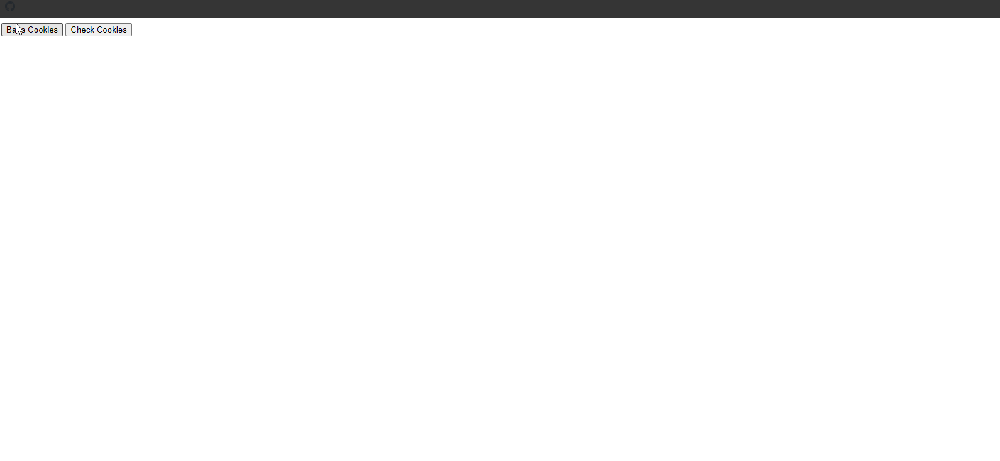

## Cookie Snippets Examples

### Example 0

#### HTML

```HTML
<!DOCTYPE html>

<html>

    <head>

        <title>This is the title</title>

        <link rel="stylesheet" type="text/css" href="style.css">
        <meta charset="utf-8">

    </head>

<body>

   <button onclick="bakeCookies();">Bake Cookies</button>
   <button onclick="checkCookies();">Check Cookies</button>
   <h2 id="status"></h2>

    <script src="js.js" type="text/javascript"></script>

</body>

</html>
```

#### JavaScript

```JavaScript
function bakeCookies(){
    document.cookie = "fname=Kuna";
    document.cookie = "lname=Rakulan";
    document.cookie = "id=7";
}
function checkCookies(){
    if(document.cookie.length == 0){
        alert("No cookies");
    } else {
        var carr = document.cookie.split("; ");
        var c1arr = carr[0].split("=");
        var c2arr = carr[1].split("=");
        var c3arr = carr[2].split("=");
        var firstname = c1arr[1];
        var lastname = c2arr[1];
        var userid = c3arr[1];
        var str = firstname+" "+lastname+"| ID: "+userid;
        document.getElementById('status').innerHTML = str;
    }
}
```

### Output


