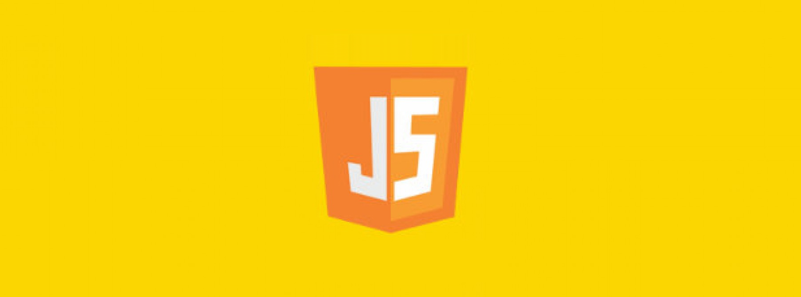

# JavaScript Snippets Codes

## Introduction

JavaScript is a dynamic computer programming language. It is lightweight and most commonly used as a part of web pages, whose implementations allow client-side script to interact with the user and make dynamic pages. It is an interpreted programming language with object-oriented capabilities.

## Learning Resources

1. [W3Schools Snippets](0-w3schools-snippets/)
2. [The New Boston Snippets](1-the-new-boston-snippets/)
3. [Bob Tabor Snippets](2-bob-tabor-snippets/)
4. [Derek Banas Snippets](3-derek-banas-snippets/)
5. [JS Advanced Snippets](4-javascript-advanced-snippets/)
6. [Mixed Tutorials Snippets](5-mixed-tutorials-snippets/)
7. [Adam Khoury Snippets](6-adam-khoury-snippets/)
8. [Bingo Card Snippets](7-bingo-card-snippets/)
9. [JavaScript Design Patterns 1 Snippets](8-javascript-design-patterns-1-snippets/)
10. [Cookie Snippets](9-cookie-snippets/)
11. [Canvas Introduction Snippets](10-canvas-introduction-snippets/)
12. [Canvas Adam Khoury Bootcamp Snippets](11-canvas-adam-khoury-bootcamp-snippets/)
13. [Ajax The New Bonston Snippets](12-ajax-the-new-bonston-snippets/)
14. [Regular Expression Snippets](13-regular-expression-snippets/)
15. [DOM Snippets](14-dom-snippets/)
16. [FunFun Function Snippets](15-funfun-function-snippets/)
17. [Functional Programming Snippets](16-functional-programming-snippets/)
18. [JavaScript Testing Snippets](17-javascript-testing-snippets/)
19. [JavaScript OOP Concept Snippets](18-javascript-opp-concept-snippets/)
20. [Jump Start Snippets](19-jump-start-snippets/)
21. [JavaScipt Best Tutorial Snippets](20-javascipt-best-tutorial-snippets/)
22. [JSON Snippets](21-json-snippets/)

## Social Links

* [Linkedin Profile](https://www.linkedin.com/in/gunarakulangunaretnam)
* [Facebook Profile](https://www.facebook.com/gunarakulangunaratnam)
* [Instagram Profile](https://www.instagram.com/gunarakulangunaretnam)
* [Twitter Profile ](https://twitter.com/gunarakulangr)
* [Kaggle Profile](https://www.kaggle.com/gunarakulangr)
* [TikTok Profile](https://www.tiktok.com/@gunarakulangunaretnam)
* [Youtube Profile](https://www.youtube.com/channel/UCMWkED5sabgVZSCKjZuRJXA)
